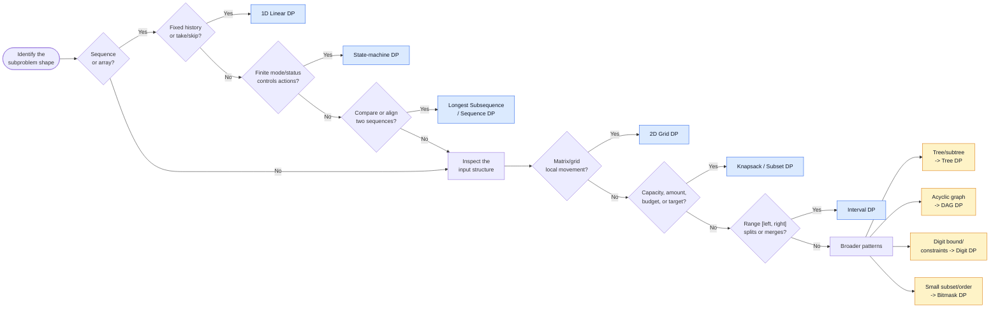

# Dynamic Programming Patterns Learning Package

This package contains six executable DP pattern examples. Each pattern folder has:

- a pattern-focused explanation (`README.md`)
- matching memoization and tabulation implementations (`solution.py`)
- a runnable comparison demo (`demo.py`)

The implementations cover the Dynamic Programming section of LeetCode's Top
Interview 150, grouped by the shape of their state rather than by the order in
which the questions appear:

1. [1D Linear DP](./01_1D_Linear_DP/README.md)
2. [2D Grid DP](./02_2D_Grid_DP/README.md)
3. [Knapsack / Subset DP](./03_Knapsack_Subset_DP/README.md)
4. [Longest Subsequence DP](./04_Longest_Subsequence_DP/README.md)
5. [Interval DP](./05_Interval_DP/README.md)
6. [State-machine DP](./06_State_Machine_DP_Stock/README.md)

## Top Interview 150 coverage

| Top 150 problem | Pattern folder | Implementations |
|---|---|---|
| Climbing Stairs | [1D Linear](./01_1D_Linear_DP/README.md) | `climb_stairs_memo`, `climb_stairs_tab` |
| House Robber | [1D Linear](./01_1D_Linear_DP/README.md) | `rob_memo`, `rob_tab` |
| Word Break | [1D Linear](./01_1D_Linear_DP/README.md) | `word_break_memo`, `word_break_tab` |
| Coin Change | [Knapsack / Subset](./03_Knapsack_Subset_DP/README.md) | `coin_change_memo`, `coin_change_tab` |
| Longest Increasing Subsequence | [Longest Subsequence](./04_Longest_Subsequence_DP/README.md) | `lis_memo`, `lis_tab` |
| Partition Equal Subset Sum | [Knapsack / Subset](./03_Knapsack_Subset_DP/README.md) | `can_partition_memo`, `can_partition_tab` |
| Unique Paths | [2D Grid](./02_2D_Grid_DP/README.md) | `unique_paths_memo`, `unique_paths_tab` |
| Minimum Path Sum | [2D Grid](./02_2D_Grid_DP/README.md) | `min_path_sum_memo`, `min_path_sum_tab` |
| Edit Distance | [Longest Subsequence / Sequence](./04_Longest_Subsequence_DP/README.md) | `edit_distance_memo`, `edit_distance_tab` |

Each problem has both a readable memoized formulation and a tabulated
formulation where that comparison is useful.  The source comments explicitly
state the meaning of every state, initialization, carry/transition, and
termination condition.

## Coverage boundary

The folder currently implements the Dynamic Programming problems from the Top Interview 150 set plus related pattern examples. The READMEs also list related problems and explain how the same state shape generalizes to them. Patterns not yet implemented here include tree DP, DAG DP, digit DP, and bitmask DP; they are documented in the broader research report rather than represented by a `solution.py` in this package.

## Common workflow

For every problem, identify:

1. The smallest sufficient state.
2. Base/initial values for empty, terminal, or impossible states.
3. Every legal transition, including the skip/carry transition.
4. The termination state and where the final answer is stored.
5. State count × transitions per state for time complexity.

Memoization is usually easiest for recursive decision trees or sparse states. Tabulation is usually preferable for regular tables, predictable dependency order, and constant-space rolling states.

## Decision Tree: Choose the DP Pattern

Start with the shape of the subproblem, not the problem title:



### Fast recognition guide

| Problem signal | State shape | Pattern |
|---|---|---|
| Index, prefix, jump, take/skip | `dp[i]` | [1D Linear DP](./01_1D_Linear_DP/README.md) |
| Row/column movement or cell cost | `dp[row][col]` | [2D Grid DP](./02_2D_Grid_DP/README.md) |
| Capacity, amount, subset, item reuse | `dp[item][capacity]` or `dp[target]` | [Knapsack / Subset DP](./03_Knapsack_Subset_DP/README.md) |
| Ordered sequence/string comparison | `dp[i][j]` or `dp[i]` | [Longest Subsequence DP](./04_Longest_Subsequence_DP/README.md) |
| Range split, merge, parenthesize | `dp[left][right]` | [Interval DP](./05_Interval_DP/README.md) |
| Holding, cooldown, transaction, previous mode | `dp[step][state]` | [State-machine DP](./06_State_Machine_DP_Stock/README.md) |

When multiple rows seem applicable, choose the state that captures the dependency:

- A grid with only right/down movement is also a DAG, but use Grid DP when coordinates are the natural state.
- Coin Change is Knapsack DP even though it is also a counting or minimization problem.
- Wildcard matching is Sequence DP with state-machine-like wildcard transitions.
- A tree or DAG should use Tree/DAG DP when parent-child or edge order is the primary dependency.

## Critique and comparison

- **Memoization versus tabulation:** memoization mirrors the recurrence and is
  often the best first proof of correctness; tabulation avoids recursion
  limits and usually enables rolling-array memory reductions.
- **State size matters more than the label:** Word Break is called “string
  DP”, but its prefix boundary is a 1D state. Edit Distance needs two
  coordinates because both prefixes affect future choices.
- **Loop direction encodes reuse:** Coin Change iterates forward because a coin
  is reusable; Partition Equal Subset Sum iterates backward because each
  number is 0/1. Changing that direction changes the problem.
- **Sparse versus dense states:** recursive approaches can skip unreachable
  states, while tables are predictable and easier to inspect. For these
  bounded interview inputs, the tabulated versions are generally faster in
  Python; for irregular constraints, memoization may do less work.
- **Why no duplicate files:** existing representative implementations were
  extended in place, preserving the pattern-oriented layout and keeping
  related transitions together.

## How to run

Run any pattern demo directly from the repository root:

```powershell
python "Problems/Dynamic Programming/01_1D_Linear_DP/demo.py"
```

Each demo prints the memoization and tabulation answers so the two implementations can be compared.
