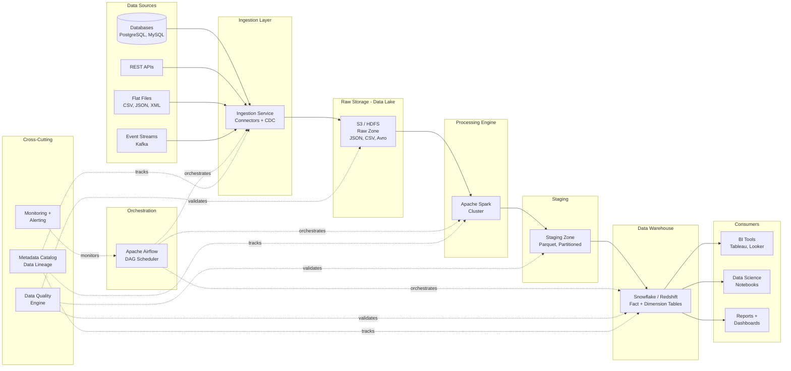
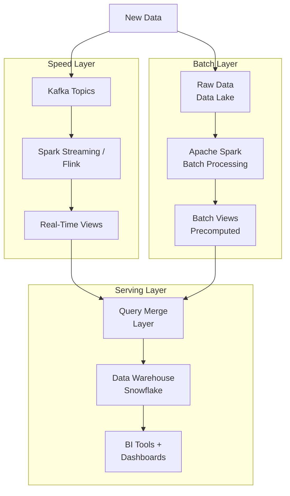
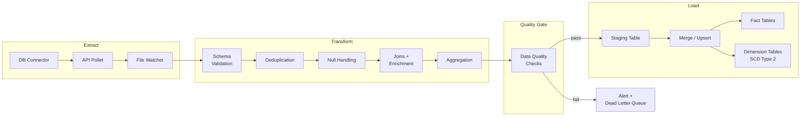

# Batch Data Pipeline (ETL/ELT) - System Design

## 1. Problem Statement

Modern organizations generate massive volumes of data across databases, APIs, log files,
and third-party services. Deriving business insights requires collecting this raw data,
transforming it into analysis-ready formats, and loading it into a data warehouse where
BI tools and analysts can query it efficiently.

We need to design a **scalable batch data processing pipeline** that:

- Ingests data from heterogeneous sources on a recurring schedule
- Applies complex transformations (cleaning, deduplication, aggregation, joins)
- Loads processed data into a data warehouse with strict SLA guarantees
- Handles failures gracefully with retry, checkpoint, and backfill capabilities
- Maintains data quality through automated validation at every stage
- Tracks data lineage from source to destination for audit and debugging

The pipeline must handle **10 TB/day** with a **<4-hour SLA** for the daily batch run.

---

## 2. Functional Requirements

| ID   | Requirement                        | Description                                                                                       |
|------|------------------------------------|---------------------------------------------------------------------------------------------------|
| FR-1 | Multi-source ingestion             | Ingest from relational DBs (PostgreSQL, MySQL), REST APIs, flat files (CSV, JSON), cloud storage |
| FR-2 | Data transformation                | Clean (nulls, outliers), deduplicate, aggregate, join across datasets                             |
| FR-3 | Data warehouse loading             | Load transformed data into warehouse with upsert (merge) semantics                               |
| FR-4 | Scheduled recurring jobs           | Cron-based and event-driven triggers for pipelines                                                |
| FR-5 | Data quality checks                | Null checks, schema validation, row count checks, referential integrity, freshness checks         |
| FR-6 | Backfill support                   | Re-run pipelines for historical date ranges without affecting current data                        |
| FR-7 | Pipeline definition as code        | Define pipelines as DAGs with stages, dependencies, and configurations                           |
| FR-8 | Idempotent reruns                  | Re-running a pipeline for the same partition produces identical results                           |
| FR-9 | Data lineage tracking              | Track which source records contributed to each destination record                                 |
| FR-10| Alerting and notifications         | Notify on failures, SLA breaches, and data quality violations                                    |

---

## 3. Non-Functional Requirements

| ID    | Requirement         | Target                                                                  |
|-------|---------------------|-------------------------------------------------------------------------|
| NFR-1 | Throughput          | Process 10 TB of raw data per day                                       |
| NFR-2 | Latency (SLA)       | Daily pipeline completes within 4 hours of trigger                      |
| NFR-3 | Fault tolerance     | Retry failed stages up to 3 times with exponential backoff              |
| NFR-4 | Idempotency         | Reruns produce identical results; no duplicate records                   |
| NFR-5 | Data lineage        | Full source-to-destination lineage queryable via metadata catalog        |
| NFR-6 | Availability        | Orchestrator available 99.9% (replicated scheduler, HA database)        |
| NFR-7 | Data freshness      | Warehouse tables refreshed within 1 hour of pipeline completion         |
| NFR-8 | Cost efficiency     | Auto-scale compute; shut down clusters when idle                        |
| NFR-9 | Security            | Encryption at rest and in transit; PII masking; RBAC                    |
| NFR-10| Observability       | End-to-end pipeline metrics, logs, and traces in a unified dashboard    |

---

## 4. Capacity Estimation

### Data Volume

| Metric                  | Daily        | Monthly       | Yearly        |
|-------------------------|-------------|---------------|---------------|
| Raw ingestion           | 10 TB       | 300 TB        | 3.6 PB        |
| After deduplication     | 7 TB        | 210 TB        | 2.5 PB        |
| After aggregation       | 500 GB      | 15 TB         | 180 TB        |
| Warehouse (cumulative)  | +500 GB/day | ~15 TB growth | ~180 TB total |

### Compute Resources

| Component           | Specification                                        |
|---------------------|------------------------------------------------------|
| Spark cluster       | 50 worker nodes, 16 cores / 64 GB RAM each           |
| Peak parallelism    | 800 concurrent tasks                                  |
| Orchestrator        | 4-node Airflow cluster (scheduler + 3 workers)        |
| Metadata DB         | PostgreSQL RDS (db.r5.2xlarge), 500 GB SSD            |

### Storage Tiers

| Tier           | Format   | Retention | Estimated Size (1 year) |
|----------------|----------|-----------|-------------------------|
| Raw (landing)  | JSON/CSV | 90 days   | 900 TB                  |
| Processed      | Parquet  | 1 year    | 750 TB (compressed)     |
| Aggregated     | Parquet  | 3 years   | 540 TB                  |
| Warehouse      | Columnar | 5 years   | 900 TB                  |

---

## 5. API Design

### Pipeline Definition

```
POST /api/v1/pipelines
{
  "name": "daily_sales_etl",
  "schedule": "0 2 * * *",
  "stages": [
    {
      "name": "extract_orders",
      "type": "extract",
      "source": {"type": "postgres", "connection": "orders_db", "query": "..."},
      "output": "raw/orders/{partition_date}"
    },
    {
      "name": "transform_orders",
      "type": "transform",
      "depends_on": ["extract_orders"],
      "logic": "spark_job:transform_orders",
      "output": "processed/orders/{partition_date}"
    },
    {
      "name": "load_orders",
      "type": "load",
      "depends_on": ["transform_orders"],
      "destination": {"type": "snowflake", "table": "fact_orders", "mode": "merge"}
    }
  ],
  "quality_checks": [
    {"stage": "extract_orders", "check": "row_count_min", "threshold": 1000},
    {"stage": "transform_orders", "check": "null_percentage", "column": "order_id", "max_pct": 0}
  ]
}

Response: 201 Created
{
  "pipeline_id": "pipe_abc123",
  "created_at": "2024-01-15T10:30:00Z",
  "next_run": "2024-01-16T02:00:00Z"
}
```

### Trigger Pipeline

```
POST /api/v1/pipelines/{pipeline_id}/trigger
{
  "partition_date": "2024-01-15",
  "parameters": {"full_refresh": false}
}

Response: 202 Accepted
{
  "run_id": "run_xyz789",
  "status": "queued",
  "estimated_completion": "2024-01-15T06:00:00Z"
}
```

### Pipeline Status

```
GET /api/v1/pipelines/{pipeline_id}/runs/{run_id}

Response: 200 OK
{
  "run_id": "run_xyz789",
  "status": "running",
  "started_at": "2024-01-15T02:00:05Z",
  "stages": [
    {"name": "extract_orders", "status": "completed", "duration_sec": 1200, "rows": 5000000},
    {"name": "transform_orders", "status": "running", "progress": 0.65},
    {"name": "load_orders", "status": "pending"}
  ],
  "quality_checks": [
    {"check": "row_count_min", "status": "passed", "actual": 5000000, "threshold": 1000}
  ]
}
```

### Backfill

```
POST /api/v1/pipelines/{pipeline_id}/backfill
{
  "start_date": "2024-01-01",
  "end_date": "2024-01-14",
  "parallelism": 4,
  "priority": "low"
}

Response: 202 Accepted
{
  "backfill_id": "bf_001",
  "total_partitions": 14,
  "estimated_hours": 8
}
```

---

## 6. Data Model

### Entity Relationship

```
pipeline_definition 1---* pipeline_run
pipeline_definition 1---* stage_definition
pipeline_run        1---* stage_run
stage_definition    1---* data_quality_rule
stage_run           1---* quality_check_result
dataset             *---* stage_definition (input/output)
```

### Tables

**pipeline_definition**

| Column        | Type      | Description                            |
|---------------|-----------|----------------------------------------|
| id            | UUID (PK) | Unique pipeline identifier             |
| name          | VARCHAR   | Human-readable name                    |
| schedule      | VARCHAR   | Cron expression                        |
| owner         | VARCHAR   | Team or user who owns the pipeline     |
| config        | JSONB     | Pipeline-level configuration           |
| is_active     | BOOLEAN   | Whether the pipeline is enabled        |
| created_at    | TIMESTAMP | Creation timestamp                     |
| updated_at    | TIMESTAMP | Last modification timestamp            |

**pipeline_run**

| Column         | Type      | Description                             |
|----------------|-----------|---------------------------------------- |
| id             | UUID (PK) | Unique run identifier                  |
| pipeline_id    | UUID (FK) | Reference to pipeline_definition       |
| partition_date | DATE      | The data partition being processed     |
| status         | ENUM      | queued/running/completed/failed        |
| trigger_type   | ENUM      | scheduled/manual/backfill              |
| started_at     | TIMESTAMP | Run start time                         |
| completed_at   | TIMESTAMP | Run completion time                    |
| parameters     | JSONB     | Runtime parameters                     |

**stage_definition**

| Column        | Type      | Description                            |
|---------------|-----------|----------------------------------------|
| id            | UUID (PK) | Unique stage identifier                |
| pipeline_id   | UUID (FK) | Parent pipeline                        |
| name          | VARCHAR   | Stage name                             |
| stage_type    | ENUM      | extract/transform/load                 |
| config        | JSONB     | Stage-specific configuration           |
| depends_on    | UUID[]    | List of upstream stage IDs             |
| retry_policy  | JSONB     | Retry count, backoff settings          |

**stage_run**

| Column       | Type      | Description                             |
|--------------|-----------|---------------------------------------- |
| id           | UUID (PK) | Unique stage run identifier            |
| run_id       | UUID (FK) | Parent pipeline run                    |
| stage_id     | UUID (FK) | Reference to stage_definition          |
| status       | ENUM      | pending/running/completed/failed       |
| attempt      | INT       | Current retry attempt number           |
| started_at   | TIMESTAMP | Stage start time                       |
| completed_at | TIMESTAMP | Stage completion time                  |
| rows_read    | BIGINT    | Number of rows read                    |
| rows_written | BIGINT    | Number of rows written                 |
| error_msg    | TEXT      | Error message if failed                |

**dataset**

| Column     | Type      | Description                              |
|------------|-----------|------------------------------------------|
| id         | UUID (PK) | Unique dataset identifier                |
| name       | VARCHAR   | Dataset name (e.g., raw.orders)          |
| location   | VARCHAR   | Storage path or table reference          |
| format     | ENUM      | parquet/csv/json/orc/avro                |
| schema     | JSONB     | Column names and types                   |
| partition  | VARCHAR   | Partition key (e.g., date)               |
| owner      | VARCHAR   | Owning team                              |

**data_quality_rule**

| Column     | Type      | Description                              |
|------------|-----------|------------------------------------------|
| id         | UUID (PK) | Unique rule identifier                   |
| stage_id   | UUID (FK) | Stage this rule applies to               |
| check_type | ENUM      | null_check/row_count/schema/custom       |
| column     | VARCHAR   | Target column (if applicable)            |
| threshold  | JSONB     | Pass/fail thresholds                     |
| severity   | ENUM      | warning/error/critical                   |
| is_blocking| BOOLEAN   | Whether failure blocks pipeline          |

---

## 7. High-Level Architecture



### Component Descriptions

| Component          | Role                                                                  |
|--------------------|-----------------------------------------------------------------------|
| Ingestion Service  | Source-specific connectors; CDC for databases; API polling; file watch |
| Raw Storage        | Immutable landing zone; data stored in original format                |
| Spark Processing   | Distributed transforms: cleaning, joins, aggregations                 |
| Staging Zone       | Validated, partitioned Parquet; intermediate results                  |
| Data Warehouse     | Optimized for analytical queries; star/snowflake schema               |
| Orchestrator       | DAG-based scheduling; dependency management; retries                  |
| Metadata Catalog   | Schema registry; lineage graph; impact analysis                      |
| Quality Engine     | Configurable rules engine; runs checks between stages                 |
| Monitoring         | Pipeline metrics, SLA tracking, alerting                              |

---

## 8. Detailed Design

### 8.1 Lambda Architecture

The pipeline follows a **Lambda Architecture** with three layers:

**Batch Layer** (primary):
- Processes the complete dataset on a schedule (e.g., daily at 2 AM)
- Produces "batch views" -- pre-computed aggregations stored in the warehouse
- Provides the authoritative, complete, and accurate dataset
- Handles reprocessing and backfill scenarios

**Serving Layer**:
- Indexes batch views for low-latency queries
- Materialized views in the data warehouse for common query patterns
- Cached aggregations for dashboard queries
- Provides sub-second query response for BI tools

**Speed Layer** (optional, for near-real-time):
- Processes streaming data to fill the gap between batch runs
- Results are approximate and eventually superseded by batch results
- Uses Kafka + Spark Streaming or Flink for micro-batch processing
- Merges with batch views at query time

### 8.2 DAG-Based Pipeline Orchestration

Each pipeline is defined as a **Directed Acyclic Graph (DAG)**:

```
Extract_Orders ---> Transform_Orders --+
                                       |
Extract_Products -> Transform_Products-+--> Join_Facts --> Quality_Check --> Load_Warehouse
                                       |
Extract_Customers-> Transform_Cust ----+
```

**Execution rules:**
1. A stage runs only when ALL upstream dependencies are complete
2. Failed stages are retried up to N times with exponential backoff
3. Stages with no dependency relationship can run in parallel
4. The orchestrator performs topological sort to determine execution order
5. Checkpoints are saved after each successful stage for restart capability

### 8.3 Partitioning Strategy

All data is partitioned by **date** (the primary access pattern for analytics):

```
s3://data-lake/raw/orders/
    partition_date=2024-01-15/
        part-00000.parquet
        part-00001.parquet
    partition_date=2024-01-16/
        ...
```

**Benefits:**
- Partition pruning eliminates scanning irrelevant data
- Enables idempotent writes: overwrite entire partition on rerun
- Supports efficient backfill: process specific date ranges
- Aligns with business reporting cadence (daily/weekly/monthly)

### 8.4 SCD Type 2 for Dimension Tables

Slowly Changing Dimension Type 2 preserves historical attribute values:

```
| customer_id | name       | city        | valid_from | valid_to   | is_current |
|-------------|------------|-------------|------------|------------|------------|
| C001        | Alice      | New York    | 2023-01-01 | 2024-03-14 | false      |
| C001        | Alice      | San Francisco| 2024-03-15 | 9999-12-31 | true       |
```

**Implementation:**
1. Compare incoming records with current dimension records
2. For changed attributes: expire current row (set valid_to, is_current=false)
3. Insert new row with updated attributes (valid_from=today, is_current=true)
4. Unchanged records are left as-is

### 8.5 Data Quality Framework

Quality checks run at stage boundaries:

| Check Type        | Description                          | Example                           |
|-------------------|--------------------------------------|-----------------------------------|
| Null check        | % of nulls in a column below limit   | order_id null % < 0.1%           |
| Row count         | Output rows within expected range    | rows >= 1000 AND rows <= 10M     |
| Schema validation | Output matches expected schema       | All required columns present      |
| Uniqueness        | No duplicate values in key columns   | order_id is unique                |
| Referential       | FK values exist in reference table   | customer_id in dim_customers      |
| Freshness         | Data timestamp within expected range | max(updated_at) >= today - 1 day |
| Statistical       | Distribution within expected bounds  | avg(amount) within 2 std devs    |

**Quality check outcomes:**
- **Pass**: Pipeline continues
- **Warning**: Pipeline continues; alert sent
- **Fail (blocking)**: Pipeline halts; alert sent; on-call paged

---

## 9. Architecture Diagram

### Lambda Architecture Layers



### ETL Stage Flow



---

## 10. Architectural Patterns

### Lambda Architecture

- **What**: Process data through both batch and real-time paths; merge at query time
- **Why**: Provides both completeness (batch) and freshness (streaming)
- **Tradeoff**: Maintaining two codepaths increases complexity; consider Kappa Architecture
  (streaming-only) if real-time is the primary requirement

### ETL vs ELT

| Aspect          | ETL                                    | ELT                                      |
|-----------------|----------------------------------------|------------------------------------------|
| Transform where | In processing engine (Spark)           | Inside the data warehouse (SQL)          |
| Best for        | Complex transformations, large volumes | SQL-friendly transforms, cloud warehouses|
| Our choice      | **ETL for heavy transforms** (joins, dedup), **ELT for aggregations** in warehouse |

### SCD Type 2 (Slowly Changing Dimensions)

- **What**: Track historical changes to dimension attributes by versioning rows
- **Why**: Enables point-in-time analysis ("What city was customer X in when they ordered?")
- **Tradeoff**: Increases dimension table size; adds complexity to joins (filter is_current)

### Idempotent Processing

- **What**: Re-running a pipeline stage for the same partition produces identical output
- **How**: Write-then-swap pattern -- write to temp location, validate, atomically replace
- **Why**: Enables safe retries and backfill without data corruption

### Partition-Based Incremental Loads

- **What**: Process only new/changed partitions instead of full dataset
- **How**: Track high-watermark (last processed timestamp/ID); load only newer records
- **Why**: Reduces compute cost from O(total_data) to O(new_data) per run

### Data Vault Modeling

- **What**: Hub (business keys), Link (relationships), Satellite (attributes) tables
- **Why**: Highly flexible for integrating data from many sources; supports full history
- **When**: Use for the raw vault layer; transform into dimensional model for serving

---

## 11. Technology Choices and Tradeoffs

### Processing Engine

| Engine   | Strengths                              | Weaknesses                      | Best For                |
|----------|----------------------------------------|---------------------------------|-------------------------|
| **Spark**| Distributed, mature, rich API          | JVM overhead, complex tuning    | Large-scale batch ETL   |
| Presto   | Fast interactive SQL queries           | Not ideal for heavy ETL writes  | Ad-hoc analytics        |
| Hive     | Good for SQL on Hadoop                 | Slow for iterative processing   | Legacy Hadoop workloads |
| dbt      | SQL-first, version controlled          | Limited to SQL transforms       | ELT in warehouse        |

**Our choice**: **Apache Spark** for heavy transforms + **dbt** for in-warehouse ELT.

### Storage

| Storage  | Strengths                              | Weaknesses                      | Best For                |
|----------|----------------------------------------|---------------------------------|-------------------------|
| **S3**   | Cheap, durable, scalable              | Higher latency than local       | Data lake               |
| HDFS     | Low latency, data locality             | Ops overhead, scaling limits    | On-prem Hadoop          |
| GCS      | GCP-native, strong consistency         | GCP lock-in                     | GCP environments        |

**Our choice**: **S3** (or equivalent object storage) for the data lake.

### Orchestrator

| Tool       | Strengths                             | Weaknesses                      | Best For                 |
|------------|---------------------------------------|---------------------------------|--------------------------|
| **Airflow**| Mature, large community, extensible   | Complex ops, UI limitations     | General-purpose pipelines|
| Prefect    | Modern API, better error handling     | Smaller community               | Python-centric teams     |
| Dagster    | Software-defined assets, type system  | Newer, less battle-tested       | Data mesh architectures  |

**Our choice**: **Apache Airflow** for production orchestration.

### File Format

| Format    | Strengths                              | Weaknesses                     | Best For                  |
|-----------|----------------------------------------|--------------------------------|---------------------------|
| **Parquet**| Columnar, good compression, fast reads| Slow for row-level updates     | Analytical workloads      |
| ORC       | Optimized for Hive, good compression   | Less ecosystem support         | Hive/Presto workloads     |
| Avro      | Row-oriented, schema evolution         | Less efficient for analytics   | Ingestion, streaming      |

**Our choice**: **Avro** for ingestion (schema evolution) -> **Parquet** for processing/warehouse.

### Data Warehouse

| Warehouse    | Strengths                           | Weaknesses                      | Best For                |
|--------------|-------------------------------------|---------------------------------|-------------------------|
| **Snowflake**| Separation of compute/storage, easy | Premium pricing                 | Multi-cloud, ease of use|
| Redshift     | AWS-native, good for large scans    | Cluster management overhead     | AWS-centric workloads   |
| BigQuery     | Serverless, fast, good for ad-hoc   | GCP lock-in, unpredictable cost | GCP, ad-hoc analytics   |

**Our choice**: **Snowflake** for separation of concerns and multi-cloud flexibility.

---

## 12. Scalability

### Horizontal Scaling of Spark

- **Dynamic allocation**: Spark executors scale up/down based on workload
- **Cluster autoscaling**: EMR/Dataproc adds nodes during peak processing
- **Stage-level resource tuning**: Memory-heavy stages (joins) get more resources
- **Adaptive Query Execution (AQE)**: Spark 3.x automatically optimizes joins and shuffles

### Partition Pruning

- Date-partitioned tables allow queries to skip irrelevant partitions
- Predicate pushdown reduces data scanned at the storage level
- Bucketing on high-cardinality join keys (e.g., customer_id) eliminates shuffle

### Caching Strategy

| Cache Layer       | What                                  | TTL           |
|-------------------|---------------------------------------|---------------|
| Spark persist     | Intermediate DataFrames used in joins | Per-job       |
| Warehouse cache   | Frequently queried result sets        | 24 hours      |
| BI tool cache     | Dashboard query results               | 15 minutes    |
| Metadata cache    | Schema, lineage information           | 1 hour        |

### Data Compaction

- Small files from streaming ingestion are compacted into larger Parquet files
- Target file size: 128 MB - 1 GB for optimal Spark read performance
- Compaction runs as a low-priority maintenance job after daily ETL

---

## 13. Reliability

### Checkpoint and Restart

- Each stage writes a completion marker (e.g., `_SUCCESS` file) upon success
- On failure, the orchestrator restarts from the last successful stage
- Intermediate data is preserved in staging; only the failed stage re-executes
- Partition-level granularity: only the failed partition is reprocessed

### Retry Policy

```
Stage Retry Configuration:
  max_retries: 3
  initial_backoff: 30 seconds
  backoff_multiplier: 2
  max_backoff: 300 seconds
  retryable_errors: [TimeoutError, ConnectionError, ThrottlingError]
  non_retryable_errors: [SchemaError, AuthenticationError]
```

### Dead Letter Queue (DLQ)

- Records that fail transformation (e.g., corrupt data) are routed to a DLQ
- DLQ records include: original record, error message, timestamp, stage name
- Periodic review process to fix and replay DLQ records
- DLQ size is a monitored metric with alerting thresholds

### SLA Breach Alerting

```
SLA Monitoring:
  - Pipeline not started by expected time: WARNING at T+15min, CRITICAL at T+30min
  - Pipeline running longer than expected: WARNING at 80% SLA, CRITICAL at 95% SLA
  - Pipeline failed: CRITICAL immediately
  - Data freshness: WARNING if warehouse table older than 6 hours
```

### Disaster Recovery

- Raw data in S3 with cross-region replication
- Pipeline definitions stored in version control (Git)
- Metadata database backed up every 6 hours
- Recovery Time Objective (RTO): 2 hours
- Recovery Point Objective (RPO): 6 hours

---

## 14. Security

### Encryption

| Layer          | Method                                                |
|----------------|-------------------------------------------------------|
| At rest        | AES-256 encryption on S3, warehouse, metadata DB      |
| In transit     | TLS 1.3 for all network communication                 |
| Key management | AWS KMS / HashiCorp Vault for key rotation            |

### Access Control

- **RBAC (Role-Based Access Control)** with principle of least privilege
- Roles: pipeline_admin, pipeline_developer, data_analyst, data_viewer
- Row-level security in warehouse for sensitive datasets
- Service accounts with scoped permissions for each pipeline

### PII Masking

| Technique        | Use Case                              | Example                        |
|------------------|---------------------------------------|--------------------------------|
| Hashing          | Pseudonymization of identifiers       | SHA-256(email)                 |
| Tokenization     | Reversible masking for authorized use | Token lookup table             |
| Redaction        | Remove sensitive fields entirely      | Drop SSN column                |
| Generalization   | Reduce precision                      | ZIP 10001 -> ZIP 100xx        |

### Audit

- All pipeline runs logged with: who triggered, what data accessed, when completed
- Data access queries logged in warehouse audit trail
- Changes to pipeline definitions tracked in Git with code review required
- Compliance reports generated monthly for SOC2 / GDPR requirements

---

## 15. Monitoring

### Key Metrics

| Metric                    | Description                                    | Alert Threshold        |
|---------------------------|------------------------------------------------|------------------------|
| Pipeline duration         | End-to-end time from trigger to completion     | > 80% of SLA           |
| Stage duration            | Time for each individual stage                 | > 2x historical avg    |
| Data freshness            | Time since last warehouse table update         | > 6 hours              |
| Row count delta           | % change from previous run                     | > 50% increase/decrease|
| Quality score             | % of quality checks passing                    | < 95%                  |
| Error rate                | Failed runs / total runs                       | > 5%                   |
| DLQ depth                 | Number of records in dead letter queue         | > 10,000               |
| Spark executor utilization| CPU and memory usage of Spark cluster          | < 30% (over-provisioned)|

### Dashboards

**Pipeline Operations Dashboard:**
- Pipeline run status (success/fail/running) over time
- SLA compliance percentage by pipeline
- Average and P99 pipeline duration trends
- Active backfill progress

**Data Quality Dashboard:**
- Quality check pass rate by pipeline and stage
- Null percentage trends for key columns
- Row count trends with anomaly detection
- Schema drift alerts

**Infrastructure Dashboard:**
- Spark cluster utilization (CPU, memory, disk)
- S3 storage growth and cost
- Warehouse query performance and credit usage
- Orchestrator task queue depth

### Alerting Channels

| Severity  | Channel                | Response Time    |
|-----------|------------------------|------------------|
| Critical  | PagerDuty + Slack      | < 15 minutes     |
| Warning   | Slack + Email          | < 1 hour         |
| Info      | Dashboard only         | Next business day|

---

## Summary

This Batch Data Pipeline design provides a scalable, reliable, and maintainable system
for processing 10 TB/day with strict SLA guarantees. Key architectural decisions include:

- **Lambda Architecture** for balancing completeness and freshness
- **Spark + Airflow** for proven, scalable batch processing
- **Partition-based idempotent processing** for safe retries and backfill
- **Multi-layer data quality** framework to catch issues before they reach consumers
- **Comprehensive monitoring** with SLA tracking and anomaly detection
