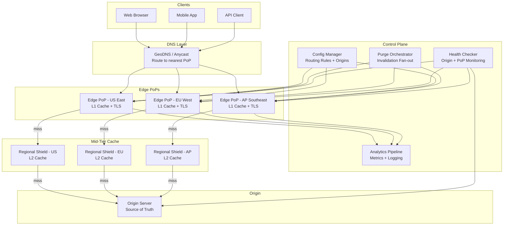
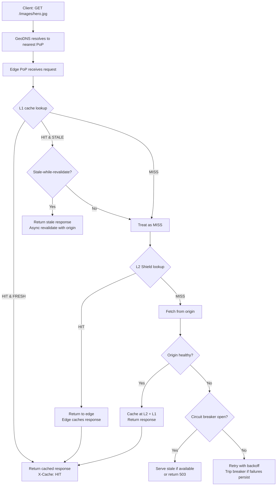
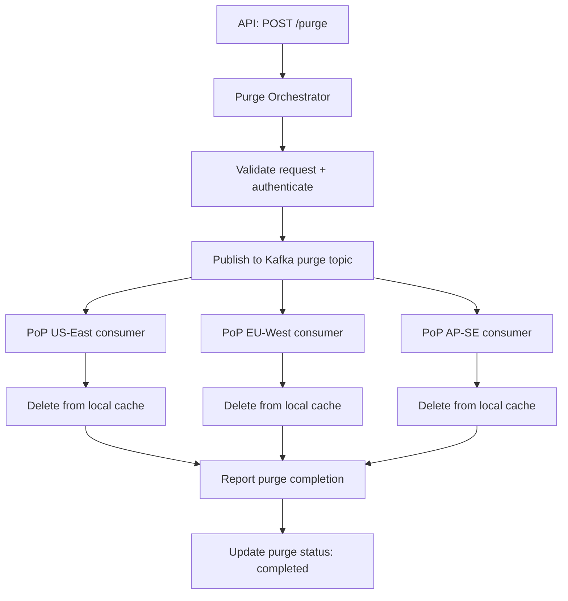

# Content Delivery Network (CDN) -- System Design

## 1. Problem Statement

A Content Delivery Network (CDN) accelerates the delivery of web content
(HTML, CSS, JavaScript, images, video, APIs) by caching copies at
geographically distributed **Points of Presence (PoPs)** close to end users.

**Why build one?**

- Origin servers cannot serve global traffic with low latency from a single
  location. A user in Tokyo hitting an origin in Virginia sees 200+ ms RTT.
- Traffic spikes (flash sales, breaking news) overwhelm origin infrastructure
  without an absorbing cache layer.
- HTTPS termination at the edge reduces TLS handshake latency from 3-RTT to 1.
- CDNs offload 80-95 % of origin traffic, drastically reducing bandwidth costs.

The core challenge is routing users to the nearest PoP, maintaining high cache
hit ratios (>95 %), and invalidating stale content within seconds -- all at
global scale handling millions of requests per second.

---

## 2. Functional Requirements

| # | Requirement | Details |
|---|-------------|---------|
| FR-1 | **Cache content at edge** | Cache static and dynamic content at edge PoPs closest to users. |
| FR-2 | **Origin pull** | On cache miss, fetch content from the origin server and cache it. |
| FR-3 | **Origin push (prefetch)** | Content owners can proactively push content to edge caches before user requests. |
| FR-4 | **Cache invalidation** | Support purge (by URL, wildcard, surrogate key/tag), soft purge (stale-while-revalidate). |
| FR-5 | **Route to nearest PoP** | Direct each user request to the geographically or latency-closest edge node. |
| FR-6 | **HTTPS termination** | Terminate TLS at the edge to reduce handshake latency; re-encrypt to origin if needed. |
| FR-7 | **Cache-Control compliance** | Respect origin `Cache-Control`, `Vary`, `ETag`, `Last-Modified` headers. |
| FR-8 | **Analytics and logging** | Provide real-time traffic, cache hit/miss, bandwidth, and error metrics. |

---

## 3. Non-Functional Requirements

| Attribute | Target |
|-----------|--------|
| **Latency** | < 50 ms p99 globally for cache hits |
| **Availability** | 99.99 % uptime (< 53 min downtime / year) |
| **Cache hit ratio** | > 95 % for static content, > 80 % for dynamic |
| **Throughput** | Handle 10 M+ requests/sec across all PoPs |
| **Invalidation latency** | Purge propagates to all PoPs within 5 seconds |
| **Traffic spikes** | Absorb 10x normal traffic without origin overload |
| **Security** | DDoS mitigation, WAF integration, bot detection |
| **Consistency** | Eventual consistency acceptable; stale-while-revalidate pattern |

---

## 4. Capacity Estimation

### 4.1 Traffic

```
Total requests      : 10 M/sec across all PoPs
PoPs worldwide      : 200 locations
Avg per PoP         : 50,000 req/sec
Cache hit ratio     : 95 %
Origin pulls        : 10 M * 0.05 = 500 K/sec
```

### 4.2 Cache Storage per PoP

```
Unique objects cached       : 50 M objects per PoP
Avg object size             : 100 KB
Storage per PoP             : 50 M * 100 KB = 5 TB SSD
Hot object working set      : 5 M objects * 100 KB = 500 GB RAM
```

### 4.3 Bandwidth

```
Avg response size           : 100 KB
Egress per PoP              : 50,000 req/s * 100 KB = 5 GB/s = 40 Gbps
Total network egress        : 200 PoPs * 40 Gbps = 8 Tbps
Origin ingress (misses)     : 500 K/s * 100 KB = 50 GB/s
```

### 4.4 TLS Overhead

```
New TLS handshakes/PoP      : ~10,000/sec (keep-alive reuses most)
TLS session resumption rate  : > 80 %
CPU overhead per PoP         : ~2 cores dedicated to TLS
```

---

## 5. API Design

### 5.1 Purge API

```
POST /api/v1/purge
```

**Request:**
```json
{
  "type": "url",
  "targets": [
    "https://cdn.example.com/images/hero.jpg",
    "https://cdn.example.com/css/main.css"
  ],
  "soft_purge": false
}
```

**Response (202 Accepted):**
```json
{
  "purge_id": "purge-abc123",
  "status": "propagating",
  "targets_count": 2,
  "estimated_completion_seconds": 5
}
```

### 5.2 Tag-Based Purge

```
POST /api/v1/purge/tags
```

**Request:**
```json
{
  "surrogate_keys": ["product-123", "category-electronics"],
  "soft_purge": true
}
```

**Response (202 Accepted):**
```json
{
  "purge_id": "purge-def456",
  "status": "propagating",
  "keys_count": 2,
  "affected_objects_estimate": 1500
}
```

### 5.3 Prefetch (Push) API

```
POST /api/v1/prefetch
```

**Request:**
```json
{
  "urls": [
    "https://cdn.example.com/videos/promo.mp4",
    "https://cdn.example.com/images/banner.webp"
  ],
  "regions": ["us-east", "eu-west", "ap-southeast"],
  "priority": "high"
}
```

**Response (202 Accepted):**
```json
{
  "prefetch_id": "pf-ghi789",
  "status": "queued",
  "urls_count": 2,
  "target_pops": 45
}
```

### 5.4 Cache Status Query

```
GET /api/v1/cache/status?url=https://cdn.example.com/images/hero.jpg
```

**Response (200 OK):**
```json
{
  "url": "https://cdn.example.com/images/hero.jpg",
  "cached_at_pops": 180,
  "total_pops": 200,
  "freshness": "fresh",
  "ttl_remaining_seconds": 3200,
  "content_hash": "sha256:abc123..."
}
```

---

## 6. Data Model

### 6.1 Cached Content -- `cached_content`

| Column | Type | Notes |
|--------|------|-------|
| `cache_key` | VARCHAR(512) PK | URL + Vary headers hash |
| `origin_url` | TEXT NOT NULL | Full origin URL |
| `content_hash` | CHAR(64) | SHA-256 of the body |
| `content_type` | VARCHAR(128) | MIME type |
| `content_length` | BIGINT | Body size in bytes |
| `headers` | JSONB | Stored response headers |
| `ttl_seconds` | INT | Time-to-live from Cache-Control |
| `cached_at` | TIMESTAMP | When first cached |
| `expires_at` | TIMESTAMP | cached_at + ttl |
| `last_validated` | TIMESTAMP | Last 304 revalidation |
| `etag` | VARCHAR(256) | Origin ETag for conditional requests |
| `surrogate_keys` | TEXT[] | Tags for grouped invalidation |
| `hit_count` | BIGINT DEFAULT 0 | Access frequency |
| `pop_id` | VARCHAR(32) | Which PoP stores this entry |

### 6.2 Origin Configuration -- `origin_config`

| Column | Type | Notes |
|--------|------|-------|
| `origin_id` | UUID PK | Unique origin identifier |
| `hostname` | VARCHAR(256) UNIQUE | e.g. `origin.example.com` |
| `scheme` | ENUM('http','https') | Protocol to origin |
| `port` | INT DEFAULT 443 | Origin port |
| `health_check_path` | VARCHAR(256) | e.g. `/healthz` |
| `health_check_interval_s` | INT DEFAULT 30 | Seconds between checks |
| `is_healthy` | BOOLEAN DEFAULT TRUE | Current health status |
| `shield_pop_id` | VARCHAR(32) | Mid-tier cache PoP for origin shielding |
| `max_connections` | INT DEFAULT 1000 | Connection pool limit |
| `timeout_ms` | INT DEFAULT 5000 | Origin fetch timeout |
| `retry_count` | INT DEFAULT 2 | Retries on failure |
| `ssl_verify` | BOOLEAN DEFAULT TRUE | Verify origin TLS cert |

### 6.3 Routing Rules -- `routing_rules`

| Column | Type | Notes |
|--------|------|-------|
| `rule_id` | UUID PK | Unique rule identifier |
| `pattern` | VARCHAR(512) | URL path pattern (glob/regex) |
| `origin_id` | UUID FK | Target origin |
| `cache_policy` | ENUM('cache','bypass','stale-while-revalidate') | Caching behavior |
| `default_ttl` | INT | TTL when origin omits Cache-Control |
| `override_ttl` | INT | Force TTL regardless of origin |
| `allowed_methods` | TEXT[] | e.g. `['GET','HEAD']` |
| `geo_restrictions` | JSONB | Allow/deny by country code |
| `priority` | INT DEFAULT 0 | Rule evaluation order |
| `created_at` | TIMESTAMP | Rule creation time |
| `updated_at` | TIMESTAMP | Last modification |

### 6.4 Indexing Strategy

- **Primary index** on `cache_key` partitioned by `pop_id` for fast local lookups.
- **Surrogate key index** on `surrogate_keys` (GIN index) for tag-based purge.
- **Expires index** on `expires_at` for TTL-based eviction scans.
- **Origin index** on `origin_id` in routing rules for config lookups.
- **Hit count** tracked in-memory with periodic persistence for LRU decisions.

---

## 7. High-Level Architecture



---

## 8. Detailed Component Design

### 8.1 DNS-Based Routing

**GeoDNS** resolves the CDN hostname to the IP of the nearest PoP based on
the client's resolver IP geolocation:

```
1. Client DNS query: cdn.example.com
2. GeoDNS checks resolver IP -> maps to region (e.g. EU-West)
3. Returns IP of nearest healthy PoP (e.g. 203.0.113.10 in Amsterdam)
4. Client connects directly to Amsterdam PoP
```

**Anycast** alternative: all PoPs advertise the same IP prefix via BGP.
Network routing automatically directs packets to the topologically nearest PoP.

| Factor | GeoDNS | Anycast |
|--------|--------|---------|
| Routing granularity | Country/city level | Network topology |
| Failover speed | DNS TTL (30-60s) | Instant (BGP withdrawal) |
| Implementation | DNS infrastructure | BGP peering at each PoP |
| Client stickiness | Per DNS TTL | Per TCP connection |
| **Best for** | HTTP/HTTPS content | UDP-based / low-latency |

**Hybrid approach (recommended):** Use Anycast for the initial DNS query and
GeoDNS for fine-grained HTTP routing decisions.

### 8.2 Cache Hierarchy

```
          +-- L1 Edge Cache --+
          |  (each PoP)       |   < 5 ms     Hot objects, LRU + TTL
          |  RAM + SSD        |              50K-200K objects per PoP
          +-------------------+
                  |
          (cache miss)
                  |
          +-- L2 Regional Shield --+
          |  (1 per region)        |   < 20 ms   Aggregates misses from
          |  Large SSD             |             5-20 edge PoPs
          +------------------------+
                  |
          (cache miss)
                  |
          +-- Origin Server --+
          |  (source of truth) |   50-200 ms  Full content store
          +--------------------+
```

**L1 Edge Cache (per PoP):**
- In-memory (RAM) for the hottest objects (top 1-5 %).
- SSD-backed for the full working set (~5 TB per PoP).
- LRU eviction with TTL expiration.
- Serves 95 %+ of requests.

**L2 Regional Shield (per region):**
- Aggregates cache misses from 5-20 edge PoPs in a region.
- Reduces origin load by 80 % (many edge misses are shield hits).
- Larger storage capacity; acts as a "shared cache" for the region.

**Origin Server:**
- Only receives requests that miss both L1 and L2 (~1 % of total).
- Protected by connection limits, circuit breakers, and request coalescing.

### 8.3 Cache Eviction Strategy

**LRU + TTL hybrid:**

1. **TTL expiration:** Each cached object has a TTL derived from
   `Cache-Control: max-age` or a configured default. Expired objects are
   removed lazily on next access or eagerly by a background sweeper.

2. **LRU eviction:** When cache storage reaches capacity (e.g. 95 % full),
   evict the least recently used objects first. Access timestamps tracked
   in a doubly-linked list + hash map for O(1) operations.

3. **Priority boosting:** Large, expensive-to-fetch objects (video segments)
   get a boost factor to avoid premature eviction.

**Stale-while-revalidate:** Serve a stale cached copy immediately while
asynchronously fetching a fresh version from origin. This prevents cache
miss latency spikes for popular objects near TTL expiry.

### 8.4 Cache Invalidation

| Method | Mechanism | Latency | Use Case |
|--------|-----------|---------|----------|
| **URL purge** | Delete specific cache key across all PoPs | < 5 s | Single asset update |
| **Wildcard purge** | Pattern match (e.g. `/images/*`) | < 10 s | Directory-level update |
| **Tag-based purge** | Surrogate-Key header groups objects | < 5 s | Product page + all variants |
| **Soft purge** | Mark stale, serve while revalidating | Instant | Zero-downtime deploys |
| **TTL expiry** | Automatic expiration | Per TTL | Normal content lifecycle |
| **Ban expressions** | Regex match on URL + headers | < 10 s | Complex invalidation logic |

**Purge fan-out architecture:**
```
API -> Purge Orchestrator -> Kafka topic -> All PoPs consume & purge locally
```

Each PoP runs a purge consumer that processes invalidation messages and removes
matching entries from its local cache.

---

## 9. Architecture Diagram -- Request Flow

### 9.1 Cache Hit Flow



### 9.2 Purge Flow



---

## 10. Architectural Patterns

### 10.1 Cache Hierarchy Pattern

A multi-tier caching architecture where each tier has different capacity,
latency, and hit-rate characteristics:

- **L1 (Edge):** Lowest latency, smallest capacity, highest hit rate.
- **L2 (Shield):** Medium latency, larger capacity, catches regional misses.
- **Origin:** Highest latency, full data, protected by upper tiers.

This pattern reduces origin load exponentially: if L1 has 85 % hit rate and
L2 has 80 % hit rate on L1 misses, origin sees only 3 % of total traffic.

### 10.2 Pull vs Push Model

**Pull (origin-pull):**
- Content fetched on first cache miss. Lazy population.
- Pros: Simple, no wasted storage for unpopular content.
- Cons: First request is slow (cold cache penalty).

**Push (prefetch):**
- Content proactively pushed to PoPs before user requests.
- Pros: Eliminates cold cache penalty for known content.
- Cons: Wastes storage if content is never requested.

**Hybrid approach:** Pull by default with push for high-value content
(homepage assets, product launches, live event streams).

### 10.3 Consistent Hashing Within PoP

Each PoP runs multiple cache servers. Consistent hashing distributes cache
keys across servers within a PoP:

- **Key:** `hash(cache_key) -> server ring position`
- **Adding a server:** Only `K/N` keys rehash (K=keys, N=servers).
- **Server failure:** Adjacent server absorbs orphaned keys.
- **Virtual nodes (vnodes):** 100-200 vnodes per physical server for even
  distribution.

This prevents thundering herd to origin when a single cache server fails.

### 10.4 Circuit Breaker for Origin

Protects the origin from cascading failures:

```
CLOSED (normal)  -- errors < threshold --> CLOSED
CLOSED           -- errors >= threshold --> OPEN
OPEN             -- timeout elapsed     --> HALF-OPEN
HALF-OPEN        -- probe succeeds      --> CLOSED
HALF-OPEN        -- probe fails         --> OPEN
```

When open: serve stale cache, return 503, or redirect to a secondary origin.
Parameters: error threshold (50 % in 10 s window), timeout (30 s), probe
interval (5 s).

### 10.5 Request Coalescing (Collapse)

When multiple clients request the same uncached URL simultaneously, only one
request goes to origin. Other requests wait for the first response:

- Prevents origin overload during cache-miss storms.
- Implementation: lock per cache key, first request acquires lock and fetches,
  subsequent requests wait on the lock and share the response.

---

## 11. Technology Choices and Tradeoffs

### 11.1 Edge Cache Software: Varnish vs Nginx

| Factor | Varnish | Nginx |
|--------|---------|-------|
| Caching performance | Purpose-built, extremely fast | Fast but general-purpose |
| Config language | VCL (powerful, complex) | nginx.conf (simpler) |
| TLS termination | Requires HAProxy/Hitch frontend | Native TLS support |
| Cache invalidation | Rich (purge, ban, xkey) | Basic purge only |
| Memory management | Malloc + LRU, file-backed | Shared memory zones |
| Community/ecosystem | Smaller, CDN-focused | Massive, general-purpose |
| **Verdict** | **Choose for pure caching** | **Choose for TLS + routing + caching** |

**Recommendation:** Nginx for TLS termination and routing, with Varnish
behind it for advanced caching and invalidation logic.

### 11.2 Routing: Anycast vs GeoDNS

| Factor | Anycast | GeoDNS |
|--------|---------|--------|
| Setup complexity | BGP peering at each PoP | DNS infrastructure |
| Failover speed | Instant (BGP convergence ~seconds) | DNS TTL (30-60 s) |
| Granularity | Network topology | Geographic / IP-based |
| Cost | Higher (BGP requires ASN) | Lower (DNS-level) |
| UDP support | Excellent | N/A (DNS resolution) |
| **Verdict** | **Choose for resilience + speed** | **Choose for simplicity + cost** |

### 11.3 Cache Warming Strategies

| Strategy | Mechanism | Best For |
|----------|-----------|----------|
| **Prefetch on deploy** | Push top-N URLs after code deploy | Application releases |
| **Peer warming** | New PoP fetches from sibling PoPs | New PoP spin-up |
| **Log replay** | Replay access logs to pre-populate | Disaster recovery |
| **Predictive** | ML model predicts future popular content | Trending content |

---

## 12. Scalability and Performance

### 12.1 Horizontal Scaling

- **Add PoPs:** Deploy new edge locations in underserved regions. GeoDNS
  automatically routes nearby users to the new PoP.
- **Scale within PoP:** Add cache servers behind the PoP load balancer.
  Consistent hashing redistributes keys with minimal churn.
- **Origin shielding:** Add shield nodes to absorb cross-region miss traffic.

### 12.2 Performance Optimizations

| Optimization | Impact |
|-------------|--------|
| **HTTP/2 multiplexing** | Reduce connection overhead by 80 % |
| **Brotli compression** | 20-30 % smaller than gzip |
| **TCP Fast Open** | Save 1 RTT on new connections |
| **TLS 1.3** | 1-RTT handshake (vs 2-RTT in TLS 1.2) |
| **0-RTT resumption** | Zero extra RTT for returning clients |
| **Edge compute** | Run logic at PoP (Cloudflare Workers model) |
| **Connection pooling** | Reuse origin connections (keep-alive) |

### 12.3 Auto-Scaling Triggers

```
CPU utilization per PoP  > 70 %  -> add cache server
Bandwidth per PoP        > 80 %  -> add network capacity
Cache eviction rate      > 5 %/min -> add storage
Origin error rate        > 1 %   -> activate secondary origin
```

---

## 13. Reliability and Fault Tolerance

### 13.1 PoP-Level Redundancy

- Multiple cache servers per PoP (N+2 redundancy).
- Load balancer health checks remove unhealthy servers in < 10 s.
- If entire PoP fails, GeoDNS reroutes to next-nearest PoP.

### 13.2 Origin Failover

- Primary + secondary origin with automatic failover.
- Circuit breaker prevents cascading failures to origin.
- Stale-while-revalidate serves expired content during origin outage.

### 13.3 Data Durability

- Cache is ephemeral by design -- origin is the source of truth.
- Routing rules and origin configs replicated across 3+ control plane nodes.
- Purge messages stored in Kafka with replication factor 3.

### 13.4 Graceful Degradation

| Failure | Mitigation |
|---------|------------|
| Single cache server down | Consistent hashing redistributes keys |
| Entire PoP down | GeoDNS failover to next-nearest PoP |
| Origin down | Serve stale cache + circuit breaker |
| Control plane down | Edge PoPs continue with last-known config |
| Network partition | PoPs operate independently with local cache |

---

## 14. Security Considerations

### 14.1 DDoS Mitigation

- **Rate limiting** at edge PoPs (token bucket per IP).
- **SYN flood protection** via SYN cookies.
- **Application-layer DDoS:** WAF rules, bot detection, CAPTCHA challenges.
- **Bandwidth absorption:** Distributed PoPs absorb volumetric attacks.

### 14.2 TLS Security

- TLS 1.3 enforced; TLS 1.0/1.1 disabled.
- HSTS preload for all CDN domains.
- OCSP stapling for faster certificate validation.
- Automated certificate management (Let's Encrypt / ACM).

### 14.3 Access Control

- **Token authentication:** Signed URLs with expiration for premium content.
- **IP whitelisting:** Origin accepts requests only from CDN PoP IPs.
- **Geo-restrictions:** Block or allow by country for content licensing.

### 14.4 Content Integrity

- **SRI (Subresource Integrity):** Hash-based verification of cached content.
- **Content-hash validation:** Verify fetched content matches expected hash.
- **Cache poisoning prevention:** Strict cache key normalization, ignore
  unknown query parameters.

---

## 15. Monitoring and Alerting

### 15.1 Key Metrics

| Metric | Target | Alert Threshold |
|--------|--------|-----------------|
| Cache hit ratio | > 95 % | < 90 % |
| Edge response p99 latency | < 50 ms | > 100 ms |
| Origin fetch p99 latency | < 500 ms | > 2 s |
| 5xx error rate | < 0.01 % | > 0.1 % |
| Purge propagation time | < 5 s | > 15 s |
| Bandwidth utilization | < 80 % | > 90 % |
| Origin health | All healthy | Any origin unhealthy |
| TLS handshake latency | < 20 ms | > 50 ms |

### 15.2 SLAs

- **Availability SLA:** 99.99 % monthly uptime.
- **Latency SLA:** p99 cache-hit response < 50 ms globally.
- **Purge SLA:** Invalidation propagated to all PoPs within 5 seconds.
- **Origin shield SLA:** < 5 % of total traffic reaches origin.

### 15.3 Observability Stack

- **Metrics:** Prometheus at each PoP, aggregated via Thanos / Cortex.
- **Dashboards:** Grafana with per-PoP, per-origin, and global views.
- **Logging:** Structured JSON access logs -> Kafka -> ClickHouse for
  real-time analytics.
- **Tracing:** Distributed tracing (Jaeger) across edge -> shield -> origin.
- **Alerting:** PagerDuty for SLA breaches; Slack for warnings.
- **Real-time maps:** Geographic visualization of traffic, latency, and errors.

---

## Summary

A CDN is a **read-heavy, latency-sensitive, globally distributed caching
system** that benefits from:

- **Cache hierarchy (L1 edge + L2 shield)** to maximize hit ratios and
  minimize origin load
- **GeoDNS + Anycast** for routing users to the nearest healthy PoP
- **LRU + TTL eviction** with stale-while-revalidate for high availability
- **Tag-based purge** via Kafka fan-out for fast, granular invalidation
- **Consistent hashing** within PoPs for even key distribution
- **Circuit breakers** and request coalescing to protect the origin
- **TLS 1.3 at the edge** for minimal handshake latency
- **Varnish + Nginx** for best-in-class caching and TLS termination
