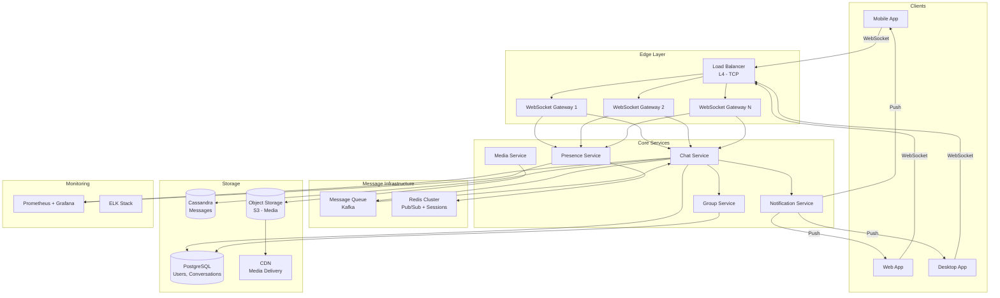
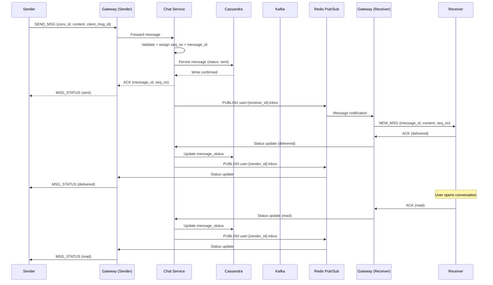

# Chat System (WhatsApp / Messenger) -- System Design

## 1. Problem Statement

Design a real-time chat system similar to WhatsApp or Facebook Messenger that supports
one-to-one messaging, group conversations, online/offline presence tracking, read receipts,
and media sharing. The system must deliver messages in real time to online users, queue
messages for offline users, guarantee message ordering within a conversation, and scale to
hundreds of millions of concurrent connections.

---

## 2. Functional Requirements

| # | Requirement | Description |
|---|-------------|-------------|
| F1 | **1:1 Chat** | Users can send and receive text messages in private conversations |
| F2 | **Group Chat** | Users can create groups (up to 256 members) and broadcast messages |
| F3 | **Online/Offline Status** | Real-time presence indicator showing when a user was last seen |
| F4 | **Read Receipts** | Sent, Delivered, and Read status for every message |
| F5 | **Media Sharing** | Support for images, videos, documents, and voice notes |
| F6 | **Message History** | Persistent storage; users can fetch historical messages on new devices |
| F7 | **Push Notifications** | Notify offline users via mobile/web push |
| F8 | **Typing Indicators** | Show when a participant is typing |

---

## 3. Non-Functional Requirements

| # | Requirement | Target |
|---|-------------|--------|
| NF1 | **Real-time delivery** | < 100 ms end-to-end latency for online recipients |
| NF2 | **Message ordering** | Strict per-conversation ordering via monotonic sequence IDs |
| NF3 | **Delivery guarantee** | At-least-once delivery; idempotent message processing on client |
| NF4 | **E2E Encryption** | Signal Protocol -- messages unreadable by the server |
| NF5 | **Availability** | 99.99% uptime (< 53 min downtime/year) |
| NF6 | **Scalability** | Support 500M+ daily active users, 2M concurrent connections per region |
| NF7 | **Data durability** | Zero message loss -- replicated storage with WAL |
| NF8 | **Low bandwidth** | Efficient binary protocol (protobuf over WebSocket) |

---

## 4. Capacity Estimation

### Traffic

| Metric | Estimate |
|--------|----------|
| Daily Active Users (DAU) | 500 million |
| Messages per user per day | 40 |
| Total messages per day | 20 billion |
| Messages per second (avg) | ~230,000 |
| Peak messages per second | ~700,000 |
| Concurrent WebSocket connections | ~100 million |

### Storage

| Data Type | Size per Unit | Daily Volume | Daily Storage |
|-----------|--------------|--------------|---------------|
| Text message (avg) | 100 bytes | 20B messages | ~2 TB |
| Message metadata | 200 bytes | 20B messages | ~4 TB |
| Media (images/video) | 300 KB avg | 2B media msgs | ~600 TB |
| Total daily storage | -- | -- | ~606 TB |

### Bandwidth

| Direction | Calculation | Throughput |
|-----------|-------------|------------|
| Inbound | 230K msg/s * 300 bytes | ~69 MB/s text |
| Outbound | 230K msg/s * 300 bytes * 1.2 fan-out | ~83 MB/s text |
| Media inbound | 23K media/s * 300 KB | ~6.9 GB/s |

---

## 5. API Design

### WebSocket Events (Real-time)

```
-- Client -> Server --

CONNECT     { token: string }
SEND_MSG    { conversation_id, content, type, client_msg_id, encrypted_payload }
TYPING      { conversation_id, is_typing: bool }
ACK         { message_id, status: "delivered" | "read" }
PRESENCE    { status: "online" | "away" }

-- Server -> Client --

NEW_MSG     { message_id, conversation_id, sender_id, content, timestamp, seq_no }
MSG_STATUS  { message_id, status, timestamp }
TYPING_IND  { conversation_id, user_id, is_typing }
PRESENCE_UP { user_id, status, last_seen }
```

### REST Endpoints

```
POST   /api/v1/auth/login              -- Authenticate, receive JWT + WS ticket
POST   /api/v1/conversations           -- Create 1:1 or group conversation
GET    /api/v1/conversations/{id}/messages?before={seq}&limit=50
                                        -- Paginated message history
POST   /api/v1/conversations/{id}/members  -- Add members to group
DELETE /api/v1/conversations/{id}/members/{uid}
PUT    /api/v1/users/{id}/profile       -- Update display name, avatar
POST   /api/v1/media/upload             -- Upload media, returns media_url
GET    /api/v1/media/{media_id}         -- Download media
```

---

## 6. Data Model

### Users Table

```
users
---------------------------------------------
user_id         UUID        PK
username        VARCHAR(50) UNIQUE
display_name    VARCHAR(100)
avatar_url      TEXT
public_key      TEXT        -- E2E encryption public key
created_at      TIMESTAMP
last_seen       TIMESTAMP
status          ENUM('online', 'offline', 'away')
```

### Conversations Table

```
conversations
---------------------------------------------
conversation_id UUID        PK
type            ENUM('direct', 'group')
name            VARCHAR(100)    -- NULL for direct
created_by      UUID        FK -> users
created_at      TIMESTAMP
```

### Conversation Members

```
conversation_members
---------------------------------------------
conversation_id UUID        PK, FK -> conversations
user_id         UUID        PK, FK -> users
role            ENUM('admin', 'member')
joined_at       TIMESTAMP
muted_until     TIMESTAMP
```

### Messages Table (Cassandra -- partitioned by conversation_id)

```
messages
---------------------------------------------
conversation_id UUID        PARTITION KEY
seq_no          BIGINT      CLUSTERING KEY (ASC)
message_id      UUID        UNIQUE
sender_id       UUID
content         BLOB        -- encrypted payload
content_type    ENUM('text', 'image', 'video', 'audio', 'file')
media_url       TEXT
client_msg_id   UUID        -- client-generated for idempotency
created_at      TIMESTAMP
```

### Message Status Table

```
message_status
---------------------------------------------
message_id      UUID        PK
user_id         UUID        PK
status          ENUM('sent', 'delivered', 'read')
updated_at      TIMESTAMP
```

---

## 7. High-Level Architecture



---

## 8. Detailed Design

### 8.1 WebSocket Connection Management

```
Connection Flow:
1. Client authenticates via REST -> receives JWT + one-time WS ticket
2. Client opens WebSocket with ticket in handshake
3. Gateway validates ticket, registers connection in Redis:
   Key: ws:user:{user_id} -> { gateway_id, connection_id, connected_at }
4. Gateway subscribes to Redis channel: user:{user_id}:inbox
5. On disconnect: remove from Redis, update last_seen in Presence Service
```

**Connection Registry (Redis)**:
- Each gateway maintains a local connection map: `connection_id -> WebSocket`
- Global registry in Redis: `user_id -> gateway_id` for routing
- Heartbeat every 30s to detect stale connections
- Graceful shutdown: drain connections to other gateways

### 8.2 Message Delivery Flow (1:1)

```
Sender App                Gateway-A    Chat Service    Cassandra    Redis    Gateway-B    Receiver App
    |                         |              |             |          |          |              |
    |-- SEND_MSG ------------>|              |             |          |          |              |
    |                         |-- forward -->|             |          |          |              |
    |                         |              |-- write --->|          |          |              |
    |                         |              |   (persist) |          |          |              |
    |                         |              |<-- ack -----|          |          |              |
    |                         |              |-- publish ------------>|          |              |
    |                         |              |   user:{recv}:inbox    |          |              |
    |                         |              |             |          |-- push ->|              |
    |                         |              |             |          |          |-- NEW_MSG -->|
    |                         |<-- ACK(sent)-|             |          |          |              |
    |<-- MSG_STATUS(sent) ----|              |             |          |          |              |
    |                         |              |             |          |          |<-- ACK(dlvd)-|
    |                         |              |<-- status --|----------|----------|              |
    |<-- MSG_STATUS(delivered)|              |             |          |          |              |
```

### 8.3 Offline Message Queue

When a recipient is offline:
1. Chat Service persists message to Cassandra (always -- regardless of online status)
2. Redis publish gets no subscriber -- message stays in DB as "sent" status
3. Notification Service sends push notification via APNs / FCM
4. When user reconnects:
   a. Gateway queries undelivered messages: `SELECT * FROM messages WHERE conversation_id IN (...) AND seq_no > last_seen_seq`
   b. Messages delivered in batch, sorted by seq_no
   c. Client sends ACK for each -> status updated to "delivered"

### 8.4 Group Message Fan-Out

**Small groups (< 50 members)**: Write-time fan-out
- Message written once to `messages` table
- Chat Service looks up group members from cache
- Publishes to each member's Redis inbox channel
- Each online member's gateway delivers the message

**Large groups (50-256 members)**: Hybrid approach
- Message written once to `messages` table
- Fan-out happens asynchronously via Kafka
- Kafka consumer processes member list in batches
- Rate limiting per group to prevent thundering herd

---

## 9. Architecture Diagram -- Message Sequence



---

## 10. Architectural Patterns

### Pub/Sub Pattern
- **Where**: Redis Pub/Sub for real-time message routing between gateways
- **Why**: Decouples message producers (Chat Service) from consumers (Gateway servers).
  A message published to `user:{id}:inbox` reaches whichever gateway holds that user's
  connection, without the Chat Service needing to know routing details.

### Event-Driven Architecture
- **Where**: Kafka for asynchronous processing (group fan-out, notifications, analytics)
- **Why**: Absorbs traffic spikes, enables replay for failed consumers, and allows
  independent scaling of producers and consumers.

### CQRS (Command Query Responsibility Segregation)
- **Where**: Write path (WebSocket -> Chat Service -> Cassandra) vs Read path
  (REST API -> Read Service -> Cassandra with caching)
- **Why**: Write-optimized Cassandra schema (partition by conversation_id, cluster by seq_no)
  differs from read patterns (pagination, search). Separate read replicas with different
  indexing serve queries without impacting write throughput.

### Connection Gateway Pattern
- **Where**: WebSocket Gateway servers as a dedicated layer
- **Why**: Separates long-lived connection management from business logic. Gateways handle
  TLS termination, heartbeats, and connection lifecycle while Chat Service focuses on
  message processing. Enables independent scaling -- add gateways for more connections,
  add Chat Service instances for more throughput.

### Inbox Pattern
- **Where**: Per-user inbox channel in Redis + per-conversation message partitioning
- **Why**: Each user has a single delivery endpoint regardless of how many conversations
  they participate in. Simplifies routing and offline message sync.

---

## 11. Technology Choices

### Real-Time Transport: WebSocket

| Option | Latency | Server Resources | Bidirectional | Choice |
|--------|---------|-----------------|---------------|--------|
| WebSocket | Low (~10ms) | 1 TCP conn/client | Yes | * Selected |
| Long Polling | Medium (~100ms) | High (repeated HTTP) | No | Fallback only |
| SSE | Low | 1 conn/client | Server->Client only | Not suitable |

**Rationale**: WebSocket provides full-duplex, low-latency communication. Long polling
kept as fallback for restrictive network environments.

### Message Storage: Apache Cassandra

| Option | Write Perf | Read Perf | Scalability | Choice |
|--------|-----------|-----------|-------------|--------|
| Cassandra | Excellent | Good (partition key) | Linear | * Selected |
| HBase | Good | Good | Good | Alternative |
| MongoDB | Good | Good | Moderate | Not ideal at scale |

**Rationale**: Cassandra's write-optimized LSM-tree storage handles 200K+ writes/sec per
node. Partition by `conversation_id` with clustering by `seq_no` gives ordered reads per
conversation. Linear horizontal scaling matches growth trajectory.

### Pub/Sub Layer: Redis Cluster

| Option | Latency | Throughput | Persistence | Choice |
|--------|---------|-----------|-------------|--------|
| Redis Pub/Sub | < 1ms | Very High | No (fire-and-forget) | * Selected |
| Kafka | ~5ms | Very High | Yes | For async fan-out |
| RabbitMQ | ~2ms | High | Yes | Overkill for routing |

**Rationale**: Redis Pub/Sub for real-time routing (sub-millisecond). Kafka for reliable
async processing (group fan-out, notifications). Redis also stores session/connection
registry and caches (user profiles, group member lists).

---

## 12. Scalability

### Connection Server Sharding
- Consistent hashing on `user_id` to assign users to gateway clusters
- Each gateway handles ~50K concurrent WebSocket connections
- 2000 gateways for 100M concurrent connections
- Sticky sessions via L4 load balancer (source IP hash) for reconnection

### Message Partitioning
- Cassandra: Partition key = `conversation_id`, ensuring all messages for a
  conversation are co-located on the same node
- Avoids hot partitions: conversations are naturally distributed (billions of
  unique conversation IDs)
- Time-based compaction strategy for efficient sequential reads

### Horizontal Scaling Strategy

```
Layer               Scaling Dimension           Target
-----------------------------------------------------------------
WebSocket Gateway   Concurrent connections      50K per instance
Chat Service        Messages per second         10K per instance
Presence Service    Heartbeat processing        100K per instance
Cassandra           Storage + write throughput   Linear with nodes
Redis Cluster       Pub/Sub channels            Shard by user_id
Kafka               Topic partitions            Partition by conv_id
```

---

## 13. Reliability

### Message Persistence
- Every message written to Cassandra BEFORE delivery acknowledgment
- Replication factor = 3 (across racks/availability zones)
- Write-ahead log (WAL) enabled on all Cassandra nodes
- If Cassandra write fails -> message rejected, client retries with same `client_msg_id`

### Delivery Guarantees
- **At-least-once**: Messages may be delivered more than once during retries
- **Idempotent processing**: `client_msg_id` used for deduplication
  - Chat Service checks if `client_msg_id` already exists before writing
  - Client ignores duplicate `message_id` on receive
- **Ordered delivery**: `seq_no` assigned by Chat Service per conversation
  - Client buffers out-of-order messages, requests gaps via REST

### Failure Scenarios

```
Scenario                    Handling
-----------------------------------------------------------------
Gateway crash               Client reconnects to another gateway;
                            fetches undelivered messages via REST
Chat Service crash          Kafka retries unprocessed messages;
                            idempotency prevents duplicates
Cassandra node down         Quorum reads/writes (CL=QUORUM with RF=3)
                            tolerate 1 node failure
Redis Pub/Sub miss          Message already in Cassandra; client
                            syncs on reconnect
Network partition           Client detects via heartbeat timeout;
                            reconnects + syncs
```

---

## 14. Security

### End-to-End Encryption (Signal Protocol)
- Each user generates a key pair (identity key + signed pre-key + one-time pre-keys)
- Public keys stored on server; private keys NEVER leave the device
- Message encrypted with recipient's public key; server cannot decrypt
- Group messages: Sender encrypts once per member (sender key protocol for efficiency)
- Key rotation on every 100 messages or 7 days (whichever comes first)

### Authentication and Authorization
- JWT tokens with short TTL (15 min) + refresh tokens (30 days)
- WebSocket ticket: one-time token exchanged during WS handshake, expires in 30s
- Rate limiting: 100 messages/min per user, 1000 API calls/min per user
- Device verification: each device registered with unique device_id

### Data Protection
- TLS 1.3 for all connections (client <-> gateway, service <-> service)
- Media files encrypted at rest (AES-256) in object storage
- PII data (phone numbers, emails) encrypted in PostgreSQL
- GDPR compliance: user data export and deletion APIs

---

## 15. Monitoring

### Key Metrics

```
Metric                      Alert Threshold     Dashboard
-----------------------------------------------------------------
Message delivery latency    P99 > 200ms         Real-time gauge
(end-to-end)

WebSocket connections       > 45K per gateway   Per-gateway chart
(per gateway)

Message throughput          Drop > 20% from     Time-series graph
(messages/sec)              baseline

Failed deliveries           > 0.1% of total     Error rate panel
(per minute)

Cassandra write latency     P99 > 50ms          Per-node heatmap

Redis Pub/Sub lag           > 1000 pending       Queue depth chart

Offline message queue       > 1M pending         Backlog gauge
depth

Gateway reconnection rate   > 5% per minute     Spike detector
```

### Monitoring Stack
- **Prometheus**: Metrics collection from all services (counters, histograms, gauges)
- **Grafana**: Dashboards for real-time visibility
- **ELK Stack**: Centralized logging (Elasticsearch + Logstash + Kibana)
- **PagerDuty**: Alert routing and on-call management
- **Distributed Tracing**: Jaeger for end-to-end message flow tracing
  (sender -> gateway -> service -> DB -> gateway -> receiver)

### Health Checks
- Gateway: WebSocket ping/pong + HTTP `/health` endpoint
- Chat Service: gRPC health check + Kafka consumer lag
- Cassandra: nodetool status + read/write latency probes
- Redis: `PING` + memory usage + pub/sub channel count
