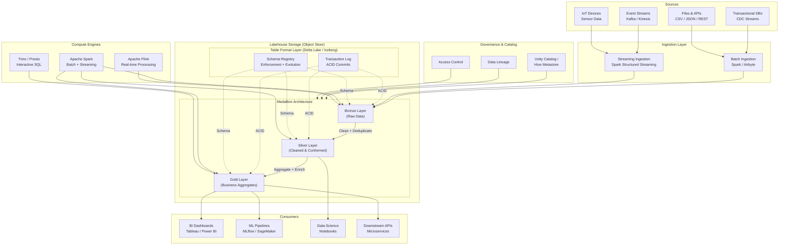
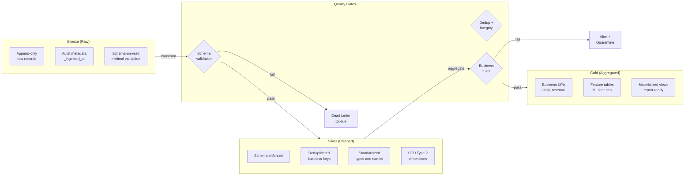

# Data Lakehouse Architecture --- System Design

## 1. Problem Statement

Modern data architectures face a fundamental tension between **data lakes** and
**data warehouses**:

| Challenge | Data Lake | Data Warehouse |
|-----------|-----------|----------------|
| Storage cost | Low (object store) | High (proprietary) |
| Schema flexibility | Schema-on-read | Rigid schema-on-write |
| Data types | Structured + unstructured | Structured only |
| ACID transactions | No | Yes |
| Query performance | Slow (full scans) | Fast (indexed, optimized) |
| ML/AI support | Native (raw files) | Poor (export required) |
| Data freshness | Near-real-time | Batch ETL lag |
| Governance | Weak | Strong |

Organizations end up maintaining **both** systems, leading to:

- **Data duplication** across lake and warehouse
- **ETL complexity** with fragile pipelines between systems
- **Stale data** in the warehouse due to batch ETL
- **Governance gaps** between two separate systems
- **Increased cost** operating two platforms

A **Data Lakehouse** unifies both paradigms: it applies warehouse-grade
reliability (ACID, schema enforcement, governance) directly on top of low-cost
object storage, eliminating the need for a separate warehouse tier.

---

## 2. Functional Requirements

| ID | Requirement | Description |
|----|-------------|-------------|
| FR-1 | Unified ingestion | Support both batch and streaming ingestion into a single platform |
| FR-2 | ACID transactions | Provide serializable isolation for concurrent reads and writes on data lake files |
| FR-3 | Schema enforcement | Validate incoming data against a registered schema; reject non-conforming records |
| FR-4 | Schema evolution | Allow additive schema changes (new columns, widened types) without rewriting data |
| FR-5 | Time travel | Query any historical version/snapshot of a table by version number or timestamp |
| FR-6 | Medallion layers | Implement Bronze (raw), Silver (cleaned), Gold (aggregated) processing tiers |
| FR-7 | Unified serving | Serve data to BI dashboards, SQL analysts, and ML training pipelines from one copy |
| FR-8 | Table management | Create, alter, drop, and list tables with partitioning and metadata |
| FR-9 | Data catalog | Register, discover, and search tables with lineage and quality metadata |
| FR-10 | Compaction and vacuum | Merge small files and remove obsolete data versions to control storage bloat |

---

## 3. Non-Functional Requirements

| ID | Requirement | Target |
|----|-------------|--------|
| NFR-1 | Scale | Handle petabyte-scale storage across billions of files |
| NFR-2 | Data freshness | < 5 minutes from source event to queryable Gold table |
| NFR-3 | ACID guarantees | Serializable isolation; no partial/corrupt reads under concurrent writes |
| NFR-4 | Query latency | Interactive BI queries < 10 s on Gold tables (comparable to warehouse) |
| NFR-5 | Availability | 99.95 % uptime for the query engine and metastore |
| NFR-6 | Durability | 99.999999999 % (11 nines) via cloud object storage replication |
| NFR-7 | Cost efficiency | >= 5x cheaper per TB than a traditional cloud data warehouse |
| NFR-8 | Governance | Column-level access control, audit logging, data lineage |
| NFR-9 | Interoperability | Open table format readable by Spark, Trino, Flink, DuckDB, etc. |

---

## 4. Capacity Estimation

### 4.1 Storage

| Tier | Daily ingest | Retention | Total storage |
|------|-------------|-----------|---------------|
| Bronze (raw) | 10 TB/day | 90 days | ~900 TB |
| Silver (cleaned) | 6 TB/day (40 % reduction) | 1 year | ~2.2 PB |
| Gold (aggregated) | 500 GB/day | 3 years | ~550 TB |
| Transaction logs | ~1 GB/day | Forever | ~10 TB |
| **Total** | | | **~3.7 PB** |

### 4.2 Compute

| Workload | Cluster size | Concurrency |
|----------|-------------|-------------|
| Batch ingestion | 50-node Spark (daily) | 1-2 jobs |
| Streaming ingestion | 20-node Spark Structured Streaming | Always-on |
| Bronze -> Silver | 30-node Spark (hourly) | 3-5 jobs |
| Silver -> Gold | 20-node Spark (hourly) | 5-10 jobs |
| BI / ad-hoc queries | 10-node Trino cluster | 50-100 concurrent |
| ML feature reads | Dedicated 5-node cluster | 10-20 concurrent |

### 4.3 Query Throughput

| Metric | Target |
|--------|--------|
| Point lookups (Gold) | < 1 s |
| Analytical scans (Gold, 1 TB) | < 10 s |
| Full table scan (Silver, 100 TB) | < 5 min |
| Concurrent BI queries | 100+ |
| Streaming write throughput | 200 K events/s |

---

## 5. API Design

### 5.1 Table Management

```text
POST   /api/v1/tables
  Body: { "name": "orders", "schema": [...], "partition_by": ["order_date"],
          "layer": "bronze", "format": "delta" }
  Response: 201 { "table_id": "tbl_abc123", "created_at": "..." }

GET    /api/v1/tables
  Query: ?layer=silver&search=orders
  Response: 200 [ { "table_id": "...", "name": "orders_cleaned", ... } ]

GET    /api/v1/tables/{table_id}
  Response: 200 { "table_id": "...", "schema": [...], "version": 42, ... }

PUT    /api/v1/tables/{table_id}/schema
  Body: { "add_columns": [{"name": "region", "type": "string", "nullable": true}] }
  Response: 200 { "schema_version": 5 }

DELETE /api/v1/tables/{table_id}
  Response: 204
```

### 5.2 Ingestion

```text
POST   /api/v1/tables/{table_id}/ingest
  Body: { "mode": "append|overwrite|merge",
          "data": [ { "order_id": 1, "amount": 99.99 }, ... ] }
  Response: 202 { "commit_version": 43, "rows_written": 1000 }

POST   /api/v1/tables/{table_id}/ingest/stream
  Body: (streaming JSON lines)
  Response: 200 (streaming acks)

POST   /api/v1/tables/{table_id}/merge
  Body: { "source_table": "tbl_staging", "match_keys": ["order_id"],
          "when_matched": "update", "when_not_matched": "insert" }
  Response: 200 { "rows_updated": 500, "rows_inserted": 200 }
```

### 5.3 Query

```text
POST   /api/v1/query
  Body: { "sql": "SELECT * FROM gold.daily_revenue WHERE date >= '2024-01-01'",
          "limit": 1000 }
  Response: 200 { "columns": [...], "rows": [...], "rows_scanned": 50000 }

GET    /api/v1/tables/{table_id}/history
  Response: 200 [ { "version": 42, "timestamp": "...", "operation": "WRITE",
                     "rows_affected": 1000 }, ... ]
```

### 5.4 Time Travel

```text
POST   /api/v1/query/time-travel
  Body: { "sql": "SELECT COUNT(*) FROM silver.orders",
          "as_of_version": 38 }
  Response: 200 { "columns": ["count"], "rows": [[42000]] }

POST   /api/v1/query/time-travel
  Body: { "sql": "SELECT COUNT(*) FROM silver.orders",
          "as_of_timestamp": "2024-06-15T00:00:00Z" }
  Response: 200 { "columns": ["count"], "rows": [[41500]] }
```

### 5.5 Maintenance

```text
POST   /api/v1/tables/{table_id}/compact
  Body: { "target_file_size_mb": 256 }
  Response: 200 { "files_before": 1200, "files_after": 80 }

POST   /api/v1/tables/{table_id}/vacuum
  Body: { "retention_hours": 168 }
  Response: 200 { "files_deleted": 340, "bytes_freed": "12.5 GB" }

POST   /api/v1/tables/{table_id}/zorder
  Body: { "columns": ["customer_id", "order_date"] }
  Response: 200 { "files_rewritten": 80 }
```

---

## 6. Data Model

### 6.1 Table Metadata

```text
Table {
    table_id        : UUID (PK)
    name            : String
    layer           : Enum(bronze, silver, gold)
    schema_id       : UUID -> SchemaVersion
    partition_cols  : List[String]
    storage_path    : String          // s3://lakehouse/silver/orders/
    format          : Enum(delta, iceberg)
    current_version : Int
    created_at      : Timestamp
    updated_at      : Timestamp
    properties      : Map[String, String]
}
```

### 6.2 Schema Versions

```text
SchemaVersion {
    schema_id       : UUID (PK)
    table_id        : UUID (FK)
    version         : Int
    columns         : List[Column]     // [{name, type, nullable, metadata}]
    created_at      : Timestamp
    change_summary  : String           // "Added column: region"
}
```

### 6.3 Transaction Log (Delta Log)

```text
TransactionLogEntry {
    table_id        : UUID (FK)
    version         : Int (PK with table_id)
    timestamp       : Timestamp
    operation       : Enum(WRITE, MERGE, DELETE, SCHEMA_CHANGE, COMPACT)
    isolation_level : Enum(Serializable, WriteSerializable)
    actions         : List[Action]     // AddFile, RemoveFile, SetSchema, ...
    commit_info     : Map              // user, notebook, cluster, etc.
}
```

### 6.4 File Manifest (per commit action)

```text
AddFile {
    path            : String           // part-00001-abc.parquet
    partition_values: Map[String, String]
    size_bytes      : Long
    row_count       : Long
    stats           : FileStats        // {min, max, null_count per column}
    data_change     : Boolean
}

RemoveFile {
    path            : String
    deletion_timestamp : Timestamp
    data_change     : Boolean
}
```

### 6.5 Data Catalog Entry

```text
CatalogEntry {
    table_id        : UUID (PK)
    database        : String
    table_name      : String
    layer           : Enum(bronze, silver, gold)
    owner           : String
    tags            : List[String]
    description     : String
    quality_score   : Float            // 0.0 - 1.0
    last_updated    : Timestamp
    row_count       : Long
    size_bytes      : Long
    lineage         : List[UUID]       // upstream table_ids
}
```

---

## 7. High-Level Architecture



---

## 8. Detailed Design

### 8.1 Medallion Architecture

The Medallion (multi-hop) architecture organizes data into three progressive
quality tiers:

#### Bronze Layer (Raw)

| Aspect | Detail |
|--------|--------|
| Purpose | Land data exactly as received; single source of truth for raw records |
| Schema | Schema-on-read; minimal validation (only structural) |
| Format | Append-only Parquet files via Delta/Iceberg |
| Partitioning | By ingestion date (`_ingested_date`) |
| Retention | 90 days (configurable) |
| Metadata | `_source_system`, `_ingested_at`, `_raw_payload` columns added |

Processing rules:
1. Accept all records regardless of data quality
2. Add audit metadata columns (`_ingested_at`, `_source_system`)
3. Preserve the original payload for replay/debugging
4. Deduplicate at ingestion boundary using event ID

#### Silver Layer (Cleaned and Conformed)

| Aspect | Detail |
|--------|--------|
| Purpose | Cleaned, deduplicated, conformed data; enterprise data model |
| Schema | Schema-on-write with strict enforcement |
| Format | Delta/Iceberg with Z-order on high-cardinality join keys |
| Partitioning | By business date + source system |
| Retention | 1 year |
| Quality gates | NOT NULL checks, type validation, referential integrity, dedup |

Processing rules:
1. Apply schema enforcement -- reject or quarantine non-conforming rows
2. Deduplicate using business keys with last-write-wins or merge semantics
3. Standardize data types, time zones, naming conventions
4. Apply Slowly Changing Dimension (SCD) Type 2 for dimension tables
5. Write quality metrics to monitoring

#### Gold Layer (Business Aggregates)

| Aspect | Detail |
|--------|--------|
| Purpose | Pre-computed business metrics and feature tables |
| Schema | Strict, versioned, documented business definitions |
| Format | Delta/Iceberg, heavily optimized (Z-order, bloom filters) |
| Partitioning | By report date + business dimension |
| Retention | 3 years |
| Materialization | Incremental refresh using Silver change feed |

Processing rules:
1. Aggregate Silver data into business-level metrics
2. Apply business logic and KPI definitions
3. Optimize for query patterns (BI tool access patterns)
4. Publish as versioned datasets with SLA guarantees

### 8.2 Delta Lake Transaction Log

The transaction log is the core mechanism enabling ACID on object storage:

```text
table_root/
  _delta_log/
    00000000000000000000.json    # Version 0: CREATE TABLE
    00000000000000000001.json    # Version 1: first WRITE
    00000000000000000002.json    # Version 2: MERGE
    00000000000000000010.json    # Version 10: ...
    00000000000000000010.checkpoint.parquet   # Checkpoint
```

**Commit Protocol (Optimistic Concurrency):**

1. Reader reads the latest version N from the log
2. Writer prepares actions (AddFile, RemoveFile, etc.)
3. Writer attempts to write version N+1 atomically
4. If `_delta_log/(N+1).json` already exists -> conflict
5. On conflict: re-read log, check if changes are compatible
6. If compatible (disjoint partitions) -> retry at N+2
7. If incompatible -> abort and raise `ConcurrentModificationException`

**Checkpoint Optimization:**

- Every 10 commits, write a Parquet checkpoint summarizing all active files
- Readers load the latest checkpoint, then replay only subsequent JSON commits
- Dramatically reduces read amplification for tables with thousands of versions

### 8.3 Schema Enforcement and Evolution

```text
Enforcement (write-time):
  incoming_record --> validate(schema) --+--> [PASS] --> write to Parquet
                                         |
                                         +--> [FAIL] --> quarantine table
                                                         + alert

Evolution (additive changes allowed):
  - Add nullable column        : OK  (backward compatible)
  - Widen type (int -> long)   : OK  (backward compatible)
  - Rename column              : Via column mapping (Delta 2.0+)
  - Drop column                : Soft delete via mapping; data stays in files
  - Change nullability          : NOT NULL -> nullable OK; reverse blocked
```

### 8.4 Z-Ordering for Query Optimization

Z-ordering co-locates related data in the same files to maximize data skipping:

```text
Before Z-order (random file layout):
  File 1: customer_id [1-999999], date [2024-01-01 to 2024-12-31]
  File 2: customer_id [1-999999], date [2024-01-01 to 2024-12-31]
  --> Query WHERE customer_id = 42 AND date = '2024-06-15' scans ALL files

After Z-order on (customer_id, date):
  File 1: customer_id [1-1000],    date [2024-01-01 to 2024-01-31]
  File 2: customer_id [1-1000],    date [2024-02-01 to 2024-02-28]
  ...
  --> Same query skips 99%+ of files using min/max stats
```

### 8.5 Vacuum and Compaction

**Compaction** (bin-packing):
- Merge many small files into fewer, larger files (target: 256 MB - 1 GB)
- Triggered when avg file size < 64 MB or file count > 10x optimal
- Runs as a background Delta `OPTIMIZE` operation

**Vacuum** (garbage collection):
- Delete data files no longer referenced by any active table version
- Retention period (default: 7 days) ensures in-flight queries complete
- `VACUUM table RETAIN 168 HOURS`
- After vacuum, time travel to versions older than retention is no longer possible

---

## 9. Architecture Diagrams

### 9.1 Medallion Architecture Data Flow



### 9.2 Storage Layer Architecture

```mermaid
flowchart TB
    subgraph ObjectStore["Object Storage (S3 / ADLS / GCS)"]
        subgraph TableRoot["s3://lakehouse/silver/orders/"]
            subgraph DeltaLog["_delta_log/"]
                V0["000.json<br/>CREATE TABLE"]
                V1["001.json<br/>AddFile x3"]
                V2["002.json<br/>AddFile x2, RemoveFile x1"]
                CP["010.checkpoint.parquet"]
            end
            subgraph DataFiles["Data Files (Parquet)"]
                subgraph Part1["order_date=2024-01-15/"]
                    F1[part-001.parquet]
                    F2[part-002.parquet]
                end
                subgraph Part2["order_date=2024-01-16/"]
                    F3[part-003.parquet]
                end
            end
        end
    end

    subgraph Metastore["Metastore (Unity Catalog / Hive)"]
        MT[Table Registry]
        MS[Schema Versions]
        MP[Partition Index]
        MA[Access Policies]
    end

    subgraph QueryEngine["Query Planning"]
        QP[Query Parser]
        PP[Partition Pruning]
        DS[Data Skipping<br/>via file stats]
        EX[Execution Engine]
    end

    QP --> PP
    PP -->|"prune partitions"| MP
    MP -->|"matching partitions"| DS
    DS -->|"read file stats from log"| CP
    CP -->|"skip files"| EX
    EX -->|"read only matched"| DataFiles

    MT --> TableRoot
    MS --> DeltaLog
```

---

## 10. Architectural Patterns

### 10.1 Medallion Architecture (Multi-Hop)

A layered data quality pattern where each hop refines data:

| Pattern aspect | Description |
|----------------|-------------|
| Intent | Incrementally improve data quality in discrete stages |
| Structure | Bronze -> Silver -> Gold with quality gates between layers |
| Benefits | Debuggability (can inspect each layer), reprocessing (replay from bronze), separation of concerns |
| Trade-off | Additional storage cost for multiple copies; latency for multi-hop processing |

### 10.2 Delta / Iceberg Table Format

Open table formats that bring warehouse features to data lakes:

| Feature | Delta Lake | Apache Iceberg |
|---------|-----------|----------------|
| ACID transactions | Yes (optimistic concurrency) | Yes (optimistic concurrency) |
| Time travel | Yes (version + timestamp) | Yes (snapshot-based) |
| Schema evolution | Yes (additive) | Yes (full evolution) |
| Partition evolution | Requires rewrite | In-place (hidden partitioning) |
| File format | Parquet | Parquet, ORC, Avro |
| Log format | JSON + Parquet checkpoints | Avro manifest files |
| Catalog | Unity Catalog, Hive | REST Catalog, Hive, Nessie |
| Engine support | Spark-native, growing | Broad (Spark, Trino, Flink) |

### 10.3 Change Data Capture (CDC)

Capture row-level changes from source databases and apply as MERGE operations:

```text
Source DB  -->  CDC Tool (Debezium)  -->  Kafka  -->  Bronze (raw CDC events)
                                                        |
                                                        v
                                                 Silver (MERGE upsert)
                                                 INSERT/UPDATE/DELETE applied
```

### 10.4 Slowly Changing Dimensions (SCD Type 2)

Track historical changes to dimension records:

```text
customer_id | name    | city      | valid_from | valid_to   | is_current
----------- | ------- | --------- | ---------- | ---------- | ----------
42          | Alice   | Seattle   | 2023-01-01 | 2024-03-15 | false
42          | Alice   | Portland  | 2024-03-15 | 9999-12-31 | true
```

### 10.5 Materialized Views via Incremental Processing

Gold tables act as materialized views refreshed incrementally:

1. Read Silver table change feed (only new/changed rows since last refresh)
2. Merge changes into Gold aggregate table
3. Update watermark to latest processed version
4. Result: Gold table is always within one refresh cycle of Silver

---

## 11. Technology Choices

### 11.1 Table Format

| Criterion | Delta Lake | Apache Iceberg | Apache Hudi |
|-----------|-----------|----------------|-------------|
| Maturity | High (Databricks) | High (Netflix, Apple) | Medium (Uber) |
| ACID | Strong | Strong | Strong |
| Partition evolution | Rewrite needed | In-place | In-place |
| Time travel | Excellent | Excellent | Good |
| Engine breadth | Growing | Broad | Narrower |
| Community | Large | Rapidly growing | Moderate |
| **Recommendation** | Databricks shops | Multi-engine / open | Streaming-heavy |

**Choice: Delta Lake** for Spark-native shops; **Iceberg** for multi-engine
environments.

### 11.2 Compute Engine

| Engine | Best for | Latency | Cost model |
|--------|----------|---------|-----------|
| Apache Spark | Batch + streaming ETL | Minutes | Cluster (pay-per-node) |
| Trino / Presto | Interactive BI queries | Seconds | Cluster (shared) |
| Apache Flink | Low-latency streaming | Sub-second | Always-on cluster |
| DuckDB | Local analytics, dev | Milliseconds | Free (in-process) |
| **Recommendation** | Spark for ETL, Trino for BI, Flink for streaming | | |

### 11.3 Storage

| Provider | Service | Tier options | Cost / TB / mo |
|----------|---------|-------------|----------------|
| AWS | S3 | Standard, IA, Glacier | $23 / $12.5 / $4 |
| Azure | ADLS Gen2 | Hot, Cool, Archive | $20 / $10 / $2 |
| GCP | GCS | Standard, Nearline, Archive | $20 / $10 / $1.2 |

**Choice:** Cloud-native object storage with lifecycle policies moving Bronze
to cool/archive tiers after retention window.

### 11.4 Catalog and Governance

| Option | Strength | Limitation |
|--------|----------|-----------|
| Unity Catalog | Unified for Delta + ML; fine-grained ACL | Databricks-centric |
| Hive Metastore | Ubiquitous, open | Limited governance |
| Project Nessie | Git-like catalog branching | Emerging |
| AWS Glue Catalog | AWS-native | AWS-only |

### 11.5 Transformation Layer

| Tool | Role |
|------|------|
| dbt | SQL-based transformations with lineage, tests, docs |
| Spark jobs | Complex Python/Scala transformations |
| Airflow / Dagster | Orchestration and scheduling |

---

## 12. Scalability

| Dimension | Strategy |
|-----------|----------|
| Storage | Object storage scales infinitely; use lifecycle policies to tier cold data |
| Compute | Auto-scaling Spark clusters; separate clusters per workload (ETL vs query) |
| Metadata | Checkpoint compaction reduces log read cost; partition index for pruning |
| Query | Z-ordering + data skipping prune > 90 % of files; caching layer for hot data |
| Ingestion | Horizontal scaling via Kafka partitions -> parallel Spark tasks |
| Compaction | Background OPTIMIZE jobs keep file sizes optimal (256 MB - 1 GB) |
| Multi-region | Object storage replication for DR; metastore replication for failover |

---

## 13. Reliability

| Concern | Mitigation |
|---------|-----------|
| Write failures | Optimistic concurrency + atomic commit ensures no partial writes |
| Read consistency | Snapshot isolation: readers always see a consistent version |
| Data corruption | Checksum validation on Parquet files; transaction log integrity checks |
| Reprocessing | Bronze layer preserves raw data; replay from any point |
| Cluster failure | Spot instance fallback to on-demand; Spark checkpointing for streaming |
| Metastore failure | Replicated database (Aurora, Cloud SQL); backup every 15 min |
| Object storage outage | Cloud provider SLA (99.99 %); cross-region replication |
| Schema mismatch | Schema enforcement rejects bad data; dead-letter queue for inspection |

---

## 14. Security

| Layer | Control |
|-------|---------|
| Network | VPC endpoints for object storage; no public access |
| Authentication | IAM roles (cloud), OAuth/SAML for users |
| Authorization | Column-level + row-level ACL via Unity Catalog / Ranger |
| Encryption at rest | SSE-S3 / SSE-KMS / ADLS encryption |
| Encryption in transit | TLS 1.2+ for all data movement |
| Audit | All reads/writes logged to immutable audit trail |
| Data masking | Dynamic masking for PII columns (e.g., email, SSN) |
| Compliance | GDPR right-to-erasure via Delta DELETE + VACUUM |

---

## 15. Monitoring and Observability

| Metric | Target | Alert threshold |
|--------|--------|-----------------|
| Ingestion lag (source -> Bronze) | < 2 min | > 5 min |
| Bronze -> Silver freshness | < 5 min | > 15 min |
| Silver -> Gold freshness | < 10 min | > 30 min |
| Query P95 latency (Gold) | < 5 s | > 15 s |
| Failed ingestion batches | 0 | > 0 |
| Dead-letter queue depth | 0 | > 100 records |
| Small file count | < 100 per partition | > 500 |
| Transaction log size | < 1000 versions since checkpoint | > 5000 |
| Storage cost / TB | < $25 | > $35 |
| Data quality score | > 0.95 | < 0.90 |

**Dashboards:**
- Ingestion pipeline health (Grafana)
- Table version growth and compaction status
- Query performance breakdown (Trino query stats)
- Data quality trends per layer
- Cost allocation by layer and team

---

## 16. Summary

The Data Lakehouse architecture eliminates the traditional two-tier split by
applying warehouse capabilities (ACID, schema enforcement, governance) directly
on low-cost object storage. The Medallion pattern provides a clear data
quality progression from raw ingestion (Bronze) through cleaning (Silver) to
business-ready aggregates (Gold). Open table formats (Delta Lake, Iceberg)
enable time travel, concurrent access, and broad engine interoperability --
while maintaining 5-10x cost advantage over proprietary warehouses.

| Key decision | Choice | Rationale |
|-------------|--------|-----------|
| Table format | Delta Lake / Iceberg | ACID on object store; time travel; open format |
| ETL engine | Apache Spark | Unified batch + streaming; native Delta support |
| Query engine | Trino | Interactive SQL; broad format support |
| Storage | S3 / ADLS / GCS | Infinite scale; 11 nines durability; tiered pricing |
| Catalog | Unity Catalog | Fine-grained ACL; lineage; ML integration |
| Orchestration | Airflow + dbt | Mature; DAG-based; SQL transformations with tests |
| Data quality | Medallion + quality gates | Progressive refinement; quarantine bad data |
