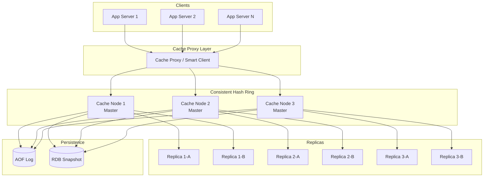
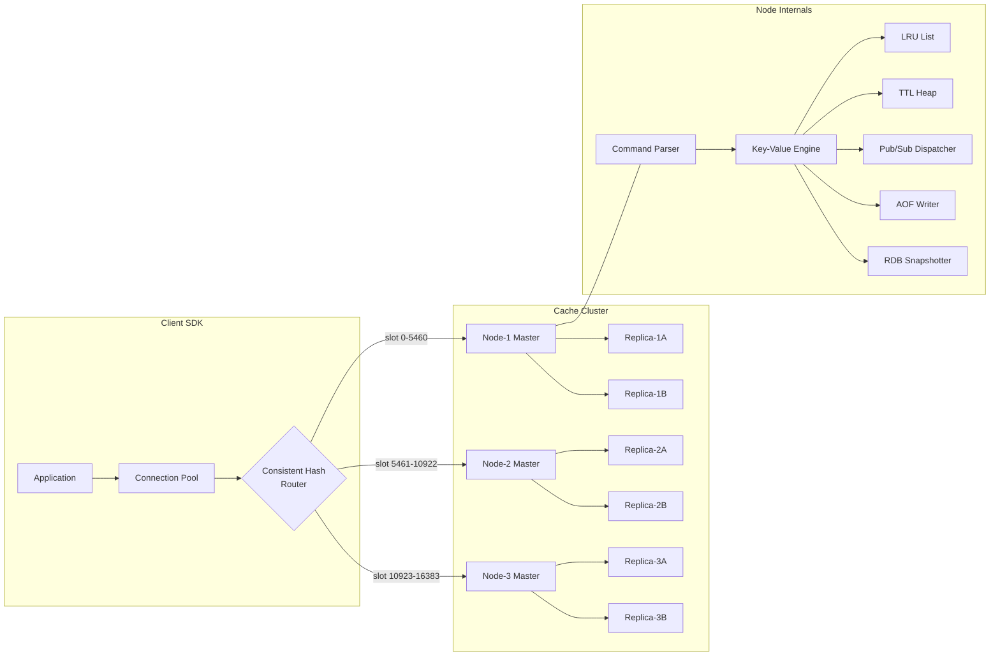

# Distributed Cache (Redis-like) — System Design

## 1. Problem Statement

Modern web applications require sub-millisecond access to frequently read data. Databases alone
cannot sustain the read throughput needed at scale. A **distributed, in-memory cache** sits between
application servers and the persistence layer, absorbing the majority of read traffic while
providing rich data-type support (strings, lists, hashes, sets), automatic expiration via TTL,
LRU eviction under memory pressure, pub/sub messaging, and optional persistence — all with
horizontal scalability and high availability.

---

## 2. Functional Requirements

| ID | Requirement | Details |
|----|-------------|---------|
| FR-1 | **GET / SET / DELETE** | Core key-value CRUD operations |
| FR-2 | **TTL Expiration** | Keys expire after a configurable time-to-live |
| FR-3 | **LRU Eviction** | Least-recently-used keys are evicted when a node exceeds its memory cap |
| FR-4 | **Pub/Sub** | Clients can publish messages to channels and subscribe to receive them |
| FR-5 | **Data Types** | Support string, list, hash (dict), and set value types |
| FR-6 | **Atomic Operations** | INCR/DECR for counters; LPUSH/RPUSH/LPOP/RPOP for lists |
| FR-7 | **Key Pattern Search** | KEYS / SCAN with glob-style pattern matching |
| FR-8 | **Batch Operations** | MGET / MSET for multi-key reads and writes |

---

## 3. Non-Functional Requirements

| ID | Requirement | Target |
|----|-------------|--------|
| NFR-1 | **Latency** | p99 < 1 ms for single-key operations |
| NFR-2 | **Throughput** | >= 100 K ops/sec per node |
| NFR-3 | **Availability** | 99.99 % (< 52 min downtime/year) |
| NFR-4 | **Durability** | Optional — AOF / RDB snapshots for persistence |
| NFR-5 | **Scalability** | Linear horizontal scale-out via consistent hashing |
| NFR-6 | **Consistency** | Eventual consistency across replicas; strong within a single node |
| NFR-7 | **Memory Efficiency** | < 100 bytes overhead per key on average |

---

## 4. Capacity Estimation

### Assumptions

| Parameter | Value |
|-----------|-------|
| Total unique keys | 1 billion |
| Average key size | 64 bytes |
| Average value size | 256 bytes |
| Metadata per entry (TTL, type, pointers) | 80 bytes |
| Replication factor | 3 |

### Calculations

```
Memory per key   = 64 + 256 + 80 = 400 bytes
Total raw memory = 1 B * 400 B   = 400 GB
With replication  = 400 GB * 3    = 1.2 TB
Nodes (64 GB each) = ceil(1200 / 64) = 19 nodes  (~20 for headroom)
```

### Hit-Ratio Targets

| Metric | Target |
|--------|--------|
| Cache hit ratio | >= 95 % |
| Hot-key ratio (top 1 % keys) | 20 % of traffic |

---

## 5. API Design

### Core Commands

```
SET   key value [EX seconds] [PX milliseconds] [NX|XX]
GET   key
DEL   key [key ...]
EXISTS key
EXPIRE key seconds
TTL   key
```

### Data-Type Commands

```
# Lists
LPUSH key value [value ...]
RPUSH key value [value ...]
LPOP  key
RPOP  key
LRANGE key start stop

# Hashes
HSET  key field value
HGET  key field
HDEL  key field
HGETALL key

# Sets
SADD      key member [member ...]
SREM      key member
SMEMBERS  key
SISMEMBER key member

# Counters
INCR key
DECR key
```

### Pub/Sub

```
PUBLISH channel message
SUBSCRIBE channel [channel ...]
UNSUBSCRIBE channel
```

### Batch

```
MGET key [key ...]
MSET key value [key value ...]
```

---

## 6. Data Model

### Entry Structure

```
CacheEntry {
    key:        string          # unique identifier
    value:      bytes | list | dict | set
    value_type: enum { STRING, LIST, HASH, SET }
    ttl:        int | None      # absolute expiry timestamp (epoch ms)
    version:    int             # monotonic counter for CAS
    created_at: int             # epoch ms
    last_accessed: int          # epoch ms — for LRU ordering
    size_bytes: int             # estimated memory footprint
}
```

### Metadata Index

Each node maintains:

* **Hash-table** — O(1) lookup by key.
* **LRU doubly-linked list** — O(1) promotion / eviction.
* **TTL min-heap** — O(log n) lazy + active expiration.
* **Pub/Sub channel map** — channel -> set of subscriber callbacks.

---

## 7. High-Level Architecture



---

## 8. Detailed Design

### 8.1 Consistent Hashing for Partitioning

Each cache node is mapped to **V virtual nodes** (default 150) on a 2^32 hash ring.

```
hash_position = md5(f"{node_id}#vnode_{i}") % 2^32
```

Key routing: `hash(key) -> walk clockwise -> first vnode -> owning physical node`.

Virtual nodes ensure uniform distribution even when physical nodes have heterogeneous
capacity (weighted vnodes).

### 8.2 LRU Eviction

* Implemented via an **OrderedDict** (Python) or a hand-rolled doubly-linked list +
  hash-map in production.
* On every GET/SET, the accessed key is moved to the **tail** (most-recently-used).
* When `current_size > max_size`, the **head** (least-recently-used) is evicted.
* Eviction is O(1) amortised.

**Eviction Policies** (configurable):

| Policy | Description |
|--------|-------------|
| `allkeys-lru` | Evict any key by LRU order |
| `volatile-lru` | Evict only keys with a TTL set |
| `allkeys-random` | Random eviction |
| `noeviction` | Return error when memory full |

### 8.3 TTL Expiration — Lazy + Active

**Lazy expiration**: On every key access, check TTL. If expired, delete and return miss.

**Active expiration** (background sweep):
1. Every 100 ms, sample 20 random keys from the TTL heap.
2. Delete any that are expired.
3. If > 25 % of sampled keys were expired, repeat immediately.
4. Caps at 25 ms of CPU time per cycle to avoid latency spikes.

### 8.4 Write-Behind Persistence

```
Client --SET--> Cache Node --async--> AOF Buffer --fsync--> Disk
                                  |
                                  +--> RDB Snapshot (periodic fork + COW)
```

* **AOF** (Append-Only File): logs every write command. Configurable fsync: `always`,
  `everysec`, `no`.
* **RDB** (Snapshot): periodic fork of the process; child writes full dataset to disk using
  copy-on-write. Minimal impact on parent latency.
* On restart: load RDB first, then replay AOF tail.

---

## 9. Architecture Diagram



---

## 10. Architectural Patterns

### 10.1 Consistent Hashing

* **Problem**: Adding/removing nodes in a naive modulo hash causes massive key redistribution.
* **Solution**: Place nodes on a virtual ring; only keys between the departing node and its
  predecessor migrate.
* **Virtual nodes** smooth out imbalance: each physical node owns ~150 positions on the ring.
* **Replication**: the key is replicated to the next `R-1` distinct physical nodes clockwise.

### 10.2 Caching Strategies

| Pattern | Write Path | Read Path | Consistency | Use Case |
|---------|-----------|-----------|-------------|----------|
| **Cache-Aside** | App writes to DB; invalidates cache | App reads cache; on miss reads DB and populates cache | Eventual | General purpose, most common |
| **Write-Through** | App writes to cache; cache synchronously writes to DB | App reads cache | Strong | When data loss is unacceptable |
| **Write-Behind** | App writes to cache; cache asynchronously batches writes to DB | App reads cache | Eventual | High write throughput |
| **Read-Through** | N/A | Cache itself fetches from DB on miss | Eventual | Simplifies app code |

### 10.3 Master-Replica Replication

* **Asynchronous replication**: master streams its write-ahead log to replicas.
* **Failover**: a sentinel / gossip protocol detects master failure; promotes a replica.
* **Read scaling**: reads can be served from replicas (with staleness trade-off).

---

## 11. Technology Choices

### In-Memory vs SSD-Backed

| Dimension | In-Memory (Redis) | SSD-Backed (e.g., Dragonfly, KeyDB) |
|-----------|--------------------|--------------------------------------|
| Latency | < 1 ms | 1-5 ms |
| Cost/GB | $$$  (DRAM) | $ (NVMe SSD) |
| Capacity | Limited by RAM | 10x+ larger datasets |
| Use case | Hot data, sessions | Warm data, large caches |

### Redis vs Memcached

| Feature | Redis | Memcached |
|---------|-------|-----------|
| Data types | String, List, Set, Hash, Sorted Set, Stream | String only |
| Persistence | AOF + RDB | None |
| Replication | Built-in master-replica | None (client-side) |
| Pub/Sub | Yes | No |
| Clustering | Redis Cluster (hash slots) | Client-side consistent hashing |
| Threading | Single-threaded event loop (6.0+ I/O threads) | Multi-threaded |
| Memory efficiency | Higher overhead per key | Lower overhead (slab allocator) |

### Serialization Formats

| Format | Speed | Size | Schema | Best For |
|--------|-------|------|--------|----------|
| Raw bytes | Fastest | Smallest | None | Simple strings/counters |
| MessagePack | Fast | Compact | Schemaless | General structured data |
| Protocol Buffers | Fast | Compact | Required | Cross-service contracts |
| JSON | Moderate | Large | Schemaless | Human-readable debugging |

---

## 12. Scalability

### Horizontal Scaling

* **Add node**: insert virtual nodes on the ring; only `K/N` keys migrate (K = total keys,
  N = total nodes).
* **Remove node**: keys on the departing node redistribute to clockwise neighbors.
* **Auto-sharding**: the proxy / smart client recomputes the ring and redirects transparently.

### Vertical Scaling

* Increase per-node RAM to hold more keys.
* Use I/O threads (Redis 6+) to parallelize network reads without changing the
  single-threaded command execution model.

### Hot-Key Mitigation

1. **Client-side caching**: embed a small L1 cache (e.g., 1000 keys) in the app process.
2. **Read replicas**: route hot-key reads to dedicated replicas.
3. **Key splitting**: `popular_key:{0..N}` — shard a single hot key across multiple slots.

---

## 13. Reliability

### Failure Modes and Mitigations

| Failure | Detection | Mitigation |
|---------|-----------|------------|
| Node crash | Heartbeat timeout (sentinel / gossip) | Automatic failover to replica |
| Network partition | Split-brain detection via quorum | WAIT command; min-replicas-to-write |
| Cascading miss storm | Spike in DB queries | Circuit breaker + stale-serve + jittered TTL |
| Memory exhaustion | `maxmemory` policy triggers | LRU eviction; alerts at 80 % |

### Data Durability Levels

| Level | Config | Risk |
|-------|--------|------|
| None | No persistence | Full data loss on restart |
| Low | RDB every 5 min | Up to 5 min of writes lost |
| Medium | AOF `everysec` | Up to 1 sec of writes lost |
| High | AOF `always` + replicas | Negligible loss; higher latency |

---

## 14. Security

* **Authentication**: `AUTH` command with password or ACL-based user/password.
* **Encryption in transit**: TLS 1.2+ on client-node and node-node links.
* **Encryption at rest**: encrypt RDB/AOF files via OS-level disk encryption.
* **Network isolation**: deploy cache nodes in a private VPC; no public endpoints.
* **ACLs** (Redis 6+): per-user command and key-pattern restrictions.
* **Input validation**: reject keys > 512 MB; enforce max value sizes.

---

## 15. Monitoring and Observability

### Key Metrics

| Metric | Source | Alert Threshold |
|--------|--------|-----------------|
| Hit ratio | `keyspace_hits / (hits + misses)` | < 90 % |
| Memory usage | `used_memory / maxmemory` | > 80 % |
| Evictions/sec | `evicted_keys` counter | Sustained > 100/s |
| Connected clients | `connected_clients` | > 80 % of `maxclients` |
| Replication lag | `master_repl_offset - replica_offset` | > 1 MB |
| Command latency p99 | `latency-tracking` | > 1 ms |
| Keys with TTL | `expires` counter | Dropping unexpectedly |

### Observability Stack

```
Cache Node --> StatsD / Prometheus Exporter --> Prometheus --> Grafana Dashboards
                                                         \--> PagerDuty Alerts
Cache Node --> Slow-log --> ELK / Loki for query analysis
```

---

## Summary

This distributed cache system provides:

- **Sub-millisecond latency** via in-memory storage with LRU eviction and lazy+active TTL expiration.
- **Horizontal scalability** through consistent hashing with virtual nodes.
- **High availability** via master-replica replication with automatic failover.
- **Rich data types** (string, list, hash, set) with atomic operations.
- **Flexible durability** from no persistence to AOF+RDB hybrid.
- **Operational excellence** through comprehensive monitoring, ACL-based security, and
  well-defined eviction policies.
