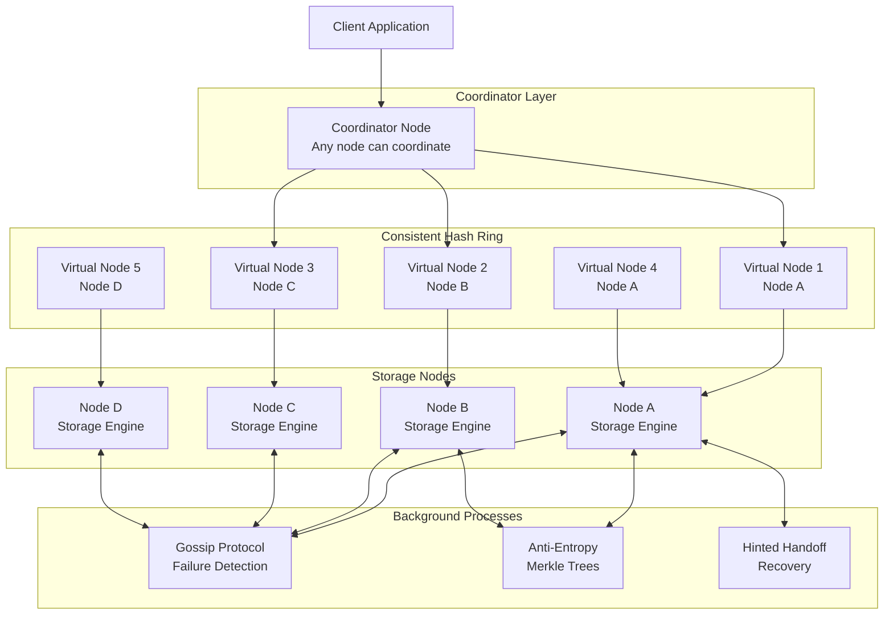
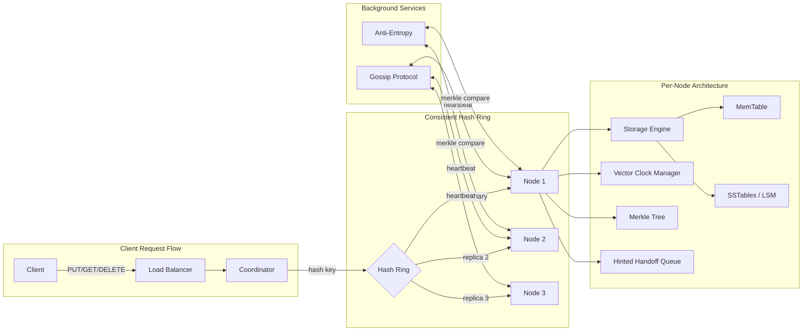
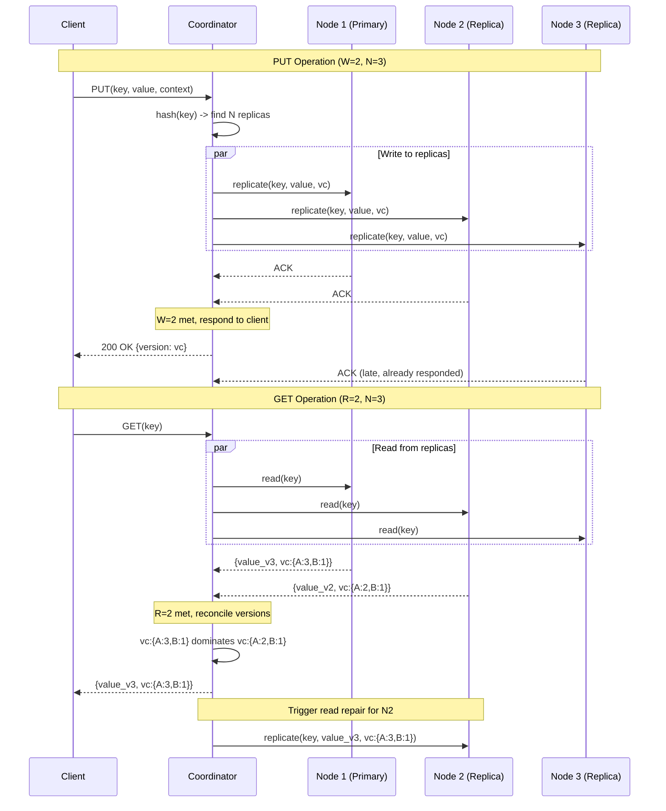

# Distributed Key-Value Store (Dynamo-like)

## 1. Problem Statement

Design and implement a distributed key-value store inspired by Amazon Dynamo that provides
high availability, fault tolerance, and tunable consistency. The system must support
horizontal scaling across multiple storage nodes while maintaining low-latency read and
write operations even during partial network failures or node outages.

Traditional single-node key-value stores become bottlenecks as data volume and request
rates grow. A distributed approach partitions data across nodes using consistent hashing,
replicates data for durability, and uses quorum-based protocols to balance consistency
and availability. Conflict resolution is handled via vector clocks to detect and reconcile
concurrent writes without coordination overhead.

---

## 2. Functional Requirements

| ID   | Requirement                                                                 |
|------|-----------------------------------------------------------------------------|
| FR-1 | `put(key, value)` -- Store a key-value pair, replicated across N nodes      |
| FR-2 | `get(key)` -- Retrieve the value(s) for a key, reading from R replicas      |
| FR-3 | `delete(key)` -- Remove a key from the store across all replicas            |
| FR-4 | Configurable consistency via quorum parameters (N, R, W)                    |
| FR-5 | Vector clock versioning for conflict detection on concurrent writes         |
| FR-6 | Automatic data partitioning via consistent hashing with virtual nodes       |
| FR-7 | Read repair -- stale replicas updated during read operations                |
| FR-8 | Hinted handoff -- writes forwarded to healthy nodes when target is down     |

---

## 3. Non-Functional Requirements

| ID    | Requirement                                                              |
|-------|--------------------------------------------------------------------------|
| NFR-1 | Read and write latency under 10ms at p99 for single-key operations       |
| NFR-2 | High availability (AP in CAP theorem) -- serve reads/writes during       |
|       | partitions with eventual consistency                                     |
| NFR-3 | Tunable consistency -- operators choose N, R, W to trade off             |
|       | consistency vs latency (strong consistency when W + R > N)               |
| NFR-4 | Handle up to F = N - W node failures for writes, N - R for reads         |
| NFR-5 | Linear horizontal scalability -- adding nodes increases throughput       |
| NFR-6 | Data durability -- no acknowledged write is lost unless > N-W nodes fail |
| NFR-7 | Automatic failure detection via gossip protocol within 10 seconds        |
| NFR-8 | Anti-entropy via Merkle trees to detect and repair data divergence       |

---

## 4. Capacity Estimation

### Assumptions

- 100 million keys, average key size 64 bytes, average value size 1 KB
- Replication factor N = 3
- Read:write ratio = 70:30
- Peak throughput: 100,000 ops/sec

### Storage

| Metric                  | Calculation                          | Result        |
|-------------------------|--------------------------------------|---------------|
| Raw data per key        | 64 B + 1 KB = ~1.1 KB               | 1.1 KB        |
| Total raw data          | 100M x 1.1 KB                       | ~110 GB       |
| With replication (N=3)  | 110 GB x 3                           | ~330 GB       |
| Per node (10 nodes)     | 330 GB / 10                          | ~33 GB/node   |
| With overhead (1.3x)    | 33 GB x 1.3 (compaction, metadata)   | ~43 GB/node   |

### Throughput

| Metric              | Value                                     |
|----------------------|------------------------------------------|
| Peak ops/sec         | 100,000                                  |
| Reads/sec            | 70,000                                   |
| Writes/sec           | 30,000                                   |
| Per node (10 nodes)  | ~10,000 ops/sec/node                     |

### Cluster Sizing

| Nodes | Storage/Node | Ops/Node   | Headroom |
|-------|-------------|------------|----------|
| 10    | 43 GB       | 10K ops/s  | Moderate |
| 15    | 29 GB       | 6.7K ops/s | Good     |
| 20    | 22 GB       | 5K ops/s   | High     |

---

## 5. API Design

### Client-Facing API

```
PUT /kv/{key}
  Body: { "value": <bytes>, "context": <vector_clock> }
  Response: 200 OK { "version": <vector_clock> }
  Quorum: W nodes must acknowledge

GET /kv/{key}
  Response: 200 OK { "values": [{ "value": <bytes>, "version": <vector_clock> }] }
  Note: May return multiple conflicting versions (siblings)
  Quorum: R nodes must respond

DELETE /kv/{key}
  Body: { "context": <vector_clock> }
  Response: 200 OK
  Note: Implemented as a tombstone write

GET /admin/ring
  Response: 200 OK { "nodes": [...], "virtual_nodes": [...] }

GET /admin/health
  Response: 200 OK { "nodes": { "<id>": "alive|suspected|dead" } }
```

### Internal Node-to-Node API

```
POST /internal/replicate
  Body: { "key": <key>, "value": <bytes>, "version": <vector_clock> }

POST /internal/read
  Body: { "key": <key> }
  Response: { "value": <bytes>, "version": <vector_clock> }

POST /internal/gossip
  Body: { "node_id": <id>, "membership": { ... }, "heartbeat": <counter> }

POST /internal/merkle
  Body: { "range_start": <hash>, "range_end": <hash>, "tree_root": <hash> }
```

---

## 6. Data Model

### Key-Value Entry

```
KeyValueEntry:
  key:          string          # Partition key (hashed for ring placement)
  value:        bytes           # Opaque blob, up to configured max size
  vector_clock: dict[node_id -> counter]  # Causality tracking
  timestamp:    int             # Wall-clock time (tie-breaking only)
  tombstone:    bool            # True if deleted (kept for anti-entropy)
  ttl:          int | None      # Optional time-to-live in seconds
```

### Vector Clock

A vector clock is a map from node IDs to monotonically increasing counters.
Each node increments its own counter on every write it coordinates.

```
VectorClock:
  clock: { "node_A": 3, "node_B": 1 }

Comparison rules:
  vc1 < vc2  : every entry in vc1 <= corresponding entry in vc2, at least one strictly less
  vc1 > vc2  : every entry in vc1 >= corresponding entry in vc2, at least one strictly greater
  vc1 || vc2 : concurrent -- neither dominates (conflict detected)
```

### Storage Engine (per node)

```
NodeStorage:
  data:       dict[key -> list[KeyValueEntry]]   # In-memory (or LSM-tree on disk)
  hints:      dict[target_node -> list[HintedEntry]]  # Pending hinted handoffs
  merkle:     MerkleTree                          # For anti-entropy comparison
```

---

## 7. High-Level Architecture



**Flow:**
1. Client sends request to any node (that node becomes the coordinator).
2. Coordinator hashes the key, finds the responsible nodes on the consistent hash ring.
3. For writes: coordinator sends to N replicas, waits for W acknowledgements.
4. For reads: coordinator queries N replicas, waits for R responses, reconciles versions.
5. Gossip protocol runs in background, exchanging membership/health state.
6. Anti-entropy (Merkle trees) periodically synchronizes divergent replicas.
7. Hinted handoff stores writes for downed nodes and replays on recovery.

---

## 8. Detailed Design

### 8.1 Consistent Hashing with Virtual Nodes

Each physical node is assigned V virtual nodes (tokens) placed on a hash ring (0 to 2^32-1).
A key is hashed (MD5/SHA-1) and placed on the ring; it is owned by the first virtual node
clockwise from the key's position. Replicas are placed on the next N-1 distinct physical
nodes clockwise.

**Virtual nodes solve:**
- Uneven load distribution when nodes have different capacities
- Data rebalancing when nodes join/leave (only neighbors are affected)

```
Ring: 0 ----[VN_A1]----[VN_B1]----[VN_C1]----[VN_A2]----[VN_D1]---- 2^32
Key hash = 42000 -> lands between VN_A1 and VN_B1 -> owned by VN_B1 (Node B)
Replicas: Node B (primary), Node C, Node A (next 2 distinct physical nodes)
```

### 8.2 Quorum Reads and Writes

Parameters: N (replication factor), W (write quorum), R (read quorum).

**Write path (W out of N):**
1. Coordinator determines N replica nodes for the key.
2. Sends write request to all N replicas in parallel.
3. Waits for W successful acknowledgements.
4. Returns success to client after W acks; remaining replicas converge asynchronously.

**Read path (R out of N):**
1. Coordinator sends read request to all N replicas.
2. Waits for R responses.
3. Compares vector clocks across responses.
4. If all agree, returns the value.
5. If conflicts exist, returns all conflicting versions (siblings) for client resolution.
6. Triggers read repair for stale replicas.

**Consistency tuning:**
- W + R > N: Strong consistency (every read sees latest write)
- W = 1, R = 1: Fastest but weakest consistency
- W = N, R = 1: Fast reads, slower writes, durable
- W = floor(N/2)+1, R = floor(N/2)+1: Balanced (typical: N=3, W=2, R=2)

### 8.3 Vector Clocks for Conflict Detection

Vector clocks track causality across nodes without synchronized clocks.

**Update rule:** When node X coordinates a write:
1. Fetch current vector clock for the key (or empty if new).
2. Increment X's counter: `vc[X] += 1`
3. Store the updated entry.

**Comparison:**
```
vc1 = {A:2, B:1}
vc2 = {A:1, B:2}
Neither dominates -> CONCURRENT (conflict!)

vc1 = {A:2, B:1}
vc2 = {A:3, B:1}
vc2 dominates vc1 -> vc1 is an ancestor of vc2 (no conflict)
```

**Conflict resolution strategies:**
- Last-writer-wins (LWW): Use timestamp to pick winner (simple but lossy)
- Client-side resolution: Return siblings to client, let application merge
- CRDTs: Use conflict-free replicated data types (add-wins set, etc.)

### 8.4 Merkle Trees for Anti-Entropy

Each node maintains a Merkle tree over its key range:
- Leaf nodes: hash of individual key-value pairs
- Internal nodes: hash of children

**Synchronization protocol:**
1. Two nodes exchange Merkle tree roots for a shared key range.
2. If roots match, data is consistent -- done.
3. If roots differ, recursively compare children to find divergent subtrees.
4. Only transfer the keys in divergent leaf ranges.

This minimizes data transfer: O(log N) comparisons to find O(K) divergent keys.

### 8.5 Gossip Protocol for Failure Detection

Nodes periodically (every 1 second) select a random peer and exchange state:

```
GossipState per node:
  membership: dict[node_id -> {heartbeat_counter, timestamp, status}]

Protocol:
  1. Increment own heartbeat counter.
  2. Pick random peer, send own membership table.
  3. Merge received table: for each node, keep the higher heartbeat counter.
  4. If a node's heartbeat hasn't increased in T_suspect seconds -> mark SUSPECTED.
  5. If suspected for T_dead seconds -> mark DEAD, redistribute its key ranges.
```

### 8.6 Sloppy Quorum and Hinted Handoff

When a target replica node is down:
1. The coordinator selects the next healthy node on the ring as a temporary holder.
2. The temporary node stores the data with a "hint" (metadata indicating the intended target).
3. When the target node recovers (detected via gossip), the temporary holder forwards
   the hinted data and deletes its local copy.

This ensures writes succeed even during node failures (availability over consistency).

---

## 9. Architecture Diagram





---

## 10. Architectural Patterns

### 10.1 Consistent Hashing
Distributes keys uniformly across nodes. Adding/removing a node only affects its
immediate neighbors on the ring, minimizing data movement. Virtual nodes (typically
100-256 per physical node) smooth out load imbalances.

### 10.2 Quorum Consensus
Intersection guarantee: if W + R > N, every read quorum overlaps with every write
quorum, ensuring the most recent write is seen. This avoids heavyweight consensus
protocols (Paxos/Raft) in favor of tunable consistency per operation.

### 10.3 Vector Clocks
Capture causal ordering without synchronized physical clocks. Each node maintains a
logical counter; the vector of all counters tracks "happens-before" relationships.
Concurrent (incomparable) vectors indicate conflicting writes that need resolution.

### 10.4 Gossip Protocol
Epidemic-style information dissemination. Each node periodically exchanges state with
a random peer. Information propagates in O(log N) rounds to all nodes. Used for failure
detection (heartbeat monitoring) and membership changes.

### 10.5 Sloppy Quorum + Hinted Handoff
Relaxes the strict quorum requirement: writes go to the first N *healthy* nodes on the
ring, even if some are not the designated replicas. A "hint" is attached so data is
forwarded to the correct node upon recovery. This maximizes write availability.

### 10.6 Merkle Trees for Anti-Entropy
Efficiently detect data divergence between replicas. By comparing tree hashes from root
to leaves, nodes identify exactly which keys are out of sync, transferring only the
necessary data. Reduces synchronization bandwidth from O(data) to O(divergent keys).

---

## 11. Technology Choices

### Storage Engine: LSM Tree vs B-Tree

| Aspect          | LSM Tree (Dynamo/Cassandra)     | B-Tree (PostgreSQL/MySQL)       |
|-----------------|---------------------------------|---------------------------------|
| Write perf      | Excellent (sequential I/O)      | Good (random I/O for updates)   |
| Read perf       | Good (may check multiple levels)| Excellent (single tree lookup)  |
| Space amp       | Higher (compaction lag)         | Lower (in-place updates)        |
| Write amp       | Higher (compaction rewrites)    | Lower                           |
| Best for        | Write-heavy workloads           | Read-heavy workloads            |

**Choice: LSM Tree** -- Dynamo-like stores are write-optimized. The append-only write path
(MemTable -> SSTable flush -> periodic compaction) provides consistent low-latency writes.

### System Comparison

| Feature            | Amazon Dynamo | Apache Cassandra | Riak KV           |
|--------------------|---------------|------------------|--------------------|
| Consistency        | Tunable (NRW) | Tunable (NRW)   | Tunable (NRW)      |
| Conflict resolution| Vector clocks | LWW timestamps   | Vector clocks/CRDT |
| Partitioning       | Consistent hash| Consistent hash | Consistent hash    |
| Gossip protocol    | Yes           | Yes              | Yes                |
| Query language     | Key-value API | CQL              | Key-value/search   |
| Open source        | No            | Yes              | Yes (partially)    |

---

## 12. Scalability

### Horizontal Scaling
- **Adding nodes:** New node joins the ring, takes ownership of key ranges from neighbors.
  Data is streamed from existing nodes. Virtual nodes ensure only ~1/N of data moves.
- **Removing nodes:** Node's key ranges are redistributed to neighbors. Hinted handoff
  ensures no writes are lost during the transition.

### Vertical Scaling
- More RAM: Larger MemTables, bigger page cache, more keys cached.
- More CPU: Higher compaction throughput, more concurrent request handling.
- Faster disk (NVMe): Faster SSTable reads and compaction.

### Load Balancing
- Virtual nodes provide natural load balancing.
- Hot partition detection: Monitor per-key-range throughput, split hot ranges.
- Client-side routing: Clients cache the ring topology, send requests directly
  to the coordinator for a key (avoiding an extra hop).

---

## 13. Reliability

### Failure Modes and Mitigations

| Failure                | Detection           | Mitigation                           |
|------------------------|---------------------|--------------------------------------|
| Single node crash      | Gossip (seconds)    | Sloppy quorum + hinted handoff       |
| Network partition      | Gossip timeout      | Serve from available side (AP)       |
| Disk failure           | Health checks       | Replicas on other nodes, rebuild     |
| Slow node (straggler)  | Latency monitoring  | Speculative reads, adaptive routing  |
| Data corruption        | Checksums           | Merkle tree repair from replicas     |
| Split brain            | Gossip convergence  | Vector clock conflict detection      |

### Durability Guarantees
- Write is durable after W nodes persist to disk (WAL + MemTable).
- Data survives up to N-1 simultaneous node failures (if W=N).
- Tombstones (delete markers) are kept for a configurable GC grace period
  to prevent deleted data from being resurrected by anti-entropy.

---

## 14. Security

### Authentication and Authorization
- Mutual TLS between all nodes for inter-node communication.
- Client authentication via API keys or OAuth tokens.
- Role-based access control: read-only, read-write, admin per key prefix.

### Data Protection
- Encryption at rest: AES-256 for SSTables and WAL files.
- Encryption in transit: TLS 1.3 for all client and inter-node traffic.
- Key rotation: Periodic rotation of encryption keys without downtime.

### Network Security
- Node-to-node communication on a private network / VPC.
- Rate limiting on client-facing APIs.
- IP allowlisting for administrative operations.

---

## 15. Monitoring

### Key Metrics

| Category    | Metric                                           |
|-------------|--------------------------------------------------|
| Latency     | p50/p95/p99 read and write latency per node      |
| Throughput  | ops/sec per node, cluster-wide aggregate          |
| Consistency | Read repair rate, anti-entropy sync frequency     |
| Storage     | Disk usage, compaction backlog, MemTable size     |
| Cluster     | Node status (alive/suspected/dead), gossip lag    |
| Replication | Hinted handoff queue depth, replica lag           |

### Alerting Rules
- p99 latency > 10ms for 5 consecutive minutes
- Node suspected/dead for > 30 seconds
- Hinted handoff queue depth > 10,000 entries
- Disk usage > 80% on any node
- Compaction backlog > configured threshold

### Dashboards
- **Cluster Overview:** Ring visualization, node health, total throughput
- **Per-Node:** CPU, memory, disk I/O, request latency histogram
- **Replication:** Replica lag, hinted handoff depth, anti-entropy sync status
- **Client:** Request rate by operation type, error rate, timeout rate
