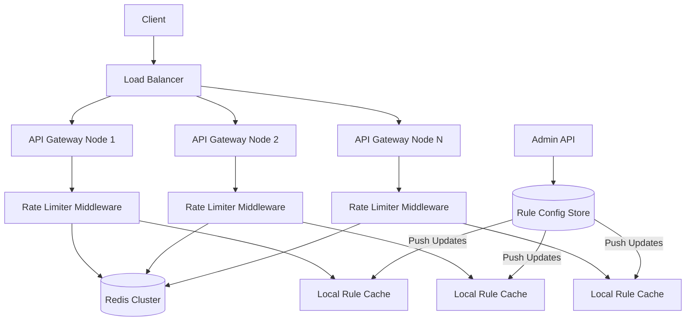
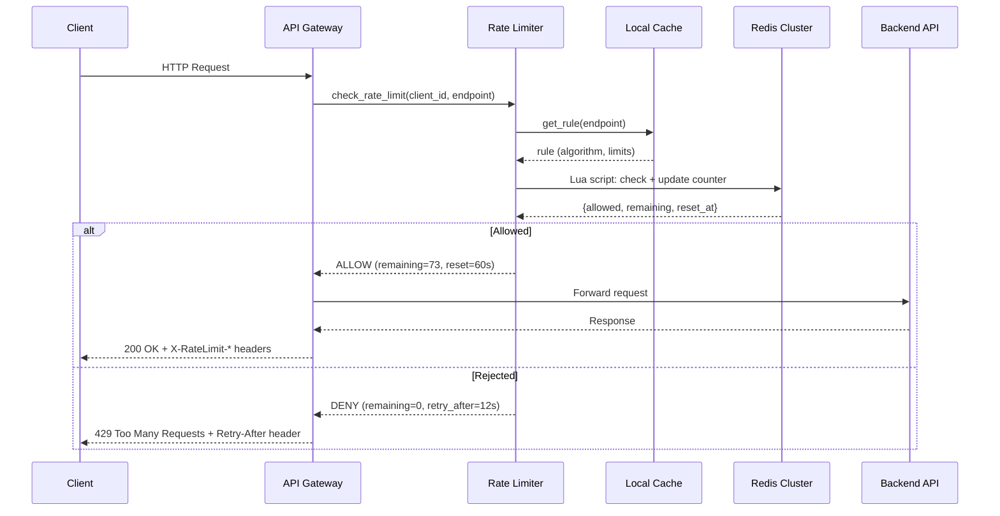
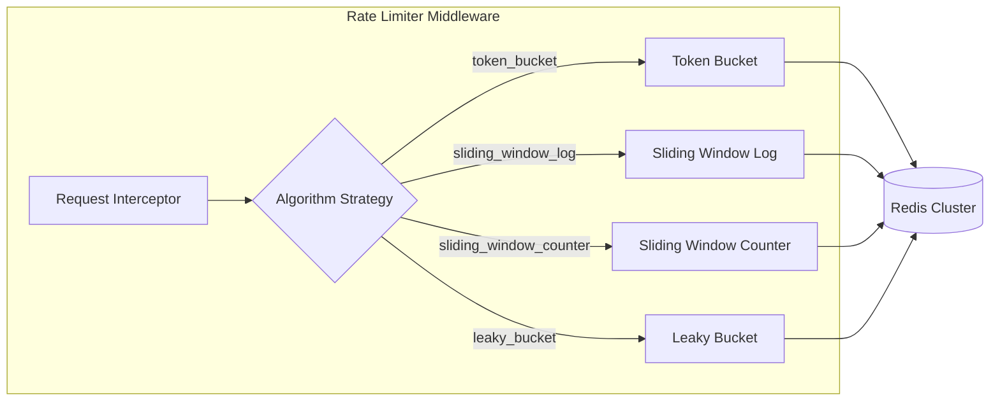

# Distributed Rate Limiter - System Design

---

## 1. Problem Statement

Modern APIs and services must protect themselves from abuse, ensure fair resource
allocation, and maintain quality of service under heavy load. A **rate limiter**
controls the rate of requests a client (identified by user ID, IP, or API key)
can make within a given time window.

In a **distributed** environment (multiple API gateway nodes), counting must be
consistent across all nodes --- a user who is rate-limited on node A must also be
limited on node B.

**Key challenges:**
- Accurate counting across distributed nodes with minimal latency
- Supporting multiple rate-limiting algorithms with different trade-offs
- Handling clock skew between nodes
- Graceful degradation when the central counter store is unavailable

---

## 2. Functional Requirements

| ID   | Requirement |
|------|-------------|
| FR-1 | Rate-limit requests by **user ID**, **IP address**, or **API key** |
| FR-2 | Support multiple algorithms: **Token Bucket**, **Sliding Window Log**, **Sliding Window Counter**, **Leaky Bucket** |
| FR-3 | Configurable rules per API endpoint (e.g., 100 req/min for `/api/search`, 1000 req/hr for `/api/data`) |
| FR-4 | Return standard response headers: `X-RateLimit-Limit`, `X-RateLimit-Remaining`, `X-RateLimit-Reset` |
| FR-5 | Return `429 Too Many Requests` when limit is exceeded |
| FR-6 | Rule management API: create, update, delete rate-limit rules |
| FR-7 | Support burst allowances (token bucket) and smooth output (leaky bucket) |

---

## 3. Non-Functional Requirements

| ID    | Requirement | Target |
|-------|-------------|--------|
| NFR-1 | **Latency overhead** | < 1 ms per rate-limit check (p99) |
| NFR-2 | **Consistency** | Distributed multi-node consistent counting via centralized store |
| NFR-3 | **Availability** | 99.99% uptime; fail-open if counter store is unreachable |
| NFR-4 | **Clock skew tolerance** | Use server-side timestamps (Redis `TIME`); tolerate up to 100 ms skew |
| NFR-5 | **Scalability** | Handle 1M+ rate-limit checks per second across all nodes |
| NFR-6 | **Observability** | Metrics for allowed/rejected counts, latency histograms, rule hit rates |

---

## 4. Capacity Estimation

### Assumptions
- 500 API endpoints, each with 2-3 rate-limit rules -> ~1,500 rules total
- 10M unique clients (users/IPs)
- Average 1,000 requests/sec per gateway node, 50 nodes -> 50K req/sec total
- Peak: 5x average -> 250K rate-limit checks/sec

### Redis Operations
| Operation | Per Check | Total at Peak |
|-----------|-----------|---------------|
| Read counter | 1 | 250K/sec |
| Write counter | 1 | 250K/sec |
| **Total Redis ops** | **2** | **500K ops/sec** |

### Storage
| Item | Size | Count | Total |
|------|------|-------|-------|
| Token bucket state (key + tokens + last_refill) | ~100 B | 10M clients x 3 rules | ~3 GB |
| Sliding window log entries (per client) | ~50 B/entry | 10M x avg 10 entries | ~5 GB |
| Sliding window counter (2 counters per window) | ~80 B | 10M x 3 rules | ~2.4 GB |
| Rate-limit rules | ~200 B | 1,500 | ~300 KB |

> **Recommendation**: Use sliding window counter for memory efficiency at scale.
> Reserve sliding window log for high-precision use cases only.

---

## 5. API Design

### Rate Limit Check (Internal Middleware)

```
POST /internal/ratelimit/check
```

**Request:**
```json
{
  "client_id": "user_12345",
  "client_type": "user_id",
  "endpoint": "/api/search",
  "method": "GET"
}
```

**Response (allowed):**
```json
{
  "allowed": true,
  "limit": 100,
  "remaining": 73,
  "reset_at": 1700000060,
  "retry_after": null
}
```

**Response (rejected):**
```json
{
  "allowed": false,
  "limit": 100,
  "remaining": 0,
  "reset_at": 1700000060,
  "retry_after": 12
}
```

### Rule Management

```
POST   /admin/rules          -- Create a new rule
GET    /admin/rules           -- List all rules
GET    /admin/rules/{id}      -- Get a specific rule
PUT    /admin/rules/{id}      -- Update a rule
DELETE /admin/rules/{id}      -- Delete a rule
```

**Rule payload:**
```json
{
  "id": "rule_001",
  "endpoint": "/api/search",
  "client_type": "api_key",
  "algorithm": "sliding_window_counter",
  "max_requests": 100,
  "window_seconds": 60,
  "burst_size": 20
}
```

---

## 6. Data Model

### rate_limit_rules

| Field | Type | Description |
|-------|------|-------------|
| id | string (PK) | Unique rule identifier |
| endpoint | string | API path pattern (supports wildcards) |
| client_type | enum | `user_id`, `ip_address`, `api_key` |
| algorithm | enum | `token_bucket`, `sliding_window_log`, `sliding_window_counter`, `leaky_bucket` |
| max_requests | int | Maximum requests allowed in the window |
| window_seconds | int | Time window duration |
| burst_size | int | Max burst (token bucket / leaky bucket queue size) |
| refill_rate | float | Tokens per second (token bucket) / drain rate (leaky bucket) |
| created_at | timestamp | Rule creation time |
| updated_at | timestamp | Last modification time |

### counters (Redis)

**Token Bucket:**
```
rate:{client_id}:{rule_id}:tokens    -> float (current token count)
rate:{client_id}:{rule_id}:last_ts   -> float (last refill timestamp)
```

**Sliding Window Log:**
```
rate:{client_id}:{rule_id}:log       -> sorted set (score=timestamp, member=request_id)
```

**Sliding Window Counter:**
```
rate:{client_id}:{rule_id}:prev      -> int (previous window count)
rate:{client_id}:{rule_id}:curr      -> int (current window count)
rate:{client_id}:{rule_id}:win_start -> float (current window start timestamp)
```

**Leaky Bucket:**
```
rate:{client_id}:{rule_id}:queue_size -> int (current queue depth)
rate:{client_id}:{rule_id}:last_leak  -> float (last drain timestamp)
```

---

## 7. High-Level Architecture



**Flow:**
1. Client request arrives at **Load Balancer**
2. Routed to an **API Gateway Node**
3. **Rate Limiter Middleware** intercepts the request before business logic
4. Middleware reads rules from **Local Rule Cache** (refreshed from config store)
5. Middleware checks/updates counters in **Redis Cluster** (atomic Lua scripts)
6. Returns allow/deny decision with rate-limit headers

---

## 8. Detailed Design - Algorithm Comparison

### 8.1 Token Bucket

**How it works:**
- A bucket holds up to `capacity` tokens
- Tokens are added at a steady `refill_rate` (tokens/sec)
- Each request consumes 1 token; if no tokens remain, the request is rejected
- Allows **bursts** up to bucket capacity

**Pseudocode:**
```
now = current_time()
elapsed = now - last_refill
tokens = min(capacity, tokens + elapsed * refill_rate)
last_refill = now
if tokens >= 1:
    tokens -= 1
    ALLOW
else:
    DENY
```

**Trade-offs:**
| Pros | Cons |
|------|------|
| Allows controlled bursts | Burst can cause momentary overload |
| Memory efficient (2 values per client) | Requires atomic read-modify-write |
| Simple to implement | Refill rate tuning needed |

---

### 8.2 Sliding Window Log

**How it works:**
- Maintain a sorted set of timestamps for each request
- On each request, remove entries older than `window_seconds`
- If remaining entries < `max_requests`, allow; otherwise deny
- **Most precise** algorithm

**Pseudocode:**
```
now = current_time()
remove entries where timestamp < (now - window_seconds)
count = size of remaining entries
if count < max_requests:
    add now to log
    ALLOW
else:
    DENY
```

**Trade-offs:**
| Pros | Cons |
|------|------|
| Exact per-window accuracy | High memory usage (stores every timestamp) |
| No boundary spikes | Redis sorted set ops are O(log N) |
| Smooth rate enforcement | Cleanup of old entries adds overhead |

---

### 8.3 Sliding Window Counter

**How it works:**
- Divide time into fixed windows
- Track count for current window and previous window
- Estimate current rate using weighted combination:
  `estimated = prev_count * overlap_ratio + curr_count`
- **Memory efficient** approximation of sliding window log

**Pseudocode:**
```
now = current_time()
window_start = floor(now / window_seconds) * window_seconds
elapsed_in_window = now - window_start
overlap_ratio = 1 - (elapsed_in_window / window_seconds)
estimated = prev_count * overlap_ratio + curr_count
if estimated < max_requests:
    curr_count += 1
    ALLOW
else:
    DENY
```

**Trade-offs:**
| Pros | Cons |
|------|------|
| Very memory efficient (2 counters) | Approximate (not exact) |
| Fast O(1) operations | Can slightly over/under-count at boundaries |
| Good balance of precision and cost | Requires window rotation logic |

---

### 8.4 Leaky Bucket

**How it works:**
- Requests enter a FIFO queue of fixed size
- Queue drains at a constant rate (`leak_rate` requests/sec)
- If queue is full, new requests are rejected
- Produces **constant-rate output** regardless of input burstiness

**Pseudocode:**
```
now = current_time()
elapsed = now - last_leak
leaked = floor(elapsed * leak_rate)
queue_size = max(0, queue_size - leaked)
last_leak = now
if queue_size < capacity:
    queue_size += 1
    ALLOW
else:
    DENY
```

**Trade-offs:**
| Pros | Cons |
|------|------|
| Constant output rate (smooths traffic) | No burst tolerance |
| Memory efficient | Requests may experience queuing delay |
| Predictable downstream load | Old requests processed before new ones |

---

### Algorithm Comparison Summary

| Criteria | Token Bucket | Sliding Window Log | Sliding Window Counter | Leaky Bucket |
|----------|-------------|-------------------|----------------------|-------------|
| **Precision** | Good | Exact | Approximate | Good |
| **Memory** | O(1) | O(N) per client | O(1) | O(1) |
| **Burst handling** | Allows bursts | No bursts | Minimal bursts | No bursts |
| **Output pattern** | Bursty | Even | Even | Constant rate |
| **Redis ops** | 1 read-modify-write | 1 ZREMRANGEBYSCORE + ZADD + ZCARD | 2 counters + 1 increment | 1 read-modify-write |
| **Best for** | APIs needing burst tolerance | Strict compliance / billing | General-purpose API limiting | Upstream protection |

---

## 9. Architecture Diagram





---

## 10. Architectural Patterns

### Middleware / Interceptor Pattern
The rate limiter is implemented as **middleware** that intercepts every request
before it reaches the business logic layer. This provides:
- **Separation of concerns**: rate limiting is decoupled from API logic
- **Consistent enforcement**: every request passes through the same check
- **Easy to enable/disable**: toggle middleware without changing API code

### Strategy Pattern
Each rate-limiting algorithm is encapsulated behind a common interface
(`RateLimiter`). The `RateLimiterFactory` selects the appropriate strategy
based on the rule configuration. This allows:
- **Runtime algorithm selection** per endpoint/rule
- **Open/closed principle**: add new algorithms without modifying existing code
- **Easy testing**: swap implementations for unit tests

### Sliding Window Pattern
The sliding window counter combines two fixed windows with a weighted overlap
to approximate a true sliding window. This is a classic **space-time trade-off**:
- Sacrifices exact precision for O(1) memory per client
- Used extensively in network traffic shaping and API rate limiting

---

## 11. Technology Choices

### Redis + Lua Scripts (Primary)
- **Why Redis**: sub-millisecond latency, atomic operations, built-in TTL
- **Why Lua scripts**: execute check-and-update atomically on the Redis server,
  eliminating race conditions without distributed locks
- **Redis Cluster**: horizontal scaling via hash slots; client keys are sharded
  across nodes

```lua
-- Example: Token Bucket Lua Script
local key_tokens = KEYS[1]
local key_ts = KEYS[2]
local capacity = tonumber(ARGV[1])
local refill_rate = tonumber(ARGV[2])
local now = tonumber(ARGV[3])

local tokens = tonumber(redis.call('GET', key_tokens) or capacity)
local last_ts = tonumber(redis.call('GET', key_ts) or now)

local elapsed = now - last_ts
tokens = math.min(capacity, tokens + elapsed * refill_rate)

if tokens >= 1 then
    tokens = tokens - 1
    redis.call('SET', key_tokens, tokens)
    redis.call('SET', key_ts, now)
    return {1, tokens, 0}  -- allowed, remaining, retry_after
else
    local retry_after = (1 - tokens) / refill_rate
    return {0, 0, retry_after}  -- denied
end
```

### Local Cache + Sync vs. Centralized

| Approach | Pros | Cons |
|----------|------|------|
| **Centralized (Redis only)** | Exact global counts | Network hop per request |
| **Local cache + periodic sync** | Lower latency, resilient to Redis failure | Allows slight over-limit during sync gap |
| **Hybrid** | Best of both; local for hot paths, Redis for precision | More complex |

> **Recommendation**: Use centralized Redis for most endpoints. Use local
> cache with periodic sync (every 100ms) for extremely high-throughput
> endpoints (> 10K req/sec per node).

---

## 12. Scalability

- **Horizontal scaling**: Add more API gateway nodes; Redis Cluster handles
  increased load via hash-slot redistribution
- **Redis Cluster sharding**: Rate-limit keys are naturally distributed by
  `{client_id}:{rule_id}` hash tags
- **Local caching**: Rules are cached locally with 30s TTL; reduces Redis
  reads for rule lookups
- **Connection pooling**: Each gateway node maintains a Redis connection pool
  (e.g., 50 connections) to avoid connection overhead
- **Read replicas**: For read-heavy patterns (checking remaining quota),
  use Redis replicas with eventual consistency

---

## 13. Reliability

- **Fail-open policy**: If Redis is unreachable, allow the request (prefer
  availability over strictness). Log the event for monitoring.
- **Circuit breaker**: If Redis errors exceed threshold (e.g., 50% failure
  in 10s window), trip the circuit and fall back to local-only limiting
- **Redis persistence**: Use AOF (append-only file) with `everysec` fsync
  for durability without major performance impact
- **Graceful degradation**: Under extreme load, switch from sliding window
  log (expensive) to sliding window counter (cheap) automatically
- **Health checks**: Each gateway node monitors Redis latency; if p99 > 5ms,
  activate local cache fallback

---

## 14. Security

- **Rule management authentication**: Admin endpoints require JWT with
  `rate_limit:admin` scope
- **Client identification**: Support multiple identification strategies
  (API key in header, JWT subject, X-Forwarded-For IP)
- **Anti-spoofing**: Validate X-Forwarded-For against trusted proxy list;
  fall back to direct connection IP
- **Rate limit the rate limiter**: Apply a meta-rate-limit to the admin
  rule management API itself
- **Encryption**: Redis connections use TLS; sensitive rule data encrypted
  at rest

---

## 15. Monitoring and Observability

### Key Metrics
| Metric | Type | Description |
|--------|------|-------------|
| `ratelimit.check.total` | Counter | Total rate-limit checks |
| `ratelimit.check.allowed` | Counter | Allowed requests |
| `ratelimit.check.rejected` | Counter | Rejected requests (429s) |
| `ratelimit.check.latency` | Histogram | Check latency (p50, p95, p99) |
| `ratelimit.redis.errors` | Counter | Redis operation failures |
| `ratelimit.fallback.active` | Gauge | Whether local fallback is active |
| `ratelimit.rules.count` | Gauge | Number of active rules |

### Alerting
- **High rejection rate**: > 10% of requests rejected for a single endpoint
- **Redis latency spike**: p99 > 5 ms
- **Redis connection failures**: > 1% error rate
- **Rule sync lag**: Local cache is > 60s stale

### Dashboards
- Real-time allowed vs. rejected by endpoint
- Per-client usage vs. limit (top offenders)
- Redis cluster health and ops/sec
- Algorithm distribution across rules

---

## Summary

The Distributed Rate Limiter provides flexible, high-performance request
throttling across a multi-node API gateway deployment. By supporting four
algorithms (Token Bucket, Sliding Window Log, Sliding Window Counter, Leaky
Bucket), operators can choose the right trade-off between precision, memory,
burst tolerance, and output smoothness for each endpoint. Redis Lua scripts
ensure atomic counter operations, while local caching and fail-open policies
maintain availability under adverse conditions.
