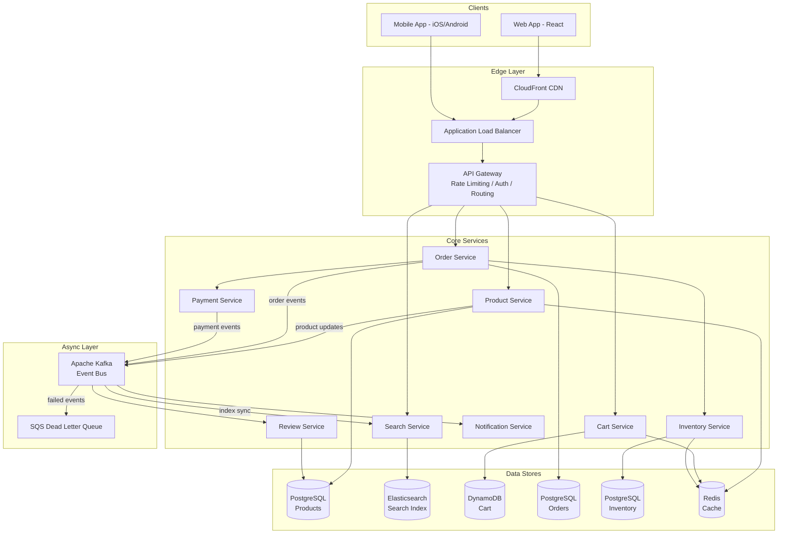
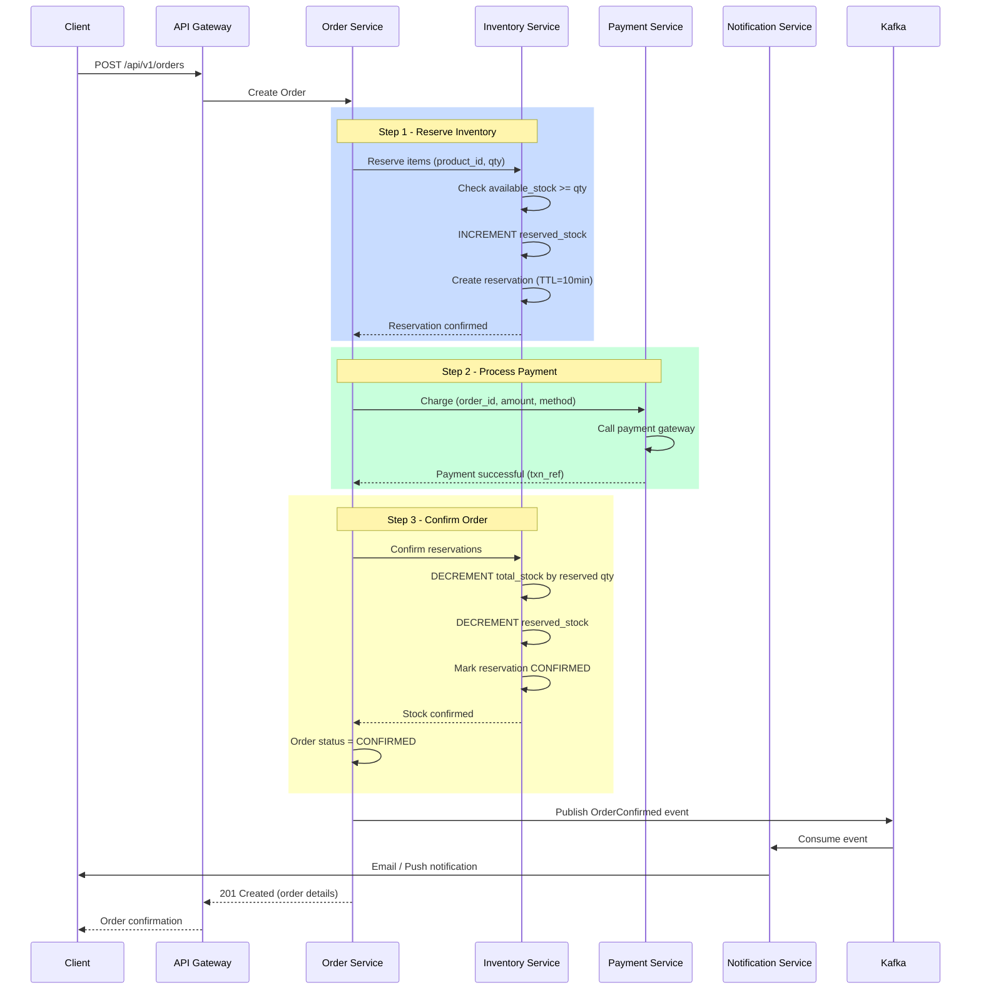

# E-Commerce Platform (Amazon-like) — System Design

## 1. Problem Statement

Design a large-scale e-commerce platform similar to Amazon that allows millions of users to browse products, search a catalog, manage shopping carts, place orders, and make payments. The system must handle high concurrency during flash sales, prevent inventory overselling, and deliver a responsive search experience across tens of millions of products.

---

## 2. Functional Requirements

| # | Requirement | Description |
|---|-------------|-------------|
| F1 | **Product Catalog** | CRUD operations on products with rich metadata (title, description, price, images, categories, attributes). |
| F2 | **Search & Browse** | Full-text search with filters (category, price range, rating, brand), autocomplete, and sorting (relevance, price, rating). |
| F3 | **Shopping Cart** | Add/remove/update items, persist across sessions, merge guest cart on login, quantity validation against stock. |
| F4 | **Checkout & Payment** | Multi-step: reserve inventory → collect payment → confirm order. Support multiple payment methods. |
| F5 | **Order Management** | Order lifecycle: PENDING → CONFIRMED → SHIPPED → DELIVERED → (CANCELLED / RETURNED). Order history for users. |
| F6 | **Inventory Management** | Real-time stock tracking, reservation with TTL, automatic release of expired reservations, low-stock alerts. |
| F7 | **Reviews & Ratings** | Users can submit reviews (1–5 stars + text) per purchased product. Aggregate rating is updated asynchronously. |
| F8 | **Notifications** | Order confirmation emails, shipping updates, payment receipts, low-stock alerts for sellers. |

---

## 3. Non-Functional Requirements

| Requirement | Target |
|-------------|--------|
| **Search Latency** | p99 < 100 ms |
| **Concurrency** | 100K concurrent users |
| **Inventory Consistency** | Zero overselling (strong consistency on stock decrement) |
| **Checkout Availability** | 99.99% uptime (≤ 52 min downtime/year) |
| **Cart Availability** | 99.9% (eventual consistency acceptable) |
| **Order Data Durability** | 99.999999999% (11 nines) |
| **Read/Write Ratio** | ~100:1 (reads dominate) |
| **Data Retention** | Orders retained indefinitely; carts expire after 30 days of inactivity |

---

## 4. Capacity Estimation

### Assumptions

| Metric | Value |
|--------|-------|
| Total products | 50 million |
| Daily active users (DAU) | 10 million |
| Avg. searches per user/day | 5 |
| Avg. product views per user/day | 15 |
| Orders per day | 1 million |
| Avg. items per order | 3 |
| Avg. product data size | 10 KB |

### Derived Numbers

| Metric | Calculation | Result |
|--------|-------------|--------|
| **Search QPS** | 10M × 5 / 86400 | ~580 QPS (peak ~2,900 QPS at 5× burst) |
| **Product view QPS** | 10M × 15 / 86400 | ~1,740 QPS (peak ~8,700 QPS) |
| **Order write QPS** | 1M / 86400 | ~12 QPS (peak ~60 QPS) |
| **Cart write QPS** | ~3× orders | ~35 QPS (peak ~175 QPS) |
| **Product storage** | 50M × 10 KB | ~500 GB |
| **Order storage/year** | 1M × 3 items × 1 KB × 365 | ~1.1 TB/year |
| **Search index size** | 50M × 2 KB (indexed fields) | ~100 GB |

---

## 5. API Design

### Product Service

```
GET    /api/v1/products/{product_id}
GET    /api/v1/products?category=X&brand=Y&min_price=10&max_price=100&page=1&size=20
POST   /api/v1/products                    (seller)
PUT    /api/v1/products/{product_id}        (seller)
DELETE /api/v1/products/{product_id}        (seller)
```

### Search Service

```
GET    /api/v1/search?q=keyword&category=X&sort=relevance&page=1&size=20
GET    /api/v1/search/autocomplete?prefix=lap
```

### Cart Service

```
GET    /api/v1/cart
POST   /api/v1/cart/items          { product_id, quantity }
PUT    /api/v1/cart/items/{item_id} { quantity }
DELETE /api/v1/cart/items/{item_id}
DELETE /api/v1/cart                 (clear cart)
```

### Order Service

```
POST   /api/v1/orders              (checkout → create order)
GET    /api/v1/orders/{order_id}
GET    /api/v1/orders?user_id=X&status=CONFIRMED&page=1
PUT    /api/v1/orders/{order_id}/cancel
```

### Payment Service

```
POST   /api/v1/payments            { order_id, method, amount }
GET    /api/v1/payments/{payment_id}
POST   /api/v1/payments/{payment_id}/refund
```

### Review Service

```
POST   /api/v1/products/{product_id}/reviews   { rating, text }
GET    /api/v1/products/{product_id}/reviews?page=1&size=10
```

---

## 6. Data Model

### Products Table (PostgreSQL — product catalog)

```sql
CREATE TABLE products (
    id              UUID PRIMARY KEY DEFAULT gen_random_uuid(),
    seller_id       UUID NOT NULL REFERENCES users(id),
    title           VARCHAR(500) NOT NULL,
    description     TEXT,
    price           DECIMAL(12,2) NOT NULL,
    category_id     UUID REFERENCES categories(id),
    brand           VARCHAR(200),
    images          JSONB,           -- ["url1", "url2"]
    attributes      JSONB,           -- {"color": "red", "size": "L"}
    avg_rating      DECIMAL(2,1) DEFAULT 0.0,
    review_count    INT DEFAULT 0,
    status          VARCHAR(20) DEFAULT 'ACTIVE',  -- ACTIVE, INACTIVE, DELETED
    created_at      TIMESTAMPTZ DEFAULT NOW(),
    updated_at      TIMESTAMPTZ DEFAULT NOW()
);
CREATE INDEX idx_products_category ON products(category_id);
CREATE INDEX idx_products_seller   ON products(seller_id);
```

### Inventory Table (PostgreSQL — strong consistency)

```sql
CREATE TABLE inventory (
    product_id      UUID PRIMARY KEY REFERENCES products(id),
    total_stock     INT NOT NULL DEFAULT 0,
    reserved_stock  INT NOT NULL DEFAULT 0,
    available_stock INT GENERATED ALWAYS AS (total_stock - reserved_stock) STORED,
    warehouse_id    UUID,
    updated_at      TIMESTAMPTZ DEFAULT NOW(),
    CONSTRAINT chk_stock CHECK (reserved_stock <= total_stock AND total_stock >= 0)
);
```

### Inventory Reservations (PostgreSQL)

```sql
CREATE TABLE inventory_reservations (
    id              UUID PRIMARY KEY DEFAULT gen_random_uuid(),
    product_id      UUID NOT NULL REFERENCES products(id),
    order_id        UUID,
    quantity         INT NOT NULL,
    status          VARCHAR(20) DEFAULT 'ACTIVE',  -- ACTIVE, CONFIRMED, RELEASED
    expires_at      TIMESTAMPTZ NOT NULL,
    created_at      TIMESTAMPTZ DEFAULT NOW()
);
CREATE INDEX idx_reservations_expiry ON inventory_reservations(expires_at)
    WHERE status = 'ACTIVE';
```

### Cart (DynamoDB — high availability, session-based)

```json
{
    "PK": "USER#<user_id>",
    "SK": "CART",
    "items": [
        {
            "product_id": "uuid",
            "quantity": 2,
            "price_at_add": 29.99,
            "added_at": "2024-01-15T10:00:00Z"
        }
    ],
    "updated_at": "2024-01-15T10:30:00Z",
    "ttl": 1707955200
}
```

### Orders Table (PostgreSQL — transactional)

```sql
CREATE TABLE orders (
    id              UUID PRIMARY KEY DEFAULT gen_random_uuid(),
    user_id         UUID NOT NULL REFERENCES users(id),
    status          VARCHAR(20) NOT NULL DEFAULT 'PENDING',
    total_amount    DECIMAL(12,2) NOT NULL,
    shipping_addr   JSONB NOT NULL,
    created_at      TIMESTAMPTZ DEFAULT NOW(),
    updated_at      TIMESTAMPTZ DEFAULT NOW()
);
CREATE INDEX idx_orders_user   ON orders(user_id, created_at DESC);
CREATE INDEX idx_orders_status ON orders(status);
```

### Order Items Table

```sql
CREATE TABLE order_items (
    id              UUID PRIMARY KEY DEFAULT gen_random_uuid(),
    order_id        UUID NOT NULL REFERENCES orders(id),
    product_id      UUID NOT NULL REFERENCES products(id),
    quantity         INT NOT NULL,
    unit_price      DECIMAL(12,2) NOT NULL,
    subtotal        DECIMAL(12,2) NOT NULL
);
CREATE INDEX idx_order_items_order ON order_items(order_id);
```

### Payments Table

```sql
CREATE TABLE payments (
    id              UUID PRIMARY KEY DEFAULT gen_random_uuid(),
    order_id        UUID NOT NULL REFERENCES orders(id),
    amount          DECIMAL(12,2) NOT NULL,
    method          VARCHAR(50) NOT NULL,   -- CREDIT_CARD, DEBIT_CARD, UPI, WALLET
    status          VARCHAR(20) DEFAULT 'PENDING',
    transaction_ref VARCHAR(200),
    created_at      TIMESTAMPTZ DEFAULT NOW(),
    updated_at      TIMESTAMPTZ DEFAULT NOW()
);
CREATE INDEX idx_payments_order ON payments(order_id);
```

---

## 7. High-Level Architecture



---

## 8. Detailed Design

### 8.1 Cart Management

**Two-tier strategy: Session Cart + Persistent Cart**

| Aspect | Guest (Session Cart) | Logged-in (Persistent Cart) |
|--------|---------------------|-----------------------------|
| Storage | Redis (TTL: 24h) | DynamoDB (TTL: 30 days) |
| Key | `session:<session_id>` | `USER#<user_id>` |
| Merge | On login, merge into persistent cart | N/A |
| Consistency | Eventual | Eventual |

**Cart Merge Logic on Login:**

```
1. Fetch guest cart from Redis by session_id
2. Fetch persistent cart from DynamoDB by user_id
3. For each item in guest cart:
   a. If product exists in persistent cart → take max(guest_qty, persistent_qty)
   b. If product is new → add to persistent cart
4. Validate all quantities against current inventory
5. Write merged cart to DynamoDB
6. Delete guest cart from Redis
```

### 8.2 Checkout Flow (Saga Pattern)

The checkout process is a distributed saga with compensating actions:

```
┌─────────────────────────────────────────────────────────────────┐
│                     CHECKOUT SAGA                                │
│                                                                  │
│  Step 1: RESERVE INVENTORY                                       │
│    ├─ For each item: decrement available, increment reserved     │
│    ├─ Set reservation TTL = 10 minutes                           │
│    └─ On failure: COMPENSATE → release all reservations          │
│                                                                  │
│  Step 2: PROCESS PAYMENT                                         │
│    ├─ Charge payment method                                      │
│    ├─ Create payment record (status=PENDING → COMPLETED)         │
│    └─ On failure: COMPENSATE → release reservations              │
│                                                                  │
│  Step 3: CONFIRM ORDER                                           │
│    ├─ Update order status: PENDING → CONFIRMED                   │
│    ├─ Convert reservations: ACTIVE → CONFIRMED                   │
│    ├─ Deduct reserved_stock, reduce total_stock                  │
│    └─ On failure: COMPENSATE → refund payment, release stock     │
│                                                                  │
│  Step 4: SEND NOTIFICATIONS                                      │
│    ├─ Emit OrderConfirmed event to Kafka                         │
│    ├─ Email confirmation to buyer                                │
│    └─ On failure: log and retry (non-critical)                   │
└─────────────────────────────────────────────────────────────────┘
```

### 8.3 Inventory Reservation with TTL

```python
# Pseudocode for atomic reservation
BEGIN TRANSACTION;
  UPDATE inventory
  SET reserved_stock = reserved_stock + :qty
  WHERE product_id = :pid
    AND (total_stock - reserved_stock) >= :qty;
  -- If rows_affected == 0 → ROLLBACK (insufficient stock)

  INSERT INTO inventory_reservations (product_id, order_id, quantity, expires_at)
  VALUES (:pid, :order_id, :qty, NOW() + INTERVAL '10 minutes');
COMMIT;
```

**Reservation Cleanup (runs every minute):**

```sql
-- Release expired reservations
UPDATE inventory
SET reserved_stock = reserved_stock - r.quantity
FROM inventory_reservations r
WHERE inventory.product_id = r.product_id
  AND r.status = 'ACTIVE'
  AND r.expires_at < NOW();

UPDATE inventory_reservations
SET status = 'RELEASED'
WHERE status = 'ACTIVE' AND expires_at < NOW();
```

---

## 9. Architecture Diagram — Checkout Flow



---

## 10. Architectural Patterns

### 10.1 Microservices Architecture

Each bounded context (Product, Cart, Order, Inventory, Payment) is an independent service with:
- Own database (Database-per-Service pattern)
- Independent deployment pipeline
- gRPC for synchronous inter-service calls
- Kafka for asynchronous event propagation

### 10.2 Saga Pattern (Checkout)

The checkout flow uses an **Orchestration Saga** where the Order Service acts as the saga orchestrator:

| Step | Service | Action | Compensating Action |
|------|---------|--------|---------------------|
| 1 | Inventory | Reserve stock | Release reservation |
| 2 | Payment | Charge customer | Refund payment |
| 3 | Order | Confirm order | Cancel order |
| 4 | Notification | Send confirmation | (log failure, retry) |

**Why Orchestration over Choreography?**
- Checkout has a well-defined linear flow
- Easier to track saga state and handle failures
- Centralized compensation logic simplifies debugging

### 10.3 CQRS (Command Query Responsibility Segregation)

| Aspect | Command Side | Query Side |
|--------|-------------|------------|
| Product writes | PostgreSQL (source of truth) | Elasticsearch (optimized for search) |
| Sync mechanism | CDC via Kafka (Debezium) | Consumer updates ES index |
| Consistency | Strong | Eventual (< 2s lag) |
| Scaling | Vertical (write leader) | Horizontal (read replicas + ES shards) |

### 10.4 Event-Driven Inventory

```
Product Updated → Kafka → Search Indexer (update ES)
Order Placed    → Kafka → Inventory Service (reserve stock)
Payment Success → Kafka → Inventory Service (confirm deduction)
Payment Failed  → Kafka → Inventory Service (release reservation)
Low Stock       → Kafka → Notification Service (alert seller)
```

---

## 11. Technology Choices

| Component | Technology | Rationale |
|-----------|-----------|-----------|
| **Search** | Elasticsearch | Full-text search, faceted filtering, autocomplete, horizontal scaling. Handles 50M products with sub-100ms latency. |
| **Cart Storage** | DynamoDB | Single-digit ms latency, auto-scaling, TTL for cart expiry, high availability (multi-AZ). Eventual consistency is acceptable for carts. |
| **Orders & Inventory** | PostgreSQL | ACID transactions critical for order processing and stock management. Prevents overselling via row-level locks and CHECK constraints. |
| **Caching** | Redis Cluster | Product catalog caching (TTL: 5min), session carts (TTL: 24h), rate limiting counters. |
| **Message Broker** | Apache Kafka | Durable event log for CQRS sync, saga events, analytics. Handles 100K+ events/sec. |
| **API Gateway** | Kong / AWS API Gateway | Rate limiting, JWT auth, request routing, circuit breaking. |
| **CDN** | CloudFront | Product images, static assets. Reduces origin load by ~80%. |
| **Container Orchestration** | Kubernetes (EKS) | Auto-scaling per service, rolling deployments, health checks. |
| **Monitoring** | Prometheus + Grafana | Metrics collection, alerting, dashboards per service. |
| **Tracing** | Jaeger / AWS X-Ray | Distributed tracing across the checkout saga. |

---

## 12. Scalability

### Horizontal Scaling Strategy

| Service | Scaling Trigger | Target |
|---------|----------------|--------|
| Product Service | CPU > 70% | 5–20 pods |
| Search Service | QPS > 500/pod | 10–50 pods |
| Cart Service | DynamoDB auto-scales | On-demand capacity |
| Order Service | CPU > 60% | 5–15 pods |
| Inventory Service | CPU > 50% | 3–10 pods (careful with locks) |
| Payment Service | QPS > 100/pod | 5–15 pods |

### Database Scaling

- **PostgreSQL Products**: Read replicas (up to 5) for catalog reads; write leader for updates.
- **PostgreSQL Orders**: Partitioned by `created_at` (monthly). Archive orders older than 2 years to cold storage (S3 + Athena).
- **Elasticsearch**: 10 primary shards, 1 replica each. Shard by category for balanced distribution.
- **DynamoDB Cart**: On-demand capacity mode. DAX (DynamoDB Accelerator) for hot items.
- **Redis**: Cluster mode with 6 nodes (3 primary + 3 replica).

### Flash Sale Handling

1. **Pre-warm**: Scale services to 3× normal capacity before sale start.
2. **Queue-based checkout**: During sales, checkout requests enter an SQS queue; workers process at controlled rate.
3. **Inventory pre-lock**: For flash sale items, pre-allocate inventory into a dedicated Redis counter for atomic decrements.
4. **Rate limiting**: Per-user rate limit of 5 checkout attempts/minute.

---

## 13. Reliability & Fault Tolerance

### Circuit Breaker Pattern

```
Payment Service Calls:
  - Closed State: Normal operation
  - Open State: After 5 consecutive failures → return "Payment temporarily unavailable"
  - Half-Open: After 30s, allow 1 trial request
```

### Retry Strategy

| Operation | Retries | Backoff | Timeout |
|-----------|---------|---------|---------|
| Payment API | 3 | Exponential (1s, 2s, 4s) | 10s |
| Inventory reservation | 2 | Linear (500ms) | 5s |
| Kafka publish | 5 | Exponential (100ms base) | 30s |
| ES query | 2 | Immediate | 3s |

### Data Durability

- PostgreSQL: Synchronous replication to standby, WAL archiving to S3.
- Kafka: Replication factor 3, `acks=all` for critical topics (orders, payments).
- DynamoDB: Global tables for multi-region replication.

### Disaster Recovery

| Metric | Target |
|--------|--------|
| RTO (Recovery Time Objective) | < 15 minutes |
| RPO (Recovery Point Objective) | < 1 minute |
| Strategy | Active-passive multi-region with automated failover |

---

## 14. Security

### Authentication & Authorization

- **JWT tokens** with short expiry (15 min) + refresh tokens (7 days).
- **OAuth 2.0** for third-party integrations.
- **Role-based access**: Buyer, Seller, Admin with fine-grained permissions.

### Payment Security

- **PCI DSS compliance**: Payment service is isolated in a separate VPC.
- **Tokenization**: Credit card numbers are never stored; use payment gateway tokens.
- **3D Secure**: Additional verification for high-value transactions.

### API Security

- Rate limiting: 100 req/min per user (general), 10 req/min for checkout.
- Input validation and sanitization on all endpoints.
- SQL injection prevention via parameterized queries.
- CORS whitelist for web clients.

### Data Protection

- Encryption at rest (AES-256) for all databases.
- Encryption in transit (TLS 1.3) for all inter-service communication.
- PII data masking in logs.
- GDPR compliance: data export and deletion APIs.

---

## 15. Monitoring & Observability

### Key Metrics Dashboard

| Metric | Alert Threshold |
|--------|----------------|
| Checkout success rate | < 98% |
| Search p99 latency | > 100 ms |
| Payment failure rate | > 2% |
| Inventory reservation timeout rate | > 5% |
| Cart abandonment rate | > 70% (business alert) |
| Order processing time (end-to-end) | > 30 seconds |

### Logging Strategy

```
Structured JSON logs → Fluentd → Elasticsearch → Kibana
```

Each log entry includes: `trace_id`, `service_name`, `user_id`, `timestamp`, `level`, `message`.

### Distributed Tracing

Every request gets a `trace_id` propagated across services:

```
Client → API GW → Order Service → Inventory Service → Payment Service
         trace_id=abc-123 propagated through all hops
```

### Alerting

- **PagerDuty** for P0/P1 incidents (checkout down, payment failures).
- **Slack** for P2/P3 (elevated latency, degraded search).
- **Auto-remediation**: If inventory service is slow, auto-scale pods; if payment gateway is down, switch to backup gateway.
