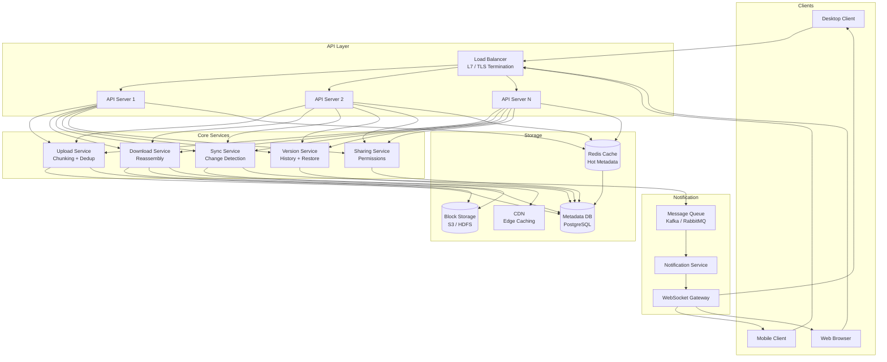
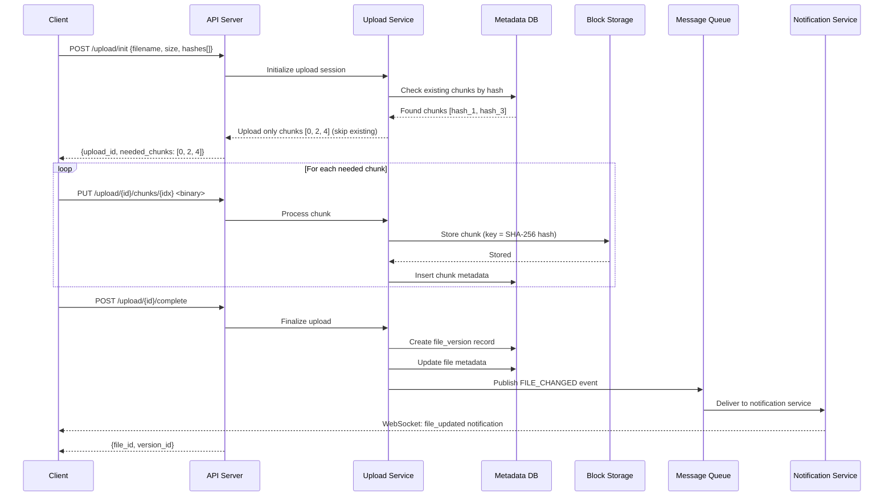
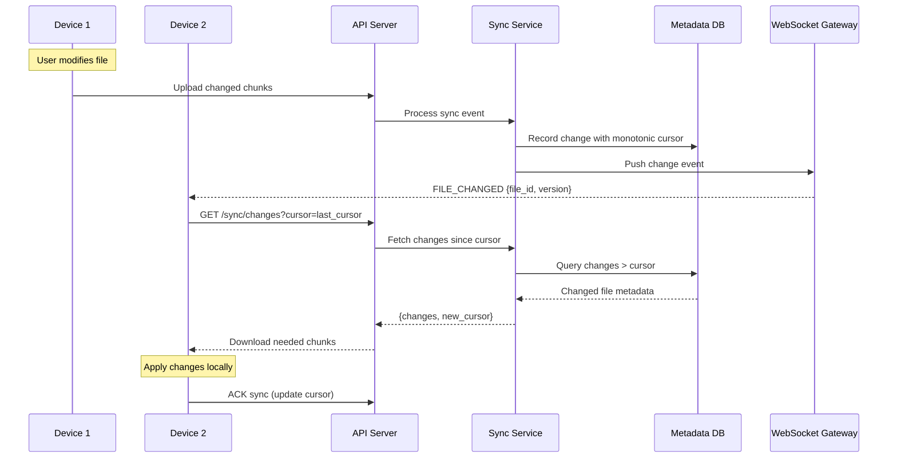

# File Storage System (Dropbox / Google Drive)

## 1. Problem Statement

Design a cloud-based file storage and synchronization service that allows users to upload, download, and sync files across multiple devices. The system must handle large files efficiently through chunking, minimize bandwidth through deduplication and delta sync, support file versioning, and enable secure sharing with granular permissions.

Key challenges:
- **Scale**: Billions of files, petabytes of storage, millions of concurrent users
- **Consistency**: Keeping files in sync across devices with conflict resolution
- **Efficiency**: Minimizing bandwidth and storage through content-addressable chunking
- **Durability**: Ensuring no data loss (11 nines of durability)

---

## 2. Functional Requirements

| ID | Requirement | Description |
|----|------------|-------------|
| FR-1 | **Upload Files** | Users can upload files of any size; large files are chunked into 4MB blocks |
| FR-2 | **Download Files** | Users can download files; chunks are reassembled transparently |
| FR-3 | **Sync Across Devices** | Changes on one device propagate to all linked devices automatically |
| FR-4 | **File Versioning** | Every modification creates a new version; users can view/restore any version |
| FR-5 | **File Sharing** | Users can share files/folders with configurable permissions (view/edit/owner) |
| FR-6 | **Conflict Resolution** | Handle concurrent edits via last-writer-wins or operational merge strategies |
| FR-7 | **Folder Organization** | Hierarchical folder structure with move/rename/delete operations |
| FR-8 | **File Deduplication** | Identical content blocks are stored once using content-addressable hashing |

---

## 3. Non-Functional Requirements

| ID | Requirement | Target |
|----|------------|--------|
| NFR-1 | **Durability** | 99.999999999% (11 nines) -- no data loss |
| NFR-2 | **Sync Latency** | < 500ms notification delivery for file changes |
| NFR-3 | **Large File Support** | Files > 1GB handled efficiently via chunked upload/download |
| NFR-4 | **Bandwidth Optimization** | Delta sync transfers only changed chunks, not entire files |
| NFR-5 | **Availability** | 99.99% uptime for read operations, 99.9% for writes |
| NFR-6 | **Consistency** | Eventual consistency for sync, strong consistency for metadata |
| NFR-7 | **Scalability** | Support 500M users, 10B files, 1EB total storage |
| NFR-8 | **Security** | End-to-end encryption, at-rest encryption, TLS in transit |

---

## 4. Capacity Estimation

### Assumptions

| Parameter | Value |
|-----------|-------|
| Total users | 500 million |
| Daily active users (DAU) | 100 million |
| Avg files per user | 200 |
| Avg file size | 500 KB |
| New uploads per user per day | 2 |
| Avg file versions | 5 |
| Chunk size | 4 MB |

### Storage

```
Total files        = 500M users x 200 files = 100 billion files
Raw storage        = 100B files x 500KB     = 50 PB (petabytes)
With versioning    = 50 PB x 5 versions     = 250 PB
With dedup (~40%)  = 250 PB x 0.6           = 150 PB effective storage
With replication(3x) = 150 PB x 3           = 450 PB raw disk
```

### Daily Throughput

```
Uploads/day        = 100M DAU x 2 uploads   = 200 million uploads/day
Upload bandwidth   = 200M x 500KB           = 100 TB/day ingress
Sync events/day    = 200M uploads x 3 devices = 600M sync notifications/day
QPS (uploads)      = 200M / 86400           ~ 2,300 uploads/sec
Peak QPS           = 2,300 x 3              ~ 7,000 uploads/sec
Metadata reads     = 10x writes             ~ 70,000 QPS
```

### Metadata Storage

```
File metadata      = 100B files x 1KB each  = 100 TB
Chunk index        = 100B files x 10 chunks x 100B = 100 TB
Version metadata   = 500B versions x 200B   = 100 TB
Total metadata     ~ 300 TB
```

---

## 5. API Design

### File Operations

```
POST   /api/v1/files/upload/init
       Body: { filename, file_size, parent_folder_id, content_hash }
       Response: { upload_id, chunk_urls: [...], chunk_size }

PUT    /api/v1/files/upload/{upload_id}/chunks/{chunk_index}
       Body: <binary chunk data>
       Headers: Content-SHA256: <hash>
       Response: { chunk_id, status }

POST   /api/v1/files/upload/{upload_id}/complete
       Body: { chunk_ids: [...] }
       Response: { file_id, version_id, created_at }

GET    /api/v1/files/{file_id}
       Query: ?version_id=<v>
       Response: { file_metadata, download_urls: [...] }

GET    /api/v1/files/{file_id}/download
       Query: ?version_id=<v>&range=bytes=0-4194303
       Response: <binary data> (supports range requests)

DELETE /api/v1/files/{file_id}
       Response: { status, deleted_at }
```

### Sync Operations

```
GET    /api/v1/sync/changes
       Query: ?cursor=<last_sync_cursor>&device_id=<id>
       Response: { changes: [...], next_cursor, has_more }

POST   /api/v1/sync/register
       Body: { device_id, device_name, platform }
       Response: { sync_token }

WS     /api/v1/sync/stream
       Bidirectional WebSocket for real-time sync notifications
```

### Versioning

```
GET    /api/v1/files/{file_id}/versions
       Response: { versions: [{ version_id, created_at, size, author }] }

POST   /api/v1/files/{file_id}/versions/{version_id}/restore
       Response: { new_version_id, status }
```

### Sharing

```
POST   /api/v1/files/{file_id}/share
       Body: { user_id, permission: "view"|"edit"|"owner" }
       Response: { share_id, share_link }

GET    /api/v1/files/{file_id}/shares
       Response: { shares: [{ user_id, permission, shared_at }] }

DELETE /api/v1/files/{file_id}/shares/{share_id}
       Response: { status }
```

---

## 6. Data Model

### Files Table

```sql
CREATE TABLE files (
    file_id         UUID PRIMARY KEY,
    owner_id        UUID NOT NULL REFERENCES users(user_id),
    filename        VARCHAR(255) NOT NULL,
    parent_folder_id UUID REFERENCES files(file_id),
    is_folder       BOOLEAN DEFAULT FALSE,
    current_version INT NOT NULL DEFAULT 1,
    total_size      BIGINT NOT NULL DEFAULT 0,
    content_hash    CHAR(64),              -- SHA-256 of full file
    mime_type       VARCHAR(128),
    status          ENUM('active','deleted','archived'),
    created_at      TIMESTAMP DEFAULT NOW(),
    updated_at      TIMESTAMP DEFAULT NOW(),
    deleted_at      TIMESTAMP NULL,

    INDEX idx_owner_parent (owner_id, parent_folder_id),
    INDEX idx_content_hash (content_hash)
);
```

### Chunks Table (Content-Addressable)

```sql
CREATE TABLE chunks (
    chunk_hash      CHAR(64) PRIMARY KEY,   -- SHA-256 of chunk content
    size            INT NOT NULL,
    ref_count       INT NOT NULL DEFAULT 1, -- reference counting for GC
    storage_tier    ENUM('hot','warm','cold') DEFAULT 'hot',
    storage_path    VARCHAR(512) NOT NULL,   -- path in block storage
    created_at      TIMESTAMP DEFAULT NOW(),

    INDEX idx_storage_tier (storage_tier)
);
```

### File Versions Table

```sql
CREATE TABLE file_versions (
    version_id      UUID PRIMARY KEY,
    file_id         UUID NOT NULL REFERENCES files(file_id),
    version_number  INT NOT NULL,
    chunk_list      JSON NOT NULL,           -- ordered list of chunk_hashes
    total_size      BIGINT NOT NULL,
    content_hash    CHAR(64) NOT NULL,
    author_id       UUID NOT NULL REFERENCES users(user_id),
    change_type     ENUM('create','modify','rename','move'),
    created_at      TIMESTAMP DEFAULT NOW(),

    UNIQUE KEY uk_file_version (file_id, version_number),
    INDEX idx_file_id (file_id)
);
```

### Users Table

```sql
CREATE TABLE users (
    user_id         UUID PRIMARY KEY,
    email           VARCHAR(255) UNIQUE NOT NULL,
    display_name    VARCHAR(128) NOT NULL,
    storage_quota   BIGINT DEFAULT 15737418240,  -- 15 GB
    storage_used    BIGINT DEFAULT 0,
    created_at      TIMESTAMP DEFAULT NOW()
);
```

### Sharing Permissions Table

```sql
CREATE TABLE sharing_permissions (
    share_id        UUID PRIMARY KEY,
    file_id         UUID NOT NULL REFERENCES files(file_id),
    owner_id        UUID NOT NULL REFERENCES users(user_id),
    shared_with_id  UUID NOT NULL REFERENCES users(user_id),
    permission      ENUM('view','edit','owner') NOT NULL,
    share_link      VARCHAR(512) UNIQUE,
    expires_at      TIMESTAMP NULL,
    created_at      TIMESTAMP DEFAULT NOW(),

    UNIQUE KEY uk_file_user (file_id, shared_with_id),
    INDEX idx_shared_with (shared_with_id)
);
```

### Sync Cursors Table

```sql
CREATE TABLE sync_cursors (
    device_id       UUID PRIMARY KEY,
    user_id         UUID NOT NULL REFERENCES users(user_id),
    last_cursor     BIGINT NOT NULL DEFAULT 0,
    last_sync_at    TIMESTAMP DEFAULT NOW(),

    INDEX idx_user_id (user_id)
);
```

### Entity Relationship

```
users 1---* files           (owner)
files 1---* file_versions   (version history)
file_versions *---* chunks  (via chunk_list JSON)
files 1---* sharing_permissions
users 1---* sharing_permissions (shared_with)
users 1---* sync_cursors
```

---

## 7. High-Level Architecture



---

## 8. Detailed Design

### 8.1 Chunking Strategy (4MB Blocks)

The system splits files into fixed-size 4MB chunks for upload, storage, and download:

```
Original File (17 MB)
|----4MB----|----4MB----|----4MB----|----4MB----|--1MB--|
  Chunk 0      Chunk 1    Chunk 2    Chunk 3   Chunk 4

Each chunk:
  chunk_hash = SHA-256(chunk_data)
  chunk_size = min(4MB, remaining_bytes)
```

**Why 4MB?**
- Small enough for efficient retries on failure
- Large enough to minimize metadata overhead
- Aligns with S3 multipart upload minimum (5MB) with slight adjustment
- Good balance for delta sync granularity

### 8.2 Content-Addressable Deduplication

Every chunk is identified by its SHA-256 hash. Before storing a chunk, the system checks if a chunk with the same hash already exists:

```
Upload Flow:
1. Client computes SHA-256 of each chunk
2. Client sends chunk hashes to server
3. Server responds with which chunks already exist
4. Client uploads ONLY new chunks
5. Server increments ref_count for existing chunks

Result: If 1000 users upload the same 100MB file,
        storage used = 100MB (not 100GB)
```

**Deduplication levels:**
- **Cross-user dedup**: Same content across different users stored once
- **Cross-version dedup**: Unchanged chunks between versions are reused
- **Inline dedup**: Checked at upload time (synchronous)

### 8.3 Delta Sync

When a file is modified, only the changed chunks are transferred:

```
Version 1: [Chunk_A, Chunk_B, Chunk_C, Chunk_D]
                              |
            User edits middle section
                              |
Version 2: [Chunk_A, Chunk_B, Chunk_C', Chunk_D]

Only Chunk_C' is uploaded (not the entire file).
Sync payload = 4MB instead of 16MB.
```

**Delta sync protocol:**
1. Client computes rolling hash (Rabin fingerprint) to detect changed regions
2. Client sends list of chunk hashes for the new version
3. Server compares with previous version's chunk list
4. Server requests upload of only missing chunks
5. New version record points to mix of old and new chunks

### 8.4 Conflict Resolution

When two devices modify the same file concurrently:

**Strategy 1: Last-Writer-Wins (LWW)**
```
Device A edits file at T=1, uploads at T=3
Device B edits file at T=2, uploads at T=4
Result: Device B's version wins (later timestamp)
Device A's version saved as a named version for recovery
```

**Strategy 2: Conflict Copy (Dropbox-style)**
```
Device A edits file at T=1, uploads at T=3
Device B edits file at T=2, uploads at T=4
Result: Both versions kept
  - "report.docx" (Device B's version)
  - "report (conflicted copy - Device A - 2024-01-15).docx"
```

**Strategy 3: Operational Transform / CRDT (Google Docs-style)**
```
For text files / collaborative editing:
  - Changes represented as operations (insert, delete)
  - Operations transformed against concurrent operations
  - All devices converge to same state
  - Most complex but best user experience
```

**Our default approach:**
- Use conflict copies for binary files (images, PDFs)
- Use LWW with version history for most files (users can restore)
- Support OT/CRDT for real-time collaborative text editing (opt-in)

---

## 9. Architecture Diagram

### Upload Flow



### Sync Flow



---

## 10. Architectural Patterns

### 10.1 Content-Addressable Storage (CAS)

Data is addressed by its content hash rather than location:

```
Traditional:  file_id -> storage_path -> data
CAS:          SHA-256(data) -> data

Benefits:
- Automatic deduplication (same content = same address)
- Data integrity verification (hash mismatch = corruption)
- Immutable storage (content at a hash never changes)
- Cache-friendly (content at hash is infinitely cacheable)
```

**Implementation**: Each chunk stored at path derived from its SHA-256:
```
s3://file-storage/chunks/ab/cd/abcdef1234567890...
                         ^^ ^^
                    First 2 bytes as directory sharding
```

### 10.2 Event-Driven Sync Architecture

File changes propagate through an event pipeline:

```
File Change -> Change Event -> Message Queue -> Sync Service -> Notification
                  |                                  |
                  v                                  v
            Change Log (CDC)              Device Sync Cursors

Event Types:
  FILE_CREATED, FILE_MODIFIED, FILE_DELETED,
  FILE_MOVED, FILE_RENAMED, FILE_SHARED,
  PERMISSION_CHANGED
```

**Benefits:**
- Decoupled producers/consumers
- Reliable delivery with at-least-once semantics
- Easy to add new consumers (audit, search indexing, etc.)
- Natural ordering via partition keys (per-user)

### 10.3 Optimistic Concurrency Control

Multiple devices can edit without locks; conflicts detected at commit time:

```
1. Device reads file with version_number = 5
2. Device makes local edits
3. Device uploads with expected_version = 5
4. Server checks: current_version == expected_version?
   - YES: Accept, set version = 6
   - NO: Conflict! Apply conflict resolution strategy

SQL: UPDATE files SET current_version = 6
     WHERE file_id = ? AND current_version = 5
     -- Atomic compare-and-swap
```

**Benefits over pessimistic locking:**
- No lock contention for read-heavy workloads
- Better user experience (no "file is locked" errors)
- Works across unreliable networks (offline-first)

---

## 11. Technology Choices

### Block Storage: S3 vs HDFS

| Criteria | Amazon S3 | HDFS |
|----------|-----------|------|
| **Durability** | 11 nines (built-in) | Requires 3x replication config |
| **Scalability** | Virtually unlimited | Namenode bottleneck at scale |
| **Cost** | Pay per use, tiering (Glacier) | Fixed infra cost |
| **Operations** | Fully managed | Requires dedicated ops team |
| **Latency** | ~50-100ms first byte | ~10-20ms (data locality) |
| **Best for** | Cloud-native, variable load | On-premise, predictable load |

**Choice: S3** -- 11-nines durability out of the box, lifecycle policies for cold storage, and no operational overhead. Use S3 Intelligent-Tiering for automatic cost optimization.

### Metadata DB: MySQL vs PostgreSQL

| Criteria | MySQL | PostgreSQL |
|----------|-------|------------|
| **JSON support** | Basic (JSON type) | Advanced (JSONB, indexing) |
| **Partitioning** | Range/Hash/List | Table inheritance + declarative |
| **Replication** | Group Replication | Streaming + Logical |
| **UUID performance** | Poor (clustered index) | Good (heap storage) |
| **Advisory locks** | Yes | Yes (richer API) |

**Choice: PostgreSQL** -- Superior JSON support for chunk_list storage, better UUID handling (our primary key type), and JSONB indexing for metadata queries.

### Sync Mechanism: Change Data Capture (CDC)

```
PostgreSQL WAL -> Debezium CDC -> Kafka -> Sync Consumers

Benefits:
- No application-level event publishing needed
- Captures ALL database changes (even direct SQL)
- Exactly-once semantics with Kafka transactions
- Low overhead on the primary database
```

### Message Queue: Kafka

- **Ordered per partition** (partition by user_id for per-user ordering)
- **Persistent** (replay capability for catch-up sync)
- **High throughput** (millions of events/sec)
- **Consumer groups** (scale sync workers independently)

### Cache: Redis

- **Hot metadata** (frequently accessed file/folder listings)
- **Session tokens** (upload sessions, sync cursors)
- **Pub/Sub** (real-time WebSocket notifications)
- **Rate limiting** (per-user upload/download quotas)

---

## 12. Scalability

### Horizontal Scaling

```
API Servers:       Stateless, auto-scale behind ALB (target: 70% CPU)
Upload Service:    Scale by upload QPS; each instance handles chunking
Download Service:  Scale independently; read-heavy, cacheable
Sync Service:      Scale by Kafka partition count (1 partition = 1 consumer)
Metadata DB:       Read replicas + sharding by user_id
Block Storage:     S3 scales automatically
```

### Sharding Strategy

```
Metadata: Shard by user_id (hash-based)
  - Each shard holds all files for a set of users
  - Cross-user sharing requires cross-shard reads (acceptable)

Chunks: Sharded by chunk_hash (content-addressable)
  - Natural distribution (hash is uniformly distributed)
  - No hotspots from popular files

Sync Events: Partition by user_id in Kafka
  - Per-user ordering guaranteed
  - Scale consumers per partition
```

### CDN Integration

```
Frequently downloaded files -> CDN edge caches
  - Pre-signed URLs with TTL for access control
  - Cache invalidation on file update
  - Geographic distribution reduces latency
  - Offloads 80%+ of download bandwidth from origin
```

---

## 13. Reliability

### Data Durability (11 Nines)

```
Layer 1: S3 stores chunks with 11-nines durability
  - Automatic replication across 3+ AZs
  - Checksums verified on every read/write

Layer 2: Metadata DB with synchronous replication
  - Primary + 2 synchronous replicas
  - WAL archival to S3 for point-in-time recovery

Layer 3: Client-side verification
  - Client computes and verifies chunk hashes
  - End-to-end integrity from upload to download
```

### Failure Handling

```
Upload failure:     Resume from last successful chunk (upload session)
Download failure:   Retry individual chunks (range requests)
Sync failure:       Cursor-based resume (no missed changes)
DB failover:        Automatic promotion of synchronous replica
S3 outage:          Cross-region replication (disaster recovery)
```

### Consistency Guarantees

```
Metadata:     Read-after-write consistency (synchronous replicas)
Sync:         Eventual consistency with causal ordering per user
Uploads:      Atomic commit (all chunks or none)
Sharing:      Immediate for new shares; cached permissions may delay revocation
```

---

## 14. Security

### Encryption

```
At Rest:
  - S3 Server-Side Encryption (SSE-S3 or SSE-KMS)
  - Database: TDE (Transparent Data Encryption)
  - Client-side encryption option for sensitive files

In Transit:
  - TLS 1.3 for all API communication
  - Mutual TLS between internal services
  - WebSocket connections over WSS

Key Management:
  - AWS KMS for encryption keys
  - Per-user keys for client-side encryption
  - Key rotation every 90 days
```

### Access Control

```
Authentication:
  - OAuth 2.0 / OpenID Connect
  - Multi-factor authentication (MFA)
  - Device-level tokens with expiry

Authorization:
  - Role-based (owner, editor, viewer)
  - File-level and folder-level permissions
  - Inherited permissions from parent folders
  - Time-limited sharing links
```

### Audit and Compliance

```
Audit Log:
  - All file operations logged (who, what, when, from where)
  - Immutable audit trail in append-only storage
  - Retention: 7 years for compliance

Compliance:
  - GDPR: Right to erasure (soft delete + scheduled purge)
  - SOC 2: Access controls and monitoring
  - HIPAA: BAA-compliant encryption and access logging
```

---

## 15. Monitoring

### Key Metrics

```
Upload Metrics:
  - upload_latency_p99: < 2s for < 10MB files
  - upload_success_rate: > 99.9%
  - chunk_dedup_ratio: target > 30%
  - upload_throughput_bytes_per_sec

Download Metrics:
  - download_latency_p99: < 500ms (cache hit), < 2s (cache miss)
  - cdn_hit_ratio: > 80%
  - download_throughput_bytes_per_sec

Sync Metrics:
  - sync_notification_latency_p99: < 500ms
  - sync_lag_seconds: < 5s
  - active_websocket_connections
  - sync_conflicts_per_hour

Storage Metrics:
  - total_storage_used_bytes
  - dedup_savings_bytes
  - chunk_ref_count_distribution
  - storage_tier_distribution (hot/warm/cold)
```

### Alerting

```
CRITICAL:
  - Upload success rate < 99%
  - Sync lag > 30 seconds
  - Metadata DB replication lag > 1 second
  - S3 error rate > 0.1%

WARNING:
  - Dedup ratio < 20% (possible hash collision investigation)
  - WebSocket connection count > 80% capacity
  - Upload queue depth > 10,000
  - Storage growth rate > 2x projected
```

### Observability Stack

```
Metrics:    Prometheus + Grafana (dashboards)
Logging:    ELK Stack (structured JSON logs)
Tracing:    Jaeger / OpenTelemetry (distributed tracing across services)
Alerting:   PagerDuty integration with escalation policies
Health:     /health endpoints on all services + synthetic monitoring
```

---

## Summary

This file storage system handles the core challenges of cloud storage through:

1. **Chunking** (4MB blocks) for large file handling and resumable transfers
2. **Content-addressable storage** for automatic deduplication
3. **Delta sync** to minimize bandwidth (only changed chunks transferred)
4. **Event-driven architecture** for real-time sync across devices
5. **Optimistic concurrency** with conflict resolution for concurrent edits
6. **Tiered storage** for cost optimization (hot/warm/cold)
7. **11-nines durability** through S3 replication and client-side verification
