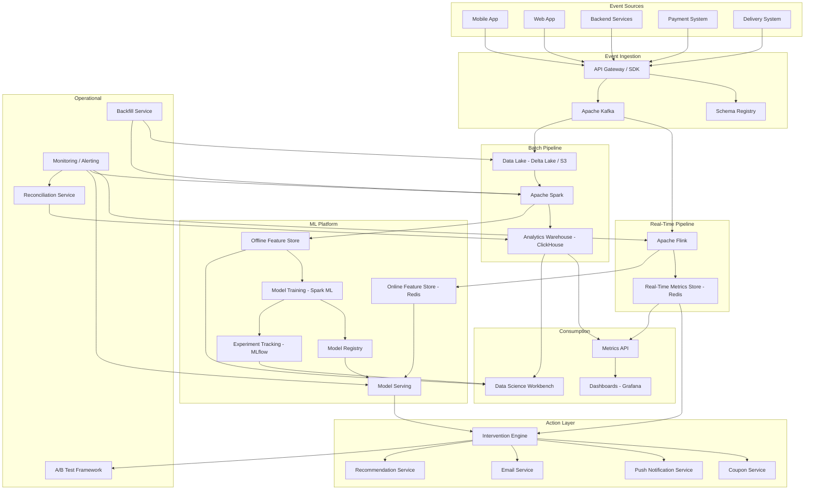
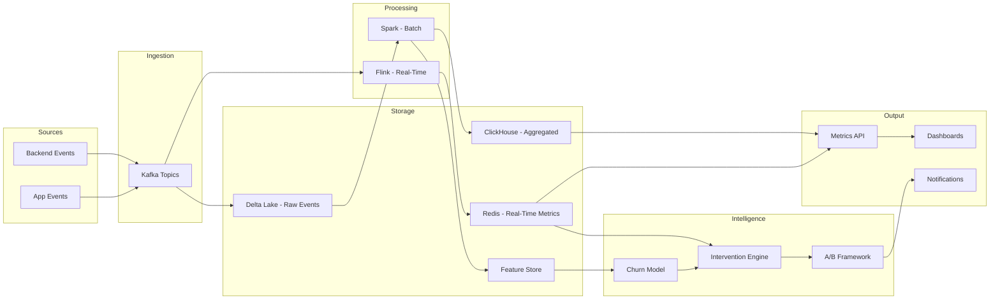
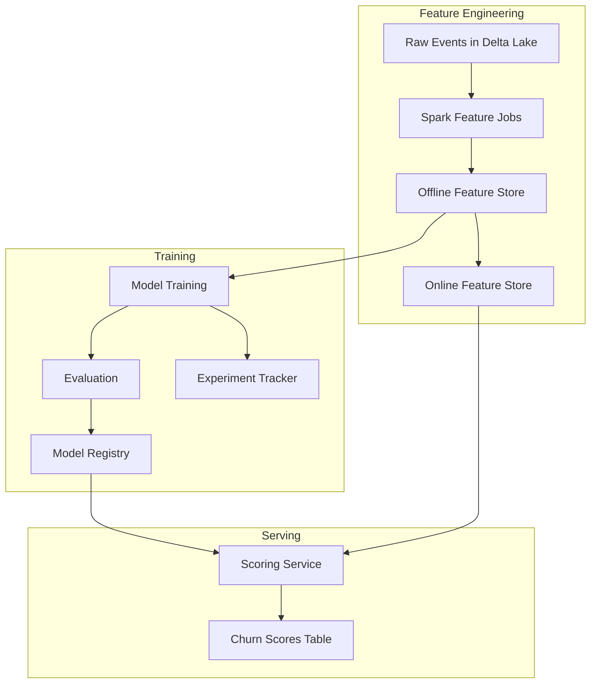
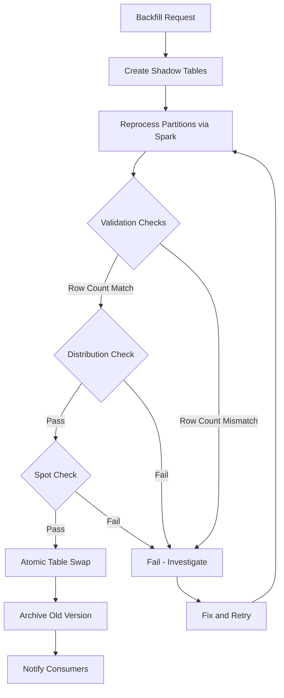
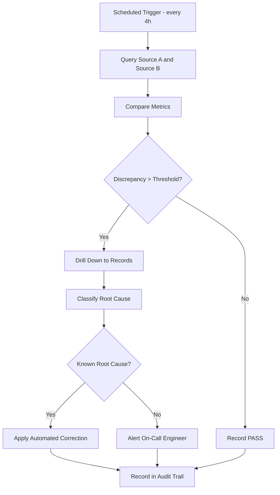

# Food Ordering App User Metrics & Attrition Reduction System

## Table of Contents

1. [Problem Statement](#1-problem-statement)
2. [Functional Requirements](#2-functional-requirements)
3. [Non-Functional Requirements](#3-non-functional-requirements)
4. [Capacity Estimation](#4-capacity-estimation)
5. [API Design](#5-api-design)
6. [Data Model](#6-data-model)
7. [High-Level Architecture](#7-high-level-architecture)
8. [Detailed Design](#8-detailed-design)
9. [Architecture Diagrams](#9-architecture-diagrams)
10. [Architectural Patterns](#10-architectural-patterns)
11. [Technology Choices & Tradeoffs](#11-technology-choices--tradeoffs)
12. [Scalability](#12-scalability)
13. [Reliability](#13-reliability)
14. [Security](#14-security)
15. [Monitoring](#15-monitoring)

---

## 1. Problem Statement

A large food ordering platform is experiencing significant user attrition. Monthly active
users have plateaued and the 90-day retention rate has dropped from 35% to 22% over
the past two quarters. The business lacks:

- **Visibility**: No unified view of user lifecycle metrics. Order data lives in the
  transactional DB, clickstream in a separate analytics store, and delivery feedback in
  a third system. Teams argue over whose numbers are "correct."
- **Understanding**: No cohort analysis or retention curves. Product cannot answer "are
  users who signed up during the holiday promo retaining better than organic signups?"
- **Prediction**: No early warning system. Churn is detected only after the user has
  already left (typically 60+ days of inactivity).
- **Action**: No automated intervention system. Win-back campaigns are manual, infrequent,
  and untargeted. There is no framework to measure whether interventions actually work.
- **Trust**: Periodic discrepancies between the app database order counts and the
  analytics warehouse cause leadership to distrust all reported metrics.

### Goals

1. Build a unified metrics platform that tracks the full user lifecycle from signup
   through churn.
2. Compute actionable user-level and cohort-level metrics in near-real-time.
3. Deploy an ML-based churn prediction model that identifies at-risk users 14-30 days
   before they would otherwise churn.
4. Implement an automated intervention engine that takes data-driven actions (coupons,
   push notifications, personalized recommendations) to retain at-risk users.
5. Provide an A/B testing framework to measure intervention effectiveness with
   statistical rigor.
6. Support backfilling when metric definitions change, without disrupting live dashboards.
7. Detect and reconcile data discrepancies across systems automatically.
8. Integrate with data science workflows (feature store, model registry, experiment
   tracking).

### Success Criteria

| Metric | Current | Target (6 months) |
|---|---|---|
| 90-day retention | 22% | 30% |
| Churn prediction lead time | N/A (reactive) | 14 days |
| Intervention response rate | 2% (manual) | 8% (automated) |
| Metric freshness | T+1 day | < 5 minutes (real-time), T+4 hours (batch) |
| Cross-system order count drift | ~2% | < 0.01% |
| A/B test time to significance | weeks (manual) | automated, daily checks |

---

## 2. Functional Requirements

### 2.1 User Lifecycle Event Tracking

- Capture all user lifecycle events: `signup`, `app_open`, `search`, `add_to_cart`,
  `order_placed`, `order_delivered`, `order_cancelled`, `rating_submitted`,
  `support_ticket`, `coupon_redeemed`, `push_notification_sent`, `push_clicked`,
  `account_deleted`.
- Each event carries: `event_id`, `user_id`, `event_type`, `timestamp`,
  `properties` (JSON), `source_system`, `schema_version`.
- Events are immutable and append-only. Late-arriving events (up to 7 days) must be
  handled correctly.

### 2.2 User-Level Metrics

Compute and store per-user metrics, updated in near-real-time for critical metrics and
daily for derived metrics:

| Metric | Update Frequency | Definition |
|---|---|---|
| Order count (lifetime) | Real-time | Count of `order_delivered` events |
| Order count (last 30 days) | Real-time | Rolling 30-day window |
| Average order value (AOV) | Real-time | total_spent / order_count |
| Total spent (lifetime) | Real-time | Sum of order amounts |
| Days since last order | Real-time | now() - max(order_delivered.timestamp) |
| Time to first order | Once | first_order.timestamp - signup.timestamp |
| Session duration (avg) | Daily | Avg time between app_open and last event in session |
| Reorder rate | Daily | Orders with >= 1 repeat restaurant / total orders |
| Delivery satisfaction score | Daily | Weighted avg of ratings + support tickets |
| Churn risk score | Hourly | ML model output, 0.0 to 1.0 |

### 2.3 Cohort Analysis

- Group users by signup week or signup month.
- Compute retention at week 1, 2, 4, 8, 12 (defined as "placed at least one order in
  that week relative to signup").
- Support filtering cohorts by acquisition channel, geography, first-order category.
- Generate retention curve visualizations (data export for BI tools).

### 2.4 Churn Prediction

- Train an ML model using features: recency, frequency, monetary value, delivery
  issues count, support tickets, session frequency trend, time since last order,
  order frequency trend, coupon redemption rate.
- Produce a churn risk score (0.0 = definitely staying, 1.0 = definitely churning)
  for every active user, refreshed hourly.
- Categorize users: Low risk (< 0.3), Medium risk (0.3 - 0.7), High risk (> 0.7).
- Model retraining pipeline runs weekly with fresh data.

### 2.5 Automated Interventions

- Rule-based triggers:
  - High churn risk (> 0.7) and no order in 7+ days: issue 20% coupon.
  - Medium churn risk (0.3-0.7) and declining order frequency: send push notification
    with personalized restaurant recommendation.
  - Low AOV users with 5+ orders: suggest bundle deals.
  - New user with no order in 3 days after signup: send onboarding push.
- ML-based triggers:
  - Optimal intervention timing model (predict when user is most likely to open app).
  - Personalized offer selection model (predict which coupon value maximizes retention
    without over-discounting).
- Track intervention outcomes: coupon redemption, order within 7 days, retention at
  30 days post-intervention.

### 2.6 A/B Testing Framework

- Create experiments with control and one or more treatment variants.
- Assign users to variants using deterministic hashing (user_id + experiment_id).
- Collect primary metric (e.g., 7-day order rate) and guardrail metrics (e.g., AOV
  does not drop, support tickets do not increase).
- Compute statistical significance using both frequentist (z-test for proportions) and
  Bayesian (Beta-Binomial model) approaches.
- Automatic early stopping if guardrail metrics are violated.
- Support for sequential testing to avoid peeking problems.

### 2.7 Backfilling

- When a metric definition changes (e.g., "active user" redefined from "ordered in
  last 30 days" to "ordered or opened app in last 30 days"), reprocess historical
  events through the updated pipeline.
- Partition-based reprocessing: recompute only affected date partitions.
- Version all metric snapshots (v1, v2, ...) so historical comparisons remain valid.
- Validate backfilled data (row counts, distribution checks, sample spot-checks)
  before swapping into production tables.
- Zero-downtime swap: write to shadow tables, validate, atomic rename.

### 2.8 Bug Detection & Data Reconciliation

- Scheduled reconciliation jobs compare:
  - Order counts: app transactional DB vs. analytics warehouse vs. metrics store.
  - Revenue totals: payment system vs. analytics.
  - User counts: auth system vs. metrics store.
- Flag discrepancies exceeding configurable thresholds (default: 0.01%).
- Generate a correction report with specific mismatched records.
- Automated correction workflow for known root causes (e.g., late-arriving events).
- Full audit trail of all corrections.

### 2.9 Data Science Integration

- **Feature Store**: Online store (Redis/DynamoDB) for low-latency serving during
  real-time scoring. Offline store (Delta Lake/Parquet) for batch training.
  Point-in-time correct feature retrieval to prevent data leakage.
- **Experiment Tracking**: MLflow-style tracking of model parameters, metrics,
  artifacts for every training run.
- **Model Registry**: Versioned model storage with staging/production promotion
  workflow. Automatic rollback if production model degrades.
- **Statistical Engine**: Reusable A/B test analysis library supporting z-test,
  t-test, chi-squared, Mann-Whitney U, and Bayesian posterior computation.

---

## 3. Non-Functional Requirements

| Requirement | Target |
|---|---|
| Real-time metric latency | < 5 minutes from event to queryable metric |
| Batch aggregation latency | < 4 hours for full daily recomputation |
| User scale | 50 million registered users, 10 million MAU |
| Order throughput | 10 million orders/day (peak: 50K orders/minute at lunch) |
| Event throughput | 500 million events/day (clickstream + backend) |
| Data accuracy | > 99.99% (reconciled) |
| Metric query latency | p50 < 50ms, p99 < 500ms |
| System availability | 99.95% (metrics pipeline), 99.99% (intervention engine) |
| Data retention | Raw events: 2 years, Aggregated metrics: 5 years, PII: per GDPR |
| Backfill speed | Full 90-day backfill in < 6 hours |
| Reconciliation frequency | Every 4 hours |

---

## 4. Capacity Estimation

### 4.1 Event Ingestion

```
Events per day:     500,000,000
Events per second:  ~5,800 (avg), ~30,000 (peak, assuming 5x burst)
Avg event size:     500 bytes (JSON, compressed ~200 bytes)
Daily raw volume:   500M * 500B = 250 GB/day (uncompressed)
                    500M * 200B = 100 GB/day (compressed)
Monthly raw volume: ~3 TB (compressed)
Yearly raw volume:  ~36 TB (compressed)
```

### 4.2 Metrics Storage

```
User metrics snapshot (daily):
  50M users * 200 bytes/user = 10 GB/day
  Monthly: 300 GB
  Yearly: 3.6 TB

Cohort metrics:
  ~200 cohorts * 12 retention points * 100 bytes = 240 KB/day (negligible)

Churn scores (hourly):
  10M active users * 50 bytes = 500 MB/hour = 12 GB/day

Feature store (online):
  10M active users * 500 bytes (feature vector) = 5 GB (in-memory)

Feature store (offline):
  50M users * 2KB (full feature history) * 365 days = 36 TB/year
```

### 4.3 Compute

```
Streaming (Flink):
  5,800 events/sec avg -> 4-8 task managers, 16 cores each
  Peak handling: auto-scale to 20 task managers

Batch (Spark):
  Daily aggregation over 500M events: ~30 min on 50-node cluster
  Weekly model training: ~2 hours on 20-node GPU cluster
  90-day backfill: ~6 hours on 100-node cluster

ML Inference:
  10M users * hourly scoring = ~2,800 inferences/sec
  Model latency: < 10ms -> 4-8 inference servers
```

### 4.4 Network

```
Kafka ingestion: 250 GB/day = ~25 Mbps sustained, ~125 Mbps peak
Cross-region replication: 2x ingestion = ~50 Mbps sustained
API serving: 10K queries/sec * 1KB avg response = ~80 Mbps
```

---

## 5. API Design

### 5.1 Metrics Query API

```
GET /api/v1/users/{user_id}/metrics
  Response: { user_id, order_count, aov, days_since_last_order, churn_risk, ... }

GET /api/v1/users/{user_id}/metrics/history?from=2024-01-01&to=2024-03-01&granularity=daily
  Response: { user_id, snapshots: [{ date, order_count, aov, ... }, ...] }

GET /api/v1/cohorts?signup_week=2024-W05&metric=retention
  Response: { cohort: "2024-W05", size: 12500, retention: { w1: 0.65, w2: 0.45, ... } }

GET /api/v1/metrics/aggregate?metric=aov&segment=city:NYC&granularity=daily
  Response: { metric: "aov", data: [{ date, value, count }, ...] }

POST /api/v1/metrics/query
  Body: { metrics: ["order_count", "aov"], filters: { city: "NYC", cohort: "2024-W05" },
          group_by: ["acquisition_channel"], time_range: { from, to } }
  Response: { results: [{ group, metrics: { order_count, aov } }] }
```

### 5.2 Intervention API

```
POST /api/v1/interventions/trigger
  Body: { user_id, intervention_type: "coupon", params: { discount_pct: 20, expiry_days: 7 } }
  Response: { intervention_id, status: "dispatched" }

GET /api/v1/interventions/{intervention_id}/outcome
  Response: { intervention_id, redeemed: true, order_within_7d: true, retained_30d: true }

GET /api/v1/users/{user_id}/interventions
  Response: { interventions: [{ id, type, dispatched_at, outcome }, ...] }
```

### 5.3 Backfill API

```
POST /api/v1/backfill/jobs
  Body: { metric: "user_activity_score", version: "v2", date_range: { from, to },
          reason: "Redefined active to include app_open events" }
  Response: { job_id, status: "queued", estimated_duration: "4h" }

GET /api/v1/backfill/jobs/{job_id}
  Response: { job_id, status: "running", progress: 0.45, partitions_done: 45,
              partitions_total: 100, validation: null }

POST /api/v1/backfill/jobs/{job_id}/validate
  Response: { job_id, validation: { row_count_match: true, distribution_check: "pass",
              sample_spot_check: "pass" } }

POST /api/v1/backfill/jobs/{job_id}/swap
  Response: { job_id, status: "swapped", old_version: "v1", new_version: "v2" }
```

### 5.4 Reconciliation API

```
POST /api/v1/reconciliation/runs
  Body: { sources: ["app_db", "analytics_warehouse"], metric: "order_count",
          date: "2024-03-15" }
  Response: { run_id, status: "running" }

GET /api/v1/reconciliation/runs/{run_id}
  Response: { run_id, status: "completed", summary: { source_a_count: 1234567,
              source_b_count: 1234589, discrepancy: 22, discrepancy_pct: 0.0018,
              threshold_pct: 0.01, result: "PASS" },
              mismatched_records: [{ order_id, source_a: "present", source_b: "missing" }] }

GET /api/v1/reconciliation/history?days=30
  Response: { runs: [{ run_id, date, result, discrepancy_pct }, ...] }
```

### 5.5 A/B Test API

```
POST /api/v1/experiments
  Body: { name: "win_back_coupon_value", variants: [
            { name: "control", weight: 0.5 },
            { name: "20pct_coupon", weight: 0.25 },
            { name: "30pct_coupon", weight: 0.25 }
          ], primary_metric: "7d_order_rate",
          guardrail_metrics: ["aov", "support_tickets"],
          target_sample_size: 10000 }
  Response: { experiment_id, status: "running" }

GET /api/v1/experiments/{experiment_id}/results
  Response: { experiment_id, variants: [
    { name: "control", sample_size: 5000, primary_metric: 0.12, ci_95: [0.10, 0.14] },
    { name: "20pct_coupon", sample_size: 2500, primary_metric: 0.18, ci_95: [0.15, 0.21],
      lift: 0.50, p_value: 0.003, significant: true },
    ...
  ], guardrails: { aov: "pass", support_tickets: "pass" } }

POST /api/v1/experiments/{experiment_id}/stop
  Body: { reason: "guardrail_violation", details: "AOV dropped 15% in treatment" }
```

---

## 6. Data Model

### 6.1 Events (append-only, partitioned by date)

```sql
CREATE TABLE events (
    event_id        UUID PRIMARY KEY,
    user_id         BIGINT NOT NULL,
    event_type      VARCHAR(50) NOT NULL,   -- signup, order_placed, order_delivered, ...
    timestamp       TIMESTAMP NOT NULL,
    properties      JSONB,                  -- { order_id, amount, restaurant_id, ... }
    source_system   VARCHAR(30),            -- app, backend, payment, delivery
    schema_version  INT DEFAULT 1,
    ingested_at     TIMESTAMP DEFAULT NOW(),
    processing_time TIMESTAMP               -- for watermark handling
) PARTITION BY RANGE (timestamp);
```

### 6.2 User Metrics (daily snapshot, SCD Type 2)

```sql
CREATE TABLE user_metrics_daily (
    user_id                 BIGINT NOT NULL,
    metric_date             DATE NOT NULL,
    metric_version          INT DEFAULT 1,
    order_count_lifetime    INT,
    order_count_30d         INT,
    total_spent_lifetime    DECIMAL(12,2),
    avg_order_value         DECIMAL(8,2),
    days_since_last_order   INT,
    time_to_first_order_hrs DECIMAL(8,2),
    session_count_30d       INT,
    avg_session_duration_s  INT,
    reorder_rate            DECIMAL(5,4),
    delivery_satisfaction   DECIMAL(3,2),     -- 0.0 to 5.0
    churn_risk_score        DECIMAL(5,4),     -- 0.0 to 1.0
    risk_category           VARCHAR(10),      -- low, medium, high
    PRIMARY KEY (user_id, metric_date, metric_version)
);
```

### 6.3 Cohort Metrics

```sql
CREATE TABLE cohort_metrics (
    cohort_id           VARCHAR(20),         -- "2024-W05" or "2024-03"
    cohort_type         VARCHAR(10),         -- weekly, monthly
    cohort_size         INT,
    retention_week_1    DECIMAL(5,4),
    retention_week_2    DECIMAL(5,4),
    retention_week_4    DECIMAL(5,4),
    retention_week_8    DECIMAL(5,4),
    retention_week_12   DECIMAL(5,4),
    avg_ltv             DECIMAL(10,2),
    avg_orders          DECIMAL(6,2),
    computed_at         TIMESTAMP,
    PRIMARY KEY (cohort_id, cohort_type)
);
```

### 6.4 Churn Scores

```sql
CREATE TABLE churn_scores (
    user_id         BIGINT NOT NULL,
    scored_at       TIMESTAMP NOT NULL,
    model_version   VARCHAR(20),
    risk_score      DECIMAL(5,4),
    risk_category   VARCHAR(10),
    top_risk_factors JSONB,                  -- [{"feature": "days_since_order", "value": 21, ...}]
    PRIMARY KEY (user_id, scored_at)
);
```

### 6.5 Interventions

```sql
CREATE TABLE interventions (
    intervention_id     UUID PRIMARY KEY,
    user_id             BIGINT NOT NULL,
    intervention_type   VARCHAR(30),         -- coupon, push_notification, email, bundle
    trigger_reason      VARCHAR(50),         -- high_churn_risk, inactive_7d, low_aov
    params              JSONB,               -- { discount_pct: 20, message: "...", ... }
    experiment_id       UUID,                -- NULL if not part of an experiment
    variant             VARCHAR(30),
    dispatched_at       TIMESTAMP,
    outcome_redeemed    BOOLEAN,
    outcome_order_7d    BOOLEAN,
    outcome_retained_30d BOOLEAN,
    outcome_recorded_at  TIMESTAMP
);
```

### 6.6 Experiments

```sql
CREATE TABLE experiments (
    experiment_id       UUID PRIMARY KEY,
    name                VARCHAR(100),
    status              VARCHAR(20),         -- draft, running, stopped, completed
    variants            JSONB,               -- [{ name, weight, description }]
    primary_metric      VARCHAR(50),
    guardrail_metrics   JSONB,               -- ["aov", "support_tickets"]
    target_sample_size  INT,
    created_at          TIMESTAMP,
    started_at          TIMESTAMP,
    stopped_at          TIMESTAMP,
    stop_reason         VARCHAR(200)
);

CREATE TABLE experiment_assignments (
    experiment_id   UUID NOT NULL,
    user_id         BIGINT NOT NULL,
    variant         VARCHAR(30),
    assigned_at     TIMESTAMP,
    PRIMARY KEY (experiment_id, user_id)
);

CREATE TABLE experiment_metrics (
    experiment_id   UUID NOT NULL,
    variant         VARCHAR(30),
    metric_name     VARCHAR(50),
    metric_value    DECIMAL(10,4),
    sample_size     INT,
    computed_at     TIMESTAMP
);
```

### 6.7 Reconciliation

```sql
CREATE TABLE reconciliation_runs (
    run_id          UUID PRIMARY KEY,
    source_a        VARCHAR(50),
    source_b        VARCHAR(50),
    metric          VARCHAR(50),
    run_date        DATE,
    source_a_value  BIGINT,
    source_b_value  BIGINT,
    discrepancy     BIGINT,
    discrepancy_pct DECIMAL(8,6),
    threshold_pct   DECIMAL(8,6),
    result          VARCHAR(10),             -- PASS, FAIL
    mismatched_ids  JSONB,
    correction_applied BOOLEAN DEFAULT FALSE,
    run_at          TIMESTAMP
);
```

---

## 7. High-Level Architecture



---

## 8. Detailed Design

### 8.1 Event Collection

**Clickstream Events** are captured by a lightweight SDK embedded in the mobile and
web apps. The SDK batches events locally (up to 10 seconds or 50 events) and sends
them to the API Gateway over HTTPS. Each event is validated against the Schema
Registry before being written to Kafka.

**Backend Events** (order_placed, order_delivered, payment_completed) are emitted by
microservices via a shared event library that publishes directly to Kafka. These
events are the source of truth for transactional data.

**Schema Registry** (Confluent Schema Registry with Avro):
- Every event type has a registered schema with required and optional fields.
- Schema evolution rules: fields can be added (with defaults) but not removed or
  renamed. This ensures backward compatibility.
- Events failing validation are routed to a dead-letter topic for investigation.

**Event Validation Pipeline**:
1. Parse JSON payload.
2. Validate against schema (type checks, required fields, enum values).
3. Check `user_id` exists in user registry (async lookup, cache-backed).
4. Check `timestamp` is within acceptable window (not in the future, not older than
   7 days).
5. Deduplicate using `event_id` (idempotency key) via a Bloom filter + Redis set.
6. Route valid events to appropriate Kafka topic (`events.orders`, `events.clickstream`,
   `events.delivery`).

### 8.2 Real-Time Pipeline

**Technology**: Apache Flink with event-time processing and watermarks.

**Processing Steps**:
1. Consume from Kafka topics.
2. Key by `user_id`.
3. Maintain per-user state:
   - Running order count (lifetime and 30-day sliding window).
   - Running total spent.
   - Last order timestamp.
   - Session tracker (app_open starts session, 30-min inactivity closes it).
4. Emit updated metrics to Redis (write-through).
5. Emit aggregated events to a Kafka "metrics changelog" topic for downstream
   consumers.

**Windowing Strategy**:
- Tumbling windows (1 minute) for live conversion funnels.
- Sliding windows (30 days, sliding by 1 day) for rolling metrics.
- Session windows (30-minute gap) for session duration computation.

**Watermarks**: Allow 5-minute late arrivals in the streaming layer. Events arriving
later than 5 minutes are processed in the next batch cycle. Events more than 7 days
late are routed to a special "late arrivals" topic for manual review.

**Exactly-Once Semantics**: Flink checkpoints to S3 every 60 seconds. Kafka consumer
uses read-committed isolation. Redis writes are idempotent (SET with version check).

### 8.3 Batch Pipeline

**Technology**: Apache Spark on a daily schedule (4:00 AM UTC) with Delta Lake as the
storage layer.

**Daily Jobs**:

1. **Raw Event Compaction**: Compact hourly Kafka exports into daily Parquet partitions
   in Delta Lake. Merge late-arriving events.

2. **User Metrics Aggregation**: For each user, compute all daily metrics from the raw
   event history. Output: `user_metrics_daily` table.

3. **Cohort Analysis**: Group users by signup week/month. For each cohort, compute
   retention at each milestone (week 1, 2, 4, 8, 12). Join with order events to
   determine if each user was "active" in each period.

4. **LTV Calculation**: For each user, compute customer lifetime value using:
   ```
   LTV = (avg_order_value * orders_per_month * gross_margin) * expected_lifetime_months
   ```
   Expected lifetime is estimated from the survival curve of the user's cohort.

5. **Feature Engineering**: Compute ML features for churn prediction:
   - Recency: days since last order.
   - Frequency: orders in last 30/60/90 days.
   - Monetary: total spent in last 30/60/90 days, AOV trend.
   - Engagement: sessions in last 7/30 days, session duration trend.
   - Satisfaction: avg rating, support ticket count, cancelled order count.
   - Behavioral: favorite cuisine, order time patterns, device type.
   Output: Feature store (offline).

6. **Feature Store Sync**: Push latest features from offline store to online store
   (Redis) for real-time model serving.

### 8.4 Churn Prediction

**Feature Engineering** (detailed):

| Feature | Description | Window |
|---|---|---|
| days_since_last_order | Recency signal | Point-in-time |
| order_count_7d/30d/90d | Frequency at multiple windows | Rolling |
| total_spent_30d/90d | Monetary value | Rolling |
| aov_trend | Linear regression slope of AOV over last 5 orders | Last 5 orders |
| session_count_7d/30d | App engagement | Rolling |
| session_duration_trend | Is user spending less time? | Last 10 sessions |
| delivery_issue_count_30d | Bad experiences | Rolling |
| support_ticket_count_30d | Frustration signal | Rolling |
| cancelled_order_count_30d | Intent without completion | Rolling |
| coupon_redemption_rate | Price sensitivity | Lifetime |
| days_since_signup | User maturity | Point-in-time |
| favorite_cuisine_diversity | Exploration vs. habit | Lifetime |

**Model Training Pipeline**:
1. Pull features from offline feature store (point-in-time correct join to prevent
   leakage).
2. Label: user churned = no order in 30 days following the feature snapshot date.
3. Train gradient-boosted tree (XGBoost) with hyperparameter tuning.
4. Evaluate on held-out test set: AUC-ROC > 0.85, precision@top10% > 0.60.
5. Log metrics to experiment tracker.
6. Register model in model registry if it beats the current production model.
7. A/B test new model vs. old model before full rollout.

**Real-Time Scoring**:
1. Intervention engine or API requests churn score for a user.
2. Model serving endpoint fetches features from online feature store (Redis).
3. Run inference (< 10ms latency).
4. Return risk score and top contributing features (for explainability).

### 8.5 Intervention Engine

**Architecture**: Event-driven service consuming from the "churn scores" topic and
the "user metrics changelog" topic.

**Rule Engine**:
```
RULE high_churn_inactive:
  WHEN churn_risk > 0.7 AND days_since_last_order > 7
  AND last_intervention_days_ago > 14       -- cooldown
  AND intervention_count_30d < 3            -- fatigue limit
  THEN issue_coupon(discount=20%, expiry=7d)

RULE medium_churn_declining:
  WHEN churn_risk BETWEEN 0.3 AND 0.7
  AND order_frequency_trend < -0.2          -- declining
  AND last_intervention_days_ago > 7
  THEN send_push(type=restaurant_recommendation, personalized=true)

RULE new_user_no_order:
  WHEN days_since_signup BETWEEN 1 AND 3
  AND order_count == 0
  THEN send_push(type=onboarding, message="Your first order is 50% off!")

RULE low_aov_loyal:
  WHEN order_count > 5 AND avg_order_value < 15.00
  THEN send_push(type=bundle_suggestion)
```

**Intervention Dispatch**:
1. Rule engine matches user state to rules.
2. If user is in an active experiment, route to A/B test framework for variant
   assignment.
3. Dispatch intervention via appropriate channel (coupon service, push notification
   service, email service).
4. Record intervention in the interventions table.
5. Schedule outcome tracking (check at +7d and +30d).

**Anti-Fatigue Controls**:
- Maximum 3 interventions per user per 30-day rolling window.
- Minimum 7-day cooldown between interventions of the same type.
- Minimum 3-day cooldown between any interventions.
- Users who have explicitly opted out receive no push notifications.

### 8.6 Backfilling

**Motivation**: Metric definitions evolve. When "active user" is redefined, all
historical values must be recomputed to maintain consistency.

**Backfill Workflow**:

1. **Initiate**: Data engineer submits backfill job via API with metric name, new
   version, date range, and reason.

2. **Shadow Tables**: Create shadow versions of target tables with the new metric
   version tag:
   ```
   user_metrics_daily_v2_shadow
   ```

3. **Reprocess**: Spark job replays raw events from Delta Lake through the updated
   metric computation logic. Process partition-by-partition (one day at a time) to
   allow incremental progress and resumability.

4. **Validate**:
   - Row count match: shadow table has same number of rows as production.
   - Distribution check: mean and stddev of key metrics are within 20% of original
     (unless the definition change is expected to shift them).
   - Sample spot-check: randomly sample 1000 users and manually verify 10.
   - Regression test: run a suite of known-answer tests (specific users with known
     expected values).

5. **Swap**: Atomic rename of shadow table to production table. Old version is
   archived (not deleted) for historical comparison.

6. **Notify**: Alert data consumers that metric version has changed. Update
   dashboard annotations.

**Resumability**: Each partition records its completion status. If the job fails, it
resumes from the last incomplete partition.

### 8.7 Bug Detection & Reconciliation

**Cross-System Checks** (run every 4 hours):

| Check | Source A | Source B | Metric |
|---|---|---|---|
| Order count | App PostgreSQL | ClickHouse | COUNT(orders) by date |
| Revenue | Payment service ledger | ClickHouse | SUM(amount) by date |
| User count | Auth service | Metrics store | COUNT(DISTINCT user_id) |
| Event count | Kafka offset | Delta Lake row count | Event count by date |

**Reconciliation Algorithm**:
1. Query both sources for the same metric and date range.
2. Compute absolute and percentage discrepancy.
3. If discrepancy > threshold:
   a. Drill down to identify specific mismatched records (e.g., order_ids present in
      source A but missing in source B).
   b. Classify root cause: late-arriving event, duplicate, processing failure,
      schema mismatch.
   c. For known root causes, apply automated correction:
      - Late-arriving events: trigger re-ingestion.
      - Duplicates: deduplicate and update.
   d. For unknown root causes: create alert for on-call engineer.
4. Record reconciliation run result and correction actions in audit table.

**Correction Workflow**:
- All corrections are applied as "correction events" (not in-place updates) to
  maintain the audit trail.
- Corrections include the original value, corrected value, reason, and approver.
- Dashboard shows "reconciliation health" trend over time.

### 8.8 Data Science Integration

**Feature Store** (Feast-style):

- **Feature Definitions**: Declared in code (Python) with schema, data source, and
  transformation logic. Version-controlled.
  ```python
  user_order_features = FeatureView(
      name="user_order_features",
      entities=["user_id"],
      schema=[
          Field("order_count_30d", Int64),
          Field("total_spent_30d", Float64),
          Field("aov_trend", Float64),
      ],
      source=SparkSource(table="user_features_daily"),
      ttl=timedelta(days=1),
  )
  ```

- **Offline Store** (Delta Lake): Used for model training. Supports point-in-time
  joins to prevent data leakage:
  ```python
  training_df = store.get_historical_features(
      entity_df=entities_with_timestamps,
      features=["user_order_features:order_count_30d", ...],
  )
  ```

- **Online Store** (Redis): Used for real-time inference. Materialized from offline
  store on a schedule (every 30 minutes).
  ```python
  features = store.get_online_features(
      entity_rows=[{"user_id": 12345}],
      features=["user_order_features:order_count_30d", ...],
  )
  ```

**Experiment Tracking** (MLflow-style):
- Every training run logs:
  - Parameters: learning_rate, max_depth, num_trees, feature_set_version.
  - Metrics: AUC-ROC, precision, recall, F1, log_loss, calibration error.
  - Artifacts: trained model file, feature importance plot, confusion matrix.
- Runs are grouped by experiment (e.g., "churn_prediction_v3").
- Best run can be promoted to model registry.

**Model Registry**:
- Models have stages: Development, Staging, Production, Archived.
- Promotion from Staging to Production requires:
  1. AUC-ROC >= production model AUC-ROC.
  2. Calibration error < 0.05.
  3. A/B test showing no regression in downstream metrics.
- Automatic rollback: if intervention conversion rate drops >10% within 24 hours of
  model deployment, revert to previous model.

### 8.9 A/B Testing

**Experiment Assignment**:
- Deterministic: `variant = hash(user_id + experiment_id) % total_weight`
- Ensures consistent assignment (same user always sees same variant).
- Supports mutual exclusion groups (user can only be in one experiment from a group).

**Metric Collection**:
- Primary metric: defined per experiment (e.g., 7-day order rate, 30-day retention).
- Guardrail metrics: global set (AOV, support tickets, cancellation rate) plus
  experiment-specific guardrails.
- Metrics are computed daily per variant.

**Statistical Analysis**:

*Frequentist (z-test for proportions)*:
```
z = (p_treatment - p_control) / sqrt(p_pooled * (1 - p_pooled) * (1/n_t + 1/n_c))
p_value = 2 * (1 - norm_cdf(abs(z)))
significant = p_value < 0.05
```

*Bayesian (Beta-Binomial)*:
```
Prior: Beta(1, 1) (uninformative)
Posterior_control:  Beta(1 + successes_c, 1 + failures_c)
Posterior_treatment: Beta(1 + successes_t, 1 + failures_t)
P(treatment > control) = Monte Carlo estimate from posterior samples
```

**Sequential Testing**: Uses alpha-spending function (O'Brien-Fleming) to allow
periodic peeking without inflating false positive rate. Maximum of 5 interim
analyses.

**Guardrail Monitoring**: If any guardrail metric degrades by more than a configurable
threshold (default: 5%) with p-value < 0.01, the experiment is automatically stopped.

---

## 9. Architecture Diagrams

### 9.1 Overall Data Flow



### 9.2 Churn Prediction Pipeline



### 9.3 Backfill Workflow



### 9.4 Reconciliation Flow



---

## 10. Architectural Patterns

### 10.1 Lambda / Kappa Hybrid

We use a **hybrid approach**:
- **Kappa** (streaming-first) for real-time user metrics: Flink processes the Kafka
  stream and maintains materialized views in Redis. This is the single source of truth
  for "live" metrics.
- **Lambda** (batch layer) for complex aggregations that are difficult or expensive to
  compute in streaming: cohort analysis, LTV, ML feature engineering. The batch layer
  reads from the data lake and overwrites the serving layer (ClickHouse) daily.

**Why hybrid?** Pure Kappa is elegant but impractical for complex windowed aggregations
over 90 days of history for 50M users. Pure Lambda has the dual-codebase problem,
which we mitigate by using the same metric computation library in both Flink and Spark
(shared Python/Scala module).

### 10.2 Event Sourcing

All state changes are captured as immutable events in Kafka/Delta Lake. The current
state of any user's metrics can be reconstructed by replaying their events. This
enables:
- **Backfilling**: Replay events through updated logic.
- **Debugging**: Trace exactly which events produced a given metric value.
- **Auditing**: Complete history of all user interactions.

### 10.3 CQRS (Command Query Responsibility Segregation)

- **Write path**: Events flow through Kafka into the processing pipelines. The
  pipelines compute metrics and write to the serving stores.
- **Read path**: APIs and dashboards query from optimized read stores (Redis for
  real-time, ClickHouse for historical). The read stores are eventually consistent
  with the write path (< 5 minutes for real-time, < 4 hours for batch).

### 10.4 Feature Store Pattern

Separates feature computation from feature consumption:
- Features are computed once (in batch or streaming) and stored centrally.
- Multiple consumers (churn model, recommendation model, intervention rules) all
  read from the same feature store, ensuring consistency.
- Online/offline split prevents training-serving skew.

### 10.5 Experiment-Driven Development

Every significant change (new intervention rule, new model version, new metric
definition) is deployed behind an experiment:
- New intervention strategy: A/B tested before full rollout.
- New churn model: shadow-scored alongside production model; promoted only if metrics
  improve.
- New metric definition: backfilled in shadow tables; compared against old definition
  before swap.

### 10.6 Reconciliation Pattern

Treat reconciliation as a first-class system concern, not an afterthought:
- Scheduled, automated cross-system checks.
- Discrepancies are surfaced proactively (not discovered during board meetings).
- Correction events maintain audit trails.
- Reconciliation health is a key operational metric.

### 10.7 Slowly Changing Dimensions (SCD Type 2)

User metrics snapshots are versioned by date and metric_version. This allows:
- Querying "what was this user's churn risk on March 1st?"
- Comparing metric values before and after a definition change.
- Historical trend analysis that is not retroactively altered.

---

## 11. Technology Choices & Tradeoffs

### Event Streaming: Kafka vs. Kinesis

| Factor | Kafka | Kinesis |
|---|---|---|
| Throughput | Higher (millions/sec per cluster) | Limited by shard count |
| Retention | Configurable (days to infinite with tiered storage) | Max 365 days |
| Ecosystem | Richer (Connect, Streams, Schema Registry) | Tighter AWS integration |
| Operations | Self-managed or Confluent Cloud | Fully managed |
| Cost at scale | Lower (especially self-managed) | Higher at 500M events/day |

**Decision**: Kafka. At 500M events/day, Kinesis shard costs become prohibitive.
Kafka's ecosystem (Schema Registry, Connect) reduces integration effort.

### Stream Processing: Flink vs. Spark Structured Streaming

| Factor | Flink | Spark Structured Streaming |
|---|---|---|
| Latency | True streaming (ms-level) | Micro-batch (100ms-seconds) |
| State management | Built-in, RocksDB-backed | Requires external state store |
| Exactly-once | Native with Kafka | Requires careful configuration |
| Windowing | Rich (event-time, session, custom) | Good but less flexible |
| Ecosystem overlap | Separate from batch | Same Spark ecosystem |

**Decision**: Flink for real-time pipeline (latency and state management are critical).
Spark for batch pipeline (cohort analysis, ML features benefit from Spark ML ecosystem).

### Data Lake: Delta Lake vs. Iceberg

| Factor | Delta Lake | Iceberg |
|---|---|---|
| Spark integration | Native (Databricks) | Good (requires plugin) |
| Time travel | Excellent | Excellent |
| Schema evolution | Good | Better (more flexible) |
| Engine support | Primarily Spark | Multi-engine (Spark, Flink, Trino, Presto) |
| Community | Large (Databricks-driven) | Growing (Netflix, Apple-driven) |

**Decision**: Delta Lake. Tighter Spark integration and the team's existing Databricks
expertise outweigh Iceberg's multi-engine advantage (we standardize on Spark for batch).

### ML Platform: MLflow vs. SageMaker

| Factor | MLflow | SageMaker |
|---|---|---|
| Vendor lock-in | None (open source) | AWS-locked |
| Flexibility | High (any framework, any cloud) | Medium (AWS-centric) |
| Managed infrastructure | Self-managed (or Databricks) | Fully managed |
| Cost | Free (compute costs only) | Premium |
| Model serving | BYO serving | Built-in endpoints |

**Decision**: MLflow for experiment tracking and model registry (flexibility, no
lock-in). Custom serving layer on Kubernetes for model inference (cost control).

### Feature Store: Redis vs. Feast

| Factor | Redis (custom) | Feast |
|---|---|---|
| Latency | Sub-ms | Depends on backing store |
| Feature management | Manual | Declarative definitions |
| Point-in-time joins | Must implement | Built-in |
| Operational overhead | Low (familiar tech) | Medium (new system) |

**Decision**: Feast for feature management and offline store (point-in-time joins are
critical for ML correctness). Redis as the online store backing Feast.

### Metrics Store: PostgreSQL vs. ClickHouse

| Factor | PostgreSQL | ClickHouse |
|---|---|---|
| Query latency on aggregations | Slow at scale (50M users) | Very fast (columnar) |
| Operational maturity | Excellent | Good, improving |
| Complex queries | Full SQL | Full SQL (some differences) |
| Write pattern | Row-oriented | Batch-oriented (append) |
| Compression | Moderate | Excellent (10-40x) |

**Decision**: ClickHouse for aggregated metrics (10x faster queries, 10x better
compression). PostgreSQL for transactional data (interventions, experiments, reconciliation).

---

## 12. Scalability

### 12.1 Partitioning Strategy

| Data | Partition Key | Rationale |
|---|---|---|
| Kafka topics | user_id % 256 | Even distribution, user-ordered processing |
| Delta Lake | date (daily) | Efficient date-range scans, simple partition pruning |
| ClickHouse | (date, cityHash64(user_id) % 16) | Date pruning + user distribution |
| Redis | user_id consistent hash | Even memory distribution across cluster |

### 12.2 Hot User Handling

Some users generate disproportionate events (restaurant chains, power users):
- Kafka: Use a salted partition key (`user_id + random_suffix`) for extremely hot keys,
  then merge downstream.
- Flink: Detect hot keys via counter and split processing across multiple subtasks.
- Redis: Shard large user metric objects across multiple keys.

### 12.3 Metric Pre-Aggregation

To keep API query latency under 50ms at p50:
- Pre-aggregate city-level, cuisine-level, and platform-level metrics in ClickHouse
  materialized views.
- Cache frequently queried cohort metrics in Redis with 5-minute TTL.
- Use approximate algorithms (HyperLogLog for unique counts, t-digest for percentiles)
  for real-time dashboards.

---

## 13. Reliability

### 13.1 Exactly-Once Metrics

- **Kafka -> Flink**: Flink's Kafka consumer uses read-committed isolation. Flink
  checkpoints include Kafka offsets and operator state. On recovery, processing
  resumes from the last checkpoint with no duplicates.
- **Flink -> Redis**: Writes are idempotent (SET only if version matches). Flink
  checkpoints ensure that Redis writes are aligned with Kafka offsets.
- **Kafka -> Delta Lake**: Spark Structured Streaming with Delta Lake provides
  exactly-once semantics via write-ahead logs.
- **End-to-end**: The system provides exactly-once metric computation within each
  pipeline. Cross-pipeline consistency (real-time vs. batch) is handled by the
  reconciliation service.

### 13.2 Reconciliation SLAs

| Check | Frequency | Max Acceptable Drift | Auto-Correction |
|---|---|---|---|
| Order count (app DB vs. analytics) | Every 4h | 0.01% | Yes (re-ingest) |
| Revenue (payment vs. analytics) | Every 4h | 0.01% | No (manual review) |
| User count (auth vs. metrics) | Daily | 0.1% | Yes (sync) |
| Event count (Kafka vs. Delta Lake) | Hourly | 0% | Yes (re-consume) |

### 13.3 Backfill Validation

Before any backfill swap, the following checks must pass:
1. Row count within 0.1% of original (some records may be added/removed by new logic).
2. Mean of key metrics within 20% of original (unless expected to change).
3. No NULL values in required fields.
4. 10 manually verified spot-checks.
5. Sign-off from data engineer and data science lead.

---

## 14. Security

### 14.1 PII Handling

- **Encryption at rest**: All data stores use AES-256 encryption.
- **Encryption in transit**: TLS 1.3 for all internal and external communication.
- **PII fields**: user_id (pseudonymized), email, phone, address are classified as PII.
- **Access control**: PII fields are accessible only to authorized roles via
  column-level access control in ClickHouse and Delta Lake.
- **Tokenization**: user_id in analytics systems is a token mapped to real user_id
  in a secure identity service.

### 14.2 Data Retention

| Data Type | Retention | Deletion Method |
|---|---|---|
| Raw events | 2 years | Partition drop |
| Aggregated metrics | 5 years | Partition drop |
| PII (in events) | Per user request or 2 years | Event redaction (overwrite PII fields with NULL) |
| Churn scores | 1 year | Partition drop |
| Intervention records | 3 years | Archive then delete |
| Experiment data | 2 years | Archive then delete |

### 14.3 GDPR Compliance

- **Right to access**: API endpoint returns all data held about a user (events, metrics,
  interventions, experiment assignments).
- **Right to deletion**: Triggers a cascading delete across all systems:
  1. Mark user as "deleted" in auth service.
  2. Redact PII in raw events (replace with NULL, keep event structure for aggregate
     metrics integrity).
  3. Delete from Redis, ClickHouse, feature store.
  4. Remove from all active experiments.
  5. Retain anonymized aggregate contribution (e.g., cohort retention counts are not
     decremented).
- **Right to portability**: Export user data as JSON via API.
- **Consent management**: Interventions (push, email) require explicit opt-in.
  Consent status is checked before every intervention dispatch.

---

## 15. Monitoring

### 15.1 Pipeline Health

| Metric | Source | Alert Threshold |
|---|---|---|
| Kafka consumer lag | Flink metrics | > 100K events for > 5 min |
| Flink checkpoint duration | Flink metrics | > 120 seconds |
| Spark job duration | Spark metrics | > 2x historical average |
| Dead letter queue size | Kafka DLQ topic | > 1000 events/hour |
| Schema validation failure rate | API Gateway | > 0.1% |

### 15.2 Metric Freshness

- Track the timestamp of the most recently processed event for each metric.
- Alert if any real-time metric is stale by > 10 minutes.
- Alert if any batch metric is stale by > 6 hours.
- Dashboard shows "data freshness" for each metric with green/yellow/red status.

### 15.3 Model Drift

- Monitor churn model input feature distributions weekly. Alert if any feature's
  mean shifts by > 2 standard deviations (covariate shift).
- Monitor model output score distribution. Alert if the proportion of "high risk"
  users changes by > 20% week-over-week (concept drift).
- Monitor calibration: binned predicted probability vs. actual churn rate. Alert if
  calibration error > 0.1.
- Automatic model retraining trigger if drift is detected.

### 15.4 Intervention Effectiveness

- Track per-intervention-type:
  - Dispatch count (daily).
  - Redemption/click rate.
  - 7-day order conversion rate.
  - 30-day retention rate.
  - ROI (revenue from retained users vs. discount cost).
- Alert if any intervention type's conversion rate drops > 50% from historical
  baseline (intervention fatigue or bug).
- Weekly automated report comparing intervention ROI across types.

### 15.5 Operational Dashboards

1. **Real-Time Dashboard**: Live order count, active users, conversion funnel,
   intervention dispatch rate.
2. **Daily Dashboard**: Cohort retention curves, churn risk distribution, LTV trends,
   reconciliation health.
3. **Experiment Dashboard**: Active experiments, per-variant metrics, significance
   status, guardrail health.
4. **System Health Dashboard**: Kafka lag, Flink throughput, Spark job status, model
   latency, error rates.

---

## Appendix: Glossary

| Term | Definition |
|---|---|
| AOV | Average Order Value (total revenue / number of orders) |
| Churn | User has not placed an order in 30+ days |
| Cohort | Group of users who signed up in the same time period |
| LTV | Lifetime Value (predicted total revenue from a user) |
| Retention | Percentage of a cohort that remains active at a given time |
| Reorder Rate | Fraction of orders from a previously ordered restaurant |
| Feature Store | Centralized repository for ML features (online + offline) |
| Guardrail Metric | A metric that must not degrade during an experiment |
| Backfill | Recomputing historical metrics with updated definitions |
| Reconciliation | Cross-system comparison to detect data discrepancies |
