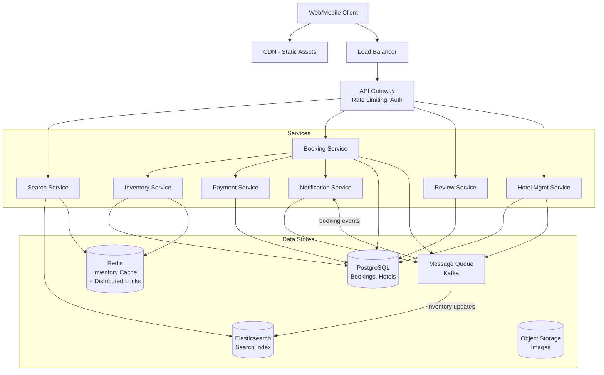
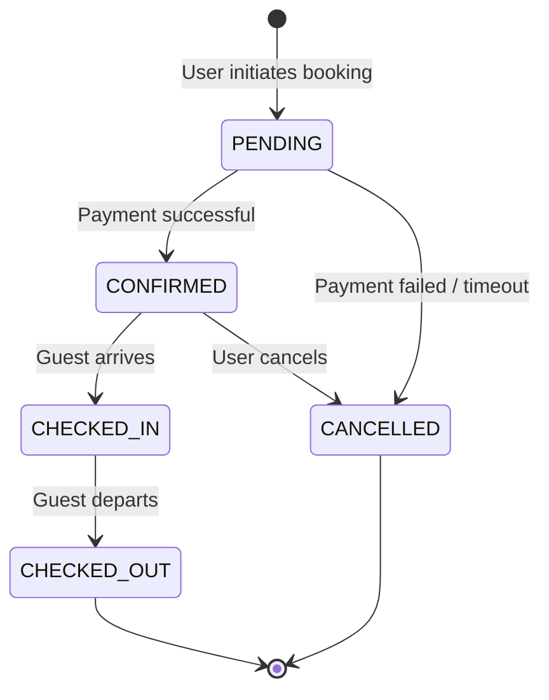
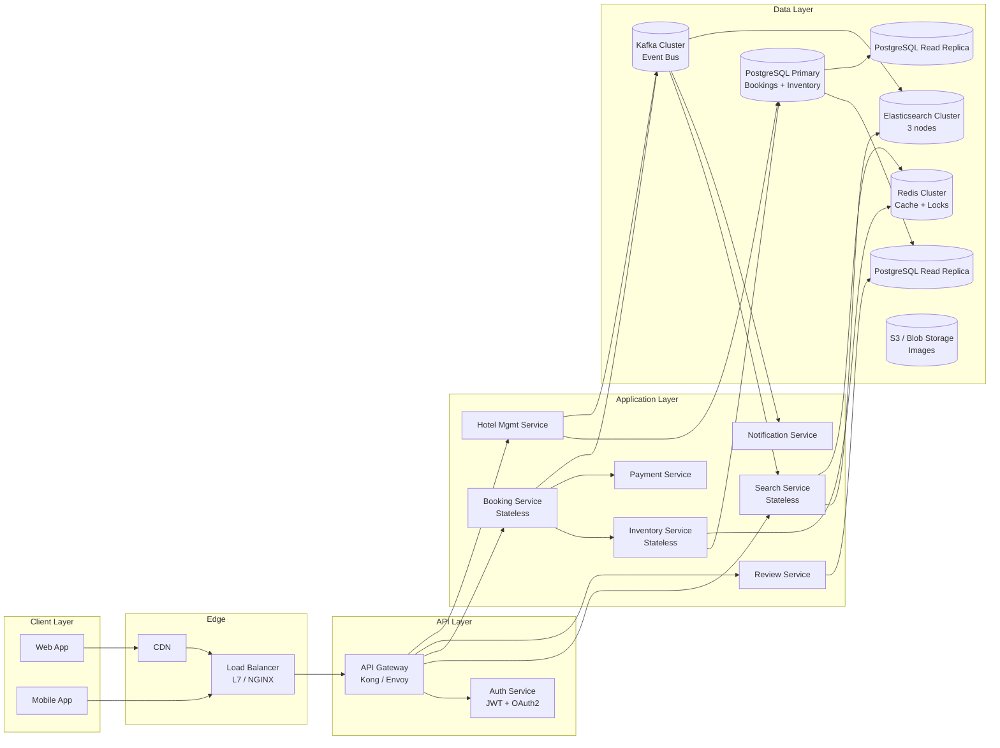

# Hotel Booking System (Booking.com)

## 1. Problem Statement

Design a hotel booking platform similar to Booking.com that allows users to search
for hotels, view room availability, make reservations, and manage bookings. The
system must handle high read traffic (searches) while ensuring strong consistency
for inventory management to prevent double bookings.

Key challenges:
- **Inventory accuracy**: Two users must never book the same room for the same dates
- **High read-to-write ratio**: Searches vastly outnumber bookings (~100:1)
- **Flash sale handling**: Popular hotels may receive thousands of concurrent booking
  attempts
- **Global scale**: Users and hotels span multiple geographic regions

---

## 2. Functional Requirements

| ID | Requirement | Priority |
|----|-------------|----------|
| FR-1 | Search hotels by location, check-in/check-out dates, and guest count | P0 |
| FR-2 | View hotel details (photos, amenities, room types, pricing) | P0 |
| FR-3 | Check real-time room availability for selected dates | P0 |
| FR-4 | Book a room (reserve inventory, collect payment) | P0 |
| FR-5 | Cancel a booking (release inventory, process refund) | P0 |
| FR-6 | View booking history and upcoming reservations | P1 |
| FR-7 | Submit and read reviews/ratings for hotels | P1 |
| FR-8 | Hotel managers can update room inventory and pricing | P1 |
| FR-9 | Price comparison across room types | P2 |
| FR-10 | Notification on booking confirmation/cancellation | P2 |

---

## 3. Non-Functional Requirements

| Requirement | Target |
|-------------|--------|
| **Consistency** | Strong consistency for inventory (no double booking) |
| **Search latency** | p99 < 200 ms for search queries |
| **Booking latency** | p99 < 500 ms end-to-end |
| **Availability** | 99.99% uptime for booking service |
| **Flash sale support** | Handle 10,000+ concurrent booking attempts per hotel |
| **Scalability** | Support 500K hotels, 50M rooms globally |
| **Durability** | Zero data loss for confirmed bookings |
| **Data isolation** | PCI-DSS compliance for payment data |

---

## 4. Capacity Estimation

### Traffic

| Metric | Estimate |
|--------|----------|
| Daily active users (DAU) | 10 million |
| Searches per day | 50 million (~580 QPS avg, ~2,000 QPS peak) |
| Hotel detail views per day | 20 million |
| Bookings per day | 500,000 (~6 QPS avg, ~50 QPS peak) |
| Cancellations per day | 50,000 |
| Reviews per day | 100,000 |

### Storage

| Data | Size Estimate |
|------|--------------|
| Hotel metadata (500K hotels) | ~5 GB |
| Room records (50M rooms) | ~50 GB |
| Room inventory (50M rooms x 365 days) | ~180 GB/year |
| Bookings (500K/day x 365 days) | ~100 GB/year |
| Reviews (100K/day x 365 days) | ~20 GB/year |
| Search index (denormalized) | ~100 GB |
| Images/media | ~50 TB (object storage) |

### Bandwidth

- Inbound: ~200 MB/s (search queries + booking requests)
- Outbound: ~2 GB/s (search results with thumbnails)

---

## 5. API Design

### Search Hotels
```
GET /api/v1/hotels/search
  ?location={city_or_coords}
  &check_in={date}
  &check_out={date}
  &guests={count}
  &page={page}
  &sort_by={price|rating|distance}
  &filters={amenities,stars,price_range}

Response 200:
{
  "hotels": [
    {
      "hotel_id": "h_123",
      "name": "Grand Hotel",
      "location": {"lat": 40.7128, "lng": -74.0060},
      "star_rating": 4,
      "avg_review_score": 8.7,
      "min_price_per_night": 150.00,
      "thumbnail_url": "https://...",
      "available_rooms": 12
    }
  ],
  "total": 342,
  "page": 1,
  "has_next": true
}
```

### Get Hotel Details
```
GET /api/v1/hotels/{hotel_id}
  ?check_in={date}
  &check_out={date}
  &guests={count}

Response 200:
{
  "hotel_id": "h_123",
  "name": "Grand Hotel",
  "description": "...",
  "amenities": ["wifi", "pool", "gym"],
  "rooms": [
    {
      "room_type_id": "rt_456",
      "name": "Deluxe King",
      "max_guests": 2,
      "price_per_night": 200.00,
      "available_count": 5,
      "amenities": ["king_bed", "city_view"]
    }
  ],
  "reviews_summary": {"avg_score": 8.7, "count": 1234}
}
```

### Create Booking
```
POST /api/v1/bookings
{
  "hotel_id": "h_123",
  "room_type_id": "rt_456",
  "check_in": "2025-03-01",
  "check_out": "2025-03-05",
  "guest_info": {"name": "John", "email": "john@example.com"},
  "payment_method_id": "pm_789"
}

Response 201:
{
  "booking_id": "b_001",
  "status": "CONFIRMED",
  "total_price": 800.00,
  "cancellation_deadline": "2025-02-28T23:59:59Z"
}
```

### Cancel Booking
```
POST /api/v1/bookings/{booking_id}/cancel

Response 200:
{
  "booking_id": "b_001",
  "status": "CANCELLED",
  "refund_amount": 800.00
}
```

### Submit Review
```
POST /api/v1/hotels/{hotel_id}/reviews
{
  "booking_id": "b_001",
  "rating": 9,
  "title": "Great stay",
  "comment": "Loved the view and service."
}

Response 201:
{
  "review_id": "r_101",
  "status": "PUBLISHED"
}
```

---

## 6. Data Model

### Hotels
```sql
CREATE TABLE hotels (
    hotel_id        UUID PRIMARY KEY,
    name            VARCHAR(255) NOT NULL,
    description     TEXT,
    city            VARCHAR(100) NOT NULL,
    country         VARCHAR(100) NOT NULL,
    latitude        DECIMAL(10, 7),
    longitude       DECIMAL(10, 7),
    star_rating     SMALLINT CHECK (star_rating BETWEEN 1 AND 5),
    amenities       JSONB,
    created_at      TIMESTAMP DEFAULT NOW(),
    updated_at      TIMESTAMP DEFAULT NOW()
);
CREATE INDEX idx_hotels_city ON hotels(city);
```

### Room Types
```sql
CREATE TABLE room_types (
    room_type_id    UUID PRIMARY KEY,
    hotel_id        UUID REFERENCES hotels(hotel_id),
    name            VARCHAR(100) NOT NULL,
    description     TEXT,
    max_guests      SMALLINT NOT NULL,
    base_price      DECIMAL(10, 2) NOT NULL,
    amenities       JSONB,
    total_rooms     INT NOT NULL  -- total physical rooms of this type
);
CREATE INDEX idx_room_types_hotel ON room_types(hotel_id);
```

### Room Inventory (per-date availability)
```sql
CREATE TABLE room_inventory (
    room_type_id    UUID REFERENCES room_types(room_type_id),
    date            DATE NOT NULL,
    total_rooms     INT NOT NULL,
    booked_rooms    INT NOT NULL DEFAULT 0,
    price           DECIMAL(10, 2) NOT NULL,
    version         INT NOT NULL DEFAULT 0,  -- for optimistic locking
    PRIMARY KEY (room_type_id, date)
);
CREATE INDEX idx_inventory_date ON room_inventory(date);
```

### Bookings
```sql
CREATE TABLE bookings (
    booking_id      UUID PRIMARY KEY,
    hotel_id        UUID REFERENCES hotels(hotel_id),
    room_type_id    UUID REFERENCES room_types(room_type_id),
    guest_name      VARCHAR(255) NOT NULL,
    guest_email     VARCHAR(255) NOT NULL,
    check_in        DATE NOT NULL,
    check_out       DATE NOT NULL,
    total_price     DECIMAL(10, 2) NOT NULL,
    status          VARCHAR(20) NOT NULL DEFAULT 'PENDING',
        -- PENDING -> CONFIRMED -> CHECKED_IN -> CHECKED_OUT
        -- PENDING -> CANCELLED
        -- CONFIRMED -> CANCELLED
    payment_id      UUID,
    version         INT NOT NULL DEFAULT 0,
    created_at      TIMESTAMP DEFAULT NOW(),
    updated_at      TIMESTAMP DEFAULT NOW()
);
CREATE INDEX idx_bookings_hotel ON bookings(hotel_id);
CREATE INDEX idx_bookings_guest ON bookings(guest_email);
CREATE INDEX idx_bookings_dates ON bookings(check_in, check_out);
```

### Reviews
```sql
CREATE TABLE reviews (
    review_id       UUID PRIMARY KEY,
    hotel_id        UUID REFERENCES hotels(hotel_id),
    booking_id      UUID REFERENCES bookings(booking_id),
    guest_name      VARCHAR(255),
    rating          SMALLINT CHECK (rating BETWEEN 1 AND 10),
    title           VARCHAR(255),
    comment         TEXT,
    created_at      TIMESTAMP DEFAULT NOW()
);
CREATE INDEX idx_reviews_hotel ON reviews(hotel_id);
```

### Entity Relationship

```
hotels 1---* room_types 1---* room_inventory (per date)
hotels 1---* bookings *---1 room_types
hotels 1---* reviews *---1 bookings
```

---

## 7. High-Level Architecture



---

## 8. Detailed Design

### 8.1 Inventory Management with Optimistic Locking

The `room_inventory` table tracks per-date availability for each room type.
We use **optimistic locking** via a `version` column to prevent double bookings
without holding database locks for the entire transaction duration.

**Booking flow (reserve inventory):**

```
BEGIN TRANSACTION;

-- Step 1: Read current inventory for all dates in the range
SELECT booked_rooms, total_rooms, version
FROM room_inventory
WHERE room_type_id = :room_type_id
  AND date BETWEEN :check_in AND :check_out - 1
FOR UPDATE;  -- pessimistic lock within transaction for critical section

-- Step 2: Verify availability for ALL dates
-- If any date has booked_rooms >= total_rooms, ABORT

-- Step 3: Atomically increment booked_rooms with version check
UPDATE room_inventory
SET booked_rooms = booked_rooms + 1,
    version = version + 1
WHERE room_type_id = :room_type_id
  AND date BETWEEN :check_in AND :check_out - 1
  AND version = :expected_version
  AND booked_rooms < total_rooms;

-- Step 4: Verify all rows were updated (affected_rows == num_nights)
-- If not, another concurrent booking took the last room -> ROLLBACK and retry

COMMIT;
```

**Why optimistic locking?**
- Short lock duration: only during the UPDATE, not the entire user session
- High throughput: most bookings are for different rooms/dates, so no contention
- Automatic conflict detection: version mismatch = retry

### 8.2 Search with Denormalized Data

Search queries hit **Elasticsearch**, which stores a denormalized hotel document:

```json
{
  "hotel_id": "h_123",
  "name": "Grand Hotel",
  "city": "New York",
  "location": {"lat": 40.7128, "lon": -74.0060},
  "star_rating": 4,
  "avg_review_score": 8.7,
  "amenities": ["wifi", "pool"],
  "room_types": [
    {
      "room_type_id": "rt_456",
      "name": "Deluxe King",
      "max_guests": 2,
      "min_price": 150.00
    }
  ],
  "min_price": 150.00,
  "available_dates": {
    "2025-03-01": true,
    "2025-03-02": true
  }
}
```

**Indexing pipeline:**
1. Hotel/inventory changes publish events to Kafka
2. Search indexer consumes events and updates Elasticsearch
3. Availability is approximate in search results (eventual consistency is OK here)
4. Exact availability is checked at booking time (strong consistency)

### 8.3 Double-Booking Prevention

Multiple layers prevent double bookings:

```
Layer 1: Redis distributed lock (per room_type + date range)
   |
   v
Layer 2: Optimistic locking (version column in room_inventory)
   |
   v
Layer 3: Database constraint (booked_rooms <= total_rooms CHECK)
```

1. **Redis lock**: Before attempting a booking, acquire a distributed lock
   (`LOCK:room_type_id:date_range`). This reduces contention on the database.
   Lock TTL = 10 seconds.

2. **Optimistic locking**: Even with the Redis lock, we verify the version
   has not changed. This catches edge cases where the Redis lock expired
   before the DB write completed.

3. **Database constraint**: As a final safety net, a CHECK constraint
   ensures `booked_rooms <= total_rooms`. Any violation causes a rollback.

### 8.4 Booking State Machine



State transitions are atomic and logged for audit:
- `PENDING -> CONFIRMED`: Inventory reserved + payment captured
- `CONFIRMED -> CANCELLED`: Inventory released + refund initiated
- Transition timeout: PENDING bookings auto-cancel after 15 minutes

---

## 9. Architecture Diagram



---

## 10. Architectural Patterns

### 10.1 Optimistic Concurrency Control (OCC)

**Problem**: Multiple users may attempt to book the last room simultaneously.

**Solution**: Use a `version` column in `room_inventory`. Each update includes
`WHERE version = :expected`. If another transaction incremented the version first,
the update affects 0 rows, signaling a conflict.

**Trade-off**: Requires retry logic, but avoids long-held pessimistic locks that
reduce throughput.

### 10.2 Saga Pattern for Distributed Transactions

A booking involves multiple services (Inventory, Payment, Notification).
We use an **orchestration-based saga** with compensating transactions:

```
Booking Saga:
  1. Reserve Inventory   -> [compensate: Release Inventory]
  2. Charge Payment      -> [compensate: Refund Payment]
  3. Confirm Booking     -> [compensate: Cancel Booking]
  4. Send Notification   -> [no compensation needed]
```

If step 2 fails, the saga orchestrator runs compensating action for step 1
(release inventory). This ensures eventual consistency without 2PC.

### 10.3 CQRS (Command Query Responsibility Segregation)

**Reads (Queries)**: Search requests hit Elasticsearch, which stores
denormalized hotel data optimized for fast filtering and geo queries.

**Writes (Commands)**: Booking/inventory mutations go through PostgreSQL,
the source of truth.

**Sync mechanism**: Kafka CDC (Change Data Capture) propagates inventory
changes from PostgreSQL to Elasticsearch with near-real-time latency (~1-2s).

```
Write Path:  Client -> Booking Service -> PostgreSQL -> Kafka -> Elasticsearch
Read Path:   Client -> Search Service -> Elasticsearch (+ Redis cache)
```

---

## 11. Technology Choices

| Component | Choice | Rationale |
|-----------|--------|-----------|
| **Search Engine** | Elasticsearch | Superior geo-query support, built-in aggregations for faceted search, better real-time indexing than Solr. Solr is stronger for pure text search but hotel search is heavily structured/geo. |
| **Primary DB** | PostgreSQL | ACID transactions for booking integrity, JSONB for flexible schema (amenities), mature ecosystem. |
| **Cache + Locks** | Redis Cluster | Sub-ms latency for inventory cache, built-in distributed lock (Redlock), pub/sub for real-time updates. |
| **Message Queue** | Kafka | Durable event log for saga orchestration, CDC streaming, high throughput for search index updates. |
| **API Gateway** | Kong / Envoy | Rate limiting, JWT validation, request routing, circuit breaker. |
| **Object Storage** | S3 / Azure Blob | Cost-effective storage for hotel images, CDN integration. |
| **Monitoring** | Prometheus + Grafana | Metrics collection and dashboarding; well-supported in cloud-native stacks. |
| **Tracing** | Jaeger / OpenTelemetry | Distributed tracing across the saga workflow. |

---

## 12. Scalability

### Read Scalability
- **Elasticsearch cluster**: Horizontal sharding by city/region; 3+ replicas
  per shard for read throughput
- **Redis cache**: Hot hotel data and availability snapshots; reduces ES load
  by ~60%
- **PostgreSQL read replicas**: Review and booking history queries routed to
  replicas
- **CDN**: Static assets (images, JS/CSS) served from edge locations

### Write Scalability
- **Database sharding**: Shard `room_inventory` and `bookings` by `hotel_id`
  (co-located data for transactional integrity)
- **Kafka partitioning**: Partition by `hotel_id` for ordered event processing
  per hotel
- **Connection pooling**: PgBouncer in front of PostgreSQL (5,000+ connections)

### Flash Sale Handling
1. **Request queuing**: Kafka absorbs burst traffic; booking service processes
   at sustainable rate
2. **Redis pre-check**: Check inventory in Redis before hitting DB; reject
   impossible requests early
3. **Exponential backoff**: Clients retry with jitter on optimistic lock
   conflicts
4. **Rate limiting**: Per-user rate limits prevent bot abuse

---

## 13. Reliability

| Mechanism | Implementation |
|-----------|---------------|
| **Replication** | PostgreSQL streaming replication (sync for primary region, async for DR) |
| **Failover** | Patroni for automatic PostgreSQL leader election (~10s failover) |
| **Circuit breaker** | Hystrix/Resilience4j on payment service calls; fallback to PENDING state |
| **Idempotency** | Booking requests carry idempotency key; dedup in Redis (TTL 24h) |
| **Retry with backoff** | Saga steps retry 3x with exponential backoff before compensating |
| **Dead letter queue** | Failed Kafka messages routed to DLQ for manual review |
| **Backup** | Daily PostgreSQL WAL archiving to S3; point-in-time recovery |
| **Multi-region DR** | Active-passive with async replication; RPO < 1 min, RTO < 5 min |

---

## 14. Security

| Threat | Mitigation |
|--------|-----------|
| **Unauthorized access** | JWT + OAuth2 for authentication; role-based access (guest, hotel_admin, platform_admin) |
| **SQL injection** | Parameterized queries only; ORM layer (SQLAlchemy) |
| **Rate abuse** | Per-IP and per-user rate limiting at API Gateway |
| **Payment data theft** | PCI-DSS Level 1 compliance; tokenized payment via Stripe/Adyen; no raw card data stored |
| **Data in transit** | TLS 1.3 everywhere; mutual TLS between services |
| **Data at rest** | AES-256 encryption for PII; PostgreSQL TDE |
| **Inventory manipulation** | Server-side price/availability validation; never trust client-side data |
| **DDoS** | CloudFlare / AWS Shield; geo-based blocking |
| **Audit trail** | Immutable event log in Kafka; all state transitions logged |

---

## 15. Monitoring and Observability

### Key Metrics

| Metric | Alert Threshold |
|--------|----------------|
| Search p99 latency | > 200 ms |
| Booking p99 latency | > 500 ms |
| Booking success rate | < 95% |
| Inventory conflict rate | > 5% (indicates contention) |
| Payment failure rate | > 2% |
| Kafka consumer lag | > 10,000 messages |
| DB connection pool utilization | > 80% |
| Redis hit rate | < 90% |

### Observability Stack
- **Metrics**: Prometheus scraping service endpoints; Grafana dashboards per
  service
- **Logging**: Structured JSON logs -> Fluentd -> Elasticsearch -> Kibana
- **Tracing**: OpenTelemetry SDK in each service; Jaeger for trace
  visualization
- **Alerting**: PagerDuty integration; tiered escalation (P1: booking failures,
  P2: search degradation, P3: review service issues)

### Health Checks
```
GET /health       -> 200 OK (basic liveness)
GET /health/ready -> 200 OK (all dependencies reachable)
```

---

## Summary

The Hotel Booking System separates the high-read search path (Elasticsearch +
Redis) from the high-consistency booking path (PostgreSQL + optimistic locking),
connected by Kafka for eventual consistency. The Saga pattern coordinates
distributed transactions across Inventory, Payment, and Notification services
with compensating actions for rollback. Optimistic concurrency control at both
Redis (distributed lock) and database (version column) layers ensures no double
bookings even under extreme concurrency.
