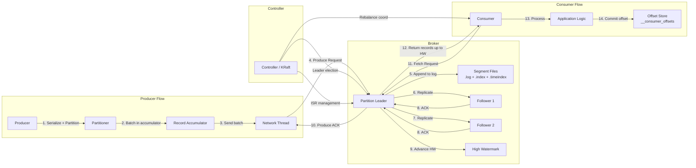

# Message Queue (Kafka-like) - System Design

## 1. Problem Statement

Design a distributed message queue system similar to Apache Kafka that enables
asynchronous, reliable, and high-throughput communication between producers and
consumers. The system must support publish/subscribe semantics, horizontal
scalability through topic partitioning, consumer group coordination, and durable
message storage with configurable retention.

Modern microservice architectures require decoupled communication where producers
and consumers operate independently. The system must handle bursty traffic,
guarantee message ordering within partitions, support multiple independent
consumer groups reading the same data at different rates, and provide at-least-once
(optionally exactly-once) delivery semantics.

---

## 2. Functional Requirements

| # | Requirement | Details |
|---|------------|---------|
| F1 | **Topic Management** | Create, delete, and list topics. Each topic has a configurable number of partitions. |
| F2 | **Publish Messages** | Producers send messages to a topic. Messages are routed to partitions via a key-based or round-robin strategy. |
| F3 | **Subscribe & Consume** | Consumers subscribe to topics and poll for messages. Each consumer tracks its own offset. |
| F4 | **Partitions** | Each topic is split into N ordered, append-only logs (partitions) for parallelism. |
| F5 | **Consumer Groups** | Consumers in the same group share partitions (each partition assigned to exactly one consumer in the group). Different groups consume independently. |
| F6 | **Message Ordering** | Messages within a single partition are strictly ordered. Cross-partition ordering is not guaranteed. |
| F7 | **Offset Management** | Consumers commit offsets. On restart, consumption resumes from the last committed offset. Supports `earliest` and `latest` reset policies. |
| F8 | **Consumer Group Rebalancing** | When consumers join or leave a group, partitions are redistributed evenly. |
| F9 | **Message Retention** | Messages are retained for a configurable duration or size limit, not deleted on consumption. |
| F10 | **Replay** | Consumers can seek to any offset to replay messages. |

---

## 3. Non-Functional Requirements

| # | Requirement | Target |
|---|------------|--------|
| NF1 | **Throughput** | 1M+ messages/sec aggregate across brokers |
| NF2 | **Latency** | p99 < 10ms for produce, p99 < 50ms for consume |
| NF3 | **Durability** | No message loss once acknowledged. Replicated across multiple brokers. |
| NF4 | **Availability** | 99.99% uptime. Automatic failover on broker failure. |
| NF5 | **Delivery Semantics** | At-least-once by default. Exactly-once via idempotent producers + transactional consumers. |
| NF6 | **Scalability** | Horizontal scaling by adding brokers and partitions. |
| NF7 | **Fault Tolerance** | Survive broker failures with ISR (In-Sync Replica) based replication. |
| NF8 | **Storage Efficiency** | Log compaction and configurable retention (time-based or size-based). |

---

## 4. Capacity Estimation

### Assumptions
- 1 million messages/sec peak
- Average message size: 1 KB
- Retention period: 7 days
- Replication factor: 3

### Storage
```
Daily volume   = 1M msg/sec * 86,400 sec/day * 1 KB = ~84 TB/day (raw)
With replication = 84 TB * 3 = ~252 TB/day
7-day retention  = 252 TB * 7 = ~1.76 PB
```

### Bandwidth
```
Ingress  = 1M msg/sec * 1 KB = ~1 GB/sec
Egress   = 1 GB/sec * 3 (replication) + consumer reads
         = ~5-10 GB/sec total
```

### Broker Count
```
Single broker throughput ~ 100-200 MB/sec
Brokers needed = 1 GB/sec / 150 MB/sec ~ 7-10 brokers minimum
With headroom and replication: 15-20 brokers
```

### Partitions
```
Target parallelism: 100-500 partitions per topic (for high-throughput topics)
Total partitions across cluster: 10,000 - 50,000
```

---

## 5. API Design

### Producer API

```
POST /topics/{topic}/messages
Headers:
    Content-Type: application/json
    X-Idempotency-Key: <uuid>          # For exactly-once semantics
Body:
{
    "key": "user-123",                  # Partition routing key (optional)
    "value": "<base64-encoded-payload>",
    "headers": {"trace-id": "abc-123"}, # Optional metadata
    "timestamp": 1700000000000          # Optional; server assigns if missing
}
Response 200:
{
    "topic": "orders",
    "partition": 3,
    "offset": 84729,
    "timestamp": 1700000000000
}
```

### Consumer API

```
POST /consumers/{group}/subscribe
Body:
{
    "topics": ["orders", "payments"],
    "auto_offset_reset": "earliest"     # or "latest"
}

GET /consumers/{group}/{consumer_id}/poll?max_records=100&timeout_ms=500
Response 200:
{
    "records": [
        {
            "topic": "orders",
            "partition": 3,
            "offset": 84729,
            "key": "user-123",
            "value": "<base64>",
            "timestamp": 1700000000000,
            "headers": {"trace-id": "abc-123"}
        }
    ]
}

POST /consumers/{group}/{consumer_id}/commit
Body:
{
    "offsets": {
        "orders-3": 84730,
        "orders-7": 12001
    }
}
```

### Admin API

```
POST   /admin/topics          # Create topic (name, partitions, replication_factor)
DELETE /admin/topics/{topic}   # Delete topic
GET    /admin/topics           # List topics with partition counts
GET    /admin/topics/{topic}   # Topic details (partitions, ISR status, offsets)
GET    /admin/groups           # List consumer groups
GET    /admin/groups/{group}   # Group details (members, partition assignments, lag)
```

---

## 6. Data Model

### Topic
```
Topic {
    name:               string       # "orders", "user-events"
    num_partitions:      int          # Number of partitions
    replication_factor:  int          # Number of replicas per partition
    retention_ms:        long         # Retention duration (default 7 days)
    retention_bytes:     long         # Max size per partition (-1 = unlimited)
    cleanup_policy:      enum         # DELETE | COMPACT | DELETE_AND_COMPACT
    created_at:          timestamp
}
```

### Partition
```
Partition {
    topic:               string
    partition_id:        int
    leader_broker:       int          # Broker ID of the leader
    replicas:            list[int]    # All broker IDs holding replicas
    isr:                 list[int]    # In-Sync Replica broker IDs
    log_start_offset:    long         # Earliest available offset
    log_end_offset:      long         # Next offset to be written (high watermark)
}
```

### Message (Log Entry)
```
Message {
    offset:              long         # Monotonically increasing within partition
    key:                 bytes        # Routing/compaction key (nullable)
    value:               bytes        # Message payload
    timestamp:           long         # Producer or broker timestamp
    headers:             map          # Key-value metadata
    crc:                 int          # Checksum for integrity
    compression:         enum         # NONE | GZIP | SNAPPY | LZ4 | ZSTD
}
```

### Consumer Group
```
ConsumerGroup {
    group_id:            string
    members:             list[ConsumerMember]
    state:               enum         # EMPTY | PREPARING_REBALANCE | COMPLETING_REBALANCE | STABLE | DEAD
    generation_id:       int          # Incremented on each rebalance
    protocol:            string       # "range" | "round-robin" | "sticky"
}

ConsumerMember {
    member_id:           string
    client_id:           string
    host:                string
    assigned_partitions: list[TopicPartition]
    last_heartbeat:      timestamp
}
```

### Offset Store
```
CommittedOffset {
    group_id:            string
    topic:               string
    partition:            int
    committed_offset:    long
    metadata:            string       # Optional consumer metadata
    commit_timestamp:    long
}
```

---

## 7. High-Level Architecture

```mermaid
graph TB
    subgraph Producers
        P1[Producer 1]
        P2[Producer 2]
        P3[Producer N]
    end

    subgraph Kafka Cluster
        subgraph Controller
            ZK[ZooKeeper / KRaft<br>Controller]
        end

        subgraph Broker 1
            B1P0[Topic-A<br>Partition 0<br>Leader]
            B1P1[Topic-A<br>Partition 2<br>Follower]
            B1P2[Topic-B<br>Partition 1<br>Leader]
        end

        subgraph Broker 2
            B2P0[Topic-A<br>Partition 1<br>Leader]
            B2P1[Topic-A<br>Partition 0<br>Follower]
            B2P2[Topic-B<br>Partition 0<br>Leader]
        end

        subgraph Broker 3
            B3P0[Topic-A<br>Partition 2<br>Leader]
            B3P1[Topic-A<br>Partition 1<br>Follower]
            B3P2[Topic-B<br>Partition 1<br>Follower]
        end
    end

    subgraph Consumer Group A
        CGA1[Consumer 1<br>P0, P1]
        CGA2[Consumer 2<br>P2]
    end

    subgraph Consumer Group B
        CGB1[Consumer 1<br>P0]
        CGB2[Consumer 2<br>P1]
        CGB3[Consumer 3<br>P2]
    end

    P1 & P2 & P3 --> B1P0 & B2P0 & B3P0
    ZK --- Broker 1 & Broker 2 & Broker 3
    B1P0 --> CGA1
    B2P0 --> CGA1
    B3P0 --> CGA2
    B1P0 --> CGB1
    B2P0 --> CGB2
    B3P0 --> CGB3
```

---

## 8. Detailed Design

### 8.1 Partition Strategy

**Key-based partitioning:**
```
partition = hash(message.key) % num_partitions
```
- Messages with the same key always go to the same partition (ordering guarantee).
- If no key is provided, round-robin across partitions for load balancing.

**Partition as an append-only log:**
```
Partition 0:  [msg0][msg1][msg2][msg3][msg4][msg5][msg6] ...
                ^                        ^              ^
            log_start                committed       log_end
            (oldest retained)        (consumer offset) (next write)
```

Each partition is a sequence of segments (files on disk):
- Active segment receives new writes.
- Closed segments are immutable and eligible for compaction/deletion.
- Each segment has an `.index` file (offset -> file position) and a `.timeindex` file.

### 8.2 Replication and ISR (In-Sync Replicas)

**Leader-Follower model:**
- Each partition has one leader and N-1 follower replicas.
- All reads and writes go through the leader.
- Followers continuously fetch from the leader to stay in sync.

**ISR (In-Sync Replicas):**
- A follower is "in-sync" if it has replicated up to the leader's log end offset
  within `replica.lag.time.max.ms` (default 10s).
- The **high watermark** = minimum offset replicated by ALL ISR members.
- Consumers only see messages up to the high watermark (committed messages).

**Failover:**
1. Leader fails -> Controller detects via heartbeat timeout.
2. Controller selects a new leader from the ISR set.
3. New leader starts serving reads/writes.
4. If ISR is empty, choose **unclean leader** (data loss possible) or wait.

```
Leader (Broker 1):    [0][1][2][3][4][5]  <- log_end = 6
Follower (Broker 2):  [0][1][2][3][4]     <- in sync (lag < threshold)
Follower (Broker 3):  [0][1][2]           <- out of sync (removed from ISR)

High Watermark = 5 (min of ISR offsets: min(6, 5) = 5)
Consumers can read up to offset 4.
```

### 8.3 Consumer Group Rebalancing

**Trigger conditions:**
- Consumer joins or leaves the group
- Consumer heartbeat timeout
- Topic partition count changes
- Consumer subscription changes

**Rebalance Protocol (Eager):**
1. All consumers revoke their current partition assignments.
2. Group coordinator (a broker) collects member subscriptions.
3. The group leader (one consumer) runs the assignor strategy.
4. Coordinator distributes new assignments to all members.

**Assignment strategies:**
- **Range**: Partitions are sorted and divided into contiguous ranges per consumer.
- **Round-Robin**: Partitions are assigned one-by-one in round-robin order.
- **Sticky**: Minimizes partition movement; tries to keep existing assignments.

**Cooperative (Incremental) Rebalance:**
- Only reassigns partitions that need to move.
- Consumers keep consuming from unchanged partitions during rebalance.
- Two-phase: first revoke only the partitions to move, then assign.

### 8.4 Log Compaction

**Delete policy:** Remove segments older than `retention.ms` or when total size exceeds `retention.bytes`.

**Compact policy:** Keep only the latest value for each key.
```
Before compaction:
  offset 0: key=A, value=1
  offset 1: key=B, value=2
  offset 2: key=A, value=3   <- newer value for A
  offset 3: key=C, value=4
  offset 4: key=B, value=null <- tombstone (delete B)

After compaction:
  offset 2: key=A, value=3
  offset 3: key=C, value=4
  offset 4: key=B, value=null <- tombstone retained briefly for downstream
```

**Compaction process:**
1. Background thread scans the log tail (dirty section).
2. Builds an offset map: key -> latest offset.
3. Rewrites the log keeping only latest entries per key.
4. Tombstones (null values) are retained for `delete.retention.ms` then removed.

---

## 9. Architecture Diagram



---

## 10. Architectural Patterns

### 10.1 Publish/Subscribe (Pub/Sub)
- Producers publish to topics without knowledge of consumers.
- Multiple consumer groups independently subscribe to the same topic.
- Decouples producers and consumers spatially and temporally.

### 10.2 Log-Based Messaging
- Messages are stored as an immutable, append-only, ordered log.
- Unlike traditional queues, messages are NOT deleted on consumption.
- Enables replay, multiple consumers, and audit trails.
- Each consumer maintains its own read position (offset) into the log.

### 10.3 Partition-Based Parallelism
- Topics are split into partitions for horizontal scalability.
- Each partition is an independent ordered log processed by one consumer per group.
- Parallelism = min(num_partitions, num_consumers_in_group).
- Partitioning by key ensures related messages are co-located and ordered.

### 10.4 Leader-Follower Replication
- Each partition has one leader handling all reads/writes.
- Followers passively replicate the leader's log.
- On leader failure, a follower from the ISR set is promoted.
- Provides fault tolerance without impacting read/write performance.

### 10.5 Consumer Group Coordination
- Consumers self-organize via a group coordinator (broker).
- Partition assignments are balanced across consumers.
- Heartbeat protocol detects consumer failures.
- Rebalancing redistributes partitions on membership changes.

---

## 11. Technology Choices

### Message Queue Comparison

| Feature | **Kafka** | **RabbitMQ** | **AWS SQS** |
|---------|-----------|-------------|-------------|
| Model | Pull-based log | Push-based queue | Pull-based queue |
| Ordering | Per-partition | Per-queue (single consumer) | Best-effort (FIFO queues for strict) |
| Throughput | Very high (1M+ msg/sec) | Moderate (50K msg/sec) | High (managed) |
| Retention | Time/size-based (days/weeks) | Until consumed | 14 days max |
| Replay | Yes (seek to any offset) | No (consumed = gone) | No |
| Consumer Groups | Native | Competing consumers | Not native |
| Exactly-once | Supported | Not native | FIFO dedup window |
| Operational Cost | High (self-managed) | Moderate | Low (serverless) |

### Pull vs Push Model

**Pull (Kafka's approach):**
- Consumer controls the rate of consumption.
- Natural backpressure: slow consumers don't overload.
- Long-polling to reduce empty fetches.
- Better for high-throughput batch processing.

**Push (RabbitMQ's approach):**
- Broker pushes messages immediately to consumers.
- Lower latency for real-time use cases.
- Requires flow control to prevent consumer overload.
- Simpler consumer implementation.

**Our choice: Pull-based** - aligns with log-based architecture, supports replay, and handles heterogeneous consumer speeds.

---

## 12. Scalability

### Horizontal Scaling
- **Add brokers**: New brokers join the cluster; partitions can be reassigned.
- **Add partitions**: Increases parallelism for a topic. (Note: cannot decrease.)
- **Partition reassignment**: Rebalance partitions across brokers for even load.

### Scaling Dimensions
- **Write throughput**: Scale by adding partitions (parallel writes to leaders on different brokers).
- **Read throughput**: Scale by adding consumers to a group (up to partition count).
- **Storage**: Scale by adding brokers with more disk.
- **Topics**: Thousands of topics supported; metadata managed by controller.

### Bottleneck Mitigation
- **Hot partitions**: Use better key distribution or add partitions.
- **Large messages**: Use claim-check pattern (store payload in object storage, send reference).
- **Consumer lag**: Add consumers, optimize processing, or use parallel processing within a consumer.

---

## 13. Reliability

### Durability Guarantees
- **acks=0**: No acknowledgment (fire and forget). Fastest but may lose data.
- **acks=1**: Leader acknowledges after local write. May lose data if leader fails before replication.
- **acks=all**: Leader acknowledges after ALL ISR replicas confirm. Strongest guarantee.

### Exactly-Once Semantics (EOS)
1. **Idempotent producer**: Each producer gets a unique PID. Broker deduplicates by (PID, sequence number).
2. **Transactional writes**: Producer can atomically write to multiple partitions.
3. **Consumer read-committed**: Consumers only see committed transactional messages.

### Failure Handling
| Failure | Detection | Recovery |
|---------|-----------|----------|
| Broker crash | Heartbeat timeout | Leader election from ISR |
| Network partition | ZooKeeper session timeout | ISR shrinks; unclean election (configurable) |
| Disk failure | I/O errors | Broker restarts; replicas catch up from other ISR members |
| Consumer crash | Heartbeat miss | Consumer group rebalance |
| Producer crash | TCP timeout | Retry with idempotent producer |

### Data Integrity
- CRC32 checksums on every message batch.
- End-to-end validation from producer to consumer.
- Corrupt segments are detected and can be rebuilt from replicas.

---

## 14. Security

### Authentication
- **SASL/PLAIN**: Username/password (simple, for development).
- **SASL/SCRAM**: Salted challenge-response (production-grade).
- **mTLS**: Mutual TLS for certificate-based authentication.
- **SASL/OAUTHBEARER**: OAuth 2.0 token-based authentication.

### Authorization
- **ACLs (Access Control Lists)**: Fine-grained permissions per principal.
  ```
  Principal: User:alice
  Resource: Topic:orders
  Operations: READ, WRITE
  Permission: ALLOW
  ```
- **Role-Based Access Control (RBAC)**: Available in Confluent Platform.

### Encryption
- **In-transit**: TLS encryption for all client-broker and broker-broker communication.
- **At-rest**: OS-level or disk-level encryption. Application-level encryption for sensitive payloads.

### Audit
- Log all administrative actions (topic creation, ACL changes).
- Track producer/consumer authentication events.
- Integration with SIEM systems for compliance.

---

## 15. Monitoring

### Key Metrics

**Broker Metrics:**
| Metric | Description | Alert Threshold |
|--------|-------------|-----------------|
| `UnderReplicatedPartitions` | Partitions where ISR < replication factor | > 0 |
| `ActiveControllerCount` | Number of active controllers | != 1 |
| `OfflinePartitionsCount` | Partitions with no leader | > 0 |
| `RequestsPerSec` | Produce/Fetch request rate | Baseline + 50% |
| `BytesInPerSec` / `BytesOutPerSec` | Network I/O throughput | Near NIC capacity |
| `LogFlushLatencyMs` | Disk flush latency | p99 > 100ms |

**Producer Metrics:**
| Metric | Description | Alert Threshold |
|--------|-------------|-----------------|
| `record-send-rate` | Messages sent per second | Drop > 50% |
| `record-error-rate` | Failed sends per second | > 0 sustained |
| `request-latency-avg` | Average produce latency | > 100ms |
| `batch-size-avg` | Average batch size | Too small = inefficient |

**Consumer Metrics:**
| Metric | Description | Alert Threshold |
|--------|-------------|-----------------|
| `records-lag-max` | Max offset lag across partitions | > 10,000 |
| `records-consumed-rate` | Consumption rate | Drop > 50% |
| `commit-latency-avg` | Offset commit latency | > 500ms |
| `rebalance-rate` | Rebalance frequency | > 1/hour |

### Monitoring Stack
- **Metrics**: Prometheus + Grafana (JMX exporter for Kafka metrics)
- **Logging**: ELK stack or Loki for broker logs
- **Tracing**: OpenTelemetry for end-to-end message tracing
- **Alerting**: PagerDuty / OpsGenie integration via Alertmanager

### Health Checks
```
GET /health/ready    -> 200 if broker is accepting requests
GET /health/live     -> 200 if broker process is alive
GET /metrics         -> Prometheus-format metrics endpoint
```
