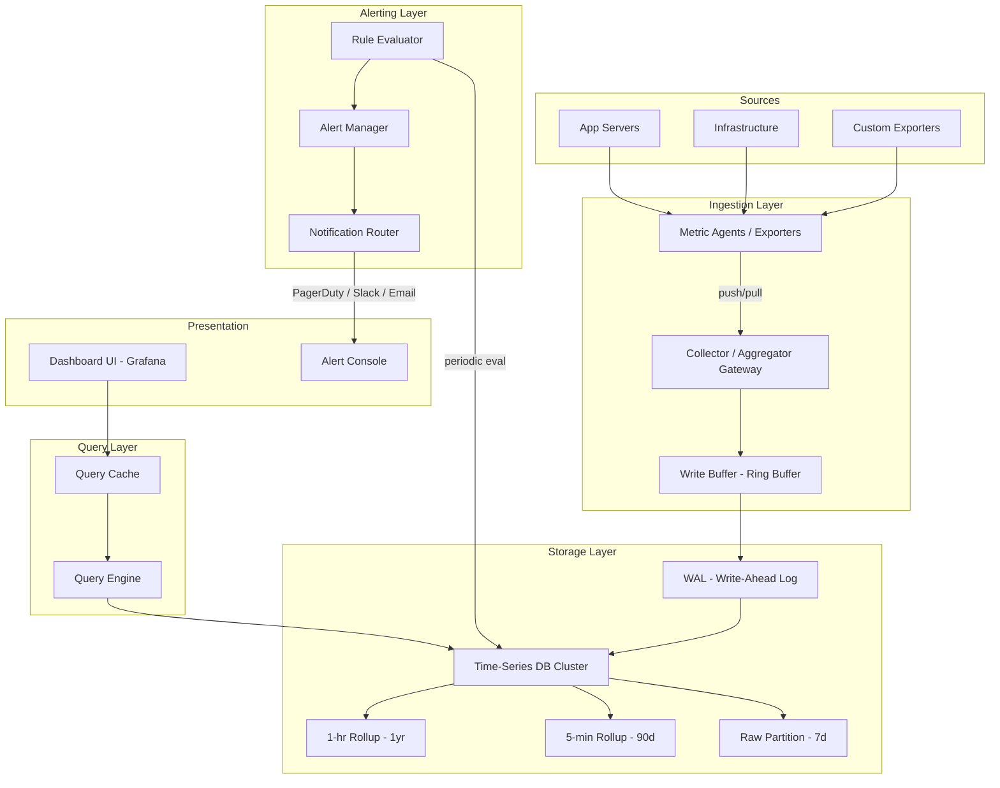
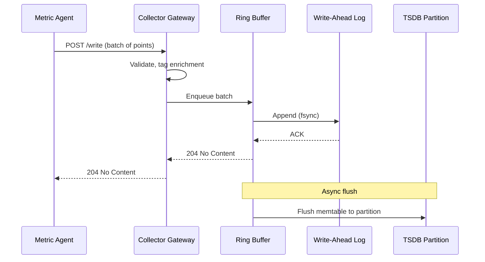
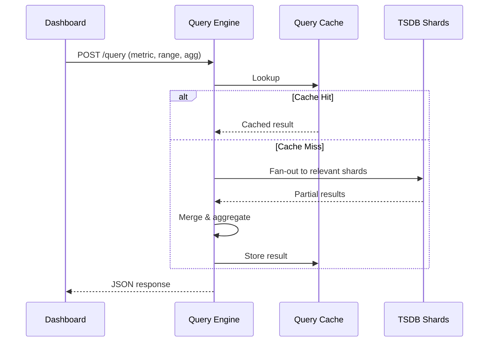
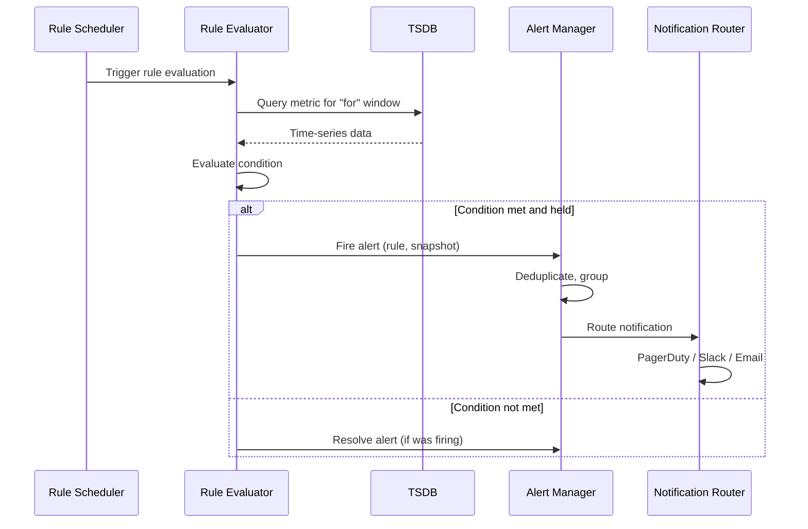

# Metrics & Monitoring System

## 1. Problem Statement

Modern distributed systems generate vast amounts of operational data -- CPU usage, request
latency, error rates, queue depths, and business KPIs. Engineers need a centralized platform
that **collects**, **stores**, **queries**, and **alerts** on these metrics in near-real-time
so they can detect incidents before users are impacted and make data-driven capacity decisions.

### Key Challenges
| Challenge | Detail |
|-----------|--------|
| **Volume** | Thousands of hosts each emitting hundreds of metric streams |
| **Velocity** | Millions of data points per second at peak |
| **Variety** | Counters, gauges, histograms, summaries -- each with different semantics |
| **Retention** | Raw data for days, downsampled data for months/years |
| **Freshness** | Alerts must fire within seconds of a threshold breach |

---

## 2. Functional Requirements

| ID | Requirement | Description |
|----|-------------|-------------|
| FR-1 | **Metric Collection** | Ingest counters, gauges, and histograms from agents via push or pull |
| FR-2 | **Time-Series Storage** | Store (metric_name, tags, timestamp, value) tuples efficiently |
| FR-3 | **Query Engine** | Support aggregation queries: avg, sum, min, max, count, percentiles (p50/p95/p99) over arbitrary time ranges |
| FR-4 | **Downsampling** | Automatically roll up raw data (1 min -> 5 min -> 1 hr -> 1 day) |
| FR-5 | **Alerting Rules** | Define threshold-based rules (e.g., avg(cpu) > 80% for 5 min) |
| FR-6 | **Alert History** | Record every alert firing with timestamp, metric snapshot, and status |
| FR-7 | **Dashboards** | Provide a UI/API to visualize metric time-series as graphs and tables |
| FR-8 | **Tag-Based Filtering** | Filter and group-by on arbitrary key-value tags (host, region, service) |

---

## 3. Non-Functional Requirements

| Attribute | Target |
|-----------|--------|
| **Write Throughput** | 10 million data points / second |
| **Query Latency** | < 1 second for dashboard queries over recent data |
| **Alerting Latency** | < 30 seconds from breach to notification |
| **Alerting Availability** | 99.9 % (< 8.7 hr downtime / year) |
| **Retention** | Raw: 7 days, 5-min rollup: 90 days, 1-hr rollup: 1 year |
| **Durability** | No data loss for committed writes (replicated WAL) |
| **Horizontal Scalability** | Linear scale-out for ingestion and query |

---

## 4. Capacity Estimation

### Write Path

| Parameter | Value |
|-----------|-------|
| Hosts | 100,000 |
| Metrics per host | 200 |
| Scrape interval | 15 seconds |
| Data points / second | 100,000 x 200 / 15 ~ **1.3 M/s** (burst to 10 M/s) |
| Bytes per point | ~40 B (8 B timestamp + 8 B value + 24 B tags hash) |
| Raw write bandwidth | 10 M x 40 B = **400 MB/s** |

### Storage

| Tier | Resolution | Retention | Size |
|------|------------|-----------|------|
| Raw | 15 s | 7 days | 400 MB/s x 86400 x 7 ~ **235 TB** (before compression) |
| 5-min rollup | 5 min | 90 days | ~4 TB |
| 1-hr rollup | 1 hr | 365 days | ~0.5 TB |
| **Total (compressed 10x)** | | | **~24 TB** |

### Query Path

| Parameter | Value |
|-----------|-------|
| Dashboard queries / sec | 5,000 |
| Alert rule evaluations / sec | 50,000 |
| Avg query fan-out | 3 TSDB shards |

---

## 5. API Design

### 5.1 Write Metrics (Push)

```
POST /api/v1/write
Content-Type: application/x-protobuf

Body: TimeSeries {
  repeated Sample {
    string metric_name
    map<string,string> tags
    int64  timestamp_ms
    double value
  }
}

Response: 204 No Content | 429 Too Many Requests
```

### 5.2 Query Metrics

```
POST /api/v1/query
{
  "metric":      "http_request_duration_seconds",
  "tags":        {"service": "api-gateway", "region": "us-east-1"},
  "aggregation": "p95",
  "group_by":    ["host"],
  "start":       "2025-01-01T00:00:00Z",
  "end":         "2025-01-01T01:00:00Z",
  "step":        "5m"
}

Response:
{
  "series": [
    {"tags": {"host": "h1"}, "values": [[1735689600, 0.42], ...]}
  ]
}
```

### 5.3 Alert Rules

```
POST /api/v1/alerts/rules
{
  "name":       "HighCPU",
  "metric":     "system_cpu_usage",
  "tags":       {"env": "prod"},
  "condition":  "avg > 0.80",
  "for":        "5m",
  "severity":   "critical",
  "notify":     ["pagerduty://team-infra", "slack://#alerts"]
}

GET  /api/v1/alerts/rules
GET  /api/v1/alerts/history?start=...&end=...
```

---

## 6. Data Model

### 6.1 Metric Data Point

| Field | Type | Description |
|-------|------|-------------|
| `metric_name` | string | Dot-separated name (e.g., `http.requests.total`) |
| `tags` | map<string, string> | Dimensional labels |
| `timestamp` | int64 (ms) | Unix epoch in milliseconds |
| `value` | float64 | Numeric measurement |

### 6.2 Alert Rule

| Field | Type | Description |
|-------|------|-------------|
| `rule_id` | UUID | Unique identifier |
| `name` | string | Human-readable name |
| `metric_name` | string | Target metric |
| `tags_filter` | map | Tag constraints |
| `condition` | string | Expression (e.g., `avg > 0.8`) |
| `for_duration` | duration | How long condition must hold |
| `severity` | enum | critical / warning / info |
| `notify_channels` | list | Notification targets |

### 6.3 Alert History

| Field | Type | Description |
|-------|------|-------------|
| `alert_id` | UUID | Unique identifier |
| `rule_id` | UUID | Triggering rule |
| `fired_at` | timestamp | When alert fired |
| `resolved_at` | timestamp | When alert resolved (nullable) |
| `metric_snapshot` | JSON | Metric values at fire time |
| `status` | enum | firing / resolved / acknowledged |

---

## 7. High-Level Architecture



---

## 8. Detailed Component Design

### 8.1 Time-Series Storage Engine

The TSDB uses an **LSM-tree** with **time-based partitioning**:

1. **In-Memory Buffer (MemTable)**: Incoming points are written to a sorted in-memory
   structure (red-black tree or skip list) grouped by metric + tags hash.
2. **Write-Ahead Log**: Every write is first appended to a WAL for durability before
   acknowledging the client.
3. **Time Partitions**: Data is partitioned into fixed time blocks (e.g., 2-hour blocks).
   Each block is an immutable SSTable-like file after flush.
4. **Compaction**: Background compaction merges small SSTables within a partition, applying
   tombstone removal and re-sorting.

```
Time -->
|-- Block 0 (00:00-02:00) --|-- Block 1 (02:00-04:00) --|-- Block 2 (04:00-06:00) --|
   [memtable] -> [SSTable]     [memtable] -> [SSTable]     [memtable (active)]
```

**Compression**: Gorilla encoding for timestamps (delta-of-delta) and XOR encoding for
float values achieves ~1.37 bytes/point (12x compression).

### 8.2 Downsampling Pipeline

```
Raw (15s) --[1-min aggregator]--> 1-min rollup
1-min rollup --[5-min aggregator]--> 5-min rollup --[1-hr aggregator]--> 1-hr rollup
```

Each rollup stores pre-computed aggregates: `min`, `max`, `sum`, `count`, `p50`, `p95`, `p99`.
This allows the query engine to answer aggregation queries without scanning raw data.

| Rollup Tier | Input | Output Resolution | Trigger |
|-------------|-------|-------------------|---------|
| 1-min | Raw points | 1 minute | Streaming (in-memory) |
| 5-min | 1-min rollup | 5 minutes | Batch (every 5 min) |
| 1-hr | 5-min rollup | 1 hour | Batch (every hour) |
| 1-day | 1-hr rollup | 1 day | Batch (daily) |

### 8.3 Alert Evaluation Pipeline

```
1. Rule Scheduler (cron-like, every 15s per rule)
2. Query the TSDB for the metric over the "for" window
3. Evaluate condition (e.g., avg > threshold)
4. State Machine per rule:
     INACTIVE --(condition true)--> PENDING --(held for "for" duration)--> FIRING
     FIRING --(condition false)--> RESOLVED
5. On state transition to FIRING: emit alert, route to notification channels
6. On RESOLVED: emit resolution notification
```

**Consistency**: Alert evaluation uses a consistent hash ring to assign rules to evaluator
nodes, ensuring each rule is evaluated by exactly one node at a time.

### 8.4 Push vs Pull Collection

| Approach | How It Works | Pros | Cons |
|----------|-------------|------|------|
| **Pull** (Prometheus-style) | Collector scrapes `/metrics` endpoints | Simple agent, collector controls rate | Requires service discovery, hard behind NAT |
| **Push** (StatsD-style) | Agents push to collector gateway | Works behind firewalls, short-lived jobs | Agents must know collector address, risk of overload |
| **Hybrid** | Pull for long-running services, push for batch jobs | Best of both worlds | More complex ingestion layer |

Our design uses a **hybrid approach**: pull-based scraping for long-running services with
a push gateway for ephemeral/batch workloads.

---

## 9. Architecture Diagram -- Request Flows

### 9.1 Write Flow



### 9.2 Query Flow



### 9.3 Alert Flow



---

## 10. Architectural Patterns

### 10.1 Time-Series Partitioning
Data is partitioned by time into fixed-size blocks (e.g., 2 hours). This enables:
- **Efficient range queries**: Only scan partitions that overlap the query window.
- **Simple retention**: Drop entire partitions when they expire.
- **Parallel compaction**: Each partition is compacted independently.

### 10.2 Ring Buffer for Ingestion
A bounded ring buffer sits between the collector gateway and the storage engine:
- **Backpressure**: When the buffer is full, the gateway returns 429 (Too Many Requests).
- **Batching**: Points accumulate and flush in batches for write amplification reduction.
- **Decoupling**: The collector and storage engine operate at independent speeds.

### 10.3 Push/Pull Hybrid Ingestion
Combines Prometheus-style pull scraping with a push gateway:
- Pull for stable, long-running services (controlled scrape interval).
- Push for ephemeral jobs, Lambda functions, and CI pipelines.
- Unified internal format after the collector gateway.

### 10.4 Rule-Based Alerting with State Machine
Each alert rule maintains a state machine (INACTIVE -> PENDING -> FIRING -> RESOLVED):
- Prevents flapping via the "for" duration (pending period).
- Deduplication: Only one notification per state transition.
- Grouping: Related alerts are batched into a single notification.

### 10.5 Downsampling as Materialized Views
Pre-computed rollups act as materialized views over raw data:
- Query engine automatically selects the best rollup tier for the requested step size.
- Reduces query scan by 10-100x for long time ranges.

---

## 11. Technology Choices and Tradeoffs

| Component | Option A | Option B | Option C | Recommendation |
|-----------|----------|----------|----------|----------------|
| **TSDB** | Prometheus | InfluxDB | TimescaleDB | **Prometheus** for pull metrics + **TimescaleDB** for long-term storage (SQL queries) |
| **Dashboard** | Grafana | Kibana | Custom | **Grafana** (native Prometheus/TimescaleDB support) |
| **Alerting** | Prometheus Alertmanager | PagerDuty native rules | Custom engine | **Alertmanager** + PagerDuty integration |
| **Message Bus** | Kafka | NATS | Redis Streams | **Kafka** for durable metric streaming between collector and TSDB |
| **Cache** | Redis | Memcached | In-process | **Redis** (TTL support, good for query cache) |
| **Compression** | Gorilla | LZ4 | Zstd | **Gorilla** for time-series (12x), **Zstd** for cold storage |

### Why Prometheus + TimescaleDB?
- Prometheus excels at pull-based collection and short-term storage (local TSDB).
- TimescaleDB (PostgreSQL extension) provides SQL-based long-term storage with automatic
  partitioning, compression, and continuous aggregates (downsampling).
- Together they cover hot (Prometheus) and warm/cold (TimescaleDB) tiers.

---

## 12. Scalability and Performance

| Strategy | Detail |
|----------|--------|
| **Sharding by metric name hash** | Distribute metrics across TSDB nodes; queries fan out to relevant shards |
| **Write batching** | Collector batches points (1000 points or 1 second, whichever first) |
| **Query parallelism** | Fan-out to shards, merge in query engine |
| **Horizontal ingestion scaling** | Add collector gateway instances behind a load balancer |
| **Read replicas** | Dashboard queries hit read replicas to avoid impacting write path |
| **Tiered storage** | Hot (SSD) for recent data, warm (HDD) for rollups, cold (S3) for archives |

### Bottleneck Analysis
1. **Write amplification**: LSM compaction can amplify writes 10-30x. Mitigation: time-partitioning
   limits compaction scope.
2. **Cardinality explosion**: High-cardinality tags (e.g., user_id) create too many series.
   Mitigation: cardinality limits per metric, pre-aggregation.
3. **Query fan-out**: Wide time ranges touch many shards. Mitigation: downsampled tiers
   reduce scan volume.

---

## 13. Reliability and Fault Tolerance

| Mechanism | Detail |
|-----------|--------|
| **WAL replication** | Synchronous replication to 2 replicas before ACK |
| **Quorum writes** | Write succeeds if 2/3 replicas ACK (tunable) |
| **Alert evaluator HA** | Consistent hash ring with automatic failover; standby evaluator takes over |
| **Collector redundancy** | Multiple collector instances; agents retry on failure |
| **Data backfill** | WAL replay on node recovery; cross-replica repair |
| **Circuit breaker** | Notification router circuit-breaks on downstream failure (PagerDuty outage) |

### Failure Scenarios
1. **TSDB node failure**: Hash ring rebalances; queries hit replicas; WAL replays on recovery.
2. **Collector failure**: Agents buffer locally (ring buffer); retry with exponential backoff.
3. **Alert evaluator failure**: Standby picks up rules within 30 seconds via leader election.
4. **Network partition**: Agents switch to push gateway; alerts continue on each partition side.

---

## 14. Security Considerations

| Area | Measure |
|------|---------|
| **Authentication** | mTLS between agents and collectors; API keys for dashboard access |
| **Authorization** | RBAC: viewer (dashboards), editor (alerts), admin (config) |
| **Encryption** | TLS 1.3 in transit; AES-256 at rest for TSDB partitions |
| **Rate limiting** | Per-tenant write quota to prevent noisy-neighbor issues |
| **Data isolation** | Tenant-ID tag enforced at ingestion; query engine filters by tenant |
| **Audit logging** | All alert rule changes logged with actor, timestamp, diff |
| **Secret management** | Notification channel credentials stored in HashiCorp Vault |

---

## 15. Monitoring the Monitoring System (Meta-Monitoring)

| What to Monitor | Metric | Alert Threshold |
|-----------------|--------|-----------------|
| Ingestion rate | `monitoring.ingest.points_per_sec` | Drop > 50% in 5 min |
| Write latency | `monitoring.write.latency_p99` | > 500 ms |
| Query latency | `monitoring.query.latency_p99` | > 2 s |
| Alert eval lag | `monitoring.alert.eval_lag_seconds` | > 60 s |
| WAL size | `monitoring.wal.size_bytes` | > 80% of disk |
| Dropped points | `monitoring.ingest.dropped_total` | > 0 for 5 min |
| Compaction backlog | `monitoring.tsdb.compaction_pending` | > 100 blocks |

**Approach**: Use a separate, minimal Prometheus instance to scrape the monitoring system
itself. Alerts from this meta-monitor go to a dedicated on-call rotation.

---

## Summary

The Metrics & Monitoring System ingests millions of data points per second through a
hybrid push/pull collector layer, stores them in a time-partitioned LSM-based TSDB with
automatic downsampling, serves fast aggregation queries through a fan-out query engine
with caching, and evaluates alert rules via a state-machine-based pipeline with
sub-minute latency. The architecture scales horizontally at every layer and provides
99.9% availability for the critical alerting path.
