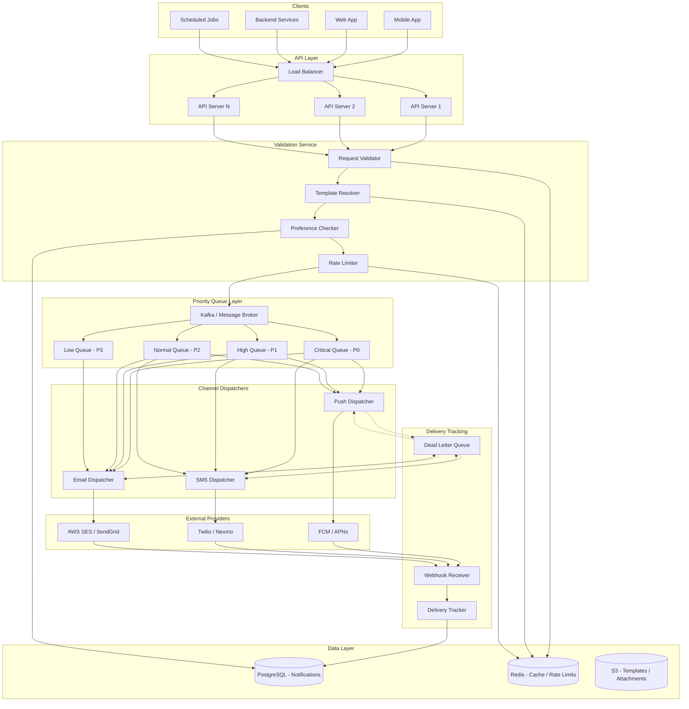
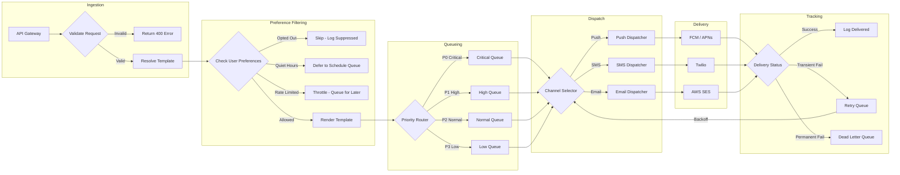
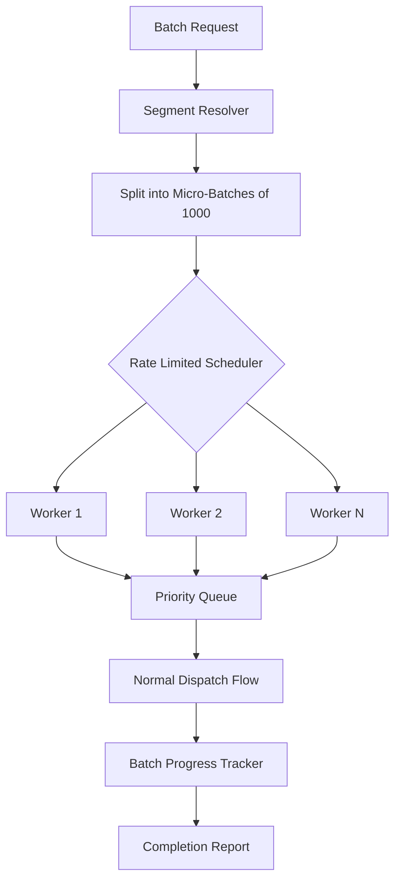

# Notification System - System Design Document

## Table of Contents

1. [Problem Statement](#1-problem-statement)
2. [Functional Requirements](#2-functional-requirements)
3. [Non-Functional Requirements](#3-non-functional-requirements)
4. [Capacity Estimation](#4-capacity-estimation)
5. [API Design](#5-api-design)
6. [Data Model](#6-data-model)
7. [High-Level Architecture](#7-high-level-architecture)
8. [Detailed Design](#8-detailed-design)
9. [Architecture Diagram](#9-architecture-diagram)
10. [Architectural Patterns](#10-architectural-patterns)
11. [Technology Choices](#11-technology-choices)
12. [Scalability](#12-scalability)
13. [Reliability](#13-reliability)
14. [Security](#14-security)
15. [Monitoring](#15-monitoring)

---

## 1. Problem Statement

Modern applications need a centralized, reliable notification system capable of delivering
messages across multiple channels (push notifications, SMS, email) with low latency,
high throughput, and guaranteed delivery. The system must support user preferences,
message templates, scheduling, batch sends, and priority-based delivery while handling
millions of notifications per minute.

**Key challenges:**

- Delivering notifications across heterogeneous channels with different protocols and SLAs
- Guaranteeing at-least-once delivery without overwhelming users with duplicates
- Supporting real-time (<30s) and scheduled delivery modes
- Scaling horizontally to handle traffic spikes (e.g., marketing campaigns, incident alerts)
- Respecting user preferences and regulatory requirements (opt-out, quiet hours)

---

## 2. Functional Requirements

### Core Features

| Feature | Description |
|---|---|
| **Multi-Channel Delivery** | Push notifications (mobile/web), SMS, and email through unified API |
| **Template Engine** | Parameterized templates with variable substitution for consistent messaging |
| **User Preferences** | Per-user channel preferences, opt-in/opt-out, quiet hours, frequency caps |
| **Scheduling** | Schedule notifications for future delivery with timezone awareness |
| **Batch Sends** | Bulk notification delivery to user segments or entire user base |
| **Priority Levels** | Critical, high, normal, low priority with corresponding SLAs |
| **Delivery Tracking** | Real-time status tracking: queued, sent, delivered, failed, bounced |
| **Retry Mechanism** | Automatic retry with exponential backoff for transient failures |

### Notification Lifecycle

1. Client submits notification request via API
2. System validates request, resolves template, checks user preferences
3. Notification enters priority queue
4. Channel dispatcher routes to appropriate provider
5. Delivery status tracked and reported back

### User Preference Options

- **Channel preferences**: Enable/disable per channel (push, SMS, email)
- **Quiet hours**: Do not disturb windows per timezone
- **Frequency caps**: Max notifications per hour/day per channel
- **Category subscriptions**: Opt-in/out per notification category (marketing, alerts, transactional)

---

## 3. Non-Functional Requirements

| Requirement | Target | Notes |
|---|---|---|
| **Throughput** | 1,000,000 notifications/min | Sustained; burst to 2M/min |
| **Real-time Latency** | < 30 seconds | From API call to delivery attempt |
| **Availability** | 99.99% | ~52 min downtime/year |
| **Delivery Guarantee** | At-least-once | With deduplication at consumer |
| **Data Retention** | 90 days delivery logs | 1 year for analytics |
| **Consistency** | Eventual consistency | Across read replicas |
| **Fault Tolerance** | No single point of failure | Active-active across regions |
| **Compliance** | GDPR, CAN-SPAM, TCPA | Opt-out within 24h |

### SLA by Priority

| Priority | Max Latency | Retry Window | Max Retries |
|---|---|---|---|
| Critical | 5 seconds | 1 hour | 10 |
| High | 15 seconds | 4 hours | 5 |
| Normal | 30 seconds | 24 hours | 3 |
| Low | 5 minutes | 48 hours | 2 |

---

## 4. Capacity Estimation

### Traffic Estimates

| Metric | Value |
|---|---|
| Total users | 500 million |
| Daily active users | 100 million |
| Avg notifications/user/day | 10 |
| **Total notifications/day** | **1 billion** |
| Peak QPS | ~17,000 |
| Average QPS | ~11,574 |

### Per-Channel Breakdown

| Channel | % of Total | Notifications/Day | Peak QPS |
|---|---|---|---|
| Push | 60% | 600M | 10,200 |
| Email | 30% | 300M | 5,100 |
| SMS | 10% | 100M | 1,700 |

### Storage Estimates

| Data | Size per Record | Daily Volume | Daily Storage |
|---|---|---|---|
| Notification record | ~500 bytes | 1B | ~500 GB |
| Delivery log entry | ~200 bytes | 1B | ~200 GB |
| Template | ~2 KB | 10K templates | ~20 MB |
| User preferences | ~500 bytes | 500M users | ~250 GB (total) |

### Infrastructure

| Component | Estimate |
|---|---|
| **Message queue** | 50 Kafka brokers (20K msgs/sec each) |
| **API servers** | 100 instances (200 RPS each) |
| **Worker nodes** | 200 per channel (push), 100 (email), 50 (SMS) |
| **Database** | Sharded across 20 nodes |
| **Cache** | 50 Redis nodes (user prefs, templates) |

---

## 5. API Design

### Send Notification

```
POST /api/v1/notifications
```

**Request Body:**

```json
{
    "notification_id": "uuid-v4 (optional, for idempotency)",
    "user_id": "user_12345",
    "template_id": "welcome_v2",
    "template_params": {
        "user_name": "Alice",
        "action_url": "https://app.example.com/verify"
    },
    "channels": ["push", "email"],
    "priority": "high",
    "category": "transactional",
    "scheduled_at": null,
    "metadata": {
        "campaign_id": "onboarding_2024",
        "source": "auth-service"
    }
}
```

**Response:**

```json
{
    "notification_id": "ntf_abc123",
    "status": "queued",
    "created_at": "2024-01-15T10:30:00Z",
    "estimated_delivery": "2024-01-15T10:30:30Z"
}
```

### Batch Send

```
POST /api/v1/notifications/batch
```

```json
{
    "batch_id": "batch_marketing_jan",
    "template_id": "promo_winter_2024",
    "template_params": {"discount": "20%"},
    "user_segment": {
        "filter": {"country": "US", "plan": "free"},
        "exclude_opted_out": true
    },
    "channels": ["email", "push"],
    "priority": "low",
    "schedule": {
        "start_at": "2024-01-20T09:00:00Z",
        "rate_limit": 10000,
        "timezone_aware": true
    }
}
```

### Get Notification Status

```
GET /api/v1/notifications/{notification_id}
```

```json
{
    "notification_id": "ntf_abc123",
    "user_id": "user_12345",
    "status": "delivered",
    "channels": {
        "push": {"status": "delivered", "delivered_at": "2024-01-15T10:30:05Z"},
        "email": {"status": "sent", "sent_at": "2024-01-15T10:30:12Z"}
    },
    "attempts": 1,
    "created_at": "2024-01-15T10:30:00Z"
}
```

### User Preferences

```
PUT /api/v1/users/{user_id}/preferences
```

```json
{
    "channels": {
        "push": {"enabled": true},
        "sms": {"enabled": false},
        "email": {"enabled": true, "frequency_cap": 10}
    },
    "quiet_hours": {
        "enabled": true,
        "start": "22:00",
        "end": "08:00",
        "timezone": "America/New_York"
    },
    "categories": {
        "marketing": false,
        "transactional": true,
        "alerts": true
    }
}
```

### Template Management

```
POST /api/v1/templates
GET /api/v1/templates/{template_id}
PUT /api/v1/templates/{template_id}
```

```json
{
    "template_id": "welcome_v2",
    "name": "Welcome Email",
    "channels": {
        "push": {
            "title": "Welcome, {{user_name}}!",
            "body": "Start exploring your new account."
        },
        "email": {
            "subject": "Welcome to Our Platform, {{user_name}}",
            "html_body": "<h1>Hello {{user_name}}</h1><p>Click <a href='{{action_url}}'>here</a> to get started.</p>",
            "text_body": "Hello {{user_name}}, visit {{action_url}} to get started."
        },
        "sms": {
            "body": "Welcome {{user_name}}! Visit {{action_url}} to get started."
        }
    },
    "category": "transactional",
    "version": 2
}
```

---

## 6. Data Model

### Notifications Table

```sql
CREATE TABLE notifications (
    notification_id     UUID PRIMARY KEY,
    user_id             VARCHAR(64) NOT NULL,
    template_id         VARCHAR(128),
    template_params     JSONB,
    channels            TEXT[],
    priority            ENUM('critical', 'high', 'normal', 'low') DEFAULT 'normal',
    category            VARCHAR(64),
    status              ENUM('pending', 'queued', 'processing', 'completed', 'failed') DEFAULT 'pending',
    scheduled_at        TIMESTAMP,
    created_at          TIMESTAMP DEFAULT NOW(),
    updated_at          TIMESTAMP DEFAULT NOW(),
    metadata            JSONB,
    batch_id            VARCHAR(128),
    idempotency_key     VARCHAR(256) UNIQUE
);

-- Indexes
CREATE INDEX idx_notifications_user ON notifications(user_id, created_at DESC);
CREATE INDEX idx_notifications_status ON notifications(status, priority, created_at);
CREATE INDEX idx_notifications_scheduled ON notifications(scheduled_at) WHERE status = 'pending';
CREATE INDEX idx_notifications_batch ON notifications(batch_id) WHERE batch_id IS NOT NULL;
```

### Templates Table

```sql
CREATE TABLE templates (
    template_id     VARCHAR(128) PRIMARY KEY,
    name            VARCHAR(256) NOT NULL,
    category        VARCHAR(64),
    channel_configs JSONB NOT NULL,
    version         INT DEFAULT 1,
    is_active       BOOLEAN DEFAULT TRUE,
    created_at      TIMESTAMP DEFAULT NOW(),
    updated_at      TIMESTAMP DEFAULT NOW(),
    created_by      VARCHAR(64)
);

CREATE INDEX idx_templates_category ON templates(category, is_active);
```

### User Preferences Table

```sql
CREATE TABLE user_preferences (
    user_id             VARCHAR(64) PRIMARY KEY,
    channel_preferences JSONB DEFAULT '{}',
    quiet_hours         JSONB,
    category_prefs      JSONB DEFAULT '{}',
    frequency_caps      JSONB DEFAULT '{}',
    timezone            VARCHAR(64) DEFAULT 'UTC',
    updated_at          TIMESTAMP DEFAULT NOW()
);
```

### Delivery Log Table

```sql
CREATE TABLE delivery_log (
    log_id          UUID PRIMARY KEY,
    notification_id UUID NOT NULL REFERENCES notifications(notification_id),
    channel         ENUM('push', 'sms', 'email') NOT NULL,
    provider        VARCHAR(64),
    status          ENUM('queued', 'sent', 'delivered', 'failed', 'bounced', 'rejected') NOT NULL,
    attempt_number  INT DEFAULT 1,
    provider_msg_id VARCHAR(256),
    error_code      VARCHAR(32),
    error_message   TEXT,
    latency_ms      INT,
    created_at      TIMESTAMP DEFAULT NOW()
);

-- Indexes
CREATE INDEX idx_delivery_notification ON delivery_log(notification_id);
CREATE INDEX idx_delivery_status ON delivery_log(status, created_at);
CREATE INDEX idx_delivery_channel ON delivery_log(channel, status, created_at);
```

### Entity Relationship

```
notifications (1) ---< (N) delivery_log
notifications (N) >--- (1) templates
user_preferences (1) --- (1) users [external]
```

---

## 7. High-Level Architecture



### Component Responsibilities

| Component | Responsibility |
|---|---|
| **API Layer** | Accept requests, authenticate, rate-limit at API level |
| **Validation Service** | Validate payloads, resolve templates, check preferences |
| **Template Resolver** | Fetch and render templates with provided parameters |
| **Preference Checker** | Filter channels based on user opt-in/out and quiet hours |
| **Rate Limiter** | Enforce per-user and per-channel frequency caps |
| **Priority Queue** | Separate queues per priority for SLA guarantees |
| **Channel Dispatchers** | Transform and deliver via channel-specific protocols |
| **Delivery Tracker** | Record delivery outcomes, trigger retries on failure |
| **Dead Letter Queue** | Store permanently failed messages for manual review |

---

## 8. Detailed Design

### 8.1 Priority Handling

The system uses **separate Kafka topics per priority level**, each with dedicated consumer
groups and different polling intervals:

```
Topic: notifications.critical  ->  Consumer group with 50 partitions, 0ms poll
Topic: notifications.high      ->  Consumer group with 30 partitions, 100ms poll
Topic: notifications.normal    ->  Consumer group with 20 partitions, 500ms poll
Topic: notifications.low       ->  Consumer group with 10 partitions, 2s poll
```

**Priority escalation:** If a normal-priority notification has been queued for >80% of
its SLA window, it is promoted to the high-priority topic.

**Resource allocation:** Critical and high priority consumers get dedicated thread pools
(never starved by low-priority traffic).

### 8.2 Rate Limiting Per User

Rate limiting operates at two levels:

1. **API-level rate limiting**: Token bucket per API key (e.g., 1000 req/sec)
2. **Per-user delivery rate limiting**: Sliding window per user per channel

```
Redis key: rate:{user_id}:{channel}:{window}
Example:   rate:user_123:push:hourly -> count=4, limit=10

Algorithm: Sliding Window Counter
- Divide time into fixed windows (1-minute granularity)
- Maintain count in current + previous window
- Weight previous window by overlap percentage
- Reject if weighted count exceeds limit
```

**Quiet hours enforcement:**

```python
def is_quiet_hours(user_prefs, current_time):
    tz = pytz.timezone(user_prefs.timezone)
    local_time = current_time.astimezone(tz).time()
    start = user_prefs.quiet_hours.start  # e.g., 22:00
    end = user_prefs.quiet_hours.end      # e.g., 08:00
    if start > end:  # crosses midnight
        return local_time >= start or local_time <= end
    return start <= local_time <= end
```

Notifications arriving during quiet hours are deferred to a scheduled delivery queue
and dispatched when the quiet window ends.

### 8.3 Template Rendering

Templates use **Mustache-style** variable substitution with a two-layer cache:

```
Layer 1: Local in-memory cache (LRU, 1000 templates, 5-min TTL)
Layer 2: Redis cache (all active templates, 1-hour TTL)
Layer 3: PostgreSQL (source of truth)
```

**Rendering pipeline:**

1. Fetch template by `template_id` (check cache layers)
2. Select channel-specific content block
3. Substitute `{{variable}}` placeholders with `template_params`
4. Apply safety: HTML-escape for email, truncate for SMS (160 chars)
5. Return rendered content per channel

**Template versioning:** Templates are versioned. Notifications reference a specific
version; the latest active version is used if not specified.

### 8.4 Retry with Exponential Backoff

```
Retry delay = base_delay * (2 ^ attempt) + random_jitter

Where:
  base_delay  = 1 second (critical), 5 seconds (high), 30 seconds (normal)
  max_delay   = 60 seconds (critical), 300 seconds (high), 3600 seconds (normal)
  jitter      = random(0, 0.5 * computed_delay)
```

**Retry flow:**

```
Attempt 1: Immediate
Attempt 2: ~2s   + jitter  (critical) | ~10s   + jitter (high)
Attempt 3: ~4s   + jitter  (critical) | ~20s   + jitter (high)
Attempt 4: ~8s   + jitter  (critical) | ~40s   + jitter (high)
...
Max attempts reached -> Move to Dead Letter Queue
```

**Retry classification:**

| Error Type | Retryable | Action |
|---|---|---|
| Network timeout | Yes | Retry with backoff |
| 429 Too Many Requests | Yes | Retry after `Retry-After` header |
| 500 Server Error | Yes | Retry with backoff |
| 400 Bad Request | No | Fail immediately, log error |
| Invalid token/device | No | Fail, mark device as inactive |
| Provider outage | Yes | Circuit breaker, failover |

---

## 9. Architecture Diagram

### Notification Processing Flow



### Batch Processing Flow



---

## 10. Architectural Patterns

### 10.1 Publisher/Subscriber Pattern

The core message flow uses pub/sub to decouple producers from consumers:

- **Publishers**: API servers publish notification events to Kafka topics
- **Subscribers**: Channel dispatchers subscribe to relevant topics
- **Benefits**: Independent scaling, loose coupling, replay capability

```
API Server --publish--> [Kafka Topic: notifications.high]
                              |
              +---------------+---------------+
              |               |               |
         Push Consumer   SMS Consumer   Email Consumer
```

Multiple consumer groups per topic allow each channel to process independently
at its own pace without blocking others.

### 10.2 Strategy Pattern (Channel Selection)

Each delivery channel implements a common `NotificationChannel` interface, allowing
the dispatcher to select the appropriate strategy at runtime:

```python
class NotificationChannel(ABC):
    @abstractmethod
    def send(self, recipient, content) -> DeliveryResult: ...

    @abstractmethod
    def validate_recipient(self, recipient) -> bool: ...

class PushChannel(NotificationChannel): ...
class SMSChannel(NotificationChannel): ...
class EmailChannel(NotificationChannel): ...

# Runtime selection
channel = channel_registry[notification.channel_type]
result = channel.send(recipient, rendered_content)
```

**Benefits**: Adding a new channel (e.g., WhatsApp, Slack) requires only implementing
the interface and registering it, with zero changes to the core dispatch logic.

### 10.3 Template Method Pattern

The notification processing pipeline follows a fixed sequence of steps with
channel-specific customization points:

```python
class NotificationProcessor:
    def process(self, notification):
        self.validate(notification)         # Common
        self.check_preferences(notification) # Common
        content = self.render(notification)  # Channel-specific rendering
        self.enqueue(notification, content)  # Common (priority-based)

    @abstractmethod
    def render(self, notification): ...     # Subclass overrides
```

### 10.4 Circuit Breaker Pattern

External provider calls are wrapped in circuit breakers to prevent cascade failures:

```
States:
  CLOSED   -> Normal operation, requests pass through
  OPEN     -> Provider down, fail fast (no requests sent)
  HALF_OPEN -> Test with limited requests, transition to CLOSED if healthy

Thresholds:
  failure_threshold = 5 failures in 60 seconds -> OPEN
  recovery_timeout  = 30 seconds -> HALF_OPEN
  success_threshold = 3 consecutive successes -> CLOSED
```

When a circuit opens for a provider:

1. Notifications queue up (bounded buffer)
2. If a fallback provider exists, traffic shifts there
3. Alerts fire to on-call team
4. After recovery timeout, probe requests test recovery

---

## 11. Technology Choices

### Message Broker: Apache Kafka

| Factor | Kafka | RabbitMQ |
|---|---|---|
| Throughput | Millions/sec | ~50K/sec |
| Message replay | Yes (log-based) | No |
| Ordering | Per-partition | Per-queue |
| Consumer groups | Built-in | Plugin |
| **Verdict** | **Selected** | Better for low-latency RPC |

**Why Kafka**: At 1M notifications/min, Kafka's log-based architecture provides the
throughput, replay capability (for reprocessing failures), and partition-based
ordering we need. Consumer groups allow each channel to scale independently.

### Push Notifications

| Provider | Platform | Notes |
|---|---|---|
| **Firebase Cloud Messaging (FCM)** | Android, Web | Free, supports topics and conditions |
| **Apple Push Notification service (APNs)** | iOS, macOS | Required for Apple devices |

Both are used together. The push dispatcher maintains persistent connections to both
services and routes based on device platform.

### SMS: Twilio

| Factor | Twilio | Nexmo/Vonage | AWS SNS |
|---|---|---|---|
| Global reach | 180+ countries | 200+ countries | Limited |
| Delivery reports | Real-time webhooks | Webhooks | CloudWatch |
| Pricing | Per-message | Per-message | Per-message |
| **Verdict** | **Primary** | Fallback | Not selected |

### Email: AWS SES

| Factor | AWS SES | SendGrid | Mailgun |
|---|---|---|---|
| Cost at scale | $0.10/1000 | $0.50/1000 | $0.80/1000 |
| Deliverability | High (with warm-up) | Very high | High |
| API quality | Good | Excellent | Good |
| **Verdict** | **Primary** | Fallback | Not selected |

### Database and Cache

- **PostgreSQL**: Notifications, templates, preferences (JSONB support, mature ecosystem)
- **Redis**: Rate limiting (sliding windows), template cache, user preference cache, dedup keys
- **S3**: Email template assets, attachment storage, delivery log archives

---

## 12. Scalability

### Horizontal Scaling Strategy

```
                    Scaling Dimension
Component           | Mechanism            | Trigger
--------------------|----------------------|------------------
API Servers         | Auto-scale pods      | CPU > 70%
Kafka Partitions    | Add partitions       | Consumer lag > 10K
Push Dispatchers    | Scale consumers      | Queue depth > 5K
SMS Dispatchers     | Scale consumers      | Queue depth > 1K
Email Dispatchers   | Scale consumers      | Queue depth > 10K
PostgreSQL          | Read replicas + sharding | QPS > 50K
Redis               | Cluster mode         | Memory > 75%
```

### Sharding Strategy

Notifications are sharded by `user_id` (consistent hashing):

- **Benefit**: All notifications for a user are on the same shard (efficient queries)
- **Rebalancing**: Virtual nodes minimize data movement when adding shards
- **Hot users**: Dedicated shard for users exceeding 10x average volume

### Batch Processing Scale

Large batch sends (>1M recipients) are processed through a dedicated pipeline:

1. Segment query runs against read replica
2. User list is split into micro-batches (1000 users each)
3. Micro-batches are distributed across workers via Kafka
4. Each worker resolves preferences and enqueues notifications
5. Rate limiter ensures sustained throughput does not exceed 50% of total capacity

---

## 13. Reliability

### 13.1 Deduplication

Duplicate notifications are prevented at multiple levels:

**Idempotency key at API level:**

```
Redis key: idemp:{idempotency_key} -> notification_id
TTL: 24 hours
```

If a request arrives with a previously seen idempotency key, the existing
notification_id is returned without creating a duplicate.

**Message-level dedup at consumer:**

```
Redis key: dedup:{notification_id}:{channel} -> 1
TTL: 1 hour
```

Before dispatching, consumers check if the notification was already sent for
that channel. This handles Kafka redeliveries (at-least-once semantics).

### 13.2 Idempotency

All provider API calls use provider-specific idempotency mechanisms:

- **FCM**: `message_id` field prevents duplicate delivery
- **Twilio**: Idempotency header with unique request ID
- **SES**: `MessageDeduplicationId` for FIFO topics

### 13.3 Dead Letter Queue (DLQ)

Notifications that exhaust all retry attempts are moved to a DLQ:

```
Kafka Topic: notifications.dlq

DLQ Record:
{
    "notification_id": "ntf_abc123",
    "channel": "sms",
    "last_error": "Provider timeout after 30s",
    "attempts": 5,
    "first_attempt": "2024-01-15T10:30:00Z",
    "last_attempt": "2024-01-15T14:30:00Z",
    "original_message": { ... }
}
```

**DLQ processing:**

1. Automated: Re-attempt DLQ messages every 6 hours (provider may have recovered)
2. Manual: Dashboard for operators to inspect, retry, or discard
3. Alerting: If DLQ depth > threshold, page on-call

### 13.4 Failure Modes and Recovery

| Failure | Impact | Recovery |
|---|---|---|
| API server crash | Requests fail | Load balancer routes to healthy instances |
| Kafka broker down | Temporary queue delay | Replication factor 3, auto-leader election |
| Provider outage | Channel unavailable | Circuit breaker, fallback provider |
| Database failure | No new writes | Failover to standby, queue buffers |
| Redis failure | No rate limiting | Graceful degradation, allow through |

---

## 14. Security

### Authentication and Authorization

- **API authentication**: OAuth 2.0 bearer tokens with scoped permissions
- **Service-to-service**: mTLS with certificate rotation
- **API keys**: Per-client keys with rate limits and channel restrictions

### Data Protection

- **Encryption at rest**: AES-256 for database, S3 server-side encryption
- **Encryption in transit**: TLS 1.3 for all connections
- **PII handling**: User contact info (phone, email) encrypted with application-level encryption; decrypted only at dispatch time
- **Data retention**: Auto-purge delivery logs after 90 days; anonymize after 30 days

### Compliance

| Regulation | Requirement | Implementation |
|---|---|---|
| **GDPR** | Right to erasure | Delete all notification data on user request |
| **CAN-SPAM** | Unsubscribe in emails | One-click unsubscribe header + footer link |
| **TCPA** | SMS consent | Explicit opt-in stored with timestamp |
| **SOC 2** | Audit trail | Immutable audit log for all preference changes |

### Abuse Prevention

- Rate limiting per API key and per user
- Content scanning for phishing/spam in templates
- Anomaly detection: Alert if notification volume exceeds 3x baseline
- IP allowlisting for admin API endpoints

---

## 15. Monitoring

### Key Metrics

| Category | Metric | Alert Threshold |
|---|---|---|
| **Throughput** | Notifications sent/min | < 800K (20% below target) |
| **Latency** | P50, P95, P99 end-to-end | P99 > 45s |
| **Delivery Rate** | % successfully delivered | < 98% (push), < 95% (SMS), < 97% (email) |
| **Error Rate** | Failed deliveries/min | > 1% of throughput |
| **Queue Depth** | Messages pending per priority | Critical > 100, Normal > 10K |
| **DLQ Depth** | Messages in dead letter queue | > 1000 |
| **Provider Latency** | Per-provider response time | P95 > 5s |
| **Circuit Breaker** | Open circuit events | Any OPEN state |

### Dashboards

1. **Real-time Operations**: Throughput, latency heatmap, error rates, queue depths
2. **Channel Health**: Per-channel delivery rates, provider status, circuit breaker states
3. **User Impact**: Notifications per user distribution, suppression reasons, opt-out trends
4. **Batch Tracking**: Active batches, progress, completion estimates

### Alerting Tiers

| Tier | Response | Examples |
|---|---|---|
| **P0 - Critical** | Page on-call, 5-min response | All channels down, DLQ overflow |
| **P1 - High** | Slack alert, 15-min response | Single channel degraded, high error rate |
| **P2 - Medium** | Ticket created, 4-hour response | Elevated latency, provider slowdown |
| **P3 - Low** | Weekly review | Delivery rate slightly below target |

### Logging

- Structured JSON logs with correlation IDs
- Distributed tracing (OpenTelemetry) across the full notification lifecycle
- Log levels: ERROR for failures, WARN for retries/throttles, INFO for delivery confirmations
- Sensitive data (phone numbers, emails) masked in logs

### Health Checks

```
GET /health         -> Basic liveness
GET /health/ready   -> Readiness (DB + Kafka + Redis connectivity)
GET /health/deep    -> Full dependency check including providers
```
