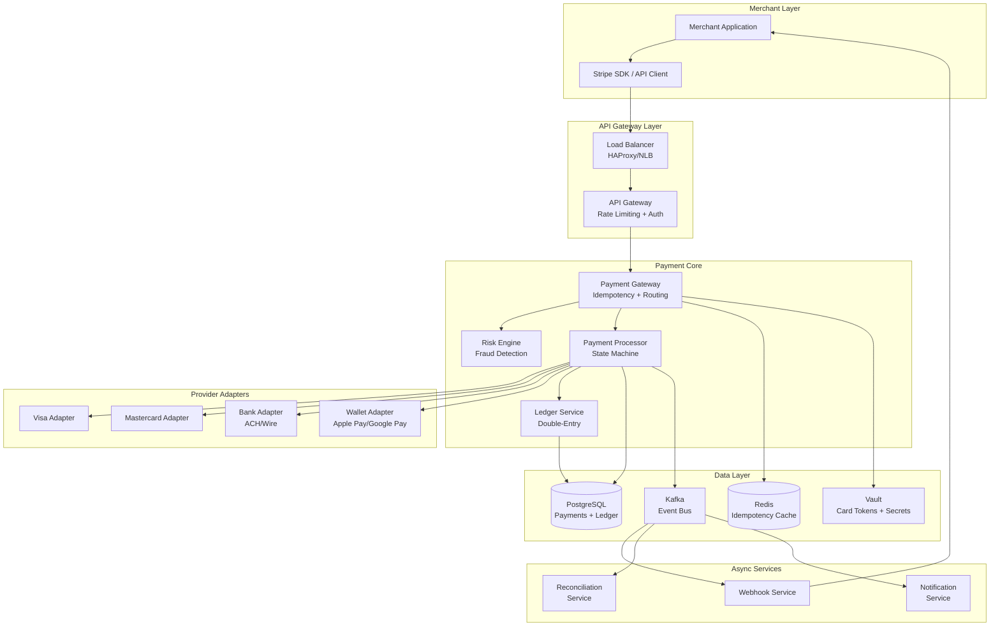
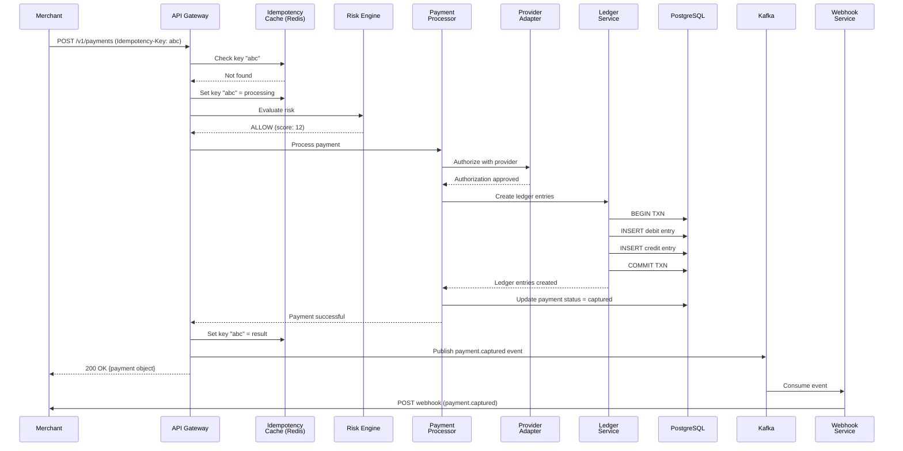

# Payment System (Stripe-like) - System Design

## 1. Problem Statement

Design a payment processing platform similar to Stripe that enables merchants to accept online payments securely and reliably. The system must handle the full payment lifecycle: authorization, capture, settlement, and refunds. It must guarantee exactly-once payment processing, maintain a consistent financial ledger, and integrate with multiple external payment providers (card networks, banks, digital wallets) while abstracting away their complexity behind a unified API.

Key challenges:
- **Financial correctness**: Every cent must be accounted for; no money can be created or lost
- **Idempotency**: Network retries must never result in duplicate charges
- **Reliability**: Payment failures must be handled gracefully with clear state transitions
- **Compliance**: PCI-DSS requirements demand strict data handling and audit trails
- **Multi-provider routing**: Intelligent routing across payment processors for cost and reliability

---

## 2. Functional Requirements

| ID | Requirement | Description |
|----|-------------|-------------|
| FR-1 | **Process Payments** | Accept payment requests with amount, currency, payment method, and merchant context. Support authorize-only and authorize+capture flows. |
| FR-2 | **Refunds** | Full and partial refunds with idempotency. Refunds decrement the original transaction and create corresponding ledger entries. |
| FR-3 | **Idempotent Requests** | Every mutating API call accepts an `Idempotency-Key` header. Repeated calls with the same key return the cached result without re-processing. |
| FR-4 | **Payment Methods** | Support credit/debit cards, bank transfers (ACH), and digital wallets. Store tokenized references (never raw card numbers). |
| FR-5 | **Transaction History** | Queryable log of all payment events per merchant with filtering by status, date range, and amount. |
| FR-6 | **Webhooks** | Notify merchants of asynchronous events (payment succeeded, refund completed, dispute opened) via configurable webhook endpoints with retry logic. |
| FR-7 | **Payment State Machine** | Payments transition through well-defined states: `CREATED -> AUTHORIZED -> CAPTURED -> SETTLED` or `CREATED -> FAILED`. Refunds: `REFUND_INITIATED -> REFUND_COMPLETED`. |
| FR-8 | **Reconciliation** | Daily reconciliation between internal ledger and external provider settlement reports. |

---

## 3. Non-Functional Requirements

| ID | Requirement | Target |
|----|-------------|--------|
| NFR-1 | **Exactly-once processing** | Idempotency keys + transactional outbox ensure no duplicate charges even under retries and crashes. |
| NFR-2 | **Latency** | p99 < 500ms for payment authorization (excluding external provider latency). |
| NFR-3 | **Availability** | 99.999% uptime for the critical payment path (5.26 minutes downtime/year). |
| NFR-4 | **PCI Compliance** | PCI-DSS Level 1: tokenize card data, encrypt at rest (AES-256) and in transit (TLS 1.3), restrict access, maintain audit logs. |
| NFR-5 | **Consistency** | Strong consistency for payment state transitions and ledger entries (serializable isolation). |
| NFR-6 | **Durability** | Zero data loss for financial transactions. WAL + synchronous replication. |
| NFR-7 | **Throughput** | Handle 10,000+ transactions per second at peak. |
| NFR-8 | **Auditability** | Immutable append-only audit log for every state change. |

---

## 4. Capacity Estimation

### Transaction Volume
| Metric | Value |
|--------|-------|
| Average TPS | 3,000 |
| Peak TPS | 10,000 |
| Daily transactions | ~260 million |
| Monthly transactions | ~7.8 billion |

### Storage Estimation
| Data | Size per record | Daily volume | Daily storage |
|------|----------------|--------------|---------------|
| Payment records | ~1 KB | 260M | ~250 GB |
| Ledger entries (2 per txn) | ~500 B | 520M | ~250 GB |
| Audit log entries | ~300 B | 1B+ | ~300 GB |
| Webhook delivery logs | ~200 B | 520M | ~100 GB |
| **Total daily** | | | **~900 GB** |

### Reconciliation Volume
- Daily: ~260M transactions to reconcile across providers
- Batch window: 2-4 hours (off-peak)
- Discrepancy rate target: < 0.001%

### Network Bandwidth
- Inbound API requests: ~50 MB/s average, ~170 MB/s peak
- Outbound webhooks: ~30 MB/s average
- Provider API calls: ~40 MB/s average

---

## 5. API Design

### Create Payment
```
POST /v1/payments
Headers:
  Authorization: Bearer sk_live_xxx
  Idempotency-Key: unique-request-id-123

{
  "amount": 5000,           // in smallest currency unit (cents)
  "currency": "usd",
  "payment_method_id": "pm_card_visa_4242",
  "capture": true,           // false for auth-only
  "description": "Order #1234",
  "metadata": {
    "order_id": "ord_abc123"
  }
}

Response 200:
{
  "id": "pay_8hx92kA3bF",
  "status": "captured",
  "amount": 5000,
  "currency": "usd",
  "payment_method_id": "pm_card_visa_4242",
  "created_at": "2024-01-15T10:30:00Z",
  "idempotency_key": "unique-request-id-123"
}
```

### Capture Payment (for auth-only flows)
```
POST /v1/payments/{payment_id}/capture
Headers:
  Idempotency-Key: capture-key-456

{
  "amount": 5000   // optional: can capture less than authorized
}
```

### Create Refund
```
POST /v1/refunds
Headers:
  Idempotency-Key: refund-key-789

{
  "payment_id": "pay_8hx92kA3bF",
  "amount": 2500,   // partial refund; omit for full
  "reason": "customer_request"
}

Response 200:
{
  "id": "ref_3kL9mN2pQ",
  "payment_id": "pay_8hx92kA3bF",
  "amount": 2500,
  "status": "refund_completed",
  "created_at": "2024-01-15T11:00:00Z"
}
```

### List Transactions
```
GET /v1/payments?status=captured&created_gte=2024-01-01&limit=50

Response 200:
{
  "data": [ ... ],
  "has_more": true,
  "next_cursor": "pay_xxx"
}
```

### Register Webhook
```
POST /v1/webhooks
{
  "url": "https://merchant.com/stripe-webhook",
  "events": ["payment.captured", "refund.completed", "dispute.opened"],
  "secret": "whsec_xxx"
}
```

---

## 6. Data Model

### payments
```sql
CREATE TABLE payments (
    id              VARCHAR(26) PRIMARY KEY,    -- ULID for sortability
    merchant_id     VARCHAR(26) NOT NULL,
    amount          BIGINT NOT NULL,            -- cents
    currency        VARCHAR(3) NOT NULL,
    status          VARCHAR(20) NOT NULL,       -- created/authorized/captured/settled/failed
    payment_method_id VARCHAR(26),
    idempotency_key VARCHAR(255) UNIQUE,
    description     TEXT,
    metadata        JSONB,
    failure_code    VARCHAR(50),
    failure_message TEXT,
    captured_amount BIGINT DEFAULT 0,
    refunded_amount BIGINT DEFAULT 0,
    created_at      TIMESTAMPTZ NOT NULL DEFAULT NOW(),
    updated_at      TIMESTAMPTZ NOT NULL DEFAULT NOW(),
    version         INT NOT NULL DEFAULT 1      -- optimistic locking
);
CREATE INDEX idx_payments_merchant ON payments(merchant_id, created_at DESC);
CREATE INDEX idx_payments_idempotency ON payments(idempotency_key);
CREATE INDEX idx_payments_status ON payments(status, created_at);
```

### payment_methods
```sql
CREATE TABLE payment_methods (
    id              VARCHAR(26) PRIMARY KEY,
    merchant_id     VARCHAR(26) NOT NULL,
    type            VARCHAR(20) NOT NULL,       -- card/bank_account/wallet
    token           VARCHAR(255) NOT NULL,      -- tokenized reference from vault
    last_four       VARCHAR(4),
    brand           VARCHAR(20),                -- visa/mastercard/amex
    exp_month       SMALLINT,
    exp_year        SMALLINT,
    billing_address JSONB,
    is_default      BOOLEAN DEFAULT FALSE,
    created_at      TIMESTAMPTZ NOT NULL DEFAULT NOW()
);
```

### transactions (event log)
```sql
CREATE TABLE transactions (
    id              VARCHAR(26) PRIMARY KEY,
    payment_id      VARCHAR(26) NOT NULL REFERENCES payments(id),
    type            VARCHAR(20) NOT NULL,       -- authorization/capture/refund/void
    amount          BIGINT NOT NULL,
    status          VARCHAR(20) NOT NULL,       -- pending/success/failed
    provider        VARCHAR(50),
    provider_txn_id VARCHAR(255),
    error_code      VARCHAR(50),
    error_message   TEXT,
    created_at      TIMESTAMPTZ NOT NULL DEFAULT NOW()
);
CREATE INDEX idx_transactions_payment ON transactions(payment_id, created_at);
```

### ledger_entries (double-entry bookkeeping)
```sql
CREATE TABLE ledger_entries (
    id              VARCHAR(26) PRIMARY KEY,
    transaction_id  VARCHAR(26) NOT NULL REFERENCES transactions(id),
    account_id      VARCHAR(50) NOT NULL,       -- e.g., "merchant:m_123", "platform:fees"
    entry_type      VARCHAR(10) NOT NULL,       -- DEBIT or CREDIT
    amount          BIGINT NOT NULL,            -- always positive
    currency        VARCHAR(3) NOT NULL,
    balance_after   BIGINT NOT NULL,            -- running balance for this account
    created_at      TIMESTAMPTZ NOT NULL DEFAULT NOW()
);
CREATE INDEX idx_ledger_account ON ledger_entries(account_id, created_at);
-- Invariant: SUM(debits) == SUM(credits) for every transaction_id
```

### webhooks
```sql
CREATE TABLE webhook_endpoints (
    id              VARCHAR(26) PRIMARY KEY,
    merchant_id     VARCHAR(26) NOT NULL,
    url             TEXT NOT NULL,
    secret          VARCHAR(64) NOT NULL,
    events          TEXT[] NOT NULL,             -- subscribed event types
    active          BOOLEAN DEFAULT TRUE,
    created_at      TIMESTAMPTZ NOT NULL DEFAULT NOW()
);

CREATE TABLE webhook_deliveries (
    id              VARCHAR(26) PRIMARY KEY,
    endpoint_id     VARCHAR(26) NOT NULL REFERENCES webhook_endpoints(id),
    event_type      VARCHAR(50) NOT NULL,
    payload         JSONB NOT NULL,
    status          VARCHAR(20) NOT NULL,       -- pending/delivered/failed
    attempts        INT DEFAULT 0,
    next_retry_at   TIMESTAMPTZ,
    last_response_code INT,
    created_at      TIMESTAMPTZ NOT NULL DEFAULT NOW()
);
CREATE INDEX idx_deliveries_retry ON webhook_deliveries(status, next_retry_at)
    WHERE status = 'pending';
```

---

## 7. High-Level Architecture



---

## 8. Detailed Design

### 8.1 Double-Entry Ledger

Every financial movement creates exactly **two** ledger entries that sum to zero:

```
Payment Captured ($50.00):
  DEBIT   customer:cust_123       $50.00   (money leaves customer)
  CREDIT  merchant:merch_456      $48.55   (merchant receives net)
  CREDIT  platform:fees           $1.45    (platform fee)

Refund ($20.00):
  DEBIT   merchant:merch_456      $20.00   (money leaves merchant)
  CREDIT  customer:cust_123       $20.00   (money returns to customer)
```

All entries for a transaction are inserted in a **single database transaction** with serializable isolation. An invariant check trigger verifies `SUM(debits) = SUM(credits)` per transaction.

### 8.2 Idempotency Key Handling

```
1. Client sends request with Idempotency-Key header
2. Gateway checks Redis for existing key:
   a. Key EXISTS with result  -> return cached result (200)
   b. Key EXISTS with "processing" -> return 409 Conflict
   c. Key NOT FOUND -> proceed to step 3
3. Set key = "processing" in Redis (with TTL = 24h)
4. Process payment through state machine
5. Store result in Redis under the key
6. Also persist idempotency_key in payments table for durability
7. Return result to client
```

Idempotency keys expire after 24 hours. The `processing` sentinel prevents concurrent requests with the same key from creating race conditions.

### 8.3 Payment State Machine

```
                    +--------+
                    | CREATED|
                    +---+----+
                        |
              +---------+---------+
              |                   |
         (authorize)         (auth fails)
              |                   |
        +-----v-----+      +-----v----+
        | AUTHORIZED |      |  FAILED  |
        +-----+-----+      +----------+
              |
         (capture)
              |
        +-----v-----+
        |  CAPTURED  |
        +-----+-----+
              |
         (settle)
              |
        +-----v-----+      +------------------+
        |  SETTLED   |      | REFUND_INITIATED |
        +-----+-----+      +--------+---------+
              |                      |
         (refund)               (complete)
              |                      |
        +-----v-----------+  +------v-----------+
        | PARTIALLY_REFUND|  | REFUND_COMPLETED |
        +-----------------+  +------------------+
```

Valid transitions are enforced at the application level:
- `CREATED -> AUTHORIZED | FAILED`
- `AUTHORIZED -> CAPTURED | FAILED`
- `CAPTURED -> SETTLED | PARTIALLY_REFUNDED`
- `SETTLED -> PARTIALLY_REFUNDED`
- `PARTIALLY_REFUNDED -> FULLY_REFUNDED`

### 8.4 Retry with Idempotency

External provider calls use exponential backoff with jitter:

```python
def call_provider_with_retry(provider, request, max_retries=3):
    for attempt in range(max_retries):
        try:
            response = provider.process(request)
            if response.is_success or response.is_hard_decline:
                return response
            # Soft decline: retry
        except TimeoutError:
            pass  # retry
        except ConnectionError:
            pass  # retry

        delay = min(2 ** attempt + random.uniform(0, 1), 30)
        time.sleep(delay)

    return ProviderResponse(status="failed", error="max_retries_exceeded")
```

The provider itself uses the **same idempotency key** we received from the merchant, ensuring the external system also deduplicates.

### 8.5 Reconciliation

Daily batch job:
1. Pull settlement files from each payment provider
2. Match each provider transaction against internal ledger entries
3. Categorize discrepancies:
   - **Missing internal**: Provider reports a txn we don't have (investigate)
   - **Missing external**: We have a txn the provider doesn't report (pending settlement or error)
   - **Amount mismatch**: Different amounts between our records and provider
4. Auto-resolve known patterns (timing differences, currency rounding)
5. Flag unresolved discrepancies for manual review
6. Generate reconciliation report with match rate and exception details

---

## 9. Architecture Diagram



---

## 10. Architectural Patterns

### 10.1 Double-Entry Bookkeeping
Every financial transaction creates balanced debit and credit entries. This ensures the fundamental accounting equation holds (`Assets = Liabilities + Equity`) and makes it impossible for money to appear or disappear. The ledger is append-only; corrections are made via new reversing entries, never by modifying existing ones.

### 10.2 Saga Pattern
Payment processing spans multiple services (risk check, provider authorization, ledger update). We use an **orchestration-based saga** where the Payment Processor acts as the saga coordinator. If any step fails, compensating transactions are executed in reverse order (e.g., void an authorization if ledger insert fails).

### 10.3 Idempotency Pattern
Every API endpoint accepts an idempotency key. The system stores the key alongside the request fingerprint and result. Subsequent identical requests return the stored result without re-execution. This is critical in payment systems where network issues can cause client retries.

### 10.4 State Machine Pattern
Payments follow a strict state machine with defined transitions. Invalid transitions are rejected. This prevents illegal operations (e.g., refunding a payment that was never captured) and provides a clear audit trail of the payment lifecycle.

### 10.5 Adapter Pattern
Each payment provider (Visa, Mastercard, ACH, wallets) has its own adapter implementing a common `PaymentProviderPort` interface. This decouples business logic from provider-specific protocols and allows adding new providers without modifying core payment processing logic.

### 10.6 Transactional Outbox Pattern
To guarantee that database writes and event publishes are atomic, we write events to an `outbox` table within the same database transaction. A separate relay process polls the outbox and publishes to Kafka, then marks the outbox entry as published.

---

## 11. Technology Choices

| Component | Technology | Rationale |
|-----------|-----------|-----------|
| **Primary Database** | PostgreSQL | ACID guarantees, serializable isolation, JSONB support for metadata, mature replication |
| **Event Bus** | Apache Kafka | Durable, ordered event streaming with exactly-once semantics (via transactions), supports replay for reconciliation |
| **Idempotency Cache** | Redis Cluster | Sub-millisecond reads for idempotency checks, TTL support for key expiry |
| **Secrets Management** | HashiCorp Vault | Card token storage, encryption key management, dynamic database credentials |
| **API Gateway** | Kong / Envoy | Rate limiting, authentication, request routing, TLS termination |
| **Container Orchestration** | Kubernetes | Auto-scaling based on TPS, rolling deployments for zero-downtime updates |
| **Monitoring** | Prometheus + Grafana | Real-time metrics dashboards, alerting on payment success rates |
| **Tracing** | Jaeger / OpenTelemetry | Distributed tracing across microservices for latency analysis |
| **Log Aggregation** | ELK Stack | Centralized logging with PCI-compliant field masking |

---

## 12. Scalability

### Horizontal Scaling
- **Stateless services**: Payment Gateway, Risk Engine, and Webhook Service scale horizontally behind load balancers
- **Database sharding**: Shard payments table by `merchant_id` using consistent hashing. Each shard is a PostgreSQL cluster with read replicas
- **Kafka partitioning**: Partition payment events by `payment_id` to ensure ordered processing per payment

### Read/Write Separation
- Write path: Primary PostgreSQL nodes (synchronous replication to standby)
- Read path: Read replicas for transaction history queries, dashboard analytics
- Ledger queries always go to primary (strong consistency required)

### Caching Strategy
- **L1 Cache**: In-process LRU cache for payment method tokens (TTL: 5 min)
- **L2 Cache**: Redis for idempotency keys, rate limiting counters, session data
- **No caching**: Payment status is never cached; always read from primary DB

### Auto-Scaling Policies
- Scale payment processors when average CPU > 60% or request queue depth > 100
- Scale webhook workers when delivery queue backlog > 10,000
- Pre-scale 2x capacity before known high-traffic events (Black Friday, etc.)

---

## 13. Reliability

### Failure Handling
- **Circuit Breaker**: Per-provider circuit breaker. If a provider exceeds 50% error rate over 30s, trip the breaker and route to backup provider
- **Fallback Routing**: Primary -> Secondary -> Tertiary provider chain per payment method type
- **Timeout Budget**: Total request budget = 5s. Allocate 200ms for risk, 3s for provider, 500ms for ledger, remainder for overhead

### Data Durability
- PostgreSQL synchronous replication to at least one standby
- WAL archiving to S3 for point-in-time recovery
- Kafka replication factor = 3, min.insync.replicas = 2
- Daily encrypted database backups with monthly restore tests

### Disaster Recovery
- Active-passive across two regions (RPO < 1s, RTO < 30s for payment path)
- DNS failover via Route 53 health checks
- Provider adapter connection pools pre-warmed in standby region

### Idempotency as Reliability
Even if the system crashes mid-transaction, the idempotency key ensures a retry from the client will either:
1. Find the completed result and return it, OR
2. Find the `processing` sentinel, wait, and then return the result, OR
3. Find nothing (crash before Redis write), safely re-process the payment

---

## 14. Security

### PCI-DSS Compliance
- **Tokenization**: Raw card numbers never enter the system. Card data goes directly to a PCI-certified vault, which returns a token
- **Encryption**: AES-256 for data at rest, TLS 1.3 for data in transit
- **Network Segmentation**: Payment processing runs in an isolated VPC with no internet egress except to approved provider IPs
- **Access Control**: RBAC with principle of least privilege. API keys are scoped per merchant and environment (live/test)

### Fraud Prevention
- Real-time risk scoring using ML models (velocity checks, device fingerprinting, behavioral analysis)
- 3D Secure (3DS) challenge flow for high-risk transactions
- Blocklists for known fraudulent cards, IPs, and email patterns

### Audit & Compliance
- Immutable audit log for every state change, API call, and admin action
- Log masking: Card numbers, CVVs, and PII are masked in all logs
- Quarterly penetration testing and annual PCI-DSS audit
- SOC 2 Type II compliance for operational controls

---

## 15. Monitoring & Observability

### Key Metrics
| Metric | Alert Threshold |
|--------|----------------|
| Payment success rate | < 95% over 5 min |
| Authorization latency (p99) | > 500ms |
| Provider error rate | > 10% per provider |
| Idempotency cache hit rate | < 0.1% (may indicate key misconfiguration) |
| Webhook delivery success | < 99% over 1 hour |
| Reconciliation match rate | < 99.99% daily |
| Ledger balance check | Any imbalance |

### Dashboards
1. **Real-time Payment Flow**: TPS, success/failure rates, latency percentiles by provider
2. **Financial Health**: Ledger balances, fee revenue, refund rates
3. **Provider Performance**: Per-provider success rates, latency, and availability
4. **Webhook Delivery**: Delivery rates, retry backlogs, endpoint health

### Alerting Tiers
- **P0 (Page immediately)**: Payment path down, ledger imbalance, data breach indicators
- **P1 (Page within 15 min)**: Provider degraded, success rate drop, reconciliation failure
- **P2 (Ticket)**: Webhook delivery delays, cache miss rate spike, disk space warnings

### Distributed Tracing
Every payment request gets a unique `trace_id` that propagates through all services. This enables:
- End-to-end latency breakdown
- Identification of slow provider calls
- Root cause analysis for failed payments
