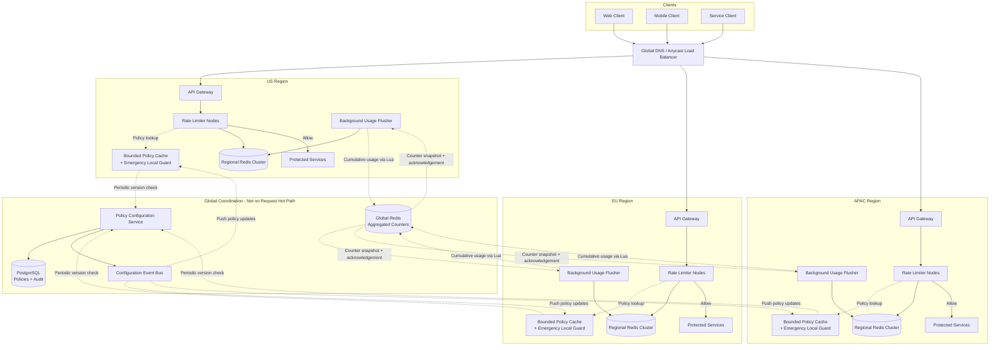
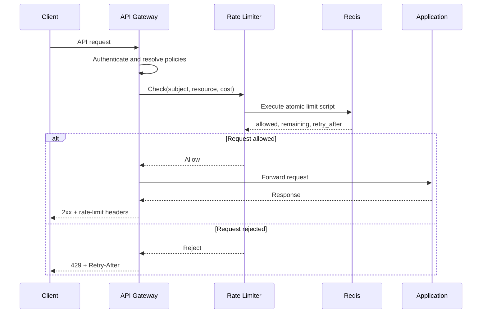
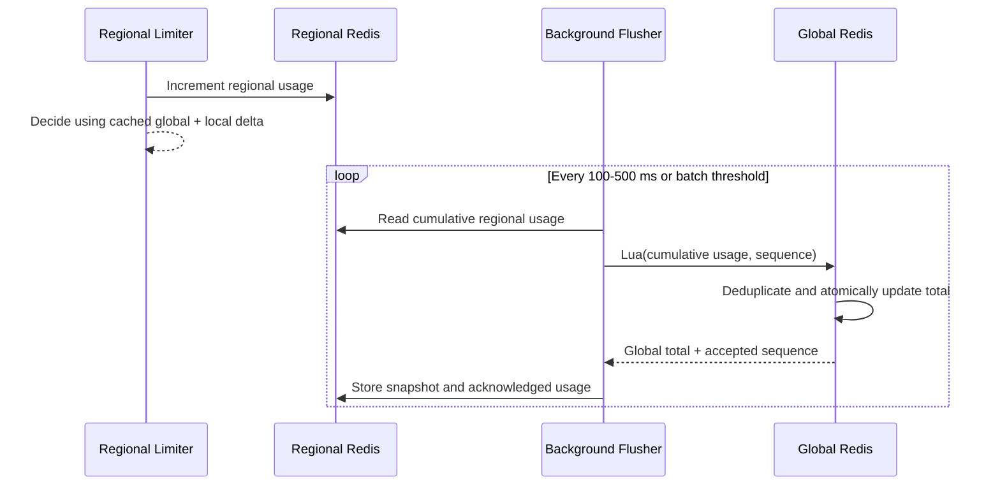

# Rate Limiter System

## 1. Problem Statement

Design a distributed rate limiting service that protects APIs and downstream systems from abusive clients, traffic spikes, accidental retry storms, and resource exhaustion. The limiter must support multiple policies, enforce limits with low latency, and remain effective across many application instances and regions.

Key challenges:
- **Low latency**: Every request passes through the limiter, so the decision must take only a few milliseconds
- **Correctness**: Concurrent requests must not bypass limits because of race conditions
- **Scalability**: The service must handle millions of checks per second
- **Availability**: A limiter failure should not unnecessarily take down the protected application
- **Global enforcement**: Multi-region traffic requires balancing latency against strict global accuracy

---

## 2. Functional Requirements

| ID | Requirement | Description |
|----|-------------|-------------|
| FR-1 | **Request Limiting** | Allow or reject requests according to a configured policy |
| FR-2 | **Multiple Dimensions** | Limit by user, API key, IP address, tenant, endpoint, or a composite key |
| FR-3 | **Multiple Algorithms** | Support token bucket, fixed window, sliding window, and concurrency limits |
| FR-4 | **Dynamic Policies** | Create and update limits without redeploying application services |
| FR-5 | **Burst Handling** | Permit controlled short bursts while enforcing a sustained request rate |
| FR-6 | **Client Feedback** | Return `429 Too Many Requests`, retry guidance, and remaining quota |
| FR-7 | **Policy Hierarchy** | Apply global, tenant, user, and endpoint policies to the same request |
| FR-8 | **Dry-Run Mode** | Evaluate and record decisions without rejecting traffic |

### Example Policies

```yaml
policies:
  - name: public-api-per-user
    key: user_id
    resource: /api/v1/search
    algorithm: token_bucket
    capacity: 100
    refill_rate: 10_per_second
    action: reject

  - name: login-attempts-per-ip
    key: ip_address
    resource: /api/v1/login
    algorithm: sliding_window_log
    limit: 5
    window: 15_minutes
    action: reject

  - name: tenant-concurrency
    key: tenant_id
    resource: inference
    algorithm: concurrency
    max_in_flight: 20
    action: queue_or_reject
```

---

## 3. Non-Functional Requirements

| ID | Requirement | Target |
|----|-------------|--------|
| NFR-1 | **Decision Latency** | < 5 ms p99 within a region |
| NFR-2 | **Availability** | 99.99% for public API limiting |
| NFR-3 | **Throughput** | Support 1 million checks/sec at peak |
| NFR-4 | **Scalability** | Horizontally scale stateless limiter nodes |
| NFR-5 | **Regional Correctness** | Atomic decisions for requests handled in one region |
| NFR-6 | **Global Correctness** | Configurable strict or eventual enforcement across regions |
| NFR-7 | **Configuration Propagation** | Policy updates visible globally within 10 seconds |
| NFR-8 | **Observability** | Per-policy metrics, logs, traces, and audit history |

### Availability vs. Correctness

The failure policy depends on the protected operation:

| Traffic Type | Failure Mode | Reason |
|--------------|--------------|--------|
| Public read API | Fail open | Availability is more important than a small temporary overage |
| Expensive compute API | Local fallback | Continue protecting capacity with a conservative local limit |
| Login / OTP / password reset | Fail closed | Security controls must not be bypassed |
| Payment or inventory mutation | Fail closed or degrade | Duplicate or excessive writes can cause financial inconsistency |

---

## 4. Capacity Estimation

### Assumptions

| Parameter | Value |
|-----------|-------|
| Daily active users | 100 million |
| Average requests per user per day | 500 |
| Average request rate | 580,000 requests/sec |
| Peak multiplier | 2x |
| Peak checks | ~1.2 million checks/sec |
| Active rate-limit keys at peak | 20 million |
| Average state per key | 100 bytes |
| Replication factor | 3 |

### Throughput

```text
Requests/day       = 100M users x 500 requests = 50 billion
Average checks/sec = 50B / 86,400              = ~580,000
Peak checks/sec    = 580K x 2                   = ~1.2 million
```

Every incoming request may evaluate more than one policy:

```text
Policies/request   = global + tenant + user + endpoint = 4
Peak policy checks = 1.2M requests/sec x 4             = 4.8M checks/sec
```

The implementation should evaluate applicable policies in one datastore operation where possible rather than making four network round trips.

### State Storage

```text
Active key state   = 20M keys x 100 bytes = 2 GB
With overhead      = 2 GB x 2             = 4 GB
With replication   = 4 GB x 3             = 12 GB
```

Sliding window logs consume substantially more memory because they store one timestamp per request. They should be reserved for low-volume, security-sensitive operations.

### Network

Assuming a compact 200-byte request and response for each decision:

```text
Peak datastore traffic = 1.2M x 200 bytes = 240 MB/sec
```

Batching multiple policies into one atomic command, connection pooling, and regional data stores are required to keep network overhead manageable.

---

## 5. API Design

The limiter may run inside an API gateway, as a sidecar, or as a shared service. A service API is useful for applications that cannot enforce limits directly at the edge.

### Check a Request

```http
POST /api/v1/limits/check
Content-Type: application/json

{
  "request_id": "req-8b7f",
  "subject": {
    "user_id": "user-123",
    "tenant_id": "tenant-42",
    "ip_address": "203.0.113.10"
  },
  "resource": "/api/v1/search",
  "cost": 1
}
```

Allowed response:

```json
{
  "allowed": true,
  "policy": "public-api-per-user",
  "limit": 100,
  "remaining": 37,
  "reset_at": "2026-08-31T11:05:00Z"
}
```

Rejected response:

```json
{
  "allowed": false,
  "policy": "public-api-per-user",
  "limit": 100,
  "remaining": 0,
  "retry_after_seconds": 6
}
```

### Policy Management

```text
POST   /api/v1/policies
       Body: { name, key, resource, algorithm, parameters, failure_mode }
       Response: { policy_id, version, created_at }

GET    /api/v1/policies/{policy_id}
       Response: { policy, version, status }

PUT    /api/v1/policies/{policy_id}
       Body: { algorithm, parameters, failure_mode }
       Response: { policy_id, new_version, updated_at }

DELETE /api/v1/policies/{policy_id}
       Response: { status, deleted_at }
```

### HTTP Response Contract

When a request is rejected, the gateway returns:

```http
HTTP/1.1 429 Too Many Requests
Retry-After: 6
RateLimit-Limit: 100
RateLimit-Remaining: 0
RateLimit-Reset: 6
Content-Type: application/json
```

Successful responses should also include limit headers when practical so clients can slow down before reaching the limit.

---

## 6. Data Model

### Policies Table

```sql
CREATE TABLE rate_limit_policies (
    policy_id          UUID PRIMARY KEY,
    name               VARCHAR(128) UNIQUE NOT NULL,
    resource_pattern   VARCHAR(256) NOT NULL,
    key_dimensions     JSON NOT NULL,
    algorithm          VARCHAR(32) NOT NULL,
    parameters         JSON NOT NULL,
    failure_mode       VARCHAR(32) NOT NULL,
    enforcement_mode   VARCHAR(16) NOT NULL DEFAULT 'enforce',
    priority           INT NOT NULL DEFAULT 100,
    version            BIGINT NOT NULL DEFAULT 1,
    enabled            BOOLEAN NOT NULL DEFAULT TRUE,
    created_at         TIMESTAMP NOT NULL DEFAULT NOW(),
    updated_at         TIMESTAMP NOT NULL DEFAULT NOW()
);
```

Policies live in a durable relational database because they require validation, versioning, auditing, and administrative queries.

### Policy Assignments Table

```sql
CREATE TABLE policy_assignments (
    assignment_id      UUID PRIMARY KEY,
    policy_id          UUID NOT NULL REFERENCES rate_limit_policies(policy_id),
    subject_type       VARCHAR(32) NOT NULL,
    subject_id         VARCHAR(128) NOT NULL,
    override_parameters JSON,
    starts_at          TIMESTAMP,
    expires_at         TIMESTAMP,

    UNIQUE (policy_id, subject_type, subject_id)
);
```

Assignments allow a premium tenant or internal service to override a default policy without duplicating the entire policy.

### Runtime State

Runtime counters are stored in Redis rather than the relational database.

```text
Key:
  rl:{region}:{algorithm}:{policy_id}:{hash(subject_dimensions)}

Token bucket value:
  tokens
  last_refill_timestamp
  policy_version

Fixed window value:
  request_count
  window_start

Sliding window value:
  sorted set of request timestamps
```

Keys receive a TTL slightly longer than their policy window so inactive clients do not consume memory indefinitely.

---

## 7. High-Level Architecture



### Request Path

1. Global routing sends the client to the nearest healthy region.
2. The regional API gateway authenticates the request and extracts trusted identity fields.
3. Applicable policies are resolved from a bounded local policy cache.
4. The regional limiter builds a canonical key from policy and subject dimensions.
5. An atomic operation in regional Redis updates the bucket and makes the decision.
6. The request is forwarded to the regional application when allowed; otherwise, the gateway returns `429`.
7. A background flusher sends cumulative regional usage to global Redis, where a Lua script atomically updates the global counter.
8. Metrics are emitted asynchronously so observability does not delay the request.

---

## 8. Detailed Design

### 8.1 Rate-Limit Key Construction

A rate limit is only as correct as its key. The gateway must build keys from trusted, normalized values.

```text
Single dimension:
  policy_id + user_id

Composite dimension:
  policy_id + tenant_id + user_id + normalized_route

Example:
  rl:us-east:tb:policy-17:sha256("tenant-42|user-123|/api/v1/search")
```

Guidelines:
- Use authenticated `user_id` or `tenant_id`, not user-controlled headers
- Normalize paths so `/users/123` and `/users/456` map to `/users/{id}`
- Canonicalize IP addresses, including IPv6
- Hash long or sensitive composite keys before storing them
- Include the policy version when incompatible policy changes require fresh state

### 8.2 Token Bucket

Token bucket is the default algorithm for general-purpose APIs because it supports controlled bursts and a stable average rate.

State:
- `capacity`: maximum tokens in the bucket
- `refill_rate`: tokens added per second
- `tokens`: currently available tokens
- `last_refill`: last update timestamp

```text
elapsed     = now - last_refill
new_tokens  = min(capacity, tokens + elapsed * refill_rate)

if new_tokens >= request_cost:
    tokens = new_tokens - request_cost
    allow request
else:
    reject request
```

Example:

```text
Capacity:      100 tokens
Refill rate:   10 tokens/sec
Request cost:  1 token

The client may send a burst of 100 requests immediately.
After the bucket is empty, requests are accepted at 10 requests/sec.
```

Weighted requests can consume different costs:

```text
GET /profile       = 1 token
POST /search       = 2 tokens
POST /ai/generate  = 20 tokens
```

### 8.3 Fixed Window Counter

The fixed window algorithm counts requests in discrete windows.

```text
Key:   rl:{region}:fw:{policy}:{subject}:{window_start}
Value: request_count

INCR key
EXPIRE key window_size
ALLOW if count <= limit
```

Advantages:
- Simple implementation
- Low memory usage
- Efficient atomic operations

Boundary problem:

```text
Limit: 100 requests/minute

10:00:59 -> client sends 100 requests
10:01:00 -> client sends 100 requests

Result: 200 requests arrive within one second.
```

Use fixed windows for coarse quotas where short boundary bursts are acceptable.

### 8.4 Sliding Window Log

The sliding window log stores each accepted request timestamp in a sorted set.

```text
1. Remove timestamps older than now - window
2. Count timestamps remaining in the set
3. If count < limit, add the current timestamp
4. Otherwise, reject the request
```

Advantages:
- Exact enforcement over any rolling interval
- No fixed-window boundary spike

Disadvantages:
- Stores one entry per request
- More CPU and memory per decision
- Expensive for high-volume public APIs

Best uses:
- Login attempts
- OTP generation
- Password reset requests
- Account recovery flows

### 8.5 Sliding Window Counter

The sliding window counter estimates a rolling count from the current and previous fixed windows.

```text
estimated_count =
    current_window_count
    + previous_window_count * previous_window_overlap
```

For a one-minute window evaluated 15 seconds into the current minute:

```text
Previous window overlap = 45 / 60 = 0.75
Previous count          = 80
Current count           = 20

Estimated count = 20 + (80 x 0.75) = 80
```

This algorithm avoids most boundary spikes while using constant memory per key. It is a good choice for high-scale systems that can tolerate small approximation errors.

### 8.6 Leaky Bucket

Leaky bucket places requests in a bounded queue and processes them at a fixed rate.

```text
Incoming requests -> bounded queue -> fixed-rate worker -> downstream service
                           |
                           +-> reject when queue is full
```

Use it when the requirement is traffic shaping rather than only request rejection:
- Protecting a fragile dependency
- Smoothing writes to a database
- Controlling background job dispatch

The queue introduces latency, so it is usually not the best default for synchronous APIs.

### 8.7 Concurrency Limiting

Request-rate limits do not protect a service when requests have widely different durations. A concurrency limiter caps in-flight work.

```text
Acquire permit before starting work
  -> permit available: execute request
  -> no permit: queue briefly or reject

Release permit on success, failure, timeout, or cancellation
```

Permits require leases with expiration so crashed workers do not leak capacity permanently.

Best uses:
- AI inference
- Report generation
- Database-heavy exports
- Third-party APIs with low connection limits

### 8.8 Sample Redis Records

The examples below show one possible representation. Production keys should hash sensitive or long subject dimensions and use Redis Cluster hash tags only when multiple keys must be updated atomically on the same shard.

| Algorithm | Key Pattern | Redis Type | Runtime Value |
|-----------|-------------|------------|---------------|
| Token bucket | `rl:{region}:tb:{policy}:{subject}` | Hash | Available tokens and last refill time |
| Fixed window | `rl:{region}:fw:{policy}:{subject}:{window}` | String integer | Request count for one fixed window |
| Sliding window log | `rl:{region}:swl:{policy}:{subject}` | Sorted set | Request timestamps and unique request IDs |
| Sliding window counter | `rl:{region}:swc:{policy}:{subject}` | Hash | Previous and current window counters |
| Leaky bucket | `rl:{region}:lb:{policy}:{subject}` | Hash | Current bucket level and last leak time |
| Concurrency limiter | `rl:{region}:conc:{policy}:{subject}` | Sorted set | Active request leases ordered by expiration |

#### Token Bucket

```text
Key:   rl:us-east:tb:policy-17:user-123
Type:  Redis hash
Value:
  tokens          = 37.5
  last_refill_ms   = 1788175800123
  capacity         = 100
  refill_per_sec   = 10
  policy_version   = 4
```

```redis
HSET rl:us-east:tb:policy-17:user-123 \
    tokens "37.5" \
    last_refill_ms "1788175800123" \
    capacity "100" \
    refill_per_sec "10" \
    policy_version "4"
PEXPIRE rl:us-east:tb:policy-17:user-123 12000
```

The Lua script reads the hash, calculates the refill using Redis server time, consumes the request cost, and writes the updated `tokens` and `last_refill_ms` atomically.

#### Fixed Window Counter

```text
Key:    rl:us-east:fw:policy-21:user-123:20260831T1127
Type:   Redis string containing an integer
Value:  64 requests in the 11:27 UTC window
```

```redis
SET rl:us-east:fw:policy-21:user-123:20260831T1127 "64" EX 65
```

The timestamp suffix identifies the current minute. `INCR` and `EXPIRE` are performed atomically in a Lua script so a newly created counter never remains without a TTL.

#### Sliding Window Log

```text
Key:   rl:us-east:swl:policy-35:ip-a1b2c3
Type:  Redis sorted set
Value:
  score=1788175800123, member=req-8b7f:1788175800123
  score=1788175814088, member=req-91de:1788175814088
  score=1788175830021, member=req-54aa:1788175830021
```

```redis
ZADD rl:us-east:swl:policy-35:ip-a1b2c3 \
    1788175800123 "req-8b7f:1788175800123" \
    1788175814088 "req-91de:1788175814088" \
    1788175830021 "req-54aa:1788175830021"
PEXPIRE rl:us-east:swl:policy-35:ip-a1b2c3 901000
```

The sorted-set score is the request timestamp in milliseconds. A unique member prevents two requests arriving in the same millisecond from overwriting each other.

#### Sliding Window Counter

```text
Key:   rl:us-east:swc:policy-42:tenant-42
Type:  Redis hash
Value:
  previous_window_start = 1788175740000
  previous_count        = 80
  current_window_start  = 1788175800000
  current_count         = 20
  policy_version        = 2
```

```redis
HSET rl:us-east:swc:policy-42:tenant-42 \
    previous_window_start "1788175740000" \
    previous_count "80" \
    current_window_start "1788175800000" \
    current_count "20" \
    policy_version "2"
PEXPIRE rl:us-east:swc:policy-42:tenant-42 125000
```

One hash keeps both windows on the same shard and allows rotation, weighted estimation, increment, and TTL refresh in one atomic script.

#### Leaky Bucket

```text
Key:   rl:us-east:lb:policy-51:tenant-42
Type:  Redis hash
Value:
  level          = 18.25
  last_leak_ms   = 1788175800123
  capacity       = 50
  leak_per_sec   = 5
```

```redis
HSET rl:us-east:lb:policy-51:tenant-42 \
    level "18.25" \
    last_leak_ms "1788175800123" \
    capacity "50" \
    leak_per_sec "5"
PEXPIRE rl:us-east:lb:policy-51:tenant-42 12000
```

For rejection-only leaky-bucket behavior, storing the current water level is sufficient. If requests must actually wait in order, use a durable queue or Redis Stream in addition to this admission state:

```redis
XADD rl:us-east:lbq:{policy-51:tenant-42} * request_id "req-8b7f" cost "1"
```

#### Concurrency Limiter

```text
Key:   rl:us-east:conc:policy-63:tenant-42
Type:  Redis sorted set
Value:
  score=1788175860123, member=lease:req-8b7f
  score=1788175867344, member=lease:req-91de
```

```redis
ZADD rl:us-east:conc:policy-63:tenant-42 \
    1788175860123 "lease:req-8b7f" \
    1788175867344 "lease:req-91de"
PEXPIRE rl:us-east:conc:policy-63:tenant-42 65000
```

Each member is an in-flight request lease and each score is its expiration time. Before acquiring a permit, the script removes expired leases, checks `ZCARD` against `max_in_flight`, and adds the new lease atomically. Normal completion removes it with `ZREM`.

### 8.9 Algorithm Comparison

| Algorithm | Accuracy | Memory | Burst Support | Best Use |
|-----------|----------|--------|---------------|----------|
| Token bucket | High | O(1) per key | Yes | General APIs |
| Fixed window | Medium | O(1) per key | Boundary bursts | Simple quotas |
| Sliding window log | Exact | O(requests) | No boundary spike | Security-sensitive, low volume |
| Sliding window counter | Approximate | O(1) per key | Limited | High-scale rolling limits |
| Leaky bucket | High | O(queue size) | Smooths traffic | Fragile downstream services |
| Concurrency limiter | Exact in region | O(active requests) | Not rate-based | Long-running operations |

---

## 9. Atomic Decision Flow

### Redis Lua Script

The refill, comparison, decrement, and TTL update must happen atomically. A read-modify-write sequence in application code is unsafe.

Race without atomicity:

```text
Bucket has 1 token.

Server A reads 1 token.
Server B reads 1 token.
Server A writes 0 and allows.
Server B writes 0 and allows.

Two requests are allowed when only one token existed.
```

Conceptual Lua operation:

```lua
local tokens = redis.call("HGET", key, "tokens")
local last_refill = redis.call("HGET", key, "last_refill")

-- Initialize, refill, compare, consume, and set expiry in one script.
-- Return allowed, remaining tokens, and retry delay.
```

The production script should:
- Use one server-side timestamp source to reduce clock skew
- Initialize missing buckets at full capacity
- Support weighted request costs
- Set TTL based on the time required to refill the bucket
- Return all response metadata in one round trip
- Validate policy parameters before execution

### Request Sequence



---

## 10. Policy Resolution

A request may match multiple policies:

```text
Global API limit:          100,000 requests/sec
Tenant limit:               10,000 requests/min
User limit:                    100 requests/min
Endpoint limit:                  5 requests/min for /login
```

The request is allowed only if every enforced policy permits it.

### Evaluation Order

1. Resolve policies from the local configuration cache.
2. Sort by priority and expected rejection probability.
3. Evaluate cheap local or broad policies first.
4. Evaluate related Redis-backed policies in one script or pipeline.
5. Stop when a policy rejects, unless dry-run metrics require all results.

### Policy Updates

```text
Administrator -> Configuration API -> PostgreSQL
                                      |
                                      v
                              Configuration Event Bus
                                      |
                   +------------------+------------------+
                   v                  v                  v
               Gateway Cache     Limiter Cache      Regional Cache
```

Limiter nodes could poll PostgreSQL or the configuration service every five seconds or every minute, but polling alone introduces predictable trade-offs:

| Approach | Advantages | Disadvantages |
|----------|------------|---------------|
| Event bus push | Near-real-time updates; no repeated unchanged reads; handles large fleets efficiently | Adds messaging infrastructure; consumers can miss or delay events |
| Periodic pull | Simple; self-heals missed updates; works without a broker | Update delay equals polling interval; synchronized polling creates load; short intervals waste reads |
| Push plus pull | Fast updates with eventual repair | Slightly more implementation complexity |

**Recommended approach: push plus pull reconciliation.**

1. The configuration service commits the policy and an outbox event in one database transaction.
2. The event bus pushes the new policy ID and version to every region.
3. Each node fetches the full policy when its cached version is older.
4. Every 30-60 seconds, nodes compare a lightweight global or regional configuration version to repair missed events.
5. Nodes keep the last known valid configuration if an update is malformed or the control plane is unavailable.

For a small deployment with few limiter nodes and policies that may take a minute to propagate, polling alone is a reasonable simpler design. The event bus becomes valuable when the fleet is large or policy changes must take effect quickly.

---

## 11. Multi-Region Design

A synchronous call to one global datastore adds cross-region latency and creates a global failure dependency. This design requires one logical global limit but accepts a bounded overage caused by asynchronous synchronization.

### 11.1 Selected Strategy: Asynchronous Global Counter

```text
US background flusher ----\
EU background flusher -----+-> global Redis Lua script -> global counter
APAC background flusher --/                                  |
                                                              +-> snapshots and acknowledgements
```

Every request updates only its regional Redis state. Limiter nodes do not fetch or scan records from all regions. Instead, a background flusher in each region periodically sends cumulative usage directly to global Redis. An atomic Lua script performs deduplication, calculates the new contribution from that region, updates the logical global counter, and returns the latest snapshot.

A separate global aggregator service is unnecessary for this flow. It would be useful only if the design later required stream processing, durable event replay, historical analytics, or aggregation rules that are too complex for a short Redis Lua script.

Regional decisions use:

```text
estimated_global_usage =
    cached_global_usage
    + local_usage_not_yet_included_in_snapshot

allow when:
    estimated_global_usage + request_cost <= soft_limit
```

Adding the local unreported delta prevents a region from ignoring its own newest requests while waiting for the next global snapshot.

### 11.2 Redis Records

Regional algorithm state remains in the algorithm-specific keys:

```text
rl:us-east:tb:policy-17:user-123
rl:eu-west:tb:policy-17:user-123
rl:ap-south:tb:policy-17:user-123
```

Each region also maintains a small usage accumulator for global reconciliation:

```text
rl:us-east:usage:policy-17:user-123:20260831T1127

Value:
  cumulative_usage      = 3200
  acknowledged_usage    = 3075
  next_sequence         = 919
  last_acked_sequence   = 917
```

The difference between `cumulative_usage` and `acknowledged_usage` is the region's local usage not yet known to be included in the global snapshot.

The global aggregate is independent of the regional algorithm's internal representation:

```text
rl:global:usage:policy-17:user-123:20260831T1127

Value:
  window_start_ms       = 1788175800000
  total                 = 8420
  snapshot_version      = 917
  us-east:usage         = 3200
  us-east:sequence      = 918
  eu-west:usage         = 2800
  eu-west:sequence      = 744
  ap-south:usage        = 2420
  ap-south:sequence     = 381
  updated_at_ms         = 1788175815000
```

The global record is updated only by the Redis Lua script invoked by background flushers, not by request-serving nodes. Regions cache the returned snapshot in memory or regional Redis. A region advances `acknowledged_usage` only when global Redis accepts its sequence.

### 11.3 Cumulative Flush Protocol

Each regional flusher sends its cumulative usage for the current window:

```json
{
  "region": "us-east",
  "policy_id": "policy-17",
  "subject_hash": "user-123",
  "window_start_ms": 1788175800000,
  "cumulative_usage": 3200,
  "sequence": 918,
  "sent_at_ms": 1788175815120
}
```

The Lua script executes the following logic atomically:

```text
previous_sequence = global_hash[region + ":sequence"]

if incoming_sequence <= previous_sequence:
    ignore duplicate or out-of-order update
else:
    previous_usage = global_hash[region + ":usage"]
    delta = incoming_cumulative_usage - previous_usage

    global_hash["total"] += delta
    global_hash[region + ":usage"] = incoming_cumulative_usage
    global_hash[region + ":sequence"] = incoming_sequence

return global_hash["total"], incoming_sequence
```

Cumulative usage is safer than sending only deltas. If sequence 918 is retried, it is ignored. If sequence 919 arrives before 918, its cumulative count already includes the usage represented by 918, so the older update can be ignored without losing requests.

### 11.4 Synchronization and Overage

The maximum overage is approximately the requests accepted across all regions while their global view is stale:

```text
approximate overage =
    combined request rate across regions
    x synchronization delay

Example:
  combined rate        = 1,000 requests/sec
  synchronization lag  = 500 ms
  possible overage     = approximately 500 requests
```

Actual overage may be larger during failed flushes, global Redis unavailability, regional disconnection, or simultaneous bursts. Monitor snapshot age, flush latency, retry count, and acknowledgement lag.

Use a safety margin to reduce the probability of crossing the hard business limit:

```text
Hard global limit:  10,000 requests/min
Soft local limit:    9,500 requests/min
Safety margin:         500 requests
```

The safety margin should cover expected traffic during p99 synchronization delay. A larger margin reduces overage but may reject valid traffic early.

### 11.5 Snapshot Flow



If a snapshot is older than the configured maximum age, the policy chooses between a conservative local estimate, fail open, or fail closed. Public API fairness limits normally use the conservative estimate; security-sensitive limits should not use this eventually consistent design.

---

## 12. Architectural Patterns

### 12.1 Sidecar or Gateway Enforcement

```text
Client -> API Gateway -> Application
             |
             +-> Rate-limit decision
```

Benefits:
- Rejects traffic before application resources are consumed
- Centralizes identity extraction and response headers
- Keeps application services stateless
- Applies consistent policies across many services

Application-level limiting is still useful for domain-specific costs that the gateway cannot determine.

### 12.2 Local Cache with Centralized State

Limiter nodes cache policy definitions locally but keep shared runtime counters in Redis. Local memory is an optimization, not the authoritative store and not a requirement to hold every active rate-limit key.

```text
Local memory: bounded hot policy definitions, route matching, defaults
Redis:        tokens, counters, timestamps, leases
PostgreSQL:   durable policy source and audit history
```

This avoids a configuration database query on every request while preserving consistent distributed counters.

#### When Local Memory Is Insufficient

Use a bounded cache with an explicit memory budget:

- Cache only policy definitions and compiled route matchers, not per-user runtime counters
- Evict least-recently-used policies while pinning global and security-critical policies
- Fetch an evicted policy from a regional configuration cache or configuration service on demand
- Coalesce concurrent misses so many requests do not fetch the same policy simultaneously
- Apply short positive-cache TTLs and shorter negative-cache TTLs
- Preload policies assigned to high-traffic tenants during startup
- Monitor cache hit ratio, eviction rate, memory use, and configuration-fetch latency

If policy volume is too large even after bounding and eviction, add a shared regional configuration cache:

```text
Limiter node local cache
        |
        | cache miss
        v
Regional configuration Redis/cache
        |
        | cache miss
        v
Configuration service -> PostgreSQL
```

The request path should not silently allow traffic because a policy was evicted. On a cache miss, fetch the policy with a short timeout; if the configuration tier is unavailable, use the last known snapshot or the policy's configured fail-open/fail-closed behavior.

### 12.3 Hierarchical Limiting

Hierarchical policies protect the system at different scopes:

```text
System capacity
  -> tenant allocation
      -> user fairness
          -> endpoint-specific protection
```

A global limit protects infrastructure even if many individual users remain below their personal limits.

### 12.4 Shadow Enforcement

New policies begin in dry-run mode:

```text
Request -> evaluate policy -> record would_allow / would_reject -> forward request
```

After observing false positives and expected rejection rates, operators switch the policy to enforcement mode.

---

## 13. Technology Choices

### Runtime Store: Redis

| Criteria | Redis | Relational DB | In-Memory Only |
|----------|-------|---------------|----------------|
| Atomic operations | Lua, transactions, counters | Transactions | Process-local only |
| Latency | Sub-millisecond to low milliseconds | Higher | Lowest |
| Shared state | Yes | Yes | No |
| Expiration | Native TTL | Cleanup required | Local eviction |
| Horizontal scaling | Redis Cluster | Sharding required | Per-instance |

**Choice: Redis** for regional runtime state because it provides atomic scripts, TTLs, sorted sets, and high throughput.

Local in-memory limiting can serve as an L1 safety mechanism, but it cannot independently enforce a distributed per-user limit.

#### When Not to Use Redis

Redis is a strong default for short-lived distributed counters, but it is not always the correct choice:

| Scenario | Why Redis Is a Poor Fit | Better Option |
|----------|-------------------------|---------------|
| Single process or one gateway instance | A network datastore adds cost without providing distributed coordination | Bounded in-memory token bucket |
| Strict global cross-region enforcement | One global Redis deployment adds WAN latency; asynchronous regional replicas permit stale decisions | Strongly consistent global datastore or synchronous coordinator |
| Zero tolerance for acknowledged counter loss | Replication and failover can lose recently acknowledged writes depending on configuration | Consensus-backed durable datastore |
| State is larger than affordable RAM | Redis is memory-first and becomes expensive for very high-cardinality or long-retention data | Disk-backed key-value store or database |
| Long-term usage history or billing ledger | TTL-based counters are operational state, not an auditable system of record | Append-only event log plus durable analytical or relational store |
| One extremely hot global key | Redis Cluster cannot divide one key across shards; one shard remains the bottleneck | Hierarchical local limits, striped approximate counters, or a dedicated coordinator |
| Complex queuing or workflow semantics | Lua scripts become difficult to maintain for retries, ordering, dead letters, and long-running workflows | Message broker or workflow engine |
| Ultra-low-latency local protection | Even a sub-millisecond network call may exceed the latency budget | In-process limiter, optionally backed by asynchronous distributed reconciliation |

Redis should hold only the minimum short-lived state required to make rate-limit decisions. Durable policy configuration belongs in PostgreSQL, and historical usage or billing events belong in a durable event or analytical store.

### Policy Store: PostgreSQL

PostgreSQL stores:
- Versioned policy definitions
- Tenant assignments and overrides
- Administrative audit records
- Rollback history

It is not on the per-request hot path.

### Configuration Distribution: Event Bus

Kafka, a managed pub/sub service, or Redis Streams can distribute policy changes. Consumers use policy versions to make updates idempotent. Periodic version polling remains necessary to detect missed events and recover after a node has been offline.

---

## 14. Scalability

### Horizontal Scaling

```text
API gateways:       Stateless; scale by request throughput
Limiter nodes:      Stateless apart from local caches; scale horizontally
Redis:              Shard by hash(rate_limit_key)
Policy database:    Primary for writes, replicas for administrative reads
Event bus:          Partition configuration events by policy_id
```

### Redis Sharding

Rate-limit keys are naturally distributed using a consistent hash.

```text
Shard = hash(policy_id + subject_key) mod shard_count
```

Hot keys require special treatment. A global policy used by every request maps to one logical key and can overload one shard.

Mitigations:
- Enforce broad global limits locally at each gateway
- Aggregate regional usage in batches instead of updating one global key per request
- Shard global counter keys by `hash(policy_id + subject_key)`
- Use striped counters for an exceptionally hot global policy, accepting an approximate asynchronous sum
- Keep fine-grained user and tenant keys naturally distributed

### Load Shedding

The limiter should protect itself:
- Bound pending requests and datastore connection pools
- Use short timeouts on Redis calls
- Reject or use the configured fallback instead of building an unbounded queue
- Sample accepted-request logs while retaining all critical rejection events

---

## 15. Reliability

### Failure Handling

```text
Limiter node failure:
  Load balancer routes to another stateless node.

Redis primary failure:
  Replica is promoted; clients reconnect with bounded retries.

Configuration database failure:
  Existing policies continue from local caches; policy updates pause.

Event bus delay:
  Nodes periodically compare policy versions with the source of truth.

Regional outage:
  Traffic shifts to another region with independent limiter capacity.
```

### Redis Outage Fallbacks

Options, selected per policy:

1. **Fail open**: Allow the request and emit a high-severity metric.
2. **Fail closed**: Reject the request because bypassing the limit is unsafe.
3. **Local fallback**: Apply an in-memory limit per gateway instance.
4. **Static emergency limit**: Use a conservative predefined policy.

Local fallback does not provide exact distributed enforcement. If ten gateway instances each allow 10 requests/sec, the effective limit may reach 100 requests/sec.

### Clock Handling

Token and sliding-window algorithms depend on time:
- Prefer datastore server time for atomic operations
- Use monotonic clocks for in-process duration measurement
- Do not trust client timestamps
- Monitor clock skew across hosts
- Clamp negative elapsed time to prevent token inflation

### Idempotency and Retries

A client retry of the limiter check can consume quota twice. The usual gateway flow avoids retrying a completed decision. For expensive weighted operations, an optional short-lived `request_id` record can make consumption idempotent.

The idempotency TTL should cover the maximum retry period without retaining request IDs indefinitely.

---

## 16. Security

### Trusted Identity

The limiter must derive keys after authentication:

```text
Good:
  user_id from validated JWT claims
  tenant_id from server-side account mapping
  source IP from a trusted proxy chain

Bad:
  X-User-Id supplied directly by an internet client
  arbitrary endpoint name supplied in the request body
```

### Preventing Key Cardinality Attacks

Attackers may generate unlimited unique keys to exhaust Redis memory.

Mitigations:
- Limit only on normalized, validated dimensions
- Reject oversized identifiers
- Hash composite keys to a fixed length
- Set TTLs on all runtime keys
- Apply a coarse IP or global limit before high-cardinality policies
- Monitor key creation rate and active-key growth

### Administrative Security

- Require role-based access for policy changes
- Use approval workflows for security-sensitive policies
- Record before-and-after values in an immutable audit log
- Encrypt connections to Redis and PostgreSQL
- Store credentials in a secret manager and rotate them regularly

### Information Disclosure

Response headers should expose enough information for clients to back off without revealing internal capacity, tenant activity, or the existence of sensitive security policies.

---

## 17. Monitoring

### Key Metrics

```text
Decision Metrics:
  rate_limit_checks_total{policy, result}
  rate_limit_rejections_total{policy, reason}
  rate_limit_decision_latency_ms{region}
  rate_limit_remaining_ratio{policy}

Datastore Metrics:
  redis_operation_latency_ms
  redis_errors_total
  redis_memory_usage_bytes
  redis_evicted_keys_total
  redis_hot_key_rate

Configuration Metrics:
  policy_version_age_seconds
  policy_propagation_lag_seconds
  policy_update_failures_total

Fallback Metrics:
  fail_open_total{policy}
  fail_closed_total{policy}
  local_fallback_total{region}
```

### Alerting

```text
CRITICAL:
  - Redis error rate > 1% for 5 minutes
  - Security policy enters fail-open behavior
  - Limiter p99 latency > 20 ms
  - Policy configuration unavailable in every region

WARNING:
  - Policy propagation lag > 30 seconds
  - Rejection rate changes by > 5x baseline
  - Redis memory usage > 75%
  - Active key count grows unexpectedly
  - One shard receives > 2x average traffic
```

### Dashboards

Operators need:
- Rejection rate by policy, tenant, endpoint, and region
- Top throttled subjects with privacy-safe identifiers
- Allowed vs. rejected traffic over time
- Redis latency, memory, shard balance, and failovers
- Current policy versions and propagation lag
- Dry-run impact before enabling a new policy

### Logging and Tracing

```text
Metrics:  Prometheus-compatible metrics and Grafana dashboards
Logs:     Structured decision logs with sampling for allowed requests
Tracing:  OpenTelemetry span for limiter latency and policy outcome
Audit:    Unsampled administrative policy changes
```

Avoid logging raw access tokens, full API keys, or sensitive composite keys.

---

## 18. Design Decisions and Trade-Offs

### Default Algorithm

Use **token bucket** for most public APIs:
- Supports short, controlled bursts
- Enforces a stable long-term rate
- Requires constant state per key
- Maps efficiently to one atomic Redis operation

### Strict Security Limits

Use a **sliding window log** or a strongly consistent counter for low-volume login, OTP, and account recovery operations. The additional cost is justified because a small enforcement gap can create a security vulnerability.

### Multi-Region Limits

Use **regional counters with an asynchronously aggregated global counter**. Each decision combines the cached global snapshot with the region's unreported local usage. A safety margin absorbs expected synchronization lag; small temporary overages are accepted in exchange for a low-latency regional request path.

### Placement

Enforce broad limits at the **API gateway or edge**. Add application-level policies only when request cost depends on domain information unavailable to the gateway.

---

## Summary

This rate limiter achieves low-latency, distributed traffic control through:

1. **Token buckets** for burst-friendly general API limits
2. **Sliding windows** for strict security-sensitive operations
3. **Concurrency limits** for long-running and expensive workloads
4. **Atomic Redis scripts** to prevent race conditions
5. **Hierarchical policies** across global, tenant, user, and endpoint scopes
6. **Regional enforcement with asynchronous global counter aggregation** for multi-region scale
7. **Configurable fail-open, fail-closed, and local fallback behavior**
8. **Versioned dynamic policies and dry-run rollout**
9. **Metrics, logs, traces, and audit history** for safe production operation
