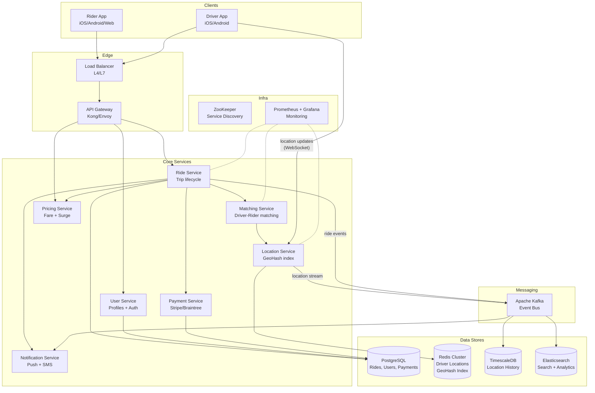
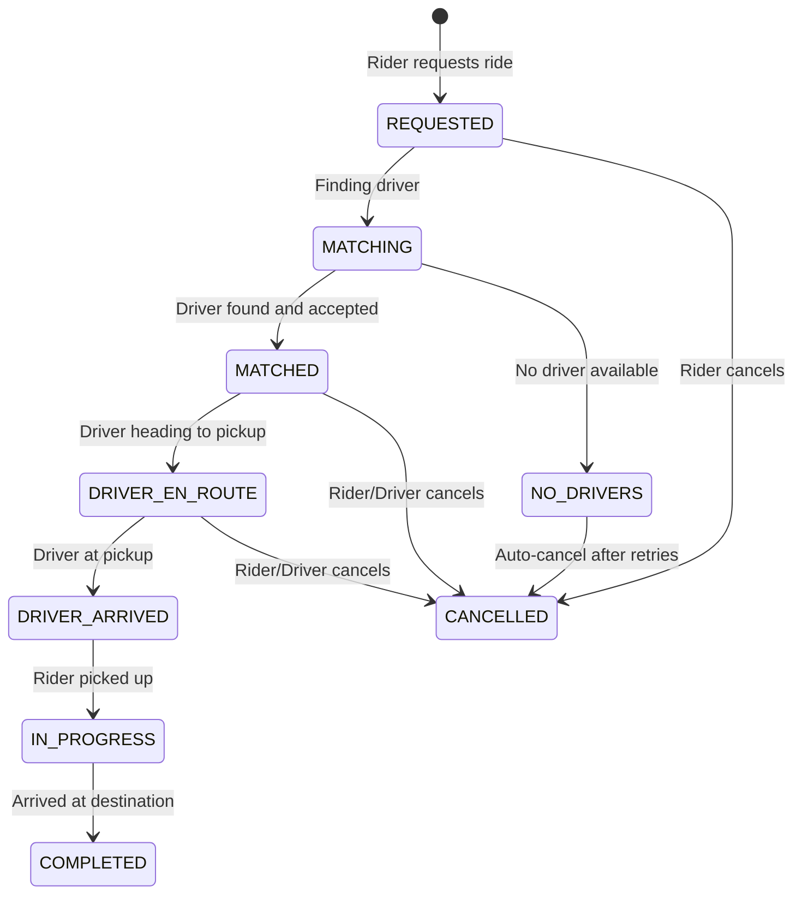
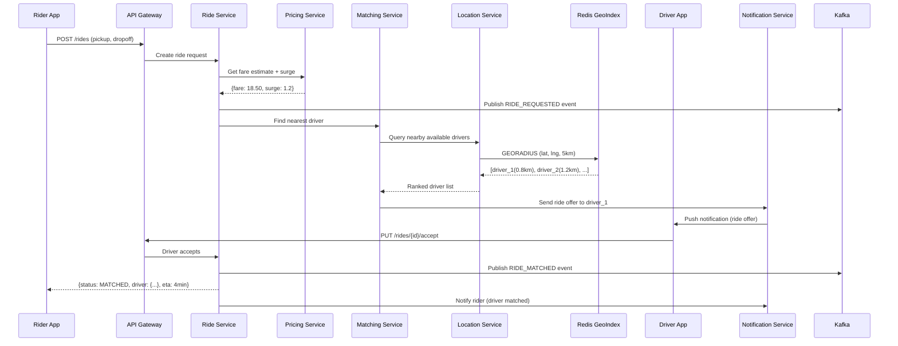
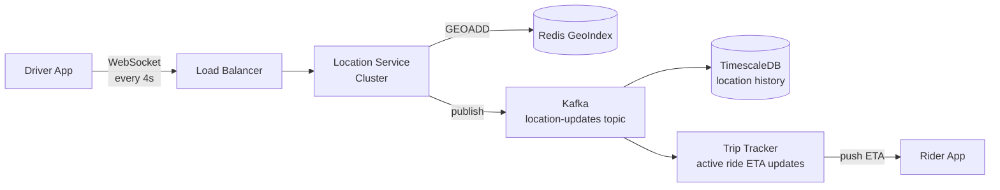

# Ride Sharing System (Uber/Lyft)

## 1. Problem Statement

Design a ride-sharing platform (similar to Uber/Lyft) that connects riders who need
transportation with nearby drivers who have available vehicles. The system must handle
real-time location tracking, intelligent driver matching using geospatial indexing,
dynamic surge pricing, fare estimation, trip lifecycle management, and payment processing
-- all at massive scale with millions of concurrent users.

The core challenge is the **real-time matching problem**: given a rider's pickup location,
find the nearest available driver within seconds, while continuously ingesting millions
of location updates per second from active drivers.

---

## 2. Functional Requirements

| # | Requirement | Description |
|---|-------------|-------------|
| FR-1 | Request Ride | Rider specifies pickup/dropoff location and vehicle type |
| FR-2 | Fare Estimation | Show estimated fare before ride confirmation (distance, time, surge) |
| FR-3 | Driver Matching | Match rider with nearest available driver using geospatial index |
| FR-4 | Real-Time Tracking | Stream driver location to rider during ride (and during approach) |
| FR-5 | Trip State Machine | Manage lifecycle: REQUESTED -> MATCHED -> EN_ROUTE -> IN_PROGRESS -> COMPLETED/CANCELLED |
| FR-6 | Fare Calculation | Calculate final fare based on actual distance, duration, surge multiplier |
| FR-7 | Payment Processing | Charge rider, credit driver, handle refunds |
| FR-8 | Trip History | Riders and drivers can view past trips with details |
| FR-9 | Ratings & Reviews | Riders rate drivers and vice versa after trip completion |
| FR-10 | Surge Pricing | Dynamically adjust prices based on supply/demand ratio in a region |

---

## 3. Non-Functional Requirements

| # | Requirement | Target |
|---|-------------|--------|
| NFR-1 | Match Latency | Driver match within < 10 seconds of ride request |
| NFR-2 | Location Freshness | Real-time location updates every 3-5 seconds from active drivers |
| NFR-3 | Availability | 99.99% uptime for ride matching service (< 53 min downtime/year) |
| NFR-4 | Scale | Handle 1 million concurrent rides globally |
| NFR-5 | Throughput | Ingest 5M+ location updates per second |
| NFR-6 | Consistency | Strong consistency for trip state transitions and payments |
| NFR-7 | Data Durability | Zero loss for payment and trip records |
| NFR-8 | Global Reach | Multi-region deployment with geo-aware routing |

---

## 4. Capacity Estimation

### Traffic Estimates

| Metric | Value |
|--------|-------|
| Daily Active Riders | 20 million |
| Daily Active Drivers | 5 million |
| Rides per Day | 15 million |
| Peak Concurrent Rides | 1 million |
| Ride Requests per Second (avg) | ~175 RPS |
| Ride Requests per Second (peak) | ~1,500 RPS |

### Location Update Estimates

| Metric | Value |
|--------|-------|
| Active Drivers (online) | 5 million |
| Update Frequency | Every 4 seconds |
| Location Updates per Second | ~1.25 million |
| Payload per Update | ~100 bytes (driver_id, lat, lng, timestamp, heading) |
| Bandwidth for Location Updates | ~125 MB/s ingress |

### Storage Estimates

| Data Type | Size per Record | Records/Day | Daily Storage | Annual Storage |
|-----------|-----------------|-------------|---------------|----------------|
| Ride Records | ~2 KB | 15M | 30 GB | ~11 TB |
| Location History | ~100 bytes | 27B (5M drivers * 21600 updates) | 2.7 TB | ~1 PB |
| User Profiles | ~1 KB | - | - | ~25 GB (25M users) |
| Payment Records | ~500 bytes | 15M | 7.5 GB | ~2.7 TB |
| Ratings | ~200 bytes | 30M (2 per ride) | 6 GB | ~2.2 TB |

### Summary

- **Total daily write throughput**: ~1.25M writes/sec (dominated by location updates)
- **Hot data (last 24h locations)**: ~2.7 TB in Redis/memory
- **Cold storage (historical)**: ~1 PB/year (tiered to object storage)

---

## 5. API Design

### Rider APIs

```
POST   /api/v1/rides/estimate
       Body: { pickup: {lat, lng}, dropoff: {lat, lng}, vehicle_type: "economy" }
       Response: { estimated_fare: 18.50, estimated_duration_min: 22, surge_multiplier: 1.2 }

POST   /api/v1/rides
       Body: { pickup: {lat, lng}, dropoff: {lat, lng}, vehicle_type: "economy", payment_method_id: "pm_123" }
       Response: { ride_id: "ride_abc", status: "REQUESTED", estimated_fare: 18.50 }

GET    /api/v1/rides/{ride_id}
       Response: { ride_id, status, driver: {...}, pickup, dropoff, fare, ... }

PUT    /api/v1/rides/{ride_id}/cancel
       Response: { ride_id, status: "CANCELLED", cancellation_fee: 5.00 }

GET    /api/v1/rides/{ride_id}/track
       Response (SSE stream): { driver_lat, driver_lng, eta_seconds, updated_at }

GET    /api/v1/riders/{rider_id}/history?page=1&limit=20
       Response: { rides: [...], total: 142, page: 1 }

POST   /api/v1/rides/{ride_id}/rate
       Body: { rating: 5, comment: "Great ride!" }
```

### Driver APIs

```
PUT    /api/v1/drivers/{driver_id}/status
       Body: { status: "AVAILABLE" | "OFFLINE" | "BUSY" }

PUT    /api/v1/drivers/{driver_id}/location
       Body: { lat: 37.7749, lng: -122.4194, heading: 90, speed: 35 }

GET    /api/v1/drivers/{driver_id}/ride-requests
       Response (SSE): { ride_id, pickup, dropoff, estimated_fare, timeout_sec: 15 }

PUT    /api/v1/rides/{ride_id}/accept
PUT    /api/v1/rides/{ride_id}/arrive       (driver arrived at pickup)
PUT    /api/v1/rides/{ride_id}/start         (rider picked up, trip begins)
PUT    /api/v1/rides/{ride_id}/complete       (arrived at destination)
```

### Internal / Admin APIs

```
GET    /api/v1/admin/surge?region=sf_downtown
       Response: { region: "sf_downtown", surge_multiplier: 1.8, demand: 450, supply: 120 }

GET    /api/v1/admin/metrics
       Response: { active_rides: 980000, avg_match_time_ms: 3200, ... }
```

---

## 6. Data Model

### Riders Table

| Column | Type | Description |
|--------|------|-------------|
| rider_id | UUID (PK) | Unique rider identifier |
| name | VARCHAR(100) | Full name |
| email | VARCHAR(255) | Email (unique) |
| phone | VARCHAR(20) | Phone number (unique) |
| rating | DECIMAL(2,1) | Average rating (1.0 - 5.0) |
| payment_methods | JSONB | Array of payment method references |
| created_at | TIMESTAMP | Account creation time |

### Drivers Table

| Column | Type | Description |
|--------|------|-------------|
| driver_id | UUID (PK) | Unique driver identifier |
| name | VARCHAR(100) | Full name |
| email | VARCHAR(255) | Email (unique) |
| phone | VARCHAR(20) | Phone number (unique) |
| vehicle_type | ENUM | economy, premium, xl |
| license_plate | VARCHAR(20) | Vehicle plate number |
| rating | DECIMAL(2,1) | Average rating |
| status | ENUM | AVAILABLE, BUSY, OFFLINE |
| current_lat | DECIMAL(10,7) | Last known latitude |
| current_lng | DECIMAL(10,7) | Last known longitude |
| last_location_update | TIMESTAMP | When location was last updated |

### Rides Table

| Column | Type | Description |
|--------|------|-------------|
| ride_id | UUID (PK) | Unique ride identifier |
| rider_id | UUID (FK) | Reference to rider |
| driver_id | UUID (FK) | Reference to matched driver (nullable until matched) |
| status | ENUM | REQUESTED, MATCHED, DRIVER_EN_ROUTE, IN_PROGRESS, COMPLETED, CANCELLED |
| pickup_lat | DECIMAL(10,7) | Pickup latitude |
| pickup_lng | DECIMAL(10,7) | Pickup longitude |
| dropoff_lat | DECIMAL(10,7) | Dropoff latitude |
| dropoff_lng | DECIMAL(10,7) | Dropoff longitude |
| vehicle_type | ENUM | Requested vehicle type |
| estimated_fare | DECIMAL(10,2) | Fare estimate at request time |
| actual_fare | DECIMAL(10,2) | Final calculated fare |
| surge_multiplier | DECIMAL(3,2) | Surge at time of request |
| distance_km | DECIMAL(8,2) | Actual trip distance |
| duration_min | DECIMAL(8,2) | Actual trip duration |
| requested_at | TIMESTAMP | When ride was requested |
| matched_at | TIMESTAMP | When driver was matched |
| started_at | TIMESTAMP | When trip started (pickup) |
| completed_at | TIMESTAMP | When trip ended |

### Location Updates Table (Time-Series)

| Column | Type | Description |
|--------|------|-------------|
| driver_id | UUID | Driver reference |
| lat | DECIMAL(10,7) | Latitude |
| lng | DECIMAL(10,7) | Longitude |
| heading | SMALLINT | Direction in degrees |
| speed | SMALLINT | Speed in km/h |
| timestamp | TIMESTAMP (PK) | Update time (partitioned) |

### Payments Table

| Column | Type | Description |
|--------|------|-------------|
| payment_id | UUID (PK) | Payment identifier |
| ride_id | UUID (FK) | Associated ride |
| rider_id | UUID (FK) | Who paid |
| driver_id | UUID (FK) | Who receives |
| amount | DECIMAL(10,2) | Total charge |
| platform_fee | DECIMAL(10,2) | Platform commission |
| driver_payout | DECIMAL(10,2) | Driver's share |
| status | ENUM | PENDING, CHARGED, REFUNDED, FAILED |
| payment_method | VARCHAR(50) | Card, wallet, etc. |
| created_at | TIMESTAMP | Transaction time |

---

## 7. High-Level Architecture



### Component Responsibilities

| Component | Responsibility |
|-----------|---------------|
| **API Gateway** | Auth, rate limiting, request routing, TLS termination |
| **Ride Service** | Trip lifecycle (state machine), orchestrates matching/pricing/payment |
| **Matching Service** | Finds nearest available driver using geospatial queries on Redis |
| **Location Service** | Ingests driver locations, maintains Redis GeoHash index |
| **Pricing Service** | Fare estimation, surge calculation, dynamic pricing |
| **Payment Service** | Charge riders, payout drivers, handle refunds |
| **Notification Service** | Push notifications, SMS alerts for ride events |
| **User Service** | Registration, authentication, profiles, ratings |

---

## 8. Detailed Design

### 8.1 Driver Matching Algorithm

The core matching algorithm uses a **geospatial proximity search** to find the nearest
available driver:

```
1. Rider requests ride at location (lat, lng)
2. Location Service queries Redis GEORADIUS:
   - Search within 3 km radius
   - Filter: status = AVAILABLE, vehicle_type matches request
   - Sort by distance ascending
3. If no drivers found, expand radius to 5 km, then 8 km, then 15 km
4. Select top-K candidates (K=5)
5. For each candidate, compute ETA using road-network routing
6. Pick driver with lowest ETA (not just shortest straight-line distance)
7. Send ride request to chosen driver with 15-second acceptance timeout
8. If driver declines or times out, try next candidate
9. If all candidates exhausted, re-search or notify rider of no availability
```

**GeoHash-Based Indexing:**

Drivers are indexed using Redis `GEOADD` which internally uses a sorted set with
52-bit GeoHash interleaved coordinates. This enables O(log N + M) proximity queries
where N is total drivers and M is the result count.

```
GEOADD drivers:available:economy  -122.4194 37.7749  "driver_001"
GEOADD drivers:available:premium  -122.4194 37.7749  "driver_002"

GEORADIUS drivers:available:economy  -122.4180 37.7750  5 km  ASC  COUNT 10
```

We partition the geo index by `vehicle_type` to avoid scanning irrelevant drivers.

### 8.2 Trip State Machine



**Valid State Transitions:**

| From | To | Trigger |
|------|----|---------|
| REQUESTED | MATCHING | System initiates matching |
| MATCHING | MATCHED | Driver accepts request |
| MATCHING | NO_DRIVERS | No driver found after retries |
| NO_DRIVERS | CANCELLED | Auto-cancellation |
| MATCHED | DRIVER_EN_ROUTE | Driver starts navigation |
| DRIVER_EN_ROUTE | DRIVER_ARRIVED | Driver reaches pickup |
| DRIVER_ARRIVED | IN_PROGRESS | Rider confirmed pickup |
| IN_PROGRESS | COMPLETED | Driver marks arrival at dropoff |
| REQUESTED/MATCHED/DRIVER_EN_ROUTE | CANCELLED | Cancel action |

### 8.3 Surge Pricing

Surge pricing balances supply and demand in real-time:

```
surge_multiplier = f(demand, supply) in a geospatial cell

Algorithm:
1. Divide city into hexagonal cells (H3 resolution 8, ~460m edge)
2. For each cell, track:
   - demand_count: ride requests in last 5 minutes
   - supply_count: available drivers in cell + adjacent cells
3. Compute ratio: R = demand_count / supply_count
4. Apply surge curve:
   - R < 1.0  =>  surge = 1.0  (no surge)
   - R = 1.0-1.5  =>  surge = 1.0 + 0.25 * (R - 1.0)
   - R = 1.5-2.5  =>  surge = 1.25 + 0.5 * (R - 1.5)
   - R = 2.5-4.0  =>  surge = 1.75 + 0.5 * (R - 2.5)
   - R > 4.0  =>  surge = min(2.5, 2.5 + 0.1 * (R - 4.0))  (capped at 3.0x)
5. Apply smoothing: surge = 0.7 * new_surge + 0.3 * prev_surge
6. Publish surge map to pricing service every 30 seconds
```

### 8.4 ETA Calculation

```
1. Straight-line distance (Haversine) for initial estimate
2. Apply road-network factor (typically 1.3-1.5x straight-line)
3. Adjust for real-time traffic conditions:
   - Query traffic service for segment speeds
   - Weight: 0.5 * historical + 0.3 * real_time + 0.2 * time_of_day
4. For active trips, use turn-by-turn routing (OSRM / Google Directions API)
```

### 8.5 Fare Calculation

```
base_fare = BASE_RATE[vehicle_type]
distance_fare = distance_km * PER_KM_RATE[vehicle_type]
time_fare = duration_min * PER_MIN_RATE[vehicle_type]
subtotal = base_fare + distance_fare + time_fare
fare = max(subtotal * surge_multiplier, MINIMUM_FARE[vehicle_type])
platform_fee = fare * PLATFORM_COMMISSION (e.g., 25%)
driver_payout = fare - platform_fee
```

---

## 9. Architecture Diagram

### Ride Request Flow (Sequence)



### Location Update Flow



---

## 10. Architectural Patterns

### 10.1 Geospatial Indexing (GeoHash / QuadTree)

**GeoHash** encodes 2D coordinates into a 1D string. Nearby points share common prefixes,
enabling efficient range queries using sorted data structures.

| Approach | Pros | Cons |
|----------|------|------|
| **Redis GeoHash** | Built-in GEORADIUS, O(log N + M), no custom code | All data in memory, limited query expressiveness |
| **QuadTree** | Adaptive density, good for non-uniform distribution | Custom implementation, harder to distribute |
| **PostGIS** | Rich spatial queries, persistent, joins with relational data | Higher latency than in-memory, heavier |
| **H3 (Uber's Hex Grid)** | Uniform hexagonal cells, great for aggregation (surge) | Additional mapping layer needed |

**Our choice**: Redis GeoHash for real-time matching (speed), H3 hexagons for surge
pricing aggregation (uniform cells), PostGIS for historical analytics.

### 10.2 State Machine Pattern

The trip lifecycle is modeled as an explicit state machine:
- Each state transition is validated against allowed transitions
- Transitions emit domain events (RIDE_MATCHED, TRIP_STARTED, etc.)
- Events are published to Kafka for downstream consumers
- Invalid transitions are rejected with clear error messages

### 10.3 CQRS (Command Query Responsibility Segregation)

- **Write path**: Ride requests, status updates, payments write to PostgreSQL
- **Read path**: Trip history, analytics, search served from Elasticsearch replicas
- Location updates are write-heavy (Redis + TimescaleDB) with separate read replicas
- Separate models optimize for different access patterns

### 10.4 Event Sourcing

All ride lifecycle events are stored in an append-only event log (Kafka):

```
RIDE_REQUESTED  -> {ride_id, rider_id, pickup, dropoff, timestamp}
DRIVER_MATCHED  -> {ride_id, driver_id, eta, timestamp}
TRIP_STARTED    -> {ride_id, start_location, timestamp}
LOCATION_UPDATE -> {ride_id, driver_id, lat, lng, timestamp}
TRIP_COMPLETED  -> {ride_id, end_location, fare, timestamp}
PAYMENT_CHARGED -> {ride_id, payment_id, amount, timestamp}
```

Benefits: complete audit trail, ability to replay/rebuild state, enables real-time
analytics and ML model training from event streams.

---

## 11. Technology Choices

| Component | Technology | Rationale |
|-----------|------------|-----------|
| **Geospatial Index** | Redis 7 GeoHash | Sub-ms GEORADIUS, 1M+ ops/sec per node |
| **Primary DB** | PostgreSQL 15 | ACID for rides/payments, mature ecosystem |
| **Time-Series** | TimescaleDB | Hypertable for location history, auto-partitioning |
| **Event Bus** | Apache Kafka | Durable event log, 1M+ msgs/sec, replay support |
| **Search/Analytics** | Elasticsearch | Full-text search on trips, Kibana dashboards |
| **Cache** | Redis Cluster | Session cache, surge multiplier cache, rate limiting |
| **Hex Grid** | H3 (Uber) | Surge pricing cell aggregation |
| **Routing** | OSRM | Open-source road-network routing for ETA |
| **API Gateway** | Kong / Envoy | Rate limiting, auth, circuit breaking |
| **Service Mesh** | Istio | mTLS, traffic management, observability |
| **Container Orchestration** | Kubernetes | Auto-scaling, self-healing, rolling deploys |
| **Dynamic Pricing** | Custom ML model | Gradient boosted trees on supply/demand features |

### Redis GeoHash vs PostGIS

| Factor | Redis GeoHash | PostGIS |
|--------|---------------|---------|
| Latency | < 1 ms | 5-50 ms |
| Throughput | 100K+ ops/sec/node | 1-5K queries/sec |
| Persistence | Optional (AOF/RDB) | Full ACID |
| Query Richness | Basic radius/box | Complex spatial queries |
| Memory | All in RAM | Disk-backed |
| Use Case | Real-time matching | Historical analytics |

**Decision**: Redis for hot path (matching), PostGIS for warm/cold analytics.

---

## 12. Scalability

### Horizontal Scaling Strategy

- **Location Service**: Shard by geohash prefix; each shard owns a geographic region
- **Ride Service**: Shard by ride_id (consistent hashing); stateless workers
- **Matching Service**: Regional instances (one per metro area)
- **Redis GeoIndex**: Cluster mode with geographic sharding (city-level)
- **Kafka**: Topic partitioned by city/region; independent consumer groups per service

### Auto-Scaling Triggers

| Service | Scale Trigger | Target |
|---------|---------------|--------|
| Location Service | CPU > 60% or ingestion lag > 2s | 50-500 pods |
| Matching Service | P99 latency > 5s | 10-100 pods per region |
| Ride Service | Request queue depth > 1000 | 20-200 pods |

### Data Partitioning

- **Location data**: Partition by time (daily) + geo region
- **Ride records**: Partition by month, index on rider_id and driver_id
- **Hot data**: Last 24h in Redis; 7-day window in TimescaleDB; older in S3/Glacier

---

## 13. Reliability

### Failure Scenarios & Mitigations

| Failure | Impact | Mitigation |
|---------|--------|------------|
| Redis node crash | Matching degraded in region | Redis Cluster auto-failover (< 5s), Sentinel |
| Kafka broker down | Event delivery delayed | Multi-broker replication (RF=3), ISR |
| Matching timeout | Rider waits | Fallback to wider radius, circuit breaker to pricing |
| Payment failure | Ride uncharged | Retry with exponential backoff, dead letter queue |
| Driver app disconnect | Stale location | TTL on location entries (60s), mark driver offline |

### Consistency Guarantees

- **Trip state**: Optimistic locking with version field; exactly-once via idempotency keys
- **Payments**: Two-phase: authorize before trip, capture after completion
- **Location**: Eventual consistency is acceptable (stale by 4-8 seconds max)

### Disaster Recovery

- Multi-AZ deployment per region
- Cross-region replication for user data and trip history
- RPO < 1 minute, RTO < 5 minutes for core services
- Chaos engineering: regular failure injection (Netflix Chaos Monkey approach)

---

## 14. Security

| Layer | Measure |
|-------|---------|
| **Authentication** | OAuth 2.0 + JWT; phone-based OTP for riders |
| **Authorization** | RBAC: rider, driver, admin, support roles |
| **Transport** | TLS 1.3 everywhere; certificate pinning in mobile apps |
| **API Security** | Rate limiting per user, request signing, input validation |
| **Data at Rest** | AES-256 encryption for PII, payment tokens |
| **PCI Compliance** | Tokenized payments via Stripe/Braintree; no card numbers stored |
| **Location Privacy** | Fuzzy location sharing (100m radius) until ride confirmed |
| **Fraud Detection** | ML model scoring ride patterns, velocity checks on payments |
| **Driver Verification** | Background checks, license validation, periodic re-checks |
| **Audit Logging** | All state transitions and admin actions logged immutably |

---

## 15. Monitoring & Observability

### Key Metrics

| Metric | Alert Threshold |
|--------|-----------------|
| Ride match P50/P95/P99 latency | P99 > 8 seconds |
| Successful match rate | < 90% in any region |
| Location update ingestion lag | > 5 seconds |
| Active ride count vs capacity | > 85% capacity |
| Payment failure rate | > 2% |
| Driver app crash rate | > 0.5% |
| API error rate (5xx) | > 0.1% |

### Observability Stack

- **Metrics**: Prometheus + Grafana (per-service dashboards)
- **Logs**: ELK Stack (structured JSON logging, correlation IDs)
- **Traces**: Jaeger / OpenTelemetry (end-to-end request tracing)
- **Alerting**: PagerDuty integration with escalation policies
- **Business Dashboards**: Real-time map of active rides, surge heatmap, supply/demand

### Health Checks

```
GET /health/live     -> 200 if process is running
GET /health/ready    -> 200 if dependencies (Redis, Kafka, DB) reachable
GET /health/startup  -> 200 after initial warm-up complete
```

---

## 16. Summary

The ride-sharing system's core technical challenges are:

1. **Real-time geospatial matching** at scale -- solved with Redis GeoHash for O(log N)
   proximity queries, processing millions of location updates per second
2. **Trip lifecycle management** -- modeled as an explicit state machine with event
   sourcing for auditability and replay
3. **Dynamic pricing** -- H3 hexagonal grid aggregation of supply/demand with smoothed
   surge multipliers
4. **Reliability at scale** -- multi-region deployment, Kafka-based event bus for
   decoupling, circuit breakers, and graceful degradation

The architecture separates the write-heavy location path (WebSocket -> Location Service
-> Redis + Kafka) from the read-heavy ride management path (REST -> Ride Service ->
PostgreSQL), following CQRS principles to optimize each independently.
