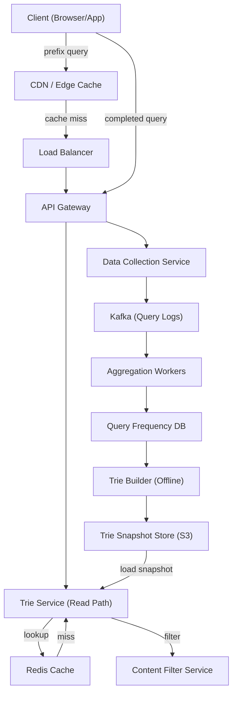
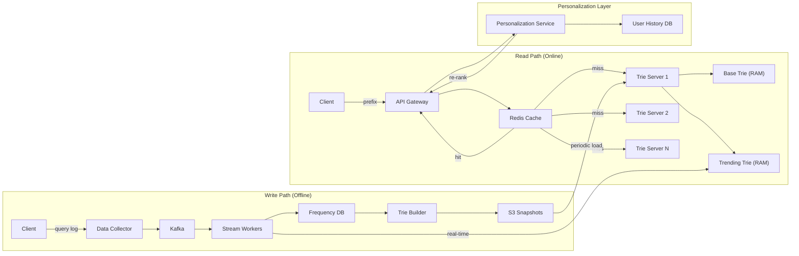

# Search Autocomplete / Typeahead System

## 1. Problem Statement

Design a search autocomplete (typeahead) system that returns the top-k most
relevant search suggestions as a user types a query prefix. The system must
handle billions of queries per day with sub-50ms latency, support prefix
matching, integrate trending queries, and optionally personalize results per
user.

Real-world examples: Google Search suggestions, Amazon product search bar,
YouTube search autocomplete.

---

## 2. Functional Requirements

| ID   | Requirement |
|------|-------------|
| FR-1 | Return top-k (default k=10) suggestions for a given prefix string. |
| FR-2 | Suggestions ranked by global query frequency (popularity). |
| FR-3 | Support prefix matching -- typing "face" returns "facebook", "facetime", etc. |
| FR-4 | Incorporate trending/recent query boost so viral topics surface quickly. |
| FR-5 | Personalization layer: weight suggestions by user's past search history. |
| FR-6 | Results update after every keystroke (character-level prefix). |
| FR-7 | Handle multi-word queries ("how to ..."). |
| FR-8 | Filter offensive / blocked terms from suggestions. |

---

## 3. Non-Functional Requirements

| ID    | Requirement |
|-------|-------------|
| NFR-1 | p99 latency < 50 ms for suggestion lookup. |
| NFR-2 | Scale to 10 billion queries per day (~115 K QPS average, ~350 K QPS peak). |
| NFR-3 | High availability: 99.99% uptime (< 53 min downtime/year). |
| NFR-4 | Eventual consistency is acceptable -- new trending queries can appear within minutes, not seconds. |
| NFR-5 | Graceful degradation: if the trie service is down, return cached or empty results rather than errors. |
| NFR-6 | Data privacy: do not surface other users' personal queries. |

---

## 4. Capacity Estimation

### 4.1 Query Volume

- 10 B queries/day
- Average query length: 20 characters -> ~20 prefix lookups per query
- Prefix lookup QPS: 10B * 20 / 86400 ~ 2.3 M QPS (many handled by client-side cache / debounce)
- After debounce (~200ms): effective server QPS ~ 350 K peak

### 4.2 Trie Storage

- Unique queries to store: ~100 M distinct queries
- Average query: 20 chars (20 bytes) + 8 bytes frequency counter + pointer overhead
- Trie node: ~60 bytes average (character, children map, top-k list pointer)
- Total trie nodes: ~2 B (avg 20 nodes per query with prefix sharing)
- Raw trie size: 2B * 60 bytes ~ 120 GB
- Compressed / pruned trie (top 5M queries): ~5-10 GB -- fits in RAM of a single machine

### 4.3 Cache

- Top 20% of prefixes serve 80% of traffic (Zipf distribution)
- Cache the top 1M prefixes * avg 1 KB response ~ 1 GB Redis cache
- TTL: 60 seconds for trending, 15 minutes for stable prefixes

### 4.4 Log Storage

- Raw query logs: 10B * ~50 bytes avg = 500 GB/day
- Retain 30 days of aggregated logs: ~500 GB compressed with rollups

---

## 5. API Design

### 5.1 Get Suggestions

```
GET /v1/suggestions?prefix={prefix}&limit={k}&user_id={uid}

Response 200:
{
  "prefix": "face",
  "suggestions": [
    {"query": "facebook", "score": 98500},
    {"query": "facebook login", "score": 72300},
    {"query": "facetime", "score": 61200},
    {"query": "face swap app", "score": 45100}
  ],
  "is_personalized": true
}
```

### 5.2 Log a Query (fire-and-forget from client)

```
POST /v1/queries
{
  "query": "facebook login",
  "user_id": "u-12345",
  "timestamp": "2024-01-15T10:30:00Z"
}

Response 202 Accepted
```

### 5.3 Report Offensive Suggestion

```
POST /v1/suggestions/report
{
  "query": "offensive term here",
  "reason": "hate_speech"
}

Response 200 OK
```

---

## 6. Data Model

### 6.1 Trie Node

```
TrieNode:
  char:       character
  children:   dict[char -> TrieNode]
  is_end:     bool
  frequency:  int            # count for this complete query
  top_k:      list[(query, freq)]  # precomputed top-k for this prefix
```

### 6.2 Query Frequency Table (Database)

```sql
CREATE TABLE query_frequencies (
    query_hash    BIGINT PRIMARY KEY,
    query_text    VARCHAR(200) NOT NULL,
    frequency     BIGINT DEFAULT 0,
    last_updated  TIMESTAMP,
    is_blocked    BOOLEAN DEFAULT FALSE
);

CREATE INDEX idx_freq ON query_frequencies(frequency DESC);
```

### 6.3 Query Log (Kafka / append-only store)

```
{
  "query": "facebook login",
  "user_id": "u-12345",
  "timestamp": 1705312200,
  "region": "us-west-2",
  "session_id": "sess-abc"
}
```

### 6.4 User Search History (for personalization)

```sql
CREATE TABLE user_search_history (
    user_id       VARCHAR(64),
    query_text    VARCHAR(200),
    search_count  INT DEFAULT 1,
    last_searched TIMESTAMP,
    PRIMARY KEY (user_id, query_text)
);
```

---

## 7. High-Level Architecture



---

## 8. Detailed Design

### 8.1 Trie with Frequency Counts

Each node in the trie stores:
- A map of children (character -> child node)
- A boolean `is_end` marking complete queries
- A `frequency` counter (only meaningful when `is_end` is True)
- A precomputed `top_k` list: the k highest-frequency completions reachable
  from this node

Precomputing top-k at every node converts a lookup from O(total completions)
to O(k) at query time. The trade-off is increased build time and memory.

### 8.2 Top-K at Each Node

During trie construction (offline), for each node we propagate the top-k
completions upward:

```
build_top_k(node, k):
    candidates = []
    if node.is_end:
        candidates.append((node.query, node.frequency))
    for child in node.children:
        candidates.extend(child.top_k)
    node.top_k = sorted(candidates, key=freq, reverse=True)[:k]
```

This is a post-order traversal, O(N * k log k) where N = number of nodes.

### 8.3 Trie Rebuild vs Real-Time Update

| Approach | Pros | Cons |
|----------|------|------|
| Full rebuild (offline, periodic) | Simple, consistent, easy to test | Stale data between rebuilds (15-60 min) |
| Real-time update | Fresh results | Complex concurrency, risk of inconsistency |
| Hybrid | Best of both | More operational complexity |

**Chosen: Hybrid approach**

- Base trie rebuilt offline every 15 minutes from aggregated frequency DB
- A small "trending overlay" trie updated in near-real-time from the last
  5 minutes of Kafka logs
- At query time, merge results from both tries, deduplicate, re-rank

### 8.4 Sampling for Data Collection

At 10B queries/day, logging every query is expensive. Strategy:

1. **Client-side debounce**: Only send prefix lookups every 200ms (reduces
   volume ~5x)
2. **Sampling**: Log 1-in-10 completed queries for frequency counting
   (statistically representative at this scale)
3. **Full logging for trending detection**: Sliding window counters on a
   small sample to detect spikes
4. **Adaptive sampling**: Increase sample rate for rare prefixes, decrease
   for common ones

### 8.5 Trie Serving

- Trie is memory-mapped from a serialized snapshot (protobuf or custom binary)
- Each trie server loads the full trie into RAM (~5-10 GB)
- Stateless: any request can go to any trie server
- Blue-green deployment: new trie snapshot loaded by standby fleet, traffic
  shifted once ready

---

## 9. Architecture Diagram



---

## 10. Architectural Patterns

### 10.1 Trie Data Structure

The trie (prefix tree) is the core data structure. It allows O(L) prefix
lookup where L is the length of the prefix. With precomputed top-k lists,
returning suggestions is O(L + k) -- independent of the total number of
stored queries.

### 10.2 CQRS (Command Query Responsibility Segregation)

- **Query side**: Trie servers handle read-only prefix lookups from an
  immutable in-memory trie snapshot
- **Command side**: Data collection service writes query logs to Kafka;
  aggregation workers update frequency DB
- The two sides are decoupled -- the read path never writes to the DB,
  and the write path never serves user queries

### 10.3 Offline/Online Separation

- **Online**: Low-latency prefix lookup from pre-built trie in RAM
- **Offline**: Periodic MapReduce / Spark job aggregates query logs,
  computes frequencies, builds new trie snapshot
- **Near-line**: Streaming pipeline (Kafka Streams / Flink) for trending
  detection and overlay trie updates

### 10.4 Event Sourcing (Query Logs)

Raw query events are the source of truth. The frequency table and trie are
derived views that can be fully reconstructed from the event log.

### 10.5 Cache-Aside Pattern

Redis cache sits between API gateway and trie servers. On cache miss, the
trie server computes the result and populates the cache. TTL-based
expiration keeps results fresh.

---

## 11. Technology Choices

### 11.1 Trie vs Inverted Index

| Criteria | Trie | Inverted Index (e.g., Elasticsearch) |
|----------|------|--------------------------------------|
| Prefix lookup speed | O(L) -- optimal | Requires prefix queries, slower |
| Memory efficiency | Good with compression | Higher overhead per document |
| Top-k precomputation | Natural fit | Requires scoring at query time |
| Fuzzy matching | Needs extension | Built-in |
| Operational complexity | Custom service | Managed service available |

**Decision**: Custom trie for primary autocomplete (latency-critical).
Elasticsearch as fallback for fuzzy/typo-tolerant suggestions.

### 11.2 Redis vs Custom Trie Server

| Criteria | Redis | Custom Trie Server |
|----------|-------|--------------------|
| Prefix lookup | Sorted sets with ZRANGEBYLEX | Native O(L) traversal |
| Top-k | Manual scoring | Precomputed at each node |
| Memory | ~2x overhead for Redis structures | Optimized for this workload |
| Ops complexity | Low (managed Redis) | Higher |
| Latency | Sub-ms for cache hits | Sub-ms for trie lookup |

**Decision**: Custom trie server for primary lookups. Redis as a caching
layer in front of trie servers for hot prefixes.

### 11.3 Kafka for Log Collection

- Handles 10B+ events/day with horizontal scaling
- Durable, replayable log for reprocessing
- Decouples data collection from aggregation
- Native integration with Spark Streaming / Flink for analytics

---

## 12. Scalability

### 12.1 Horizontal Scaling of Trie Servers

- Trie servers are stateless readers of an immutable snapshot
- Scale out by adding more replicas behind the load balancer
- Each server holds the full trie (~5-10 GB) -- no sharding needed for
  moderate query sets

### 12.2 Sharding for Very Large Query Sets

If the trie exceeds single-machine RAM:
- **Shard by first character(s)**: prefix "a*" -> shard 0, "b*" -> shard 1
- API gateway routes to the correct shard based on the prefix
- Uneven distribution (more queries start with certain letters) handled by
  consistent hashing across prefix ranges

### 12.3 Multi-Region Deployment

- Deploy trie servers in each region (us-east, us-west, eu-west, ap-east)
- Regional trie snapshots can include region-specific trending queries
- Global frequency aggregation with per-region overlays

### 12.4 Data Pipeline Scaling

- Kafka partitioned by query hash for parallel consumption
- Aggregation workers auto-scale based on consumer lag
- Trie build is a batch job: parallelizable by prefix range

---

## 13. Reliability

### 13.1 Redundancy

- Multiple trie server replicas per region (minimum 3)
- Redis cache cluster with replication
- Kafka with replication factor 3

### 13.2 Failure Modes and Mitigations

| Failure | Impact | Mitigation |
|---------|--------|------------|
| Trie server crash | Reduced capacity | Load balancer routes to healthy replicas |
| Redis cache down | Higher latency (cache miss) | Trie servers handle full load; circuit breaker |
| Kafka broker down | Delayed log ingestion | Replication; client-side buffering |
| Trie build failure | Stale suggestions | Keep serving previous snapshot; alert on build failure |
| DB down | Cannot rebuild trie | Trie servers unaffected (serve from RAM); DB has standby replica |

### 13.3 Deployment Safety

- Blue-green deployment for trie snapshots
- Canary rollout: new trie served to 5% of traffic, monitor error rates
- Rollback: revert to previous snapshot in < 1 minute

---

## 14. Security

### 14.1 Input Validation

- Sanitize prefix input: max length 200 chars, strip special characters
- Rate limiting per user/IP to prevent abuse

### 14.2 Content Filtering

- Blocklist of offensive terms checked before returning suggestions
- ML-based toxicity filter as a second layer
- Admin API to add/remove blocked terms in real-time

### 14.3 Privacy

- Do not surface other users' personal/identifiable queries
- Aggregate frequency counts are anonymous
- User search history encrypted at rest; user can delete their history
- GDPR/CCPA compliance: right to erasure for query logs

### 14.4 Authentication

- Public autocomplete endpoint: rate-limited, no auth required
- Personalized endpoint: requires auth token (JWT)
- Admin endpoints: role-based access control

---

## 15. Monitoring

### 15.1 Key Metrics

| Metric | Target | Alert Threshold |
|--------|--------|-----------------|
| p50 latency | < 10 ms | > 20 ms |
| p99 latency | < 50 ms | > 100 ms |
| Cache hit ratio | > 90% | < 80% |
| Trie build duration | < 10 min | > 30 min |
| Trie freshness (age of snapshot) | < 20 min | > 60 min |
| Error rate (5xx) | < 0.01% | > 0.1% |
| QPS per trie server | < 50 K | > 80 K |

### 15.2 Dashboards

- Real-time QPS and latency distribution
- Cache hit/miss ratio over time
- Trie size (nodes, memory) trend
- Top trending queries (last 5 min, 1 hr, 24 hr)
- Data pipeline lag (Kafka consumer offset)

### 15.3 Alerting

- PagerDuty integration for critical alerts (latency spike, server down)
- Slack notifications for warning-level alerts (cache ratio drop, build delay)
- Automated runbooks linked to each alert

### 15.4 Logging

- Structured JSON logs for all services
- Distributed tracing (OpenTelemetry) across read path
- Query sampling for debugging (1% of requests logged with full context)
