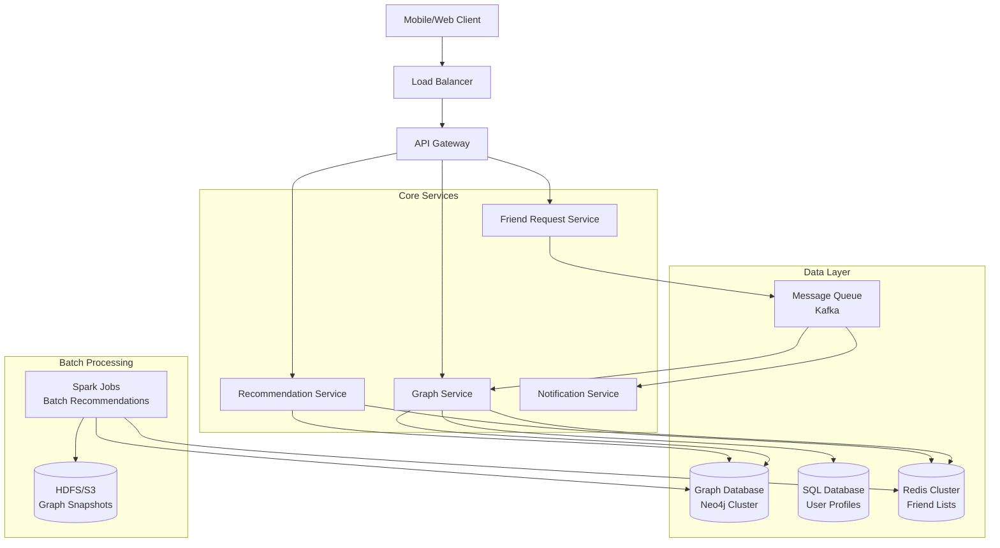
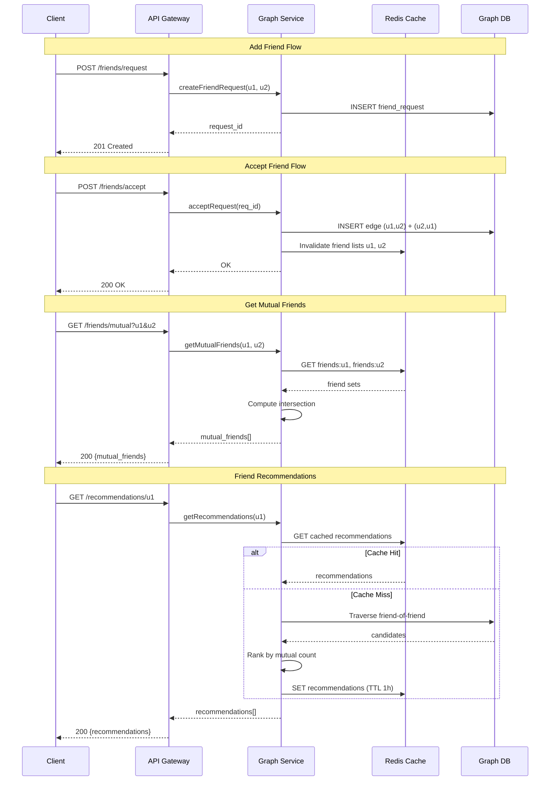

# Social Graph System (Facebook-like)

## 1. Problem Statement

Design a scalable social graph system that models user relationships (friendships) and
supports efficient friend operations: adding/removing friends, finding mutual friends,
generating friend recommendations ("People You May Know"), and computing degrees of
separation between any two users. The system must handle billions of users with
sub-second latency for interactive queries while processing batch recommendation
jobs in the background.

---

## 2. Functional Requirements

| ID | Requirement | Description |
|----|-------------|-------------|
| FR-1 | Add Friend | Send and accept a friend request, creating a bidirectional edge |
| FR-2 | Remove Friend | Delete the bidirectional friendship edge |
| FR-3 | Friend List | Retrieve paginated list of a user's friends |
| FR-4 | Mutual Friends | Given two users, return their common friends |
| FR-5 | Friend Recommendations | "People You May Know" via friend-of-friend analysis |
| FR-6 | Degrees of Separation | Compute shortest path length between two users (BFS) |
| FR-7 | Friend Request Management | Send, accept, reject, cancel pending requests |
| FR-8 | Block User | Prevent a user from sending requests or appearing in results |

---

## 3. Non-Functional Requirements

| Requirement | Target |
|-------------|--------|
| Friend lookup latency | < 50 ms (p99) |
| Scale | 1 billion users, ~200 avg friends/user |
| Recommendation generation | < 200 ms for online; batch within 1 hour |
| Availability | 99.99% uptime |
| Consistency | Eventual consistency acceptable for recommendations; strong for friendship mutations |
| Data durability | No friendship data loss (replicated storage) |

---

## 4. Capacity Estimation

### Users and Edges

| Metric | Value |
|--------|-------|
| Total users | 1,000,000,000 (1B) |
| Average friends per user | 200 |
| Total friendship edges | 1B x 200 / 2 = 100B edges |
| Edge storage (user_id pair + metadata) | ~64 bytes/edge |
| Total edge storage | 100B x 64B = ~6.4 TB |
| User profile storage (core fields) | ~500 bytes/user |
| Total user storage | 1B x 500B = ~500 GB |

### Query Load

| Operation | Estimated QPS |
|-----------|---------------|
| Friend list reads | 500,000 |
| Mutual friend queries | 100,000 |
| Add/remove friend writes | 50,000 |
| Recommendation requests | 200,000 |
| Degrees of separation | 10,000 |

### Cache Requirements

- Friend list cache: top 100M active users x 200 friends x 8 bytes = ~160 GB
- Redis cluster with 20+ nodes

---

## 5. API Design

### REST Endpoints

```
POST   /v1/friends/request
  Body: { "from_user_id": "u1", "to_user_id": "u2" }
  Response: 201 Created

POST   /v1/friends/accept
  Body: { "request_id": "req123" }
  Response: 200 OK

DELETE /v1/friends/{user_id}/{friend_id}
  Response: 204 No Content

GET    /v1/friends/{user_id}?cursor=xxx&limit=20
  Response: { "friends": [...], "next_cursor": "yyy" }

GET    /v1/friends/mutual?user1=u1&user2=u2
  Response: { "mutual_friends": [...], "count": 15 }

GET    /v1/friends/recommendations/{user_id}?limit=10
  Response: { "recommendations": [{ "user_id": "u5", "mutual_count": 8 }, ...] }

GET    /v1/friends/degrees?user1=u1&user2=u2&max_depth=6
  Response: { "degrees": 3, "path": ["u1", "u7", "u3", "u2"] }
```

### Rate Limiting

- Read endpoints: 1000 req/min per user
- Write endpoints: 100 req/min per user
- Degrees of separation: 10 req/min per user (expensive BFS)

---

## 6. Data Model

### Users Table

```sql
CREATE TABLE users (
    user_id     BIGINT PRIMARY KEY,
    username    VARCHAR(64) UNIQUE NOT NULL,
    name        VARCHAR(128),
    created_at  TIMESTAMP DEFAULT NOW(),
    status      ENUM('active', 'suspended', 'deleted')
);
```

### Friendships Table (Bidirectional Edges)

```sql
CREATE TABLE friendships (
    user_id     BIGINT NOT NULL,
    friend_id   BIGINT NOT NULL,
    created_at  TIMESTAMP DEFAULT NOW(),
    PRIMARY KEY (user_id, friend_id),
    INDEX idx_friend (friend_id, user_id)
);
-- Each friendship stored as TWO rows: (A,B) and (B,A)
-- Enables efficient single-key lookup for "all friends of X"
```

### Friend Requests Table

```sql
CREATE TABLE friend_requests (
    request_id  BIGINT PRIMARY KEY AUTO_INCREMENT,
    from_user   BIGINT NOT NULL,
    to_user     BIGINT NOT NULL,
    status      ENUM('pending', 'accepted', 'rejected', 'cancelled'),
    created_at  TIMESTAMP DEFAULT NOW(),
    updated_at  TIMESTAMP DEFAULT NOW(),
    UNIQUE KEY uq_request (from_user, to_user)
);
```

### Blocked Users Table

```sql
CREATE TABLE blocked_users (
    user_id         BIGINT NOT NULL,
    blocked_user_id BIGINT NOT NULL,
    created_at      TIMESTAMP DEFAULT NOW(),
    PRIMARY KEY (user_id, blocked_user_id)
);
```

### Graph Database Model (Neo4j)

```cypher
(:User {id: 123, name: "Alice"})
  -[:FRIENDS_WITH {since: "2024-01-15"}]->
(:User {id: 456, name: "Bob"})
```

---

## 7. High-Level Architecture



---

## 8. Detailed Design

### 8.1 Graph Storage: Adjacency List

The core data structure is an **adjacency list** where each user maps to a set of
friend user IDs. This enables O(1) friend existence checks and O(degree) friend
list retrieval.

```
graph = {
    "alice":  {"bob", "charlie", "diana"},
    "bob":    {"alice", "eve"},
    "charlie": {"alice", "diana"},
    ...
}
```

**In-memory representation** uses hash maps of hash sets for O(1) average-case
lookup per edge.

### 8.2 BFS for Mutual Friends

Given users A and B, mutual friends = `friends(A) intersection friends(B)`.

```
mutual_friends(A, B):
    return friends[A] & friends[B]
```

Time complexity: O(min(deg(A), deg(B))) with hash sets.

### 8.3 Friend-of-Friend Recommendations

The "People You May Know" algorithm:

```
recommend(user):
    candidates = Counter()
    for friend in friends[user]:
        for fof in friends[friend]:
            if fof != user and fof not in friends[user]:
                candidates[fof] += 1  # count mutual connections
    return candidates.most_common(k)
```

- Candidates ranked by number of mutual friends (higher = stronger signal)
- Additional signals: shared schools, workplaces, location, interaction frequency
- Time complexity: O(d^2) where d = average degree

### 8.4 Degrees of Separation (BFS)

Bidirectional BFS from both source and target, meeting in the middle:

```
degrees_of_separation(src, dst):
    if src == dst: return 0
    front_src = {src}, front_dst = {dst}
    visited_src = {src}, visited_dst = {dst}
    depth = 0
    while front_src and front_dst:
        depth += 1
        # expand smaller frontier
        if len(front_src) <= len(front_dst):
            next_front = expand(front_src)
            if next_front & visited_dst: return depth
            visited_src |= next_front
            front_src = next_front
        else:
            ...similar for dst side...
    return -1  # not connected
```

Bidirectional BFS reduces search space from O(b^d) to O(b^(d/2)).

### 8.5 Graph Partitioning

For billion-scale graphs:

- **Hash-based partitioning**: `partition = hash(user_id) % num_partitions`
  - Simple, even distribution, but friends likely on different partitions
- **Social-aware partitioning** (e.g., METIS):
  - Cluster tightly connected users on the same partition
  - Reduces cross-partition queries by up to 70%
- **Replication of high-degree vertices**:
  - Celebrity nodes replicated across partitions
  - Reduces hot-spot reads

---

## 9. Architecture Diagram



---

## 10. Architectural Patterns

### Graph Database Pattern
- Native graph storage with index-free adjacency for O(1) edge traversal
- Cypher query language for expressive graph pattern matching
- Best for relationship-heavy queries (mutual friends, shortest path)

### BFS/DFS Traversal
- BFS for shortest path (degrees of separation) with bounded depth (max 6)
- Bidirectional BFS reduces exponential search space
- DFS for connected component analysis and community detection

### Collaborative Filtering
- Friend-of-friend scoring: rank by mutual connection count
- Hybrid approach: combine graph signals with user attributes (location, school)
- Batch pre-computation via Spark for top-k recommendations per user

### Cache-Aside Pattern
- Friend list cached in Redis sorted sets (score = friendship timestamp)
- Cache invalidation on add/remove friend operations
- Recommendation cache with 1-hour TTL to balance freshness and load

### Event-Driven Architecture
- Friendship mutations published to Kafka topics
- Consumers: notification service, recommendation refresher, analytics
- Decouples write path from downstream processing

---

## 11. Technology Choices

| Component | Choice | Rationale |
|-----------|--------|-----------|
| Graph Storage | **Neo4j** (primary) + SQL adjacency list (fallback) | Native graph traversal for complex queries; SQL for simple lookups |
| Relational DB | **MySQL/PostgreSQL** | User profiles, friend requests, metadata |
| Cache | **Redis Cluster** | Sorted sets for friend lists, TTL for recommendations |
| Message Queue | **Apache Kafka** | Durable event streaming for friendship events |
| Batch Processing | **Apache Spark (GraphX)** | Large-scale graph analytics and recommendation generation |
| Search | **Elasticsearch** | User search by name, location for friend discovery |
| API Gateway | **Kong / Envoy** | Rate limiting, authentication, request routing |
| Monitoring | **Prometheus + Grafana** | Latency percentiles, cache hit rates, graph query metrics |

### Neo4j vs SQL Adjacency List Trade-offs

| Aspect | Neo4j | SQL Adjacency List |
|--------|-------|-------------------|
| Multi-hop traversal | O(hops x avg_degree) - excellent | Requires recursive JOINs - slower |
| Single-hop friends | Fast | Fast with proper indexing |
| Operational complexity | Higher (cluster management) | Lower (use existing SQL infra) |
| Cost | License cost for enterprise | Included in existing DB |
| Recommendation | Use for >= 2-hop queries | Use for 1-hop queries and storage |

---

## 12. Scalability

### Horizontal Scaling
- **Graph DB sharding**: Hash-based with social-aware rebalancing
- **Read replicas**: 5-10 replicas per shard for read-heavy friend list queries
- **Caching tier**: Redis cluster scales independently (add nodes for throughput)

### Handling Celebrity Nodes (High Degree)
- Users with >100K friends get special treatment:
  - Friend list stored in dedicated shards
  - Recommendations pre-computed and cached
  - Rate-limited traversal to prevent resource exhaustion

### Batch vs Real-Time Pipeline
- **Real-time**: Add/remove friend, mutual friends, friend list (< 50ms)
- **Near real-time**: Recommendation refresh on friendship changes (via Kafka, < 5min)
- **Batch**: Full graph recommendation recomputation (Spark, nightly)

---

## 13. Reliability

- **Replication**: Neo4j causal clustering (1 leader + 2 followers per partition)
- **Backup**: Daily full graph snapshots to S3; hourly incremental WAL shipping
- **Circuit breaker**: If graph DB latency exceeds 500ms, serve stale cache
- **Graceful degradation**:
  - If recommendation service is down, show cached or empty recommendations
  - If graph DB is down, serve friend lists from Redis cache (read-only mode)
- **Idempotent operations**: Friend add/remove are idempotent by design (set semantics)

---

## 14. Security

- **Authentication**: OAuth 2.0 / JWT for all API endpoints
- **Authorization**: Users can only query their own friend list; mutual friends requires both users to be non-blocked
- **Privacy controls**:
  - Friend list visibility: public / friends-only / private
  - "People You May Know" opt-out setting
- **Rate limiting**: Per-user limits to prevent scraping of social graph
- **Data encryption**: TLS in transit; AES-256 at rest for PII
- **Graph traversal limits**: Max depth of 3 for recommendations, 6 for degrees of separation

---

## 15. Monitoring and Observability

### Key Metrics

| Metric | Alert Threshold |
|--------|----------------|
| Friend list p99 latency | > 50ms |
| Mutual friends p99 latency | > 100ms |
| Recommendation p99 latency | > 200ms |
| Graph DB query error rate | > 0.1% |
| Cache hit rate (friend lists) | < 95% |
| Friendship write throughput | < 40K/s |
| BFS depth distribution | > 6 hops for >1% of queries |

### Dashboards
- **Graph Health**: Edge count, vertex count, partition balance, replication lag
- **Query Performance**: Latency histograms by query type, slow query log
- **Cache Effectiveness**: Hit/miss rates, eviction rates, memory usage
- **Recommendation Quality**: Click-through rate, acceptance rate, diversity score

### Alerting
- PagerDuty for p99 latency breaches and error rate spikes
- Slack notifications for cache hit rate drops and partition rebalancing events
- Weekly reports on graph growth, recommendation quality, and capacity projections
