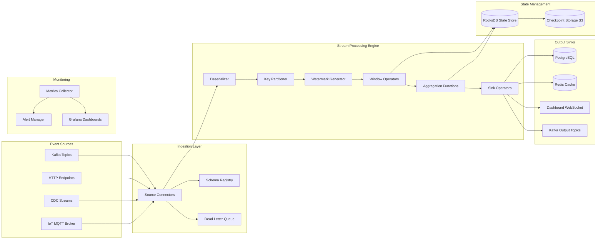
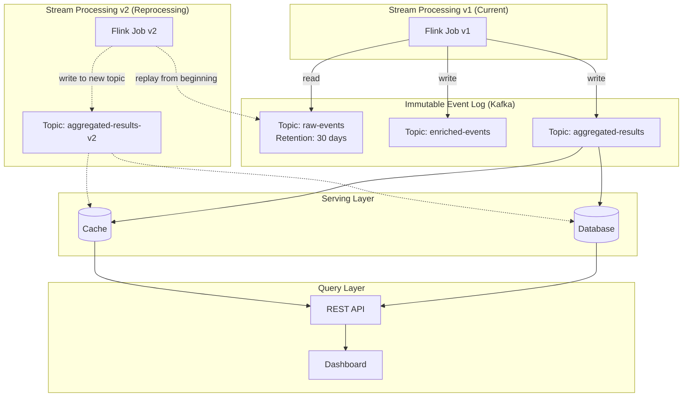
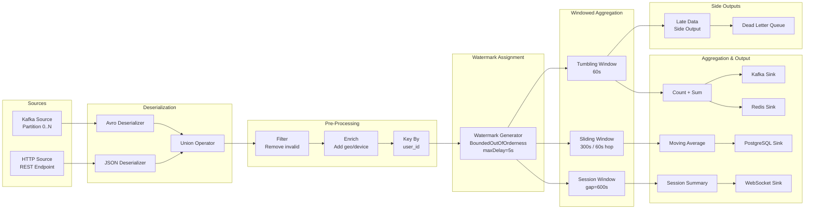

# Real-Time Streaming Data Pipeline - System Design

## Table of Contents

1. [Problem Statement](#1-problem-statement)
2. [Functional Requirements](#2-functional-requirements)
3. [Non-Functional Requirements](#3-non-functional-requirements)
4. [Capacity Estimation](#4-capacity-estimation)
5. [API Design](#5-api-design)
6. [Data Model](#6-data-model)
7. [High-Level Architecture](#7-high-level-architecture)
8. [Detailed Design](#8-detailed-design)
9. [Architecture Diagram](#9-architecture-diagram)
10. [Architectural Patterns](#10-architectural-patterns)
11. [Technology Choices](#11-technology-choices)
12. [Scalability](#12-scalability)
13. [Reliability](#13-reliability)
14. [Security](#14-security)
15. [Monitoring](#15-monitoring)

---

## 1. Problem Statement

Modern businesses generate massive volumes of event data from user interactions, IoT sensors, financial transactions, and application logs. Deriving real-time insights from this data is critical for:

- **Real-time analytics**: Dashboards showing live metrics such as active users, conversion rates, and revenue per minute.
- **Fraud detection**: Identifying suspicious transaction patterns within milliseconds to block fraudulent activity before it completes.
- **Recommendations**: Serving personalized content or product suggestions based on the user's current session behavior, not stale batch-computed models.
- **Alerting and anomaly detection**: Triggering operational alerts when metrics deviate from expected baselines in real time.

Traditional batch processing (e.g., nightly ETL) introduces hours of latency, making it unsuitable for these use cases. We need a **streaming data pipeline** that can:

1. Ingest millions of events per second from heterogeneous sources.
2. Process and aggregate them in real time using windowed computations.
3. Handle late-arriving and out-of-order events gracefully.
4. Deliver results to multiple downstream sinks with exactly-once semantics.
5. Recover from failures without data loss or duplication.

---

## 2. Functional Requirements

| ID | Requirement | Description |
|----|------------|-------------|
| FR-1 | **High-velocity event ingestion** | Accept events from Kafka topics, HTTP endpoints, CDC streams, and IoT brokers at rates up to 1M events/sec per partition group. |
| FR-2 | **Windowed aggregations** | Support **tumbling** (fixed, non-overlapping), **sliding** (overlapping, hop-based), and **session** (activity-gap-based) windows with configurable sizes and gaps. |
| FR-3 | **Exactly-once processing** | Guarantee that each event contributes to exactly one output result, even across retries and failures. |
| FR-4 | **Late data handling** | Accept events that arrive after the watermark has advanced past their event time, routing them to side outputs or re-aggregating within an allowed lateness threshold. |
| FR-5 | **Multi-sink output** | Write results concurrently to databases (PostgreSQL, Cassandra), caches (Redis), dashboards (WebSocket push), and downstream Kafka topics. |
| FR-6 | **Schema evolution** | Integrate with a schema registry to support backward/forward compatible schema changes without pipeline restarts. |
| FR-7 | **Dead letter queue** | Route malformed, unprocessable, or schema-violating events to a DLQ topic for manual inspection and replay. |
| FR-8 | **Stream topology definition** | Provide a builder API to define source -> transform -> window -> sink pipelines programmatically. |
| FR-9 | **Backpressure management** | Automatically slow down ingestion when downstream sinks or processing stages cannot keep up. |

---

## 3. Non-Functional Requirements

| ID | Requirement | Target |
|----|------------|--------|
| NFR-1 | **End-to-end latency** | < 1 second from event ingestion to sink delivery (p99). |
| NFR-2 | **Throughput** | Process >= 1,000,000 events/sec per pipeline instance (horizontally scalable). |
| NFR-3 | **Exactly-once semantics** | Zero duplicates, zero data loss under normal operations and single-node failures. |
| NFR-4 | **Out-of-order handling** | Correctly process events arriving up to 5 minutes out of order using watermarks. |
| NFR-5 | **Availability** | 99.99% uptime via automatic failover and checkpoint-based recovery. |
| NFR-6 | **Recovery time** | Resume processing within 30 seconds of a task manager failure. |
| NFR-7 | **State size** | Support up to 1 TB of managed keyed state per pipeline. |
| NFR-8 | **Checkpoint duration** | Complete incremental checkpoints in < 5 seconds for 100 GB state. |

---

## 4. Capacity Estimation

### Event Volume

| Metric | Value |
|--------|-------|
| Peak events/sec | 1,000,000 |
| Average event size | 500 bytes |
| Peak ingestion bandwidth | 500 MB/sec (~4 Gbps) |
| Daily event volume | ~50 billion events |
| Daily raw data | ~25 TB |

### State Storage

| Component | Size Estimate |
|-----------|--------------|
| Active tumbling windows (1-min, 100K keys) | ~5 GB |
| Active sliding windows (5-min, 30s hop, 100K keys) | ~50 GB |
| Active session windows (30-min gap, 1M users) | ~20 GB |
| Total managed state | ~75 GB typical, up to 1 TB peak |

### Checkpoint Storage

| Parameter | Value |
|-----------|-------|
| Checkpoint interval | 30 seconds |
| Incremental checkpoint size | ~500 MB (delta) |
| Full checkpoint size | ~75 GB |
| Checkpoint storage (7-day retention) | ~1 TB |
| Checkpoint backend | S3 / HDFS with RocksDB incremental snapshots |

### Cluster Sizing (Flink Reference)

| Resource | Estimate |
|----------|----------|
| Task managers | 20-50 nodes |
| CPU per task manager | 8-16 cores |
| Memory per task manager | 32-64 GB |
| Network bandwidth per node | 10 Gbps |
| Kafka partitions (input) | 100-500 |

---

## 5. API Design

### Stream Definition API

```
POST /api/v1/streams
{
    "name": "user-click-stream",
    "source": {
        "type": "kafka",
        "topic": "raw-clicks",
        "deserialization": "avro",
        "schema_registry": "http://registry:8081"
    },
    "transforms": [
        {"type": "filter", "condition": "event.type == 'click'"},
        {"type": "map", "expression": "enrich_with_geo(event)"},
        {"type": "key_by", "key": "event.user_id"}
    ],
    "window": {
        "type": "tumbling",
        "size": "60s",
        "allowed_lateness": "300s",
        "trigger": "event_time"
    },
    "aggregation": {
        "type": "reduce",
        "function": "count_and_sum",
        "output_fields": ["user_id", "click_count", "total_value"]
    },
    "sinks": [
        {"type": "kafka", "topic": "click-aggregates"},
        {"type": "redis", "key_pattern": "clicks:{user_id}:{window_end}"},
        {"type": "postgres", "table": "click_summaries"}
    ]
}
```

### Topology Management API

```
GET  /api/v1/topologies                  -- List all topologies
POST /api/v1/topologies                  -- Deploy a new topology
GET  /api/v1/topologies/{id}             -- Get topology details
PUT  /api/v1/topologies/{id}/scale       -- Scale parallelism
POST /api/v1/topologies/{id}/savepoint   -- Trigger savepoint
POST /api/v1/topologies/{id}/restart     -- Restart from savepoint
DELETE /api/v1/topologies/{id}           -- Stop and remove topology
```

### Metrics API

```
GET /api/v1/metrics/throughput           -- Events processed/sec
GET /api/v1/metrics/latency              -- p50, p95, p99 latency
GET /api/v1/metrics/backpressure         -- Backpressure ratio per operator
GET /api/v1/metrics/checkpoints          -- Checkpoint duration and size
GET /api/v1/metrics/watermark            -- Current watermark per partition
GET /api/v1/metrics/state-size           -- Managed state size per operator
```

---

## 6. Data Model

### Event

```json
{
    "event_id": "uuid-v4",
    "event_time": "2024-01-15T10:30:00.123Z",
    "processing_time": "2024-01-15T10:30:00.456Z",
    "ingestion_time": "2024-01-15T10:30:00.234Z",
    "source": "mobile-app",
    "event_type": "click",
    "key": "user-12345",
    "payload": {
        "page": "/products/widget",
        "action": "add_to_cart",
        "value": 29.99
    },
    "metadata": {
        "schema_version": "2.1",
        "partition": 42,
        "offset": 1000234
    }
}
```

### Window

```json
{
    "window_id": "tumbling-60s-user12345-1705312200000",
    "window_type": "tumbling",
    "key": "user-12345",
    "start_time": "2024-01-15T10:30:00.000Z",
    "end_time": "2024-01-15T10:31:00.000Z",
    "state": {
        "count": 47,
        "sum_value": 1234.56,
        "min_value": 1.99,
        "max_value": 99.99
    },
    "event_count": 47,
    "last_updated": "2024-01-15T10:30:58.789Z"
}
```

### Watermark

```json
{
    "partition_id": 42,
    "watermark_time": "2024-01-15T10:29:55.000Z",
    "current_processing_time": "2024-01-15T10:30:00.456Z",
    "lag_ms": 5456,
    "strategy": "bounded_out_of_orderness",
    "max_delay": "5s"
}
```

### Checkpoint

```json
{
    "checkpoint_id": 12345,
    "trigger_time": "2024-01-15T10:30:00.000Z",
    "completion_time": "2024-01-15T10:30:02.345Z",
    "duration_ms": 2345,
    "size_bytes": 524288000,
    "type": "incremental",
    "state_snapshots": {
        "window-operator-1": {"keys": 100000, "size_mb": 250},
        "window-operator-2": {"keys": 50000, "size_mb": 125}
    },
    "source_offsets": {
        "raw-clicks-0": 1000234,
        "raw-clicks-1": 998765
    },
    "storage_path": "s3://checkpoints/pipeline-1/chk-12345/"
}
```

---

## 7. High-Level Architecture



---

## 8. Detailed Design

### 8.1 Kappa Architecture

Unlike Lambda Architecture, which maintains separate batch and speed layers, the **Kappa Architecture** treats everything as a stream:

```
Traditional Lambda:
  Raw Data --> Batch Layer (MapReduce) --> Serving Layer --> Query
  Raw Data --> Speed Layer (Storm)     --> Serving Layer --> Query

Kappa Architecture:
  Raw Data --> Stream Layer (Flink) --> Serving Layer --> Query
```

**Key Principles:**
1. **Single processing path**: All data flows through the streaming engine. No batch layer to maintain.
2. **Reprocessing via replay**: To recompute results, replay the immutable event log (Kafka) through an updated pipeline version.
3. **Immutable log as source of truth**: Kafka retains events for a configurable period (e.g., 30 days), enabling full reprocessing.

**Advantages over Lambda:**
- No code duplication between batch and streaming layers.
- Simpler operational model (one system to deploy and monitor).
- Consistent results (no reconciliation between batch and streaming outputs).

**Trade-offs:**
- Requires a replayable, durable event log (Kafka with sufficient retention).
- Reprocessing large historical windows can be expensive.
- Not ideal for workloads requiring ad-hoc batch exploration (use a separate OLAP system).

### 8.2 Windowing Strategies

#### Tumbling Windows (Fixed, Non-Overlapping)

```
Time:    |  0s  |  10s |  20s |  30s |  40s |  50s |  60s |
Events:  . * . * * . * . . * * * . * . * . * * . * . * * .
Window:  |<--- Window 1 --->|<--- Window 2 --->|<--- Window 3 --->|
         [0s, 20s)          [20s, 40s)          [40s, 60s)

- Fixed size, no overlap
- Each event belongs to exactly one window
- Window fires when watermark passes window end time
- Use case: per-minute aggregations, hourly reports
```

#### Sliding Windows (Overlapping, Hop-Based)

```
Time:    |  0s  |  10s |  20s |  30s |  40s |  50s |
Events:  . * . * * . * . . * * * . * . * . * * . *
Window1: |<------- 30s window ------->|
Window2:       |<------- 30s window ------->|
Window3:              |<------- 30s window ------->|
         Hop = 10s, Size = 30s

- Fixed size, overlapping by hop interval
- Each event belongs to (window_size / hop) windows
- Smoother aggregation curves than tumbling
- Use case: moving averages, trend detection
```

#### Session Windows (Activity-Gap-Based)

```
Time:    |  0s  |  5s  |  10s |  20s |  25s |  30s |  50s |  55s |
Events:  * . * * . * . .  .  .  * . * * .  .  .  .  * . * .
         |<- Session 1 ->|      |<-Session 2->|      |<-Ses 3->|
         gap=10s          gap>10s             gap>10s

- Dynamic size based on activity gaps
- Window closes when no event arrives within the gap duration
- Sessions merge if a late event bridges two sessions
- Use case: user session analytics, clickstream analysis
```

### 8.3 Watermarks and Late Data Handling

Watermarks track the progress of event time through the stream. They provide a heuristic assertion: "No events with timestamp <= W will arrive after this point."

```
Processing Time -->
   |
   |  Events:     e1(t=10) e2(t=8) e3(t=15) e4(t=12) e5(t=20) e6(t=9)
   |                                                              ^
   |  Watermark:  W=5      W=5     W=10     W=10     W=15       LATE!
   |                                                   |
   |  e6 arrives with event_time=9, but watermark=15   |
   |  -> e6 is "late" (event_time < watermark)         |
   |                                                   |
   |  Handling options:                                |
   |  1. Drop (default after allowed_lateness)         |
   |  2. Side output to late-data topic                |
   |  3. Re-aggregate within allowed_lateness window   |
```

**Watermark generation strategies:**
- **Bounded out-of-orderness**: `watermark = max_event_time - max_delay`. Simple, works for most cases.
- **Per-partition tracking**: Track watermarks per Kafka partition, advance global watermark to min of all partitions.
- **Punctuated**: Use special watermark events embedded in the stream.

### 8.4 Checkpointing for Fault Tolerance

The checkpoint-barrier algorithm (based on Chandy-Lamport distributed snapshots):

```
Source1: ---e1---e2---[B1]---e3---e4---[B2]---e5---
Source2: ---e6---e7---[B1]---e8---e9---[B2]---e10--

Operator receives barrier B1 from Source1:
  1. Stop processing Source1 events
  2. Buffer Source1 events until B1 arrives from Source2
  3. When B1 arrives from all inputs:
     a. Snapshot operator state to checkpoint storage
     b. Forward B1 to downstream operators
     c. Resume processing all inputs

Checkpoint completes when all sinks acknowledge B1.
```

**Checkpoint types:**
- **Full checkpoint**: Snapshot all state. Simple but expensive for large state.
- **Incremental checkpoint**: Only snapshot state changes since last checkpoint. Uses RocksDB SST file tracking.

**Recovery process:**
1. Detect task manager failure.
2. Restart failed tasks on available task managers.
3. Restore state from the latest completed checkpoint.
4. Reset source offsets (Kafka) to checkpoint positions.
5. Resume processing; events between checkpoint and failure are replayed.

### 8.5 Exactly-Once Semantics

Exactly-once requires coordination across three boundaries:

```
[Source] --exactly-once--> [Processor] --exactly-once--> [Sink]

Source side:
  - Kafka consumer with committed offsets stored in checkpoint
  - On recovery, reset to checkpointed offsets (replay is safe)

Processing side:
  - Checkpoint-barrier algorithm ensures consistent state snapshots
  - State is restored atomically on recovery

Sink side (two approaches):
  1. Idempotent writes: Use deterministic keys so replayed writes overwrite
     - Redis SET, database UPSERT with event_id
  2. Transactional writes: Two-phase commit with checkpoint
     - Kafka transactional producer: begin_txn -> write -> commit on checkpoint
     - Database: begin_txn -> write -> commit on checkpoint notification
```

---

## 9. Architecture Diagram

### Kappa Architecture Overview



### Event Processing Topology



---

## 10. Architectural Patterns

### 10.1 Kappa Architecture

**Pattern**: Treat all data as streams. Use an immutable, replayable event log as the single source of truth. Eliminate the batch layer entirely.

**Application**: The pipeline reads exclusively from Kafka topics. Historical reprocessing is achieved by replaying the log through a new job version, not by running a separate batch job.

### 10.2 Event Sourcing

**Pattern**: Store every state change as an immutable event rather than overwriting current state. Derive current state by replaying events.

**Application**: Raw events are immutable in Kafka. Windowed aggregations are derived state computed by replaying events within a window. On failure recovery, state is rebuilt from checkpointed snapshots + replayed events.

### 10.3 Windowed Aggregation

**Pattern**: Group unbounded streams into finite, time-bounded windows for aggregation. Different window types serve different analytical needs.

**Application**: Tumbling windows for periodic reports, sliding windows for smoothed metrics, session windows for user behavior analysis. Windows are keyed by business dimensions (user_id, region, etc.).

### 10.4 Watermark-Based Late Data Handling

**Pattern**: Use watermarks (monotonically advancing timestamps) to track event-time progress. Events arriving after the watermark are classified as "late" and handled via configurable policies.

**Application**: Bounded out-of-orderness watermarks with a 5-second max delay. Late events within the allowed lateness window trigger re-aggregation. Events beyond the allowed lateness are routed to a dead letter queue for manual processing.

### 10.5 Checkpoint-Barrier Algorithm (Chandy-Lamport)

**Pattern**: Inject barrier markers into the data stream. When an operator receives barriers from all inputs, it snapshots its state. This produces a globally consistent snapshot without stopping processing.

**Application**: Flink's checkpoint coordinator injects barriers every 30 seconds. Barriers flow through the DAG. Operators snapshot to RocksDB + S3. On failure, the entire pipeline rolls back to the latest completed checkpoint.

---

## 11. Technology Choices

### Stream Processing Engines Comparison

| Feature | Apache Flink | Spark Structured Streaming | Kafka Streams | Apache Storm |
|---------|-------------|---------------------------|---------------|--------------|
| **Processing model** | True streaming (event-at-a-time) | Micro-batch (continuous mode experimental) | True streaming | True streaming |
| **Latency** | Milliseconds | Seconds (micro-batch interval) | Milliseconds | Milliseconds |
| **Exactly-once** | Native (checkpoint barriers) | Via micro-batch boundaries | Via Kafka transactions | At-least-once (Trident for EO) |
| **State management** | Built-in (RocksDB, heap) | Delta Lake / RocksDB | Kafka changelog topics | External (manual) |
| **Windowing** | Rich (tumbling, sliding, session, global) | Tumbling, sliding (session limited) | Tumbling, sliding, session | Manual implementation |
| **Late data** | Watermarks + allowed lateness | Watermarks + allowed lateness | Grace period on windows | Not built-in |
| **Throughput** | Very high (millions/sec) | High (micro-batch amortization) | High (per-partition) | Moderate |
| **Operational complexity** | Moderate (separate cluster) | High (Spark cluster) | Low (embedded in app) | High (ZooKeeper) |

**Our Choice: Apache Flink**

Rationale:
1. True event-at-a-time processing achieves the sub-second latency requirement.
2. Native exactly-once semantics via checkpoint barriers without external coordination.
3. Rich windowing primitives including session windows with late data support.
4. Proven at scale (Alibaba processes 1B+ events/sec with Flink).

### State Backend: RocksDB vs Heap

| Aspect | RocksDB | Heap (JVM) |
|--------|---------|------------|
| **State size** | Up to TBs (disk-backed) | Limited by JVM heap (GBs) |
| **Access latency** | Microseconds (with cache) | Nanoseconds |
| **Incremental checkpoints** | Yes (SST file tracking) | No (full snapshot) |
| **GC impact** | None (off-heap) | Significant for large state |
| **Use case** | Production, large state | Development, small state |

**Our Choice: RocksDB** for production (large keyed state), Heap for lightweight operators.

### Exactly-Once Trade-offs

| Approach | Latency Impact | Throughput Impact | Complexity |
|----------|---------------|-------------------|------------|
| At-least-once + idempotent sinks | Minimal | Minimal | Low |
| Checkpoint barriers (Flink) | Minimal (async) | ~5% overhead | Moderate |
| Transactional sinks (2PC) | +10-50ms per commit | ~15% overhead | High |
| End-to-end exactly-once | +10-50ms | ~20% overhead | Very high |

---

## 12. Scalability

### Horizontal Scaling

- **Partitioned processing**: Each Kafka partition maps to a Flink task slot. Add partitions + task slots to scale linearly.
- **Key-based parallelism**: Events are partitioned by key (e.g., user_id). Each key group is processed by exactly one parallel subtask.
- **Dynamic scaling**: Flink's reactive mode can auto-scale task managers based on backpressure metrics.

### Scaling Bottlenecks and Mitigations

| Bottleneck | Mitigation |
|-----------|-----------|
| Hot keys (skewed data) | Local pre-aggregation before global aggregation (two-phase combine) |
| State size growth | RocksDB with incremental checkpoints; TTL-based state cleanup |
| Checkpoint duration | Incremental checkpoints; unaligned checkpoints for backpressured pipelines |
| Network shuffle | Co-locate operators with the same key space; minimize shuffles in topology |
| Sink throughput | Batch writes; async I/O; multiple sink parallelism |

### Scaling Numbers

| Scale Point | Configuration |
|------------|--------------|
| 100K events/sec | 5 task managers, 4 slots each |
| 1M events/sec | 20 task managers, 8 slots each |
| 10M events/sec | 100 task managers, 16 slots each + tiered state |

---

## 13. Reliability

### Failure Scenarios and Recovery

| Failure | Detection | Recovery |
|---------|----------|----------|
| Task manager crash | Heartbeat timeout (30s) | Restart tasks on surviving TMs; restore from checkpoint |
| Job manager crash | ZooKeeper leader election | Standby JM takes over; restart from latest checkpoint |
| Kafka broker failure | Consumer rebalance | Reconnect to surviving brokers; resume from committed offsets |
| Network partition | Checkpoint timeout | Cancel checkpoint; retry; fall back to last completed checkpoint |
| Sink unavailable | Write timeout / circuit breaker | Buffer in state; retry with exponential backoff; DLQ after max retries |
| Corrupted state | Checkpoint validation (CRC) | Restore from previous valid checkpoint |

### Data Durability Guarantees

1. **Kafka**: Replication factor 3, min.insync.replicas=2, acks=all.
2. **Checkpoints**: Stored in S3 (11 nines durability) with versioning enabled.
3. **State**: RocksDB WAL for crash recovery between checkpoints.

### Graceful Shutdown

1. Stop sources (stop reading from Kafka).
2. Drain in-flight events through the pipeline.
3. Trigger a final savepoint.
4. Commit pending sink transactions.
5. Shut down task managers.

---

## 14. Security

### Data Protection

| Layer | Mechanism |
|-------|----------|
| **In transit** | TLS 1.3 for all Kafka, inter-TM, and sink connections |
| **At rest** | AES-256 encryption for checkpoints in S3; encrypted RocksDB state |
| **Authentication** | mTLS for Kafka; SASL/SCRAM for broker authentication |
| **Authorization** | Kafka ACLs per topic; RBAC for Flink web UI and REST API |

### Sensitive Data Handling

- **PII masking**: Apply field-level encryption or tokenization in the transform stage before windowing.
- **Data retention**: Configure Kafka topic retention and checkpoint TTL to comply with GDPR/CCPA.
- **Audit logging**: Log all topology deployments, scaling events, and configuration changes.

### Network Security

- Deploy Flink cluster in a private VPC/subnet.
- Use network policies to restrict inter-service communication.
- Expose only the REST API and dashboard via an API gateway with rate limiting.

---

## 15. Monitoring

### Key Metrics

| Category | Metric | Alert Threshold |
|----------|--------|----------------|
| **Throughput** | Events processed/sec | < 80% of expected rate |
| **Latency** | Event-time lag (watermark lag) | > 10 seconds |
| **Latency** | Processing latency p99 | > 1 second |
| **Backpressure** | Backpressure ratio | > 0.5 for > 2 minutes |
| **Checkpoints** | Checkpoint duration | > 30 seconds |
| **Checkpoints** | Failed checkpoints | > 3 consecutive failures |
| **State** | State size per operator | > 80% of configured max |
| **Consumer lag** | Kafka consumer lag | > 100,000 offsets |
| **GC** | JVM GC pause duration | > 500ms |
| **Restarts** | Task restart count | > 3 in 10 minutes |

### Monitoring Stack

```
Flink Metrics Reporter --> Prometheus --> Grafana Dashboards
                       --> AlertManager --> PagerDuty / Slack
Flink Web UI          --> Operator dashboard (backpressure, watermarks)
Kafka Monitoring      --> Burrow (consumer lag tracking)
Distributed Tracing   --> Jaeger / Zipkin (per-event tracing for debugging)
```

### Dashboard Panels

1. **Pipeline Health**: Throughput, latency, error rate, restart count.
2. **Window Progress**: Active windows, watermark lag, late event rate.
3. **State & Checkpoints**: State size, checkpoint duration, checkpoint failures.
4. **Resource Usage**: CPU, memory, network, disk I/O per task manager.
5. **Kafka Integration**: Consumer lag, partition assignment, rebalance events.

### Alerting Rules (Examples)

```yaml
- alert: HighWatermarkLag
  expr: flink_watermark_lag_seconds > 10
  for: 2m
  labels:
    severity: warning
  annotations:
    summary: "Watermark lag exceeds 10s"

- alert: CheckpointFailure
  expr: flink_checkpoint_failures_total > 3
  for: 5m
  labels:
    severity: critical
  annotations:
    summary: "Multiple checkpoint failures detected"

- alert: BackpressureHigh
  expr: flink_backpressure_ratio > 0.5
  for: 2m
  labels:
    severity: warning
  annotations:
    summary: "Operator experiencing sustained backpressure"
```
