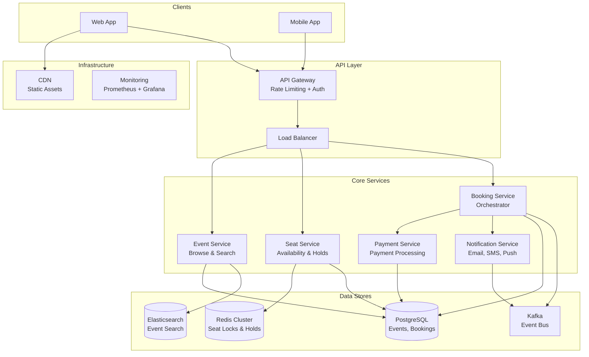
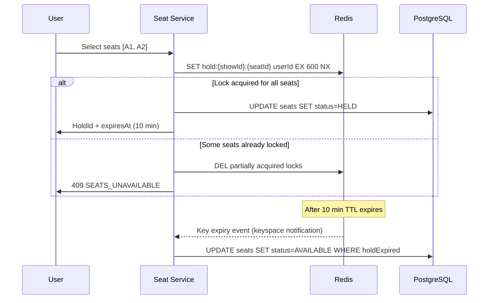
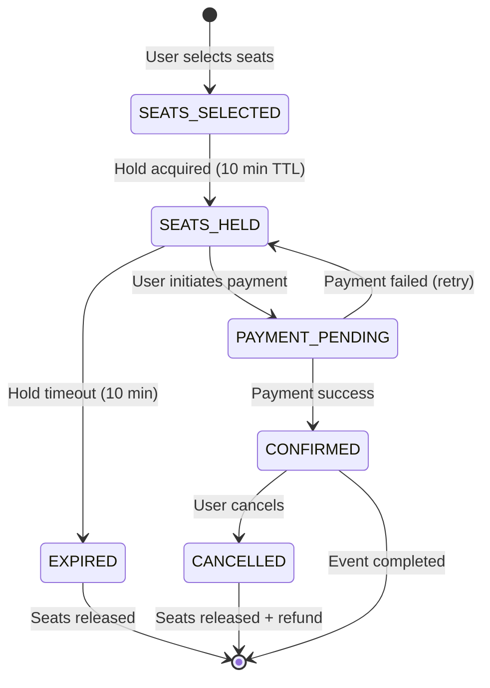
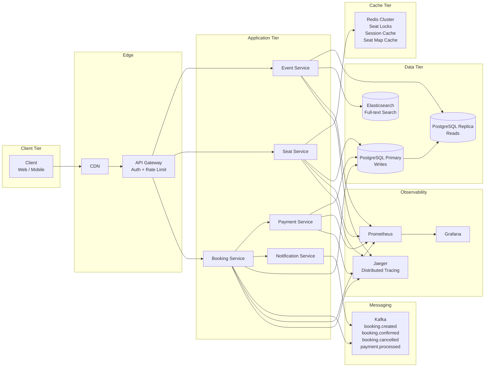

# Ticket Booking System (BookMyShow-like)

## 1. Problem Statement

Design a large-scale online ticket booking platform (similar to BookMyShow, Fandango, or TicketMaster) that allows users to browse events and movies, view real-time seat availability, select and temporarily hold seats, complete bookings with payment, and cancel bookings. The system must guarantee **no double-booking** of the same seat even under extreme concurrency (flash sales with thousands of simultaneous users targeting the same event).

---

## 2. Functional Requirements

| ID | Requirement | Description |
|----|-------------|-------------|
| FR-1 | Browse Events/Movies | Users can search and browse events by city, genre, date, and venue. |
| FR-2 | View Seat Map | Display real-time seat map showing available, held, and booked seats for a specific show. |
| FR-3 | Select Seats | Users select one or more available seats; the system validates availability atomically. |
| FR-4 | Hold Seats Temporarily | Selected seats are held for a configurable duration (default 10 minutes) while the user completes payment. |
| FR-5 | Book and Pay | Confirm booking by processing payment; transition seats from held to booked. |
| FR-6 | Cancel Booking | Users can cancel a confirmed booking; seats return to the available pool. |
| FR-7 | View Booking History | Users can view their past and upcoming bookings. |
| FR-8 | Notifications | Send booking confirmation, cancellation, and reminder notifications. |

---

## 3. Non-Functional Requirements

| ID | Requirement | Target |
|----|-------------|--------|
| NFR-1 | No Double Booking | A seat must never be sold to two different users for the same show. |
| NFR-2 | Seat Hold Timeout | Held seats auto-release after 10 minutes if payment is not completed. |
| NFR-3 | Flash Sale Concurrency | Handle 10,000+ concurrent seat selection attempts for the same event. |
| NFR-4 | Seat Selection Latency | Seat selection response time < 500ms at p99. |
| NFR-5 | Availability | 99.99% uptime for booking flow. |
| NFR-6 | Consistency | Strong consistency for seat state; eventual consistency acceptable for read views. |
| NFR-7 | Data Durability | Zero booking data loss. |

---

## 4. Capacity Estimation

### Assumptions

| Metric | Value |
|--------|-------|
| Total events per day | 5,000 |
| Average seats per event | 500 |
| Total seats across all events/day | 2,500,000 |
| Bookings per day | 500,000 |
| Average seats per booking | 3 |
| Peak concurrent seat selections (flash sale) | 10,000 for a single event |
| Seat map views per day | 5,000,000 |

### Storage Estimates

| Entity | Record Size | Daily Records | Daily Storage |
|--------|------------|---------------|---------------|
| Events | ~2 KB | 5,000 | ~10 MB |
| Shows | ~1 KB | 20,000 | ~20 MB |
| Seats (per show) | ~200 B | 10,000,000 | ~2 GB |
| Seat Holds (transient) | ~300 B | 1,000,000 | ~300 MB |
| Bookings | ~1 KB | 500,000 | ~500 MB |

### Throughput Estimates

| Operation | QPS (avg) | QPS (peak) |
|-----------|-----------|------------|
| Browse events | 500 | 5,000 |
| View seat map | 60 | 2,000 |
| Select seats | 20 | 10,000 |
| Confirm booking | 6 | 500 |

---

## 5. API Design

### Event Service

```
GET  /api/v1/events?city={city}&date={date}&genre={genre}
     -> 200: { events: [{ id, title, genre, city, venues, dates }] }

GET  /api/v1/events/{eventId}
     -> 200: { id, title, description, genre, cast, duration, rating }

GET  /api/v1/events/{eventId}/shows?date={date}&venueId={venueId}
     -> 200: { shows: [{ id, eventId, venueId, startTime, availableSeats }] }
```

### Seat Service

```
GET  /api/v1/shows/{showId}/seats
     -> 200: { seats: [{ id, row, number, category, price, status }] }

POST /api/v1/shows/{showId}/seats/hold
     Body: { userId, seatIds: ["A1", "A2"] }
     -> 200: { holdId, seatIds, expiresAt }
     -> 409: { error: "SEATS_UNAVAILABLE", unavailable: ["A2"] }

DELETE /api/v1/holds/{holdId}
     -> 200: { released: ["A1", "A2"] }
```

### Booking Service

```
POST /api/v1/bookings
     Body: { userId, holdId, paymentMethod }
     -> 201: { bookingId, status: "CONFIRMED", seats, totalAmount }
     -> 400: { error: "HOLD_EXPIRED" }
     -> 402: { error: "PAYMENT_FAILED" }

DELETE /api/v1/bookings/{bookingId}
     -> 200: { bookingId, status: "CANCELLED", refundAmount }

GET  /api/v1/users/{userId}/bookings
     -> 200: { bookings: [{ id, event, show, seats, status, amount }] }
```

### Payment Service

```
POST /api/v1/payments
     Body: { bookingId, amount, method, token }
     -> 200: { paymentId, status: "SUCCESS" }
     -> 402: { paymentId, status: "FAILED", reason }
```

---

## 6. Data Model

### Entity-Relationship Diagram

```
Event 1---* Show *---1 Venue
Show 1---* Seat
Seat 1---0..1 SeatHold
Seat *---0..1 Booking
Booking *---1 User
Booking 1---1 Payment
```

### Table Definitions

```sql
CREATE TABLE events (
    id              UUID PRIMARY KEY,
    title           VARCHAR(255) NOT NULL,
    description     TEXT,
    genre           VARCHAR(50),
    duration_min    INT,
    rating          DECIMAL(2,1),
    created_at      TIMESTAMP DEFAULT NOW()
);

CREATE TABLE venues (
    id              UUID PRIMARY KEY,
    name            VARCHAR(255) NOT NULL,
    city            VARCHAR(100),
    address         TEXT,
    total_seats     INT
);

CREATE TABLE shows (
    id              UUID PRIMARY KEY,
    event_id        UUID REFERENCES events(id),
    venue_id        UUID REFERENCES venues(id),
    start_time      TIMESTAMP NOT NULL,
    end_time        TIMESTAMP NOT NULL,
    status          VARCHAR(20) DEFAULT 'SCHEDULED',
    version         INT DEFAULT 0  -- optimistic locking
);

CREATE TABLE seats (
    id              UUID PRIMARY KEY,
    show_id         UUID REFERENCES shows(id),
    row_label       VARCHAR(5),
    seat_number     INT,
    category        VARCHAR(20),  -- PLATINUM, GOLD, SILVER
    price           DECIMAL(10,2),
    status          VARCHAR(20) DEFAULT 'AVAILABLE',
    version         INT DEFAULT 0,  -- optimistic locking
    UNIQUE(show_id, row_label, seat_number)
);

-- Index for fast seat lookups by show and status
CREATE INDEX idx_seats_show_status ON seats(show_id, status);

CREATE TABLE seat_holds (
    id              UUID PRIMARY KEY,
    user_id         UUID NOT NULL,
    show_id         UUID REFERENCES shows(id),
    created_at      TIMESTAMP DEFAULT NOW(),
    expires_at      TIMESTAMP NOT NULL,
    status          VARCHAR(20) DEFAULT 'ACTIVE'
);

CREATE TABLE seat_hold_items (
    hold_id         UUID REFERENCES seat_holds(id),
    seat_id         UUID REFERENCES seats(id),
    PRIMARY KEY(hold_id, seat_id)
);

-- TTL cleanup: expire holds automatically
CREATE INDEX idx_holds_expires ON seat_holds(expires_at) WHERE status = 'ACTIVE';

CREATE TABLE bookings (
    id              UUID PRIMARY KEY,
    user_id         UUID NOT NULL,
    show_id         UUID REFERENCES shows(id),
    hold_id         UUID REFERENCES seat_holds(id),
    status          VARCHAR(20) DEFAULT 'PENDING',
    total_amount    DECIMAL(10,2),
    created_at      TIMESTAMP DEFAULT NOW(),
    confirmed_at    TIMESTAMP,
    cancelled_at    TIMESTAMP
);

CREATE TABLE booking_seats (
    booking_id      UUID REFERENCES bookings(id),
    seat_id         UUID REFERENCES seats(id),
    PRIMARY KEY(booking_id, seat_id)
);

CREATE TABLE payments (
    id              UUID PRIMARY KEY,
    booking_id      UUID REFERENCES bookings(id),
    amount          DECIMAL(10,2),
    method          VARCHAR(30),
    status          VARCHAR(20) DEFAULT 'PENDING',
    transaction_ref VARCHAR(100),
    created_at      TIMESTAMP DEFAULT NOW()
);
```

---

## 7. High-Level Architecture



---

## 8. Detailed Design

### 8.1 Seat Selection with Optimistic Locking

When a user selects seats, the system uses **optimistic concurrency control** to prevent double-booking:

```
1. Read seat records with their current version numbers
2. Validate all seats are AVAILABLE
3. UPDATE seats SET status='HELD', version=version+1
   WHERE id IN (...) AND status='AVAILABLE' AND version=<read_version>
4. If affected_rows < requested_seats -> conflict detected -> retry or fail
```

This avoids long-lived database locks and allows high throughput under contention.

### 8.2 Temporary Seat Hold with TTL



**Key design decisions:**
- Redis `SET NX` (set-if-not-exists) provides atomic distributed locking
- TTL of 600 seconds (10 minutes) auto-releases abandoned holds
- Redis keyspace notifications trigger cleanup in PostgreSQL

### 8.3 Distributed Lock for Concurrent Booking

For flash sales with 10K concurrent requests for the same seat:

```
Lock Key Pattern: seat_lock:{showId}:{seatId}

Algorithm (Redlock-inspired):
1. For each seat in the selection:
   a. SETNX seat_lock:{showId}:{seatId} {userId} EX 30
   b. If fails -> another user holds the lock -> abort all
2. If all locks acquired:
   a. Write to PostgreSQL (seat status + hold record)
   b. Return success
3. On any failure:
   a. Release all acquired locks (cleanup)
   b. Return conflict error
```

### 8.4 Booking State Machine



**State transitions:**

| From | To | Trigger | Action |
|------|----|---------|--------|
| SEATS_SELECTED | SEATS_HELD | Lock acquired | Create hold record, set TTL |
| SEATS_HELD | PAYMENT_PENDING | Payment initiated | Create booking record |
| PAYMENT_PENDING | CONFIRMED | Payment success | Update booking, send confirmation |
| PAYMENT_PENDING | SEATS_HELD | Payment failed | Allow retry within hold window |
| SEATS_HELD | EXPIRED | TTL elapsed | Release seats, delete hold |
| CONFIRMED | CANCELLED | User request | Release seats, initiate refund |

---

## 9. Architecture Diagram



---

## 10. Architectural Patterns

### 10.1 Distributed Locking (Redis)

**Problem:** Multiple users selecting the same seat simultaneously.

**Solution:** Use Redis `SETNX` with TTL as a distributed lock. Each seat gets its own lock key (`seat_lock:{showId}:{seatId}`). The lock holder has exclusive right to book that seat.

**Why not DB locks?** Database row-level locks create contention bottlenecks under 10K concurrent requests. Redis handles 100K+ ops/sec on a single node with sub-millisecond latency.

### 10.2 Optimistic Concurrency Control

**Problem:** Concurrent updates to seat status in PostgreSQL.

**Solution:** Each seat row has a `version` column. Updates include `WHERE version = <expected>` in the predicate. If the version has changed since the read, the update affects zero rows and the operation retries or fails.

**Trade-off:** Higher throughput than pessimistic locking but requires retry logic on conflicts.

### 10.3 State Machine (Booking Lifecycle)

**Problem:** Bookings transition through multiple states; invalid transitions cause data corruption.

**Solution:** Model booking lifecycle as a finite state machine with explicit transitions and guard conditions. Each transition validates the current state before allowing the move.

**Benefit:** Makes the system predictable, auditable, and easier to debug.

### 10.4 Saga Pattern (Booking Flow)

**Problem:** Booking involves multiple services (seat, payment, notification) and any step can fail.

**Solution:** Orchestration-based saga where the Booking Service coordinates:

```
1. Hold seats         (Seat Service)      -- compensate: release seats
2. Process payment    (Payment Service)   -- compensate: refund payment
3. Confirm booking    (Booking Service)   -- compensate: cancel booking
4. Send notification  (Notification Svc)  -- no compensation needed
```

If step N fails, execute compensating transactions for steps 1..N-1 in reverse order.

### 10.5 CQRS for Seat Availability

**Problem:** Seat map reads vastly outnumber writes (100:1 ratio).

**Solution:**
- **Write path:** Seat Service updates PostgreSQL through Redis locks
- **Read path:** Seat map served from Redis cache (refreshed on every state change via Kafka events)

This separates read and write concerns, allowing independent scaling.

---

## 11. Technology Choices

| Component | Technology | Rationale |
|-----------|-----------|-----------|
| Seat Locks | **Redis Cluster** | Sub-ms latency, atomic SETNX, built-in TTL, 100K+ ops/sec |
| Primary DB | **PostgreSQL** | ACID transactions, optimistic locking support, mature ecosystem |
| Event Search | **Elasticsearch** | Full-text search, geo queries for nearby venues, fast aggregations |
| Message Bus | **Kafka** | Durable event streaming, replay capability, high throughput |
| API Gateway | **Kong / Envoy** | Rate limiting, auth, circuit breaking, observability |
| Cache | **Redis** | Seat map caching, session storage, rate limit counters |
| Notification | **SQS + Lambda / Kafka Consumers** | Async delivery, retry with backoff |
| Monitoring | **Prometheus + Grafana** | Metrics collection, dashboards, alerting |
| Tracing | **Jaeger / OpenTelemetry** | Distributed tracing across services |
| Container Orchestration | **Kubernetes** | Auto-scaling, self-healing, rolling deployments |

---

## 12. Scalability

### Horizontal Scaling

- **Seat Service:** Shard by `showId` across Redis cluster nodes. Each show's seats are managed by a single Redis shard, eliminating cross-node coordination.
- **Event Service:** Stateless; scale horizontally behind load balancer. Cache popular events in CDN.
- **Booking Service:** Stateless orchestrator; scale based on QPS. Use Kafka for async downstream processing.

### Hot Event Handling (Flash Sales)

```
1. Dedicated Redis shard for hot events
2. Request queuing: funnel 10K concurrent requests through a queue
   - Only N requests processed concurrently (where N = available seats)
   - Rest receive "sold out" quickly
3. Pre-computed seat maps: cache full seat map in Redis, update atomically
4. Virtual waiting room: throttle entry to booking flow
```

### Database Scaling

- **Read replicas:** Serve browse/search queries from replicas
- **Table partitioning:** Partition `seats` table by `show_id` for faster queries
- **Connection pooling:** PgBouncer to manage database connections
- **Archival:** Move completed bookings to cold storage after 90 days

---

## 13. Reliability

### Failure Modes and Mitigation

| Failure | Impact | Mitigation |
|---------|--------|------------|
| Redis node down | Seat locks unavailable | Redis Cluster with auto-failover; fallback to DB-level locks |
| PostgreSQL primary down | Writes fail | Synchronous replication + automatic failover (Patroni) |
| Payment service timeout | Booking stuck in PAYMENT_PENDING | Timeout after 30s; auto-retry; idempotency keys |
| Kafka broker down | Events not delivered | Multi-broker cluster; producer retries; consumer offset tracking |
| Seat hold TTL not enforced | Seats stuck in HELD state | Background cleanup job runs every minute; Redis keyspace notifications as primary |

### Idempotency

All booking operations use idempotency keys to handle retries safely:
- `holdId` for seat holds (same hold request returns same result)
- `bookingId` for payment (duplicate payment requests are deduplicated)

### Circuit Breaker

Payment service calls use circuit breaker pattern:
- **Closed:** Normal operation
- **Open:** After 5 consecutive failures, fail fast for 30 seconds
- **Half-open:** Allow one request through to test recovery

---

## 14. Security

| Layer | Measure |
|-------|---------|
| Authentication | JWT tokens with short expiry (15 min access + refresh token) |
| Authorization | RBAC: users can only access their own bookings; admins manage events |
| Rate Limiting | Per-user: 10 seat-hold requests/min; Per-IP: 100 requests/min |
| Input Validation | Validate all seat IDs, show IDs against database; prevent injection |
| Payment Security | PCI-DSS compliance; tokenized card data; never store raw card numbers |
| Data Encryption | TLS 1.3 in transit; AES-256 at rest for PII |
| Anti-Bot | CAPTCHA on seat selection during flash sales; device fingerprinting |
| Audit Trail | Log all state transitions with timestamps, user IDs, and IP addresses |

---

## 15. Monitoring

### Key Metrics

| Metric | Alert Threshold |
|--------|----------------|
| Seat selection p99 latency | > 500ms |
| Booking success rate | < 95% |
| Seat hold expiry rate | > 30% (indicates UX/timeout issues) |
| Payment failure rate | > 5% |
| Redis lock contention rate | > 50% (indicates hot event) |
| Double-booking incidents | > 0 (critical alert) |

### Dashboards

1. **Real-time booking flow:** Funnel visualization (view -> select -> hold -> pay -> confirm)
2. **Seat availability heatmap:** Per-show seat status in real-time
3. **Service health:** Request rates, error rates, latency percentiles per service
4. **Flash sale dashboard:** Concurrent users, queue depth, seat depletion rate

### Alerting

```yaml
alerts:
  - name: DoubleBookingDetected
    condition: count(booking where seat already booked) > 0
    severity: CRITICAL
    action: Page on-call, halt bookings for affected show

  - name: HighSeatSelectionLatency
    condition: p99(seat_selection_latency) > 500ms
    severity: WARNING
    action: Scale Seat Service, check Redis health

  - name: PaymentServiceDegraded
    condition: error_rate(payment_service) > 5% for 5min
    severity: HIGH
    action: Enable circuit breaker, notify payment team
```
