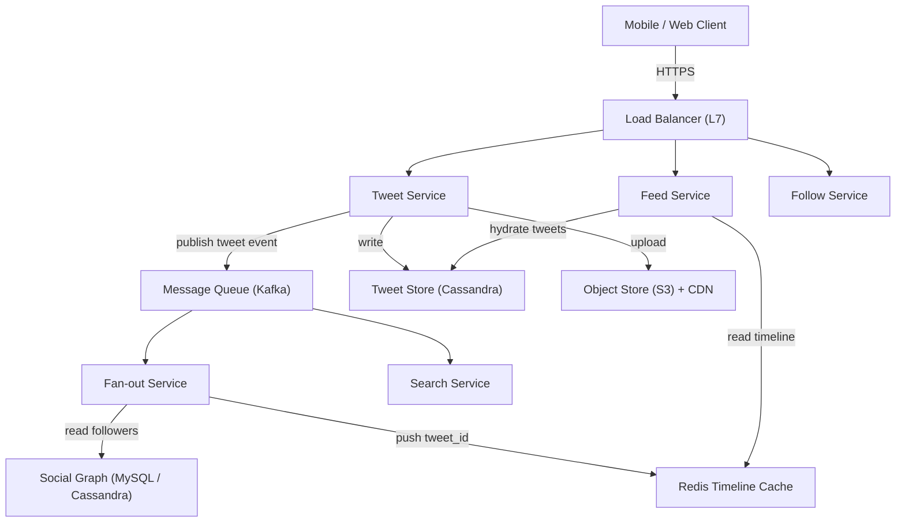
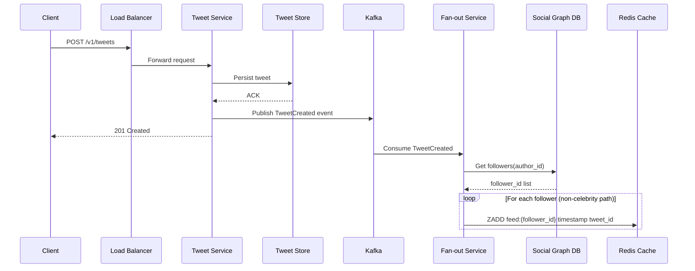
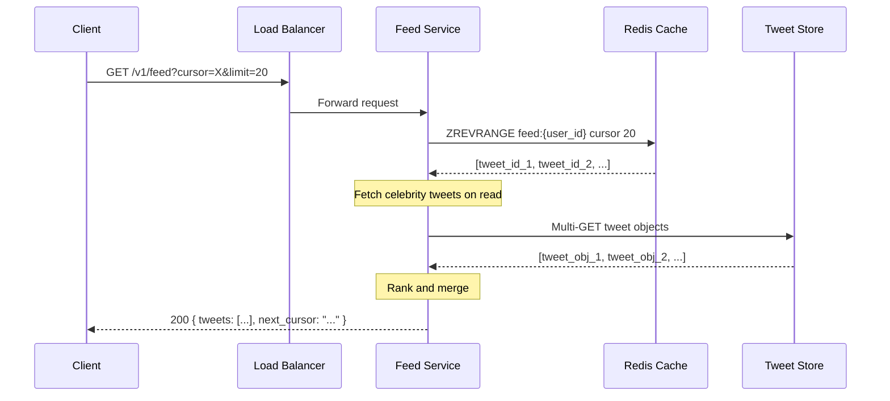

# Twitter / News Feed System Design

## 1. Problem Statement

Design a social media feed system similar to Twitter where users can post short
messages (tweets), follow other users, and view a personalized news feed
aggregated from the accounts they follow. The system must handle hundreds of
millions of users, generate feeds with sub-second latency, and remain available
even during partial failures.

---

## 2. Functional Requirements

| ID | Requirement |
|----|-------------|
| FR-1 | **Post Tweet** -- A user can publish a text tweet (up to 280 characters), optionally with media attachments. |
| FR-2 | **Follow / Unfollow** -- A user can follow or unfollow another user. |
| FR-3 | **News Feed** -- A user can request their home timeline: a reverse-chronological (or ranked) list of tweets from accounts they follow. |
| FR-4 | **Like / Retweet** -- A user can like or retweet any tweet, and these interactions are reflected in feed ranking signals. |
| FR-5 | **User Timeline** -- View all tweets posted by a specific user. |
| FR-6 | **Search** -- Full-text search across tweets (secondary scope). |

---

## 3. Non-Functional Requirements

| Attribute | Target |
|-----------|--------|
| **Latency** | Feed generation < 200 ms (p99) |
| **Scale** | 500 M registered users, 200 M DAU |
| **Throughput** | ~600 K tweets/min at peak |
| **Availability** | 99.99 % uptime |
| **Consistency** | Eventual consistency is acceptable for feed; strong consistency for follow/unfollow state |
| **Durability** | Zero tweet loss once acknowledged |

---

## 4. Capacity Estimation

### Traffic

| Metric | Value |
|--------|-------|
| DAU | 200 M |
| Tweets per day | ~500 M |
| Avg tweet reads per user/day | 100 |
| Read QPS (avg) | ~230 K |
| Read QPS (peak, 3x) | ~700 K |
| Write QPS (avg) | ~6 K |
| Write QPS (peak, 3x) | ~18 K |

### Storage (5-year horizon)

| Item | Calculation | Total |
|------|-------------|-------|
| Tweet text | 500 M/day x 280 B avg x 365 x 5 | ~256 TB |
| Tweet metadata | 500 M/day x 200 B x 365 x 5 | ~183 TB |
| Media (images) | 50 M images/day x 200 KB avg x 365 x 5 | ~18.25 PB |
| User data | 500 M users x 1 KB | ~500 GB |
| Follow graph | 500 M users x 200 avg follows x 16 B | ~1.6 TB |

### Bandwidth

| Direction | Calculation | Rate |
|-----------|-------------|------|
| Ingress (tweets) | 6 K/s x 300 B | ~1.8 MB/s |
| Egress (feeds) | 230 K/s x 20 tweets x 300 B | ~1.38 GB/s |
| Media egress | dominant; served via CDN | ~10+ GB/s |

---

## 5. API Design

### Tweet Service

```
POST   /v1/tweets
  Body: { "text": "...", "media_ids": [...] }
  Response: 201 { "tweet_id": "...", "created_at": "..." }

DELETE /v1/tweets/{tweet_id}
  Response: 204

GET    /v1/users/{user_id}/tweets?cursor=&limit=20
  Response: 200 { "tweets": [...], "next_cursor": "..." }
```

### Follow Service

```
POST   /v1/users/{user_id}/follow
  Body: { "target_user_id": "..." }
  Response: 200

POST   /v1/users/{user_id}/unfollow
  Body: { "target_user_id": "..." }
  Response: 200
```

### Feed Service

```
GET    /v1/feed?cursor=&limit=20
  Response: 200 { "tweets": [...], "next_cursor": "..." }
```

### Engagement Service

```
POST   /v1/tweets/{tweet_id}/like
POST   /v1/tweets/{tweet_id}/retweet
DELETE /v1/tweets/{tweet_id}/like
```

All endpoints require `Authorization: Bearer <token>` header and are rate-limited.

---

## 6. Data Model

### Users Table

| Column | Type | Notes |
|--------|------|-------|
| user_id | UUID (PK) | Snowflake / ULID |
| username | VARCHAR(30) | Unique |
| display_name | VARCHAR(50) | |
| bio | TEXT | |
| follower_count | INT | Denormalized counter |
| following_count | INT | Denormalized counter |
| created_at | TIMESTAMP | |

### Tweets Table

| Column | Type | Notes |
|--------|------|-------|
| tweet_id | BIGINT (PK) | Snowflake ID embeds timestamp |
| user_id | UUID (FK) | Author |
| text | VARCHAR(280) | |
| media_urls | JSON | |
| like_count | INT | Denormalized |
| retweet_count | INT | Denormalized |
| created_at | TIMESTAMP | Extracted from tweet_id |

### Follows Table

| Column | Type | Notes |
|--------|------|-------|
| follower_id | UUID | Composite PK |
| followee_id | UUID | Composite PK |
| created_at | TIMESTAMP | |

Partition key: `follower_id` (efficient "who do I follow?" query).
Secondary index on `followee_id` (efficient "who follows me?" for fan-out).

### Feed Cache (Redis Sorted Set per user)

```
Key:   feed:{user_id}
Score: tweet timestamp (epoch ms)
Value: tweet_id
```

Each user's feed cache holds the latest ~800 tweet IDs.

---

## 7. High-Level Architecture



### Component Responsibilities

| Component | Role |
|-----------|------|
| **Tweet Service** | CRUD for tweets; publishes events to Kafka |
| **Fan-out Service** | Consumes tweet events; pushes tweet IDs into followers' feed caches |
| **Feed Service** | Reads pre-built feed from cache, hydrates tweet objects, applies ranking |
| **Follow Service** | Manages social graph; emits follow/unfollow events |
| **Redis Cache** | Stores per-user sorted sets of tweet IDs (latest ~800) |
| **Kafka** | Decouples write path from fan-out; guarantees at-least-once delivery |
| **Cassandra** | Stores tweets (wide-column, partition by tweet_id or user_id) |

---

## 8. Detailed Design

### 8.1 Fan-Out Strategies

#### Fan-Out on Write (Push Model)

When a user tweets, the fan-out service immediately writes the tweet ID into
every follower's feed cache.

**Pros:** Feed reads are O(1) -- just read from cache.
**Cons:** High write amplification for users with millions of followers
(celebrities). A user with 10 M followers triggers 10 M cache writes per tweet.

#### Fan-Out on Read (Pull Model)

When a user requests their feed, the system fetches recent tweets from each
followed account and merges them on the fly.

**Pros:** No write amplification.
**Cons:** Slow reads -- must query N followees and merge-sort. Unacceptable at
scale for users following hundreds of accounts.

#### Hybrid Approach (Production Choice)

```
IF author.follower_count < CELEBRITY_THRESHOLD (e.g., 10,000):
    fan-out on write  (push tweet_id to all followers' caches)
ELSE:
    fan-out on read   (celebrity tweets fetched at read time and merged)
```

At feed-read time, the Feed Service:

1. Reads the user's pre-built cache (non-celebrity tweets).
2. Fetches latest tweets from followed celebrities.
3. Merge-sorts both lists by timestamp.
4. Applies ranking model (engagement signals, recency, diversity).
5. Returns top N tweets.

### 8.2 Feed Ranking

A lightweight ranking layer re-orders the merged feed using:

- **Recency** -- exponential decay weight
- **Engagement score** -- likes + retweets + replies (normalized)
- **User affinity** -- how often the viewer interacts with the author
- **Content type boost** -- media tweets may get higher weight
- **Diversity penalty** -- avoid consecutive tweets from the same author

The ranker runs in < 50 ms on a pre-fetched candidate set of ~200 tweets.

---

## 9. Architecture Diagrams

### 9.1 Posting a Tweet (Sequence)



### 9.2 Reading the Feed (Sequence)



---

## 10. Architectural Patterns

### Fan-Out Pattern
The core of feed generation. Write-time fan-out trades storage and write
amplification for ultra-fast reads. The hybrid model limits write amplification
to non-celebrity accounts only.

### CQRS (Command Query Responsibility Segregation)
- **Command side:** Tweet Service writes to the Tweet Store and emits events.
- **Query side:** Feed Service reads from pre-materialized Redis caches.
- The two sides are connected asynchronously via Kafka.

### Event Sourcing
Every tweet creation, like, retweet, and follow is an immutable event stored in
Kafka. These events drive downstream materialized views (feed caches, counters,
search indices). Replaying events can rebuild any view.

### Pub/Sub
Kafka topics act as pub/sub channels:
- `tweet.created` -- consumed by fan-out service, search indexer, analytics
- `user.followed` -- consumed by fan-out service (add backfill), notification service
- `tweet.liked` -- consumed by counter service, ranking signal updater

---

## 11. Technology Choices and Tradeoffs

### Redis Timeline Cache vs. Database Reads

| Aspect | Redis Cache | Database |
|--------|-------------|----------|
| Read latency | < 5 ms | 20-100 ms |
| Cost | High (RAM) | Lower (disk) |
| Durability | Volatile (rebuildable) | Durable |
| Best for | Hot feeds (active users) | Cold feeds, archival |

**Decision:** Use Redis for active users' feeds; evict inactive users' caches
after 7 days of inactivity and rebuild on demand.

### Cassandra vs. MySQL for Tweet Storage

| Aspect | Cassandra | MySQL |
|--------|-----------|-------|
| Write throughput | Excellent (LSM) | Moderate |
| Read pattern | Partition-key lookups | Flexible queries |
| Scalability | Linear horizontal | Sharding complex |
| Consistency | Tunable | Strong |

**Decision:** Cassandra for tweet storage (write-heavy, partition by user_id).
MySQL for social graph (strong consistency for follow state, sharded by user_id).

### Push vs. Pull vs. Hybrid

| Strategy | Write Cost | Read Cost | Latency |
|----------|-----------|-----------|---------|
| Pure Push | O(followers) | O(1) | < 50 ms |
| Pure Pull | O(1) | O(followees) | 200-500 ms |
| Hybrid | O(non-celeb followers) | O(celeb followees) | < 100 ms |

**Decision:** Hybrid. Celebrity threshold at ~10,000 followers.

---

## 12. Scalability

### Sharding Strategy

- **Tweets:** Partition by `user_id` in Cassandra. All tweets from one user
  reside on the same partition for efficient user-timeline reads.
- **Social Graph:** Shard MySQL by `follower_id` so "who do I follow?" is a
  single-shard query.
- **Feed Cache:** Redis Cluster with consistent hashing on `user_id`.

### Fan-Out Optimization

1. **Batch writes:** Fan-out service batches Redis ZADD commands (pipeline
   mode) to reduce round trips.
2. **Prioritized fan-out:** Push to online users first (check presence service),
   defer offline users.
3. **Worker pool scaling:** Auto-scale fan-out workers based on Kafka consumer
   lag metric.
4. **Feed trimming:** Keep only the latest 800 tweet IDs per user cache;
   ZREMRANGEBYRANK trims older entries.

### Handling Hot Partitions

- Celebrity tweets skip write-time fan-out entirely.
- Dedicated "celebrity tweet cache" stores recent tweets from high-follower
  accounts, read at query time.
- CDN caching for public profiles / trending content.

---

## 13. Reliability

### Replication

- **Cassandra:** Replication factor 3 across availability zones.
- **Redis:** Redis Cluster with 1 replica per primary; automatic failover.
- **Kafka:** Replication factor 3, `min.insync.replicas=2`.
- **MySQL:** Primary-replica setup with semi-synchronous replication.

### Async Processing and Backpressure

- Fan-out is fully asynchronous (Kafka-driven). If the fan-out service is slow,
  events queue in Kafka without blocking the Tweet Service.
- Consumer groups allow horizontal scaling of fan-out workers.
- Dead-letter queues capture permanently failed events for manual inspection.

### Idempotency

- Tweet IDs are globally unique (Snowflake); duplicate fan-out writes to Redis
  sorted sets are naturally idempotent (same score + member = no-op).
- API endpoints accept client-generated idempotency keys to prevent duplicate
  tweet creation on retries.
- Kafka consumers track offsets; reprocessing the same offset is safe due to
  idempotent cache writes.

### Failure Scenarios

| Failure | Mitigation |
|---------|-----------|
| Redis node down | Replica promotion; rebuild cache from DB |
| Kafka broker down | ISR takeover; producers retry |
| Fan-out lag spike | Auto-scale workers; degrade to pull for lagging users |
| Tweet DB partition | Cassandra quorum reads from replicas |

---

## 14. Security

### Authentication and Authorization

- OAuth 2.0 / JWT-based authentication.
- Scoped access tokens (read, write, admin).
- API gateway validates tokens before routing to services.

### Rate Limiting

- Per-user rate limits: 300 tweets/day, 1000 follows/day, 100 feed
  requests/minute.
- Token bucket algorithm at the API gateway layer.
- Separate limits for authenticated vs. unauthenticated requests.

### Content Moderation

- Asynchronous content scanning pipeline (NLP-based toxicity detection).
- NSFW image classification before media is served.
- User reporting mechanism with human review escalation.
- Spam detection: velocity checks, duplicate content hashing, new-account
  throttling.

### Data Protection

- Encryption at rest (AES-256) and in transit (TLS 1.3).
- PII stored in a separate encrypted data store with access audit logging.
- GDPR-compliant data deletion pipeline (cascading delete across all stores).

---

## 15. Monitoring

### Key Metrics

| Metric | Target | Alert Threshold |
|--------|--------|-----------------|
| Feed generation latency (p99) | < 200 ms | > 300 ms |
| Fan-out lag (Kafka consumer lag) | < 30 s | > 60 s |
| Redis cache hit ratio | > 95 % | < 90 % |
| Tweet write latency (p99) | < 100 ms | > 200 ms |
| Error rate (5xx) | < 0.01 % | > 0.1 % |
| Fan-out throughput | > 500 K writes/s | < 300 K writes/s |

### Dashboards

- **Feed Health:** latency percentiles, cache hit/miss ratio, feed empty rate.
- **Fan-out Pipeline:** Kafka consumer lag per partition, worker CPU/memory,
  batch size distribution.
- **Tweet Ingestion:** write QPS, error rate, media upload success rate.
- **Social Graph:** follow/unfollow rate, graph query latency.

### Alerting

- PagerDuty integration for critical alerts (feed latency, fan-out lag).
- Slack notifications for warnings (cache hit ratio drift).
- Automated runbooks for common failure scenarios (cache rebuild, worker restart).

### Observability Stack

- **Metrics:** Prometheus + Grafana
- **Logging:** ELK stack (Elasticsearch, Logstash, Kibana)
- **Tracing:** Jaeger / OpenTelemetry for distributed request tracing
- **Profiling:** Continuous profiling with Pyroscope for hot-path optimization

---

## Summary

The Twitter/News Feed system uses a **hybrid fan-out** approach to balance write
amplification against read latency. Non-celebrity tweets are pushed to follower
caches at write time (fan-out on write), while celebrity tweets are fetched at
read time (fan-out on read). A Kafka-driven event pipeline decouples the write
path from feed materialization, enabling independent scaling of ingestion and
fan-out. Redis sorted sets provide sub-200 ms feed reads, while Cassandra
ensures durable, horizontally scalable tweet storage.
