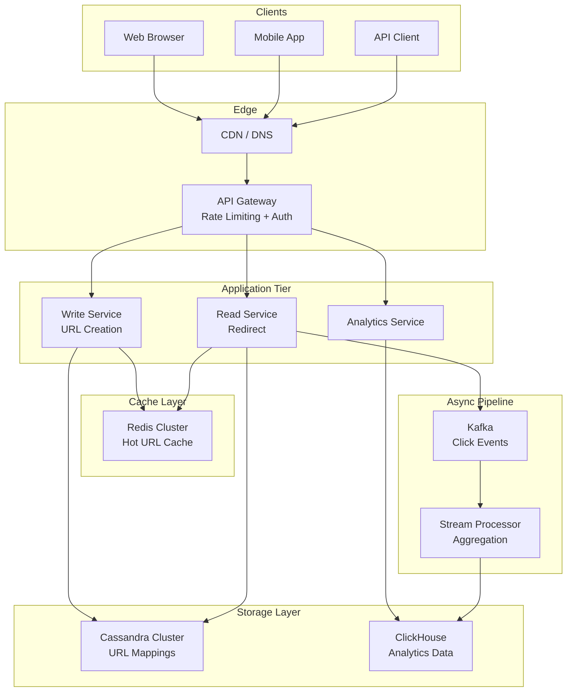
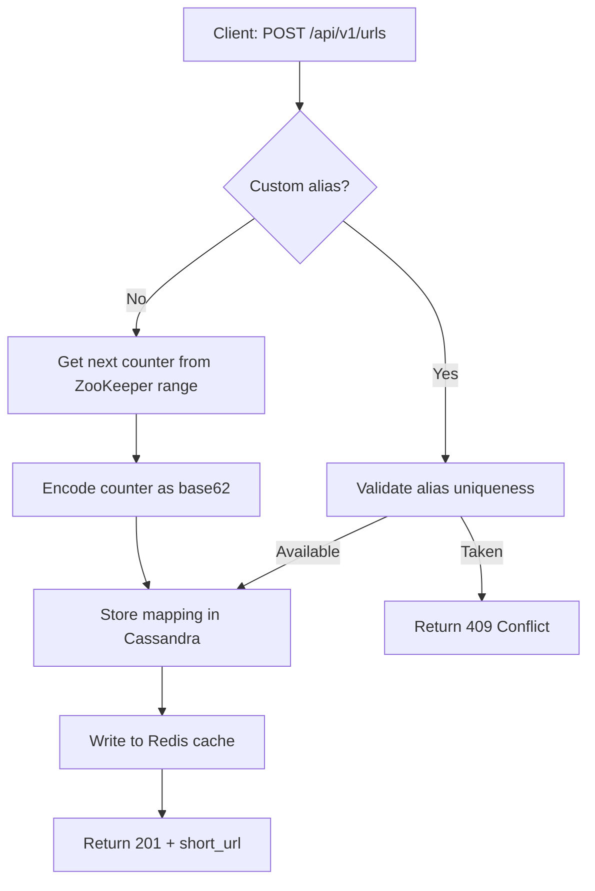
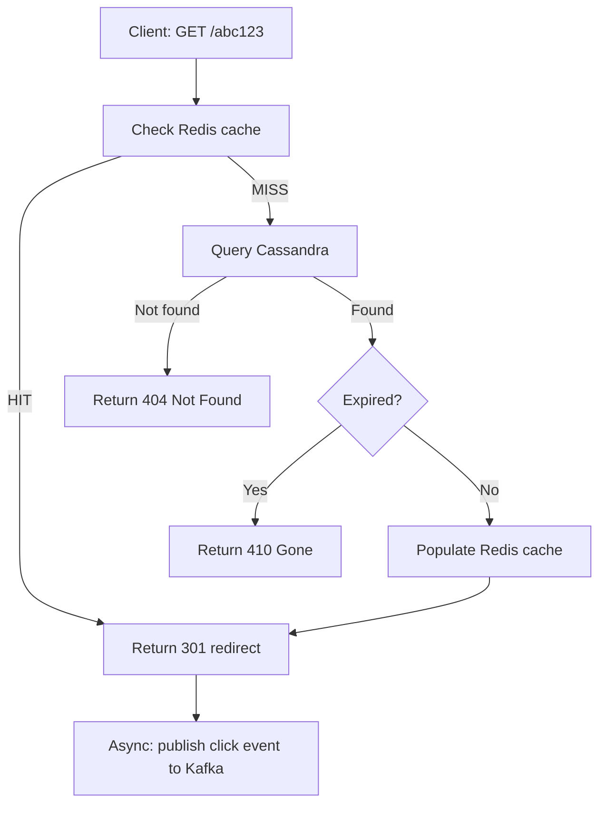

# URL Shortener (TinyURL) -- System Design

## 1. Problem Statement

A URL shortener converts long, unwieldy URLs into compact, shareable links
(e.g. `https://tinyurl.com/abc123`). When a user visits the short URL the
service redirects them to the original destination.

**Why build one?**

- Long URLs break in emails, SMS, and social media posts.
- Short links enable click analytics (who, when, where).
- Custom branded short links improve marketing engagement.
- Link expiration provides temporal access control.

The core challenge is generating globally unique, short identifiers at massive
scale while keeping redirect latency under 100 ms.

---

## 2. Functional Requirements

| # | Requirement | Details |
|---|-------------|---------|
| FR-1 | **Create short URL** | Given a long URL, return a unique 7-character short code. |
| FR-2 | **Redirect** | Given a short URL, HTTP 301/302 redirect to the original URL. |
| FR-3 | **Custom aliases** | Users may supply their own alias (e.g. `my-brand`). |
| FR-4 | **Expiration (TTL)** | URLs can have an optional time-to-live after which they expire. |
| FR-5 | **Analytics** | Track total clicks, click timestamps, referrer, and geo data. |
| FR-6 | **Deletion** | Owners can delete their short URLs. |

---

## 3. Non-Functional Requirements

| Attribute | Target |
|-----------|--------|
| **Redirect latency** | < 100 ms (p99) |
| **Availability** | 99.99 % uptime (< 53 min downtime / year) |
| **Write throughput** | 100 M new URLs / day (~1 160 writes/s) |
| **Read throughput** | 10 B redirects / day (~115 000 reads/s) -- 100:1 read/write |
| **Durability** | Zero data loss -- every shortened URL must be retrievable |
| **Consistency** | Eventual consistency acceptable for analytics; strong for redirects |
| **Security** | Rate limiting, abuse detection, input validation |

---

## 4. Capacity Estimation

### 4.1 Traffic

```
Writes : 100 M / day  = ~1 160 / s
Reads  : 100 * 1 160  = ~116 000 / s   (100:1 read-heavy)
```

### 4.2 Storage (5-year horizon)

```
URLs created       : 100 M/day * 365 * 5 = 182.5 B records
Avg record size    : short_code (7 B) + long_url (256 B) + metadata (100 B)
                   ~ 363 B per record
Total storage      : 182.5 B * 363 B ~ 66 TB
```

### 4.3 Bandwidth

```
Incoming (writes)  : 1 160 req/s * 500 B avg = 580 KB/s
Outgoing (reads)   : 116 000 req/s * 500 B avg = 58 MB/s
```

### 4.4 Cache

Using the 80-20 rule (20 % of URLs generate 80 % of traffic):

```
Daily read requests : 10 B
Cache 20 % of daily : 10 B * 0.20 * 500 B ~ 1 TB in-memory cache
```

---

## 5. API Design

### 5.1 Create Short URL

```
POST /api/v1/urls
```

**Request:**
```json
{
  "long_url": "https://example.com/very/long/path?q=123",
  "custom_alias": "my-link",
  "ttl_seconds": 86400
}
```

**Response (201 Created):**
```json
{
  "short_url": "https://tiny.url/my-link",
  "short_code": "my-link",
  "long_url": "https://example.com/very/long/path?q=123",
  "created_at": "2024-01-15T10:30:00Z",
  "expires_at": "2024-01-16T10:30:00Z"
}
```

### 5.2 Redirect

```
GET /{short_code}
```

**Response:** `301 Moved Permanently` with `Location: <long_url>` header.

### 5.3 Get Analytics

```
GET /api/v1/urls/{short_code}/analytics
```

**Response (200 OK):**
```json
{
  "short_code": "my-link",
  "total_clicks": 4523,
  "clicks_today": 120,
  "recent_clicks": [
    {"timestamp": "2024-01-15T10:35:00Z", "referrer": "twitter.com", "country": "US"}
  ]
}
```

### 5.4 Delete URL

```
DELETE /api/v1/urls/{short_code}
```

**Response:** `204 No Content`

---

## 6. Data Model

### 6.1 Primary Table -- `urls`

| Column | Type | Notes |
|--------|------|-------|
| `short_code` | VARCHAR(16) PK | Base62-encoded or custom alias |
| `long_url` | TEXT NOT NULL | Original destination |
| `user_id` | UUID | Owner (nullable for anonymous) |
| `created_at` | TIMESTAMP | Creation time |
| `expires_at` | TIMESTAMP | NULL means never expires |
| `click_count` | BIGINT DEFAULT 0 | Denormalized counter |

### 6.2 Analytics Table -- `clicks`

| Column | Type | Notes |
|--------|------|-------|
| `click_id` | UUID PK | Unique click event |
| `short_code` | VARCHAR(16) FK | Foreign key to `urls` |
| `clicked_at` | TIMESTAMP | Event time |
| `referrer` | TEXT | HTTP Referer header |
| `user_agent` | TEXT | Browser/device info |
| `ip_address` | INET | Client IP |
| `country` | VARCHAR(2) | GeoIP-derived |

### 6.3 Indexing Strategy

- **Primary index** on `short_code` (partition key in Cassandra).
- **Secondary index** on `long_url` hash for deduplication lookups.
- **TTL index** on `expires_at` for automatic cleanup.
- **Time-series index** on `clicks(short_code, clicked_at)` for analytics range queries.

---

## 7. High-Level Architecture



---

## 8. Detailed Component Design

### 8.1 URL Encoding -- Base62

We use **base62** encoding (`[0-9a-zA-Z]`) to convert an integer counter
into a compact string.

```
62^7 = 3.5 trillion unique codes
```

A 7-character base62 code supports 3.5 T unique URLs -- enough for decades.

**Algorithm:**

1. Atomically increment a distributed counter (or use a pre-allocated range).
2. Encode the counter value in base62.
3. Store the mapping `short_code -> long_url`.

### 8.2 Hash Collision Handling

When using a hash-based approach (e.g. MD5/SHA-256 of the long URL truncated
to 7 chars):

1. Compute `hash = base62(MD5(long_url)[:7])`.
2. Check the DB for an existing entry with that code.
3. **If collision:** append an incrementing suffix and retry.
4. **If duplicate URL:** return the existing short code (deduplication).

We prefer **counter-based** encoding because it guarantees zero collisions
without DB lookups, but hash-based works for deduplication.

### 8.3 Cache Strategy -- Cache-Aside

```
REDIRECT(short_code):
  1. Check Redis cache
  2. If HIT  -> return long_url (< 1 ms)
  3. If MISS -> query Cassandra, populate Redis, return long_url
  4. Set TTL on cache entry (e.g. 24 hours)
```

Hot URLs (top 20 %) stay cached; cold URLs evict via LRU.

---

## 9. Architecture Diagram -- Request Flows

### 9.1 Create Short URL



### 9.2 Redirect



---

## 10. Architectural Patterns

### 10.1 CQRS (Command Query Responsibility Segregation)

- **Write path (Command):** Create/delete URLs go through the Write Service
  which owns the counter and writes to Cassandra.
- **Read path (Query):** Redirects go through the Read Service which reads
  from Redis first, then Cassandra. Read replicas can be scaled independently.

This separation lets us scale reads (100x more traffic) without impacting
write performance.

### 10.2 Cache-Aside Pattern

The application (not the cache) is responsible for populating the cache:

1. On read: check cache first, fall back to DB, populate cache on miss.
2. On write: write to DB first, then invalidate/update cache.
3. On delete: remove from both DB and cache.

This avoids stale data from write-through issues and keeps cache lean.

### 10.3 Consistent Hashing for DB Sharding

URLs are distributed across Cassandra nodes using consistent hashing on the
`short_code` partition key:

- Adding/removing nodes only redistributes `K/N` keys (K = total keys,
  N = number of nodes) instead of all keys.
- Virtual nodes ensure even distribution.
- The short_code itself serves as a natural partition key since redirects
  look up by short_code.

---

## 11. Technology Choices and Tradeoffs

### 11.1 Database: Cassandra vs MySQL

| Factor | Cassandra | MySQL |
|--------|-----------|-------|
| Write throughput | High (append-only LSM) | Moderate (B-tree) |
| Read by PK | Fast (partition key) | Fast (indexed) |
| Horizontal scaling | Native (add nodes) | Complex (sharding) |
| Schema flexibility | Wide columns | Rigid schema |
| Consistency | Tunable (ONE/QUORUM) | Strong (ACID) |
| **Verdict** | **Chosen** -- key-value access pattern, massive scale | Good for < 10 M URLs |

### 11.2 Cache: Redis vs Memcached

| Factor | Redis | Memcached |
|--------|-------|-----------|
| Data structures | Rich (strings, hashes, sorted sets) | Strings only |
| Persistence | Optional RDB/AOF | None |
| Cluster mode | Native | Client-side |
| Analytics support | Sorted sets for top-K | Not built-in |
| **Verdict** | **Chosen** -- analytics + persistence + cluster support | Simpler but limited |

### 11.3 Encoding: Base62 vs MD5

| Factor | Base62 (counter) | MD5 (hash) |
|--------|-------------------|------------|
| Collision | Zero (monotonic counter) | Possible (birthday problem) |
| Predictability | Sequential (guessable) | Random-looking |
| Deduplication | Needs separate check | Natural (same URL = same hash) |
| Performance | No DB lookup needed | Requires collision check |
| **Verdict** | **Chosen** -- zero collisions, simpler | Use MD5 only for dedup check |

---

## 12. Scalability and Performance

### 12.1 Sharding Strategy

- **Shard key:** `short_code` (hash-based partitioning).
- **Range allocation:** Each app server gets a counter range (e.g. 1M IDs)
  from ZooKeeper. When exhausted, it fetches the next range.
- **No cross-shard queries** for redirect (single partition lookup).

### 12.2 Caching Layers

```
Layer 1: Browser cache     (301 Moved Permanently, Cache-Control)
Layer 2: CDN edge cache    (cache popular short URLs at edge PoPs)
Layer 3: Redis cluster     (in-memory, < 1 ms, top 20% of URLs)
Layer 4: Cassandra row cache (on-node memory for hot partitions)
```

### 12.3 Read Replicas

- Cassandra supports tunable consistency: use `ONE` for reads (fast) and
  `QUORUM` for writes (durable).
- Deploy read-heavy nodes in regions closest to users.

---

## 13. Reliability and Fault Tolerance

### 13.1 Replication

- Cassandra: replication factor = 3 across availability zones.
- Redis: Redis Sentinel for automatic failover, or Redis Cluster with
  replicas.

### 13.2 Failover

- **App server failure:** Load balancer health checks remove unhealthy nodes.
- **Cache failure:** Fall back to Cassandra (higher latency but functional).
- **DB node failure:** Cassandra self-heals via hinted handoff and read repair.

### 13.3 Circuit Breaker

- Wrap DB and cache calls with circuit breakers (e.g. Hystrix pattern).
- If Cassandra latency spikes, the breaker trips and returns cached results
  or a degraded response (e.g. "try again later").
- Auto-recovery with half-open state after cooldown.

### 13.4 Disaster Recovery

- Cross-region Cassandra replication for geo-redundancy.
- Redis AOF backups to object storage (S3) every hour.
- Counter state backed by ZooKeeper ensemble (3-5 nodes).

---

## 14. Security Considerations

### 14.1 Rate Limiting

- Token bucket per API key: 100 creates/min, 1000 redirects/min.
- Global rate limit at the API gateway level.
- Sliding window counter in Redis.

### 14.2 Abuse Prevention

- Block known malicious URLs using a blocklist (Google Safe Browsing API).
- CAPTCHA for anonymous bulk creation.
- Flag URLs that receive suspicious redirect spikes.

### 14.3 Input Validation

- Validate URL format (scheme, host, path).
- Reject URLs longer than 2048 characters.
- Sanitize custom aliases: only `[a-zA-Z0-9_-]` allowed, 3-30 chars.
- Prevent open redirect attacks by validating the scheme is `http` or `https`.

### 14.4 Authentication and Authorization

- API keys for programmatic access.
- OAuth 2.0 for user-facing dashboard.
- URL owners authenticated before delete/analytics operations.

---

## 15. Monitoring and Alerting

### 15.1 Key Metrics

| Metric | Target | Alert Threshold |
|--------|--------|-----------------|
| Redirect p99 latency | < 100 ms | > 200 ms |
| Create p99 latency | < 500 ms | > 1 s |
| Cache hit ratio | > 90 % | < 80 % |
| Error rate (5xx) | < 0.01 % | > 0.1 % |
| DB replication lag | < 100 ms | > 1 s |
| Counter range exhaustion | -- | < 10 % remaining |

### 15.2 SLAs

- **Availability SLA:** 99.99 % monthly uptime.
- **Latency SLA:** p99 redirect < 100 ms.
- **Durability SLA:** Zero URL data loss.

### 15.3 Observability Stack

- **Metrics:** Prometheus + Grafana dashboards.
- **Logging:** Structured JSON logs -> ELK stack.
- **Tracing:** Distributed tracing with Jaeger (create and redirect flows).
- **Alerting:** PagerDuty integration for SLA breaches.

---

## Summary

The URL shortener is a **read-heavy, key-value workload** that benefits from:

- **Base62 counter encoding** for zero-collision short codes
- **Cassandra** for horizontally scalable, partition-key-based storage
- **Redis** for sub-millisecond cache hits on hot URLs
- **CQRS** to independently scale reads (100x) and writes
- **Kafka** for async analytics without impacting redirect latency
- **Consistent hashing** for even data distribution across shards
