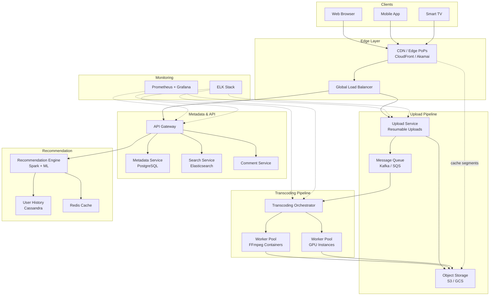
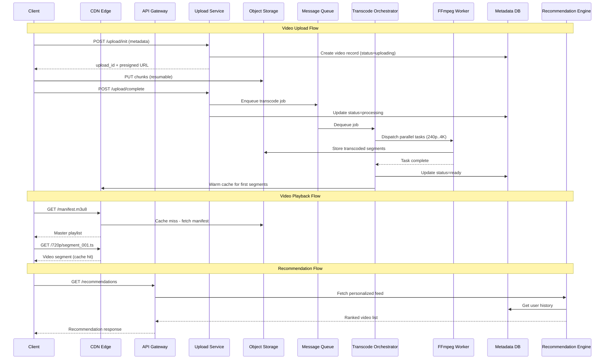

# Video Streaming Platform (YouTube/Netflix) - System Design

## 1. Problem Statement

Design a large-scale video streaming platform that allows users to upload, transcode,
store, and stream video content globally. The system must support adaptive bitrate
streaming, personalized recommendations, search, and social features (comments, likes)
while maintaining low latency and high availability for hundreds of millions of daily
active users.

Key challenges:
- **Ingestion**: Accept large video uploads (multi-GB) reliably.
- **Transcoding**: Convert raw uploads into multiple resolutions/codecs efficiently.
- **Delivery**: Stream video segments with sub-200 ms start time worldwide.
- **Discovery**: Power search and personalized recommendation feeds.
- **Scale**: Handle 100M+ DAU with 99.9% uptime.

---

## 2. Functional Requirements

| ID | Requirement | Description |
|----|-------------|-------------|
| FR-1 | Upload Video | Users upload videos (up to 10 GB) via resumable upload. |
| FR-2 | Transcode | System transcodes each upload into 240p, 360p, 480p, 720p, 1080p, 4K. |
| FR-3 | Adaptive Streaming | Client automatically switches quality based on bandwidth (HLS/DASH). |
| FR-4 | Search | Full-text search over titles, descriptions, tags, and captions. |
| FR-5 | Recommendations | Personalized video feed using collaborative + content-based filtering. |
| FR-6 | Comments | Users can post, reply to, like, and report comments on videos. |
| FR-7 | View Tracking | Record views, watch time, and engagement metrics per video. |
| FR-8 | Channels | Creators can manage a channel with playlists and subscriptions. |
| FR-9 | Notifications | Notify subscribers when a new video is published. |

---

## 3. Non-Functional Requirements

| Category | Target |
|----------|--------|
| **Latency** | Video start time < 200 ms (P99) from CDN edge. |
| **Throughput** | Support 100 M daily active users, 1 M concurrent streams. |
| **Availability** | 99.9% uptime (< 8.76 h downtime/year). |
| **Durability** | 99.999999999% (11 nines) for stored video objects. |
| **Global Delivery** | Edge PoPs on 6 continents; < 50 ms to nearest edge. |
| **Upload Reliability** | Resumable uploads; no data loss on network interruption. |
| **Consistency** | Eventual consistency acceptable for views/recommendations; strong consistency for uploads and metadata writes. |

---

## 4. Capacity Estimation

### Assumptions
- 100 M DAU, 10% upload content = 10 M creators
- Average 500 K new videos uploaded per day
- Average raw video size: 500 MB
- Transcoded output: ~3x raw size (multiple resolutions + codecs)
- Average watch session: 40 minutes/day, average bitrate 5 Mbps

### Storage

| Item | Calculation | Daily | Yearly |
|------|-------------|-------|--------|
| Raw uploads | 500 K x 500 MB | 250 TB/day | ~91 PB/year |
| Transcoded | 250 TB x 3 | 750 TB/day | ~274 PB/year |
| Total new storage | | ~1 PB/day | ~365 PB/year |

### Bandwidth (CDN)

| Item | Calculation | Result |
|------|-------------|--------|
| Concurrent viewers | 1 M streams x 5 Mbps | 5 Tbps aggregate |
| Daily egress | 100 M users x 40 min x 5 Mbps / 8 | ~15 PB/day |

### Metadata
- 500 K videos/day x 5 KB metadata = 2.5 GB/day (negligible vs video)
- View events: 100 M users x 20 views/day = 2 B events/day

---

## 5. API Design

### Video Upload
```
POST /api/v1/videos/upload/init
  Headers: Authorization: Bearer <token>
  Body: { "title": "...", "description": "...", "tags": [...], "category": "..." }
  Response: { "upload_id": "uuid", "upload_url": "https://upload.cdn.example.com/..." }

PUT /api/v1/videos/upload/{upload_id}/chunk
  Headers: Content-Range: bytes 0-1048575/5242880
  Body: <binary chunk>
  Response: { "bytes_received": 1048576, "status": "in_progress" }

POST /api/v1/videos/upload/{upload_id}/complete
  Response: { "video_id": "v_abc123", "status": "processing" }
```

### Video Streaming
```
GET /api/v1/videos/{video_id}/manifest.m3u8
  Response: HLS master playlist with available quality levels

GET /api/v1/videos/{video_id}/segments/{quality}/{segment_number}.ts
  Response: MPEG-TS video segment (served from CDN edge)
```

### Search
```
GET /api/v1/search?q=keyword&page=1&limit=20
  Response: { "results": [{ "video_id", "title", "thumbnail_url", "duration", "views" }], "next_page": 2 }
```

### Recommendations
```
GET /api/v1/recommendations?user_id=u123&limit=20
  Response: { "videos": [{ "video_id", "title", "score", "reason" }] }
```

### Comments
```
POST /api/v1/videos/{video_id}/comments
  Body: { "text": "...", "parent_id": null }

GET  /api/v1/videos/{video_id}/comments?sort=top&page=1
```

### View Tracking
```
POST /api/v1/videos/{video_id}/view
  Body: { "watch_time_sec": 120, "quality": "1080p", "buffering_events": 0 }
```

---

## 6. Data Model

### Videos Table (PostgreSQL - metadata service)
```sql
CREATE TABLE videos (
    video_id        UUID PRIMARY KEY DEFAULT gen_random_uuid(),
    creator_id      UUID NOT NULL REFERENCES users(user_id),
    title           VARCHAR(500) NOT NULL,
    description     TEXT,
    tags            TEXT[],
    category        VARCHAR(100),
    duration_sec    INT,
    status          VARCHAR(20) DEFAULT 'uploading',
        -- uploading | processing | ready | failed | deleted
    upload_url      TEXT,
    thumbnail_url   TEXT,
    view_count      BIGINT DEFAULT 0,
    like_count      BIGINT DEFAULT 0,
    created_at      TIMESTAMPTZ DEFAULT NOW(),
    updated_at      TIMESTAMPTZ DEFAULT NOW()
);
CREATE INDEX idx_videos_creator ON videos(creator_id);
CREATE INDEX idx_videos_status ON videos(status);
```

### Transcoding Jobs Table
```sql
CREATE TABLE transcoding_jobs (
    job_id          UUID PRIMARY KEY DEFAULT gen_random_uuid(),
    video_id        UUID NOT NULL REFERENCES videos(video_id),
    resolution      VARCHAR(10) NOT NULL,  -- '240p','360p','480p','720p','1080p','4k'
    codec           VARCHAR(20) NOT NULL,  -- 'h264','h265','vp9','av1'
    status          VARCHAR(20) DEFAULT 'queued',
        -- queued | running | completed | failed
    input_path      TEXT NOT NULL,
    output_path     TEXT,
    started_at      TIMESTAMPTZ,
    completed_at    TIMESTAMPTZ,
    error_message   TEXT,
    retry_count     INT DEFAULT 0
);
CREATE INDEX idx_jobs_video ON transcoding_jobs(video_id);
CREATE INDEX idx_jobs_status ON transcoding_jobs(status);
```

### User Watch History (Cassandra - high write throughput)
```
CREATE TABLE user_history (
    user_id         UUID,
    watched_at      TIMESTAMP,
    video_id        UUID,
    watch_duration  INT,
    completed       BOOLEAN,
    PRIMARY KEY ((user_id), watched_at)
) WITH CLUSTERING ORDER BY (watched_at DESC);
```

### Recommendations Cache (Redis)
```
Key:   rec:{user_id}
Value: JSON list of { video_id, score, reason, generated_at }
TTL:   1 hour
```

### Comments Table
```sql
CREATE TABLE comments (
    comment_id      UUID PRIMARY KEY DEFAULT gen_random_uuid(),
    video_id        UUID NOT NULL REFERENCES videos(video_id),
    user_id         UUID NOT NULL REFERENCES users(user_id),
    parent_id       UUID REFERENCES comments(comment_id),
    text            TEXT NOT NULL,
    like_count      INT DEFAULT 0,
    created_at      TIMESTAMPTZ DEFAULT NOW()
);
CREATE INDEX idx_comments_video ON comments(video_id, created_at);
```

---

## 7. High-Level Architecture



---

## 8. Detailed Design

### 8.1 Transcoding Pipeline (DAG of Tasks)

The transcoding pipeline models each video as a **directed acyclic graph (DAG)** of tasks:

```
Raw Upload
    |
    v
[Validate & Extract Metadata]
    |
    +---> [Generate Thumbnail]
    |
    +---> [Transcode 240p H.264]
    +---> [Transcode 360p H.264]
    +---> [Transcode 480p H.264]
    +---> [Transcode 720p H.264]
    +---> [Transcode 1080p H.264]
    +---> [Transcode 4K H.265]
    |
    v (all complete)
[Generate HLS Manifests]
    |
    v
[Publish to CDN / Mark Ready]
```

**Key design decisions:**
- Each resolution is an independent task; they run in parallel on the worker pool.
- Workers are stateless containers running FFmpeg; they pull jobs from a queue.
- GPU instances handle H.265/AV1 encoding for higher resolutions.
- Retry logic: failed tasks are retried up to 3 times with exponential backoff.
- The orchestrator tracks DAG state in PostgreSQL and emits completion events.

**Chunked transcoding** for large files:
1. Split raw video into 10-second segments.
2. Transcode each segment independently (embarrassingly parallel).
3. Concatenate output segments in order.
4. Generate final HLS/DASH manifests.

### 8.2 Adaptive Bitrate Streaming (HLS/DASH)

**HLS (HTTP Live Streaming):**
1. Video is split into small segments (2-10 seconds each).
2. A master playlist (`.m3u8`) lists available quality levels.
3. Each quality level has its own media playlist with segment URLs.
4. The client player monitors download speed and buffer health.
5. It switches quality levels dynamically to prevent buffering.

**Master Playlist Example:**
```
#EXTM3U
#EXT-X-STREAM-INF:BANDWIDTH=400000,RESOLUTION=426x240
240p/playlist.m3u8
#EXT-X-STREAM-INF:BANDWIDTH=800000,RESOLUTION=640x360
360p/playlist.m3u8
#EXT-X-STREAM-INF:BANDWIDTH=1400000,RESOLUTION=854x480
480p/playlist.m3u8
#EXT-X-STREAM-INF:BANDWIDTH=2800000,RESOLUTION=1280x720
720p/playlist.m3u8
#EXT-X-STREAM-INF:BANDWIDTH=5000000,RESOLUTION=1920x1080
1080p/playlist.m3u8
#EXT-X-STREAM-INF:BANDWIDTH=14000000,RESOLUTION=3840x2160
4k/playlist.m3u8
```

**ABR Algorithm (Buffer-Based):**
```
if buffer_level < LOW_THRESHOLD:
    switch_to_lowest_quality()
elif buffer_level > HIGH_THRESHOLD:
    switch_to_next_higher_quality()
else:
    maintain_current_quality()
```

### 8.3 CDN Caching Strategy

**Three-tier caching:**

| Tier | Location | TTL | Content |
|------|----------|-----|---------|
| L1 - Edge | CDN PoP (200+ locations) | 24h | Popular segments, thumbnails |
| L2 - Regional | Regional origin shield | 72h | All segments for region-popular videos |
| L3 - Origin | Object storage (S3) | Permanent | All content (source of truth) |

**Cache key design:**
```
/{video_id}/{quality}/{segment_number}.ts
```

**Cache warming strategy:**
- Pre-warm edge caches for trending/new videos from popular creators.
- First 3 segments of each quality level are proactively pushed to edges.
- Long-tail content is served via origin pull on first request.

**Cache invalidation:**
- Video deletion: purge all CDN entries via API.
- Re-transcode: version the segment path (`/v2/{video_id}/...`).

### 8.4 Recommendation Algorithm

**Hybrid approach combining collaborative filtering and content-based filtering:**

**Stage 1 - Candidate Generation (offline, Spark):**
- **Collaborative filtering**: Matrix factorization (ALS) on the user-video interaction matrix.
  - Input: (user_id, video_id, watch_fraction, implicit_rating)
  - Output: top-500 candidate videos per user.
- **Content-based**: TF-IDF on video metadata (title, tags, description) + video embedding similarity.

**Stage 2 - Ranking (near-real-time):**
- A lightweight neural ranking model scores each candidate.
- Features: user history, video freshness, creator affinity, watch-time prediction.
- Output: top-50 ranked videos.

**Stage 3 - Re-ranking (real-time):**
- Diversity injection: avoid showing too many videos from one creator/category.
- Business rules: boost new creator content, suppress already-watched videos.
- A/B test framework for experimentation.

**Feedback loop:**
- View events, watch time, likes, and skips are streamed to Kafka.
- Spark jobs retrain the model daily; online learning updates features hourly.

---

## 9. Architecture Diagram



---

## 10. Architectural Patterns

### 10.1 Pipeline Pattern (Transcoding)
The transcoding system uses the **pipeline pattern** where each stage transforms data
and passes it to the next. Combined with a **DAG scheduler**, tasks are executed in
dependency order with maximum parallelism. This pattern enables:
- Independent scaling of each pipeline stage.
- Easy addition of new output formats without modifying existing stages.
- Built-in retry and dead-letter handling per stage.

### 10.2 CDN Edge Caching (Cache-Aside + Write-Through)
Video segments use a **cache-aside** pattern at CDN edges:
- On cache miss, the edge fetches from the origin shield (L2) or object storage (L3).
- On cache hit, the segment is served directly with zero origin load.
- Proactive **write-through** for high-demand content (trending videos pre-warmed).

### 10.3 Eventual Consistency
- **View counts** are updated asynchronously via event streaming (Kafka).
  Counters are aggregated in time windows and flushed to the database periodically.
- **Recommendations** are pre-computed offline and cached in Redis; stale by up to 1 hour.
- **Search index** is updated via CDC (Change Data Capture) from the metadata DB,
  with a lag of seconds.

### 10.4 Collaborative Filtering
The recommendation engine uses **collaborative filtering** (users who watched X also
watched Y) combined with content-based signals. This hybrid approach handles:
- **Cold-start problem**: New users get content-based recommendations until enough
  interaction data accumulates.
- **Popularity bias**: Diversity re-ranking prevents the system from only recommending
  viral content.

### 10.5 CQRS (Command Query Responsibility Segregation)
- **Write path** (upload, comment, like): goes through the API to the primary database.
- **Read path** (search, recommendations, video metadata): served from read replicas,
  caches, and specialized stores (Elasticsearch, Redis).

---

## 11. Technology Choices

| Component | Technology | Rationale |
|-----------|-----------|-----------|
| Object Storage | AWS S3 / GCS | 11 nines durability, lifecycle policies, multipart upload |
| CDN | CloudFront / Akamai | 200+ global PoPs, adaptive bitrate support, origin shield |
| Transcoding | FFmpeg on ECS/K8s | Industry standard, supports all codecs, GPU acceleration |
| GPU Encoding | NVIDIA NVENC | Hardware-accelerated H.265/AV1 encoding |
| Metadata DB | PostgreSQL (Aurora) | ACID transactions, rich indexing, read replicas |
| User History | Apache Cassandra | High write throughput, time-series optimized |
| Cache | Redis Cluster | Sub-ms latency, TTL support, pub/sub for invalidation |
| Message Queue | Apache Kafka | Durable, ordered, high-throughput event streaming |
| Search | Elasticsearch | Full-text search, fuzzy matching, autocomplete |
| Recommendations | Apache Spark + MLlib | Distributed ALS, feature engineering at scale |
| API Gateway | Kong / AWS API Gateway | Rate limiting, auth, request routing |
| Container Orchestration | Kubernetes (EKS) | Auto-scaling worker pools, rolling deployments |
| Monitoring | Prometheus + Grafana | Metrics collection, dashboards, alerting |
| Logging | ELK Stack | Centralized log aggregation, search, visualization |
| CI/CD | GitHub Actions | Automated testing, deployment pipelines |

---

## 12. Scalability

### Horizontal Scaling
- **Upload Service**: Stateless; scales horizontally behind a load balancer.
- **Transcoding Workers**: Auto-scaled based on queue depth (Kafka consumer lag).
  - Burst capacity via spot/preemptible GPU instances.
  - Target: process a new video within 10 minutes of upload.
- **API Servers**: Stateless; horizontally scaled per region.
- **Database**: PostgreSQL read replicas (up to 15) for read-heavy metadata queries.

### Data Partitioning
- **Object Storage**: Partitioned by `video_id` prefix for even distribution.
- **Cassandra**: Partitioned by `user_id` for watch history (each user's data on one node).
- **Kafka**: Topics partitioned by `video_id` for ordered processing per video.

### CDN Scaling
- Popular content (top 1% of videos = 80% of traffic) cached at all edges.
- Long-tail content served via regional origin shields to reduce origin load.
- During viral events, CDN auto-scales edge capacity and pre-warms caches.

### Rate Limiting
- Upload: 10 videos/hour per user.
- API: 1000 requests/minute per user.
- Comments: 30 comments/minute per user.

---

## 13. Reliability

### Fault Tolerance
- **Upload resumability**: Multipart uploads with server-side tracking; clients resume from last acknowledged chunk.
- **Transcoding retry**: Failed jobs retried 3x with exponential backoff; dead-letter queue for persistent failures.
- **Multi-AZ deployment**: All services deployed across 3+ availability zones.
- **Database**: PostgreSQL with synchronous replication to standby; automatic failover.
- **Object Storage**: S3 provides 11 nines durability with cross-region replication.

### Circuit Breakers
- Recommendation service failure: fall back to trending/popular videos.
- Search service failure: fall back to category browsing.
- Transcoding backlog: prioritize by creator tier (verified > regular).

### Disaster Recovery
- **RPO** (Recovery Point Objective): 0 for video data (synchronous replication), < 1 min for metadata.
- **RTO** (Recovery Time Objective): < 5 minutes for automated failover.
- Cross-region replication for critical data (video objects, metadata).
- Regular DR drills with automated runbooks.

---

## 14. Security

### Authentication & Authorization
- OAuth 2.0 + JWT for user authentication.
- Role-based access: viewer, creator, moderator, admin.
- Presigned URLs for direct-to-S3 uploads (time-limited, single-use).

### Content Security
- **Upload scanning**: Virus/malware scan on every upload before transcoding.
- **Content moderation**: ML-based detection of prohibited content (nudity, violence, copyright).
- **DRM**: Widevine/FairPlay for premium content; encrypted HLS segments.
- **Watermarking**: Invisible forensic watermarks in transcoded output for piracy tracking.

### Infrastructure Security
- All traffic encrypted in transit (TLS 1.3).
- Encryption at rest for object storage and databases (AES-256).
- VPC isolation for internal services; no direct internet access for workers.
- WAF (Web Application Firewall) at CDN edge for DDoS protection.
- Regular penetration testing and security audits.

### Privacy
- GDPR/CCPA compliance: user data deletion within 30 days of request.
- Watch history anonymization for recommendation training.
- Geo-blocking for region-restricted content.

---

## 15. Monitoring & Observability

### Key Metrics

| Category | Metric | Alert Threshold |
|----------|--------|-----------------|
| **Streaming** | Video start time (P99) | > 200 ms |
| **Streaming** | Rebuffering ratio | > 1% |
| **Streaming** | CDN cache hit ratio | < 95% |
| **Upload** | Upload success rate | < 99% |
| **Transcoding** | Queue depth | > 10,000 jobs |
| **Transcoding** | Job completion time (P95) | > 15 minutes |
| **API** | Request latency (P99) | > 500 ms |
| **API** | Error rate (5xx) | > 0.1% |
| **Infrastructure** | CPU utilization | > 80% sustained |
| **Infrastructure** | Disk usage | > 85% |

### Dashboards
- **Real-time streaming health**: concurrent viewers, bitrate distribution, buffering events.
- **Upload pipeline**: uploads in progress, transcoding queue, completion rate.
- **Recommendation quality**: CTR, watch-through rate, diversity score.
- **Business metrics**: DAU, total watch hours, creator uploads.

### Alerting
- PagerDuty integration for P1 incidents (streaming outage, data loss).
- Slack alerts for P2 (elevated error rates, transcoding delays).
- Automated runbooks for common issues (cache purge, worker restart).

### Distributed Tracing
- OpenTelemetry instrumentation across all services.
- Trace uploads from client through transcoding to CDN availability.
- Jaeger UI for investigating latency issues.

---

## Summary

This video streaming platform is designed around three core pillars:

1. **Efficient Ingestion**: Resumable uploads with a DAG-based transcoding pipeline
   that processes videos into multiple formats in parallel.

2. **Global Low-Latency Delivery**: A three-tier CDN caching strategy with adaptive
   bitrate streaming ensures sub-200 ms start times worldwide.

3. **Personalized Discovery**: A hybrid recommendation engine combining collaborative
   filtering and content-based signals, with real-time re-ranking for diversity.

The architecture leverages event-driven patterns, CQRS, and eventual consistency
to scale independently across upload, streaming, and discovery workloads while
maintaining 99.9% availability.
