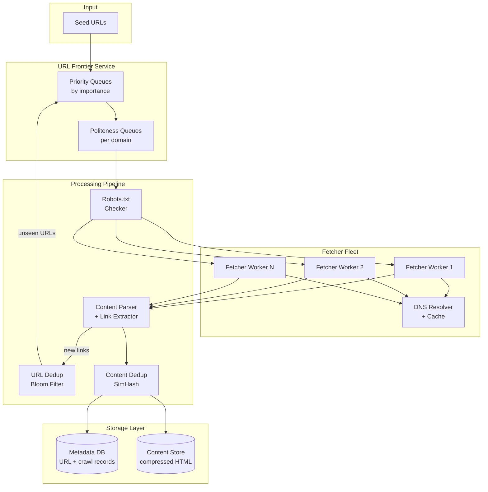
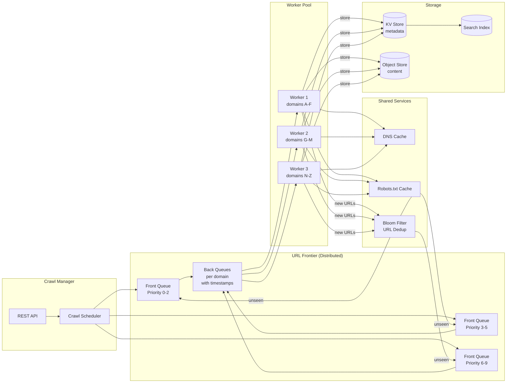

# Web Crawler - System Design

## 1. Problem Statement

Design a large-scale web crawler that systematically browses the internet, discovers new
pages via hyperlinks, downloads their content, and stores it for indexing by a search engine.
The crawler must handle billions of pages, respect website policies, avoid duplicate work,
and stay fresh by re-crawling pages periodically.

**Key challenges:**
- The web is enormous (~1 billion new/updated pages per month to crawl)
- Many pages are duplicates or near-duplicates
- Websites have varying tolerance for crawl traffic (politeness)
- The link graph is cyclic and can trap naive crawlers
- Content changes at different rates requiring intelligent re-crawl scheduling

---

## 2. Functional Requirements

| ID | Requirement |
|----|------------|
| FR-1 | Accept a set of **seed URLs** to begin crawling |
| FR-2 | **Extract hyperlinks** from downloaded pages and add them to the crawl frontier |
| FR-3 | **Download and store** page content (HTML, metadata, headers) |
| FR-4 | **Respect robots.txt** rules for each domain |
| FR-5 | Support **configurable crawl depth** (max hops from seed) |
| FR-6 | Support **domain scope** restrictions (e.g., crawl only `*.example.com`) |
| FR-7 | **Normalize URLs** to avoid crawling the same page via different URL forms |
| FR-8 | Provide a **status API** to monitor crawl progress |
| FR-9 | Support **pause/resume** of crawl jobs |
| FR-10 | **Re-crawl** pages based on configurable freshness policies |

---

## 3. Non-Functional Requirements

| Category | Requirement |
|----------|------------|
| **Politeness** | Rate-limit requests per domain (default: 1 req/sec per domain). Honor `Crawl-delay` in robots.txt. |
| **Scalability** | Handle **1 billion pages/month** (~385 pages/sec sustained). Horizontally scalable fetcher fleet. |
| **Freshness** | Re-crawl popular/frequently-changing pages within 24 hours. Long-tail pages within 30 days. |
| **Deduplication** | URL-level dedup via Bloom filter. Content-level dedup via fingerprinting (SimHash). |
| **Fault Tolerance** | Survive worker crashes without losing frontier state. At-least-once crawl guarantee. |
| **Extensibility** | Pluggable content parsers (HTML, PDF, images). Pluggable storage backends. |
| **Observability** | Metrics on pages/sec, error rates, queue depths, domain distribution. |

---

## 4. Capacity Estimation

### Throughput
| Metric | Value |
|--------|-------|
| Target pages/month | 1,000,000,000 |
| Pages/day | ~33,300,000 |
| Pages/second | ~385 |
| Avg page size | 100 KB (HTML + headers) |
| Bandwidth | 385 * 100 KB = **38.5 MB/s = 308 Mbps** |

### Storage (per month)
| Component | Calculation | Size |
|-----------|------------|------|
| Raw HTML | 1B * 100 KB | **100 TB** |
| Compressed HTML | 100 TB * 0.3 (gzip ratio) | **30 TB** |
| Metadata (URL, timestamps, headers) | 1B * 2 KB | **2 TB** |
| URL frontier | 10B URLs * 100 bytes avg | **1 TB** |
| Bloom filter (10B URLs, 1% FP) | ~1.2 GB | **~1.2 GB** |

### Infrastructure
| Resource | Estimate |
|----------|----------|
| Fetcher workers | ~50 machines (each handling ~8 pages/sec with politeness delays) |
| DNS cache | In-memory, ~500 MB for 10M domain entries |
| Content store | Distributed object store (S3-like), 30 TB/month |
| Metadata DB | Sharded key-value store, 2 TB/month |

---

## 5. API Design

### Crawl Management

```
POST /api/v1/crawls
{
    "seed_urls": ["https://example.com", "https://news.site.com"],
    "config": {
        "max_depth": 5,
        "allowed_domains": ["example.com", "*.example.com"],
        "max_pages": 100000,
        "politeness_delay_ms": 1000,
        "respect_robots_txt": true,
        "user_agent": "MyCrawler/1.0",
        "content_types": ["text/html"],
        "freshness_policy": "daily"
    }
}
Response: { "crawl_id": "c-abc123", "status": "running" }
```

### Status & Control

```
GET  /api/v1/crawls/{crawl_id}
Response: {
    "crawl_id": "c-abc123",
    "status": "running",
    "pages_crawled": 45230,
    "pages_in_frontier": 182400,
    "errors": 120,
    "started_at": "2024-01-15T10:00:00Z",
    "pages_per_second": 385
}

POST /api/v1/crawls/{crawl_id}/pause
POST /api/v1/crawls/{crawl_id}/resume
DELETE /api/v1/crawls/{crawl_id}

GET  /api/v1/crawls/{crawl_id}/pages?domain=example.com&limit=100
GET  /api/v1/crawls/{crawl_id}/errors?limit=50
```

### Robots.txt Cache

```
GET /api/v1/robots?domain=example.com
Response: {
    "domain": "example.com",
    "rules": { "disallow": ["/private/", "/admin/"], "crawl_delay": 2 },
    "cached_at": "2024-01-15T09:00:00Z"
}
```

---

## 6. Data Model

### URL Frontier Entry

```
URLFrontierEntry {
    url: string              -- normalized URL
    domain: string           -- extracted domain for politeness grouping
    priority: int            -- 0 (highest) to 9 (lowest)
    depth: int               -- hops from seed URL
    discovered_at: timestamp
    source_url: string       -- page where this URL was found
    retry_count: int         -- number of failed fetch attempts
    next_crawl_at: timestamp -- for re-crawl scheduling
}
```

### Crawled Page Record

```
CrawledPage {
    url: string              -- canonical URL
    domain: string
    crawl_id: string
    status_code: int         -- HTTP status
    content_hash: string     -- SimHash fingerprint for dedup
    content_length: int
    content_type: string
    headers: map<string, string>
    fetched_at: timestamp
    fetch_duration_ms: int
    depth: int
    outgoing_links: list<string>
}
```

### Content Store Object

```
ContentObject {
    content_hash: string     -- primary key (content-addressed)
    raw_html: bytes          -- gzip-compressed page body
    extracted_text: string   -- stripped text for indexing
    extracted_links: list<string>
    title: string
    meta_tags: map<string, string>
}
```

### Robots.txt Cache

```
RobotsCache {
    domain: string           -- primary key
    rules: RobotsRules       -- parsed rules
    fetched_at: timestamp
    expires_at: timestamp    -- TTL-based expiry (default 24h)
}
```

---

## 7. High-Level Architecture

The crawler follows a **producer-consumer** pattern. The URL Frontier produces URLs
for fetcher workers to consume. Fetched pages are parsed to extract new links, which
are fed back into the frontier after deduplication.



---

## 8. Detailed Design

### 8.1 URL Frontier

The URL frontier is the core scheduling component. It manages **what to crawl next**
while enforcing both priority ordering and per-domain politeness.

**Two-level queue architecture:**

```
Level 1: Priority Queues (Front Queues)
  [Priority 0] -> [Priority 1] -> ... -> [Priority 9]
  Each queue holds URLs sorted by priority score.
  Priority is based on: PageRank, freshness need, domain authority.

Level 2: Politeness Queues (Back Queues)
  [domain-a.com queue] -> [domain-b.com queue] -> ...
  Each domain has its own FIFO queue.
  A domain queue is only dequeued when enough time has passed since
  the last request to that domain (politeness delay).
```

**URL selection flow:**
1. Front queue selector picks the highest-priority non-empty queue
2. URL is routed to the appropriate domain back queue
3. Back queue router checks the domain's last-fetch timestamp
4. If politeness delay has elapsed, URL is dispatched to a fetcher
5. If not, the domain queue waits and another domain is selected

**Consistent hashing for domain assignment:**
- Each fetcher worker is assigned a set of domains via consistent hashing
- This ensures the same worker handles all URLs for a given domain
- Prevents multiple workers from hitting the same domain simultaneously
- When workers join/leave, minimal domain reassignment occurs

### 8.2 Content Fingerprinting (Deduplication)

**URL-level dedup (Bloom Filter):**
- Before adding a URL to the frontier, check if it has been seen before
- Bloom filter with 10 billion entries and 1% false positive rate
- Size: ~1.2 GB (10 hash functions)
- False positives cause a small number of URLs to be skipped (acceptable)
- No false negatives: every seen URL is guaranteed to be caught

**Content-level dedup (SimHash):**
- After fetching, compute a SimHash fingerprint of the page content
- Compare against stored fingerprints to detect near-duplicate pages
- Hamming distance threshold of 3 bits identifies near-duplicates
- Prevents storing multiple copies of syndicated/mirrored content

### 8.3 Robots.txt Handling

- Before crawling any URL, fetch and cache the domain's robots.txt
- Cache with 24-hour TTL (configurable)
- Parse User-agent, Disallow, Allow, and Crawl-delay directives
- If robots.txt fetch fails with 5xx, retry later; if 4xx, assume all allowed
- Store parsed rules in a fast lookup structure keyed by domain

### 8.4 BFS Crawl Strategy

The crawler uses **Breadth-First Search** as its primary traversal strategy:
- Seed URLs are at depth 0
- Links discovered on depth-0 pages are queued at depth 1
- This ensures broad coverage before deep dives
- Max depth is configurable per crawl job
- BFS naturally prioritizes pages closer to well-known seeds (higher quality)

### 8.5 Fetcher Worker Pipeline

```
1. Receive URL from frontier
2. Check robots.txt cache -> allowed?
3. Resolve DNS (check cache first)
4. HTTP GET with timeout (30s connect, 60s read)
5. Follow redirects (max 5 hops)
6. Validate content type (skip non-HTML if configured)
7. Compute content fingerprint
8. Store content + metadata
9. Extract links from HTML
10. Normalize extracted URLs
11. Filter by domain scope
12. Submit new URLs to frontier (via dedup)
13. ACK URL as crawled
```

---

## 9. Architecture Diagram



---

## 10. Architectural Patterns

### 10.1 Producer-Consumer Pattern

The entire crawler is built around producer-consumer:
- **Producers**: Link extractor and seed URL injector produce URLs
- **Queue**: The URL frontier acts as the bounded buffer
- **Consumers**: Fetcher workers consume URLs and produce new ones (cycle)

This decouples discovery speed from fetch speed and allows independent scaling.

### 10.2 Bloom Filter for URL Deduplication

**Why Bloom filter?**
- We need to check ~10 billion URLs for membership
- A hash set would require ~500 GB of memory (50 bytes/URL)
- Bloom filter needs only ~1.2 GB for 1% false positive rate
- False positives (skipping a URL we haven't seen) are tolerable
- False negatives (re-crawling a seen URL) are not tolerable
- Bloom filter guarantees zero false negatives

**Configuration:**
- m = 9.6 billion bits (~1.2 GB)
- k = 7 hash functions (optimal for n=1B, FP=1%)
- Partitioned across frontier nodes for distributed operation

### 10.3 BFS Crawl Strategy

**Why BFS over DFS?**
- BFS discovers pages in order of distance from seeds
- Pages closer to well-known seeds tend to be higher quality
- BFS provides broad coverage quickly (important for search engines)
- DFS can get trapped in deep link chains (calendar pages, pagination)
- BFS is naturally parallelizable: all URLs at depth d can be fetched concurrently

**Implementation:**
- Each URL carries a `depth` counter
- When links are extracted, child URLs get `parent_depth + 1`
- URLs exceeding `max_depth` are discarded
- Priority queues can boost certain depths for hybrid strategies

### 10.4 Politeness via Per-Domain Rate Limiting

Each domain gets its own rate-limiting queue:
- Default: 1 request per second per domain
- Configurable via robots.txt `Crawl-delay` directive
- Consistent hashing ensures one worker owns a domain (no coordination needed)
- This is a **token bucket** pattern applied per-domain

---

## 11. Technology Choices

| Component | Choice | Rationale |
|-----------|--------|-----------|
| **URL Frontier** | Apache Kafka + Redis sorted sets | Kafka for durable queue, Redis for priority scoring and politeness timestamps |
| **Bloom Filter** | Custom partitioned Bloom filter | 1.2 GB fits in memory; Redis Bloom module for distributed version |
| **Content Store** | S3 / MinIO | Cost-effective blob storage; content-addressed keys for dedup |
| **Metadata DB** | Cassandra | Write-heavy workload, wide-column for flexible schema, tunable consistency |
| **DNS Cache** | Local in-memory (LRU) + shared Redis | DNS resolution is slow (~50ms); caching reduces it to <1ms |
| **Content Parser** | Custom with lxml/BeautifulSoup | Fast HTML parsing; extensible for other content types |
| **Orchestration** | Kubernetes | Auto-scaling worker pods based on frontier depth |
| **Monitoring** | Prometheus + Grafana | Standard metrics pipeline; custom counters for pages/sec, errors |
| **Priority Queue** | Min-heap | O(log n) insert and extract-min; efficient for real-time priority scheduling |
| **Hashing** | MurmurHash3 | Fast, well-distributed; used in Bloom filter and consistent hashing ring |

---

## 12. Scalability

### Horizontal Scaling
- **Fetcher workers**: Add more workers; consistent hashing redistributes domains automatically
- **URL frontier**: Partition by domain hash across multiple frontier nodes
- **Content store**: S3/MinIO scales independently of compute
- **DNS cache**: Each worker has local cache; shared Redis for cross-worker dedup

### Bottleneck Analysis
| Bottleneck | Mitigation |
|-----------|-----------|
| Single frontier | Partition frontier by domain hash across N nodes |
| DNS resolution | Aggressive caching (TTL-based) + local resolver |
| Bandwidth | Distribute workers across multiple data centers |
| Bloom filter size | Partitioned Bloom filter; rotate/rebuild periodically |
| robots.txt fetches | Cache with 24h TTL; batch pre-fetch for queued domains |

### Scaling Milestones
- **100 pages/sec**: Single machine, in-memory frontier
- **1K pages/sec**: 5-10 workers, Redis frontier, shared DNS cache
- **10K pages/sec**: Kafka-based frontier, 50+ workers, distributed Bloom filter
- **100K pages/sec**: Multi-datacenter, partitioned everything, dedicated DNS resolvers

---

## 13. Reliability

### Failure Modes and Recovery

| Failure | Impact | Recovery |
|---------|--------|----------|
| Worker crash | URLs in-flight are lost | Frontier marks URLs as "in-progress" with timeout; re-enqueue after 5 min |
| Frontier node crash | Partition of URLs unavailable | Kafka provides durability; Redis replicas for sorted sets |
| DNS resolver down | Cannot resolve domains | Fallback to cached entries + public DNS (8.8.8.8) |
| Target site down | Fetch fails for domain | Exponential backoff; move domain to low-priority queue |
| Bloom filter corruption | May re-crawl seen URLs | Rebuild from metadata DB (URL column); idempotent storage handles duplicates |

### Consistency Guarantees
- **At-least-once crawling**: Every URL is crawled at least once (Bloom filter has no false negatives)
- **Idempotent storage**: Content store uses content-hash as key; re-storing same content is a no-op
- **Checkpoint/resume**: Frontier state is persisted; crawl can resume after full cluster restart

### Circuit Breaker Pattern
- If a domain returns 5 consecutive 5xx errors, circuit opens
- Domain is moved to a penalty queue (retry after 1 hour)
- Prevents wasting resources on unavailable sites

---

## 14. Security

### Crawl Safety
- **Respect robots.txt**: Always check before crawling
- **Rate limiting**: Never overwhelm target servers
- **User-Agent identification**: Clearly identify crawler with contact info
- **Redirect limit**: Max 5 redirects to prevent infinite loops
- **Content size limit**: Max 10 MB per page to prevent memory exhaustion

### Crawler Traps
- **Infinite URL spaces**: Calendar pages, session IDs in URLs, query parameter permutations
- **Mitigation**: URL normalization (strip session params), max depth limit, max pages per domain
- **Detection**: Monitor URLs-per-domain; alert if a single domain generates excessive URLs

### Infrastructure Security
- **Network isolation**: Workers in private subnet; only outbound HTTP(S) allowed
- **Secret management**: API keys and credentials in vault (not in config files)
- **Content scanning**: Validate downloaded content; do not execute JavaScript
- **DDoS prevention**: Internal rate limiting prevents accidental DDoS of target sites

### Data Privacy
- **Do not crawl**: Honor `noindex`, `nofollow` meta tags
- **Do not store**: Respect `Cache-Control: no-store` headers
- **Data retention**: Configurable retention policy; auto-delete old crawl data

---

## 15. Monitoring & Alerting

### Key Metrics

| Metric | Type | Alert Threshold |
|--------|------|----------------|
| `crawler_pages_per_second` | Gauge | < 200 (below 50% target) |
| `crawler_frontier_depth` | Gauge | > 100M (backlog growing) |
| `crawler_error_rate` | Counter | > 5% of requests |
| `crawler_fetch_latency_p99` | Histogram | > 10 seconds |
| `crawler_dns_cache_hit_rate` | Gauge | < 80% (cache ineffective) |
| `crawler_bloom_filter_size` | Gauge | > 80% capacity (rebuild needed) |
| `crawler_domain_queue_depth` | Gauge | > 10K for any single domain |
| `crawler_duplicate_rate` | Counter | > 30% (poor URL normalization) |
| `crawler_robots_cache_miss` | Counter | > 100/min (cache TTL too short) |

### Dashboards
1. **Overview**: Pages/sec, error rate, frontier size, active workers
2. **Domain Health**: Top domains by crawl volume, error rate by domain, politeness delays
3. **Infrastructure**: CPU/memory/network per worker, Kafka lag, Redis memory
4. **Quality**: Duplicate rate, content type distribution, average page size, depth distribution

### Logging
- Structured JSON logs with: `url`, `domain`, `status_code`, `fetch_duration_ms`, `content_hash`
- Log levels: ERROR (fetch failures), WARN (slow responses, retries), INFO (page crawled)
- Centralized log aggregation (ELK stack) with 30-day retention
